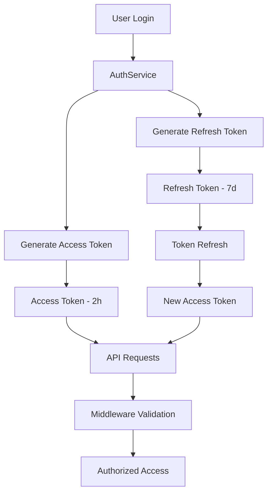

# JWT Implementation

## Summary

Comprehensive guide for the JWT (JSON Web Token) implementation in the Axisor platform. This document covers token generation, validation, refresh mechanisms, security considerations, and best practices for production deployments.

## JWT Architecture



## Token Generation

### Access Token Generation

```typescript
// backend/src/services/auth.service.ts
private async generateAccessToken(user: User): Promise<string> {
  const expiresIn = await this.securityConfig.getJWTExpiration();
  return this.fastify.jwt.sign(
    {
      userId: user.id,
      email: user.email,
      planType: user.plan_type,
    },
    {
      expiresIn,
    }
  );
}
```

### Auto-Login Token Generation (Post-Verification)

```typescript
// Auto-login after email verification
async generatePostVerificationToken(user: User): Promise<string> {
  return this.fastify.jwt.sign({
    sub: user.id,
    email: user.email,
    email_verified: true,
    iat: Math.floor(Date.now() / 1000),
    exp: Math.floor(Date.now() / 1000) + (7 * 24 * 60 * 60) // 7 days
  });
}
```

### Secure Cookie Configuration

```typescript
// HttpOnly cookie for auto-login
reply.setCookie('access_token', jwt, {
  httpOnly: true,           // Prevent XSS attacks
  secure: process.env.NODE_ENV === 'production', // HTTPS only in production
  sameSite: 'lax',          // CSRF protection
  path: '/',                // Available site-wide
  maxAge: 7 * 24 * 60 * 60  // 7 days expiration
});
```
```

### Refresh Token Generation

```typescript
// backend/src/services/auth.service.ts
private async generateRefreshToken(user: User): Promise<string> {
  const expiresIn = await this.securityConfig.getRefreshTokenExpiration();
  return this.fastify.jwt.sign(
    {
      userId: user.id,
      type: 'refresh',
    },
    {
      expiresIn,
    }
  );
}
```

### Token Storage

```typescript
// backend/src/services/auth.service.ts
private async storeRefreshToken(
  userId: string,
  _refreshToken: string
): Promise<void> {
  const expiresAt = new Date();
  expiresAt.setDate(expiresAt.getDate() + 7); // 7 days

  await this.prisma.user.update({
    where: { id: userId },
    data: { session_expires_at: expiresAt },
  });
}
```

## Token Validation

### Session Validation

```typescript
// backend/src/services/auth.service.ts
async validateSession(token: string): Promise<User> {
  try {
    console.log('🔍 VALIDATE SESSION - Token:', '[REDACTED]');
    const decoded = this.fastify.jwt.verify(token) as any;
    console.log('🔍 VALIDATE SESSION - Decoded:', { ...decoded, token: '[REDACTED]' });

    const user = await this.prisma.user.findUnique({
      where: { id: decoded.userId },
      select: {
        id: true,
        email: true,
        username: true,
        plan_type: true,
        created_at: true,
        last_activity_at: true,
        is_active: true,
        session_expires_at: true,
      },
    });

    if (!user || !user.is_active) {
      console.log('❌ VALIDATE SESSION - User not found or inactive');
      throw new Error('Invalid session');
    }

    // Check if session is expired
    if (user.session_expires_at && user.session_expires_at < new Date()) {
      console.log('❌ VALIDATE SESSION - Session expired');
      throw new Error('Session expired');
    }

    console.log('✅ VALIDATE SESSION - Session valid');
    return user as any;
  } catch (error) {
    console.log('❌ VALIDATE SESSION - Error:', (error as Error).message);
    throw new Error('Invalid session');
  }
}
```

### Middleware Authentication

```typescript
// backend/src/middleware/auth.middleware.ts
export async function authMiddleware(
  request: FastifyRequest,
  reply: FastifyReply
): Promise<void> {
  try {
    console.log('🔍 AUTH MIDDLEWARE - Starting authentication check');
    
    // Get token from Authorization header
    const authHeader = request.headers.authorization;

    if (!authHeader || !authHeader.startsWith('Bearer ')) {
      console.log('❌ AUTH MIDDLEWARE - No valid authorization header');
      return reply.status(401).send({
        error: 'UNAUTHORIZED',
        message: 'Authorization header with Bearer token is required',
      });
    }

    const token = authHeader.substring(7); // Remove 'Bearer ' prefix
    console.log('🔍 AUTH MIDDLEWARE - Token extracted:', '[REDACTED]');

    // Initialize auth service with singleton Prisma instance
    const prisma = await getPrisma();
    const authService = new AuthService(prisma, request.server);

    // Validate token and get user
    console.log('🔍 AUTH MIDDLEWARE - Validating session...');
    const user = await authService.validateSession(token);
    console.log('🔍 AUTH MIDDLEWARE - User from validateSession:', user?.email, 'ID:', user?.id);

    // Attach user to request
    (request as any).user = user;
    
    console.log('✅ AUTH MIDDLEWARE - Authentication successful');
  } catch (error) {
    console.log('❌ AUTH MIDDLEWARE - Error:', error);
    return reply.status(401).send({
      error: 'UNAUTHORIZED',
      message: error instanceof Error ? error.message : 'Invalid token',
    });
  }
}
```

## Refresh Token Mechanism

### Token Refresh

```typescript
// backend/src/services/auth.service.ts
async refreshToken(refreshToken: string): Promise<RefreshTokenResponse> {
  try {
    // Verify refresh token
    const decoded = this.fastify.jwt.verify(refreshToken) as any;

    // Check if token exists in database
    const tokenRecord = await this.prisma.user.findFirst({
      where: {
        id: decoded.userId,
        session_expires_at: {
          gt: new Date(),
        },
      },
    });

    if (!tokenRecord) {
      throw new Error('Invalid refresh token');
    }

    // Generate new access token
    const newToken = this.generateAccessToken(tokenRecord);

    return {
      token: newToken,
    };
  } catch (error) {
    throw new Error('Invalid refresh token');
  }
}
```

## Security Configuration

### Security Config Service

```typescript
// backend/src/services/security-config.service.ts
export class SecurityConfigService {
  /**
   * Get JWT expiration time from config
   */
  async getJWTExpiration(): Promise<string> {
    return await this.getConfig('jwt_expires_in') || '2h';
  }

  /**
   * Get refresh token expiration time from config
   */
  async getRefreshTokenExpiration(): Promise<string> {
    return await this.getConfig('refresh_token_expires_in') || '7d';
  }

  /**
   * Get max login attempts from config
   */
  async getMaxLoginAttempts(): Promise<number> {
    const value = await this.getConfig('max_login_attempts');
    return value ? parseInt(value) : 5;
  }

  /**
   * Get lockout duration from config
   */
  async getLockoutDuration(): Promise<string> {
    return await this.getConfig('lockout_duration') || '15m';
  }

  /**
   * Get session timeout from config
   */
  async getSessionTimeout(): Promise<string> {
    return await this.getConfig('session_timeout') || '30m';
  }
}
```

## Admin Authentication

### Admin Middleware

```typescript
// backend/src/middleware/auth.middleware.ts
export async function adminAuthMiddleware(
  request: FastifyRequest,
  reply: FastifyReply
): Promise<void> {
  try {
    console.log('🔍 ADMIN AUTH MIDDLEWARE - Starting authentication check');
    
    // First, authenticate the user
    await authMiddleware(request, reply);

    // Check if user is admin
    const user = (request as any).user;
    console.log('🔍 ADMIN AUTH MIDDLEWARE - User from authMiddleware:', user?.email, 'ID:', user?.id);
    
    if (!user) {
      console.log('❌ ADMIN AUTH MIDDLEWARE - No user found from authMiddleware');
      return reply.status(401).send({
        error: 'UNAUTHORIZED',
        message: 'User not authenticated',
      });
    }

    // Check if user has admin role using singleton Prisma instance
    const prisma = await getPrisma();
    const adminUser = await prisma.adminUser.findUnique({
      where: { user_id: user.id },
    });

    console.log('🔍 ADMIN AUTH MIDDLEWARE - Admin user found:', adminUser);

    if (!adminUser) {
      console.log('❌ ADMIN AUTH MIDDLEWARE - User is not admin');
      return reply.status(403).send({
        error: 'FORBIDDEN',
        message: 'Admin access required',
      });
    }

    console.log('✅ ADMIN AUTH MIDDLEWARE - Admin access granted');

    // Attach admin info to request
    (request as any).user = { 
      id: user.id,
      email: user.email,
      username: user.username,
      plan_type: user.plan_type
    };
  } catch (error) {
    console.log('❌ ADMIN AUTH MIDDLEWARE - Error:', error);
    return reply.status(401).send({
      error: 'UNAUTHORIZED',
      message: error instanceof Error ? error.message : 'Authentication failed',
    });
  }
}
```

## Token Revocation

### Revoke All User Tokens

```typescript
// backend/src/services/security-config.service.ts
async revokeAllUserTokens(userId: string, revokedBy?: string): Promise<void> {
  await this.prisma.refreshToken.updateMany({
    where: { user_id: userId, is_revoked: false },
    data: { is_revoked: true }
  });

  await this.logSecurityAction(
    revokedBy || userId,
    'TOKENS_REVOKED',
    `All refresh tokens revoked for user ${userId}`,
    { userId }
  );
}
```

### Cleanup Expired Tokens

```typescript
// backend/src/services/security-config.service.ts
async cleanupExpiredTokens(): Promise<number> {
  const result = await this.prisma.refreshToken.deleteMany({
    where: {
      OR: [
        { expires_at: { lt: new Date() } },
        { is_revoked: true }
      ]
    }
  });

  return result.count;
}
```

## Security Best Practices

### Token Security

1. **Short Expiration Times**: Access tokens expire in 2 hours by default
2. **Refresh Token Rotation**: Refresh tokens are rotated on each use
3. **Secure Storage**: Tokens are stored securely in database
4. **Audit Logging**: All token operations are logged
5. **Revocation Support**: Tokens can be revoked immediately

### Configuration Security

```typescript
// Security configuration defaults
const defaultSecurityConfig = {
  jwt_expires_in: '2h',
  refresh_token_expires_in: '7d',
  max_login_attempts: 5,
  lockout_duration: '15m',
  session_timeout: '30m',
  require_2fa: false,
  token_rotation_enabled: true,
  max_concurrent_sessions: 3
};
```

### Error Handling

```typescript
// Consistent error responses
const authErrors = {
  UNAUTHORIZED: {
    error: 'UNAUTHORIZED',
    message: 'Authorization header with Bearer token is required'
  },
  INVALID_TOKEN: {
    error: 'UNAUTHORIZED',
    message: 'Invalid or expired token'
  },
  SESSION_EXPIRED: {
    error: 'UNAUTHORIZED',
    message: 'Session expired'
  },
  ADMIN_REQUIRED: {
    error: 'FORBIDDEN',
    message: 'Admin access required'
  }
};
```

## Monitoring and Auditing

### Security Audit Logging

```typescript
// backend/src/services/security-config.service.ts
async logSecurityAction(
  userId: string,
  action: string,
  resource: string,
  details?: any,
  ipAddress?: string,
  userAgent?: string,
  success: boolean = true
): Promise<void> {
  try {
    await this.prisma.securityAuditLog.create({
      data: {
        user_id: userId,
        action,
        resource,
        ip_address: ipAddress,
        user_agent: userAgent,
        success,
        details
      }
    });
  } catch (error) {
    console.error('Failed to log security action:', error);
  }
}
```

### Audit Log Retrieval

```typescript
async getAuditLogs(
  userId?: string,
  action?: string,
  limit: number = 100,
  offset: number = 0
) {
  return await this.prisma.securityAuditLog.findMany({
    where: {
      ...(userId && { user_id: userId }),
      ...(action && { action })
    },
    orderBy: { created_at: 'desc' },
    take: limit,
    skip: offset,
    include: {
      user: {
        select: {
          id: true,
          email: true,
          username: true
        }
      }
    }
  });
}
```

## Deployment Configuration

### Environment Variables

```bash
# JWT Configuration
JWT_SECRET=your-super-secret-jwt-key-here
JWT_EXPIRES_IN=2h
REFRESH_TOKEN_EXPIRES_IN=7d

# Security Configuration
MAX_LOGIN_ATTEMPTS=5
LOCKOUT_DURATION=15m
SESSION_TIMEOUT=30m
REQUIRE_2FA=false
TOKEN_ROTATION_ENABLED=true
MAX_CONCURRENT_SESSIONS=3
```

### Fastify JWT Plugin Configuration

```typescript
// backend/src/index.ts
await fastify.register(require('@fastify/jwt'), {
  secret: config.jwt.secret,
  sign: {
    expiresIn: config.jwt.expiresIn,
    algorithm: 'HS256'
  },
  verify: {
    algorithms: ['HS256']
  }
});
```

## Troubleshooting

### Common Issues

#### Token Validation Failures

```typescript
// Debug token validation
const debugTokenValidation = async (token: string) => {
  try {
    const decoded = fastify.jwt.verify(token);
    console.log('Token decoded successfully:', decoded);
    
    const user = await prisma.user.findUnique({
      where: { id: decoded.userId }
    });
    
    console.log('User found:', user?.email);
    console.log('User active:', user?.is_active);
    console.log('Session expires:', user?.session_expires_at);
    
    return user;
  } catch (error) {
    console.error('Token validation failed:', error);
    throw error;
  }
};
```

#### Session Expiration Issues

```typescript
// Check session expiration
const checkSessionExpiration = (user: User) => {
  if (user.session_expires_at && user.session_expires_at < new Date()) {
    console.log('Session expired at:', user.session_expires_at);
    return false;
  }
  return true;
};
```

## How to Use This Document

- **For Development**: Use the token generation examples for implementing authentication
- **For Security**: Use the security best practices for production deployments
- **For Troubleshooting**: Use the debugging examples for resolving authentication issues
- **For Configuration**: Use the configuration examples for environment setup