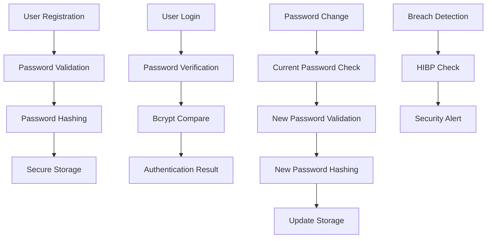

# Password Security

## Summary

Comprehensive guide for password security implementation in the Axisor platform. This document covers password hashing, validation, strength requirements, breach detection, and security best practices for password management.

## Password Security Architecture



## Password Hashing

### Registration Password Hashing

```typescript
// backend/src/services/auth.service.ts
async register(data: RegisterRequest): Promise<AuthResponse> {
  console.log('🔐 Starting user registration process...');
  
  const { email, username, password, coupon_code } = data;

  // Check if user already exists
  const existingUser = await this.prisma.user.findUnique({
    where: { email },
  });

  if (existingUser) {
    throw new Error('User already exists with this email');
  }

  // Validate password strength
  await this.validatePasswordStrength(password);

  authLogger.debug('Hashing password for user registration');
  // Hash password with bcrypt
  const passwordHash = await bcrypt.hash(password, 12);
  console.log('✅ Password hashed successfully');

  // Create user with hashed password
  const user = await this.prisma.user.create({
    data: {
      email,
      username,
      password_hash: passwordHash,
      plan_type: planType,
    },
  });

  // Generate tokens
  const token = await this.generateAccessToken(user);
  const refreshToken = await this.generateRefreshToken(user);

  return {
    user_id: user.id,
    token,
    refresh_token: refreshToken,
    plan_type: user.plan_type as PlanType,
  };
}
```

### Password Verification

```typescript
// backend/src/services/auth.service.ts
async login(data: LoginRequest): Promise<AuthResponse> {
  const { emailOrUsername, password } = data;

  // Find user by email or username
  const user = await this.prisma.user.findFirst({
    where: {
      OR: [
        { email: emailOrUsername },
        { username: emailOrUsername }
      ]
    },
  });

  if (!user) {
    throw new Error('Invalid email/username or password');
  }

  if (!user.password_hash) {
    throw new Error('User registered with social login, please use social login');
  }

  // Verify password using bcrypt
  const isValidPassword = await bcrypt.compare(password, user.password_hash);
  if (!isValidPassword) {
    throw new Error('Invalid email/username or password');
  }

  // Continue with login process...
}
```

## Password Strength Validation

### Password Validation Service

```typescript
// Password validation service
export class PasswordValidationService {
  private readonly minLength = 8;
  private readonly maxLength = 128;
  private readonly requireUppercase = true;
  private readonly requireLowercase = true;
  private readonly requireNumbers = true;
  private readonly requireSpecialChars = true;
  private readonly forbiddenPasswords = [
    'password', '123456', 'qwerty', 'abc123', 'password123'
  ];

  /**
   * Validate password strength
   */
  async validatePasswordStrength(password: string): Promise<void> {
    const errors: string[] = [];

    // Length validation
    if (password.length < this.minLength) {
      errors.push(`Password must be at least ${this.minLength} characters long`);
    }

    if (password.length > this.maxLength) {
      errors.push(`Password must be no more than ${this.maxLength} characters long`);
    }

    // Character type validation
    if (this.requireUppercase && !/[A-Z]/.test(password)) {
      errors.push('Password must contain at least one uppercase letter');
    }

    if (this.requireLowercase && !/[a-z]/.test(password)) {
      errors.push('Password must contain at least one lowercase letter');
    }

    if (this.requireNumbers && !/\d/.test(password)) {
      errors.push('Password must contain at least one number');
    }

    if (this.requireSpecialChars && !/[!@#$%^&*()_+\-=\[\]{};':"\\|,.<>\/?]/.test(password)) {
      errors.push('Password must contain at least one special character');
    }

    // Forbidden password check
    if (this.forbiddenPasswords.includes(password.toLowerCase())) {
      errors.push('This password is too common and not allowed');
    }

    // Common patterns check
    if (this.hasCommonPatterns(password)) {
      errors.push('Password contains common patterns and is not secure');
    }

    if (errors.length > 0) {
      throw new Error(`Password validation failed: ${errors.join(', ')}`);
    }

    // Check against Have I Been Pwned
    await this.checkPasswordBreach(password);
  }

  /**
   * Check for common password patterns
   */
  private hasCommonPatterns(password: string): boolean {
    const commonPatterns = [
      /(.)\1{2,}/, // Repeated characters (aaa, 111, etc.)
      /123456|234567|345678|456789|567890/, // Sequential numbers
      /abcdef|bcdefg|cdefgh|defghi/, // Sequential letters
      /qwerty|asdfgh|zxcvbn/, // Keyboard patterns
    ];

    return commonPatterns.some(pattern => pattern.test(password.toLowerCase()));
  }

  /**
   * Check password against Have I Been Pwned database
   */
  private async checkPasswordBreach(password: string): Promise<void> {
    try {
      const { HIBPService } = await import('../services/hibp.service');
      const hibpService = new HIBPService();
      
      const isBreached = await hibpService.checkPassword(password);
      if (isBreached) {
        throw new Error('This password has been found in data breaches and is not secure');
      }
    } catch (error) {
      // Log error but don't fail registration if HIBP check fails
      console.warn('HIBP check failed:', error);
    }
  }

  /**
   * Calculate password strength score
   */
  calculatePasswordStrength(password: string): {
    score: number;
    feedback: string[];
    strength: 'weak' | 'fair' | 'good' | 'strong';
  } {
    let score = 0;
    const feedback: string[] = [];

    // Length scoring
    if (password.length >= 8) score += 1;
    if (password.length >= 12) score += 1;
    if (password.length >= 16) score += 1;

    // Character diversity scoring
    if (/[a-z]/.test(password)) score += 1;
    if (/[A-Z]/.test(password)) score += 1;
    if (/\d/.test(password)) score += 1;
    if (/[!@#$%^&*()_+\-=\[\]{};':"\\|,.<>\/?]/.test(password)) score += 1;

    // Bonus for longer passwords
    if (password.length > 20) score += 1;

    // Determine strength level
    let strength: 'weak' | 'fair' | 'good' | 'strong';
    if (score < 4) {
      strength = 'weak';
      feedback.push('Password is weak. Consider adding more characters and variety.');
    } else if (score < 6) {
      strength = 'fair';
      feedback.push('Password is fair. Consider adding special characters or making it longer.');
    } else if (score < 8) {
      strength = 'good';
      feedback.push('Password is good. Consider making it longer for better security.');
    } else {
      strength = 'strong';
      feedback.push('Password is strong and secure.');
    }

    return { score, feedback, strength };
  }
}
```

## Password Change and Reset

### Password Change Implementation

```typescript
// Password change service
export class PasswordChangeService {
  constructor(private prisma: PrismaClient) {}

  /**
   * Change user password
   */
  async changePassword(
    userId: string,
    currentPassword: string,
    newPassword: string
  ): Promise<void> {
    // Get user with current password hash
    const user = await this.prisma.user.findUnique({
      where: { id: userId },
      select: { password_hash: true }
    });

    if (!user || !user.password_hash) {
      throw new Error('User not found or no password set');
    }

    // Verify current password
    const isCurrentPasswordValid = await bcrypt.compare(currentPassword, user.password_hash);
    if (!isCurrentPasswordValid) {
      throw new Error('Current password is incorrect');
    }

    // Validate new password strength
    const passwordValidator = new PasswordValidationService();
    await passwordValidator.validatePasswordStrength(newPassword);

    // Check if new password is different from current
    const isSamePassword = await bcrypt.compare(newPassword, user.password_hash);
    if (isSamePassword) {
      throw new Error('New password must be different from current password');
    }

    // Hash new password
    const newPasswordHash = await bcrypt.hash(newPassword, 12);

    // Update password
    await this.prisma.user.update({
      where: { id: userId },
      data: { password_hash: newPasswordHash }
    });

    // Log password change
    await this.prisma.securityAuditLog.create({
      data: {
        user_id: userId,
        action: 'PASSWORD_CHANGED',
        resource: 'user_account',
        success: true,
        details: { timestamp: new Date().toISOString() }
      }
    });
  }

  /**
   * Reset password with token
   */
  async resetPasswordWithToken(
    token: string,
    newPassword: string
  ): Promise<void> {
    // Verify reset token (implementation depends on token system)
    const resetRequest = await this.prisma.passwordResetToken.findUnique({
      where: { token },
      include: { user: true }
    });

    if (!resetRequest || resetRequest.expires_at < new Date()) {
      throw new Error('Invalid or expired reset token');
    }

    // Validate new password strength
    const passwordValidator = new PasswordValidationService();
    await passwordValidator.validatePasswordStrength(newPassword);

    // Hash new password
    const newPasswordHash = await bcrypt.hash(newPassword, 12);

    // Update password and invalidate token
    await this.prisma.$transaction([
      this.prisma.user.update({
        where: { id: resetRequest.user_id },
        data: { password_hash: newPasswordHash }
      }),
      this.prisma.passwordResetToken.delete({
        where: { token }
      })
    ]);

    // Log password reset
    await this.prisma.securityAuditLog.create({
      data: {
        user_id: resetRequest.user_id,
        action: 'PASSWORD_RESET',
        resource: 'user_account',
        success: true,
        details: { 
          timestamp: new Date().toISOString(),
          method: 'token_reset'
        }
      }
    });
  }
}
```

## Have I Been Pwned Integration

### HIBP Service Implementation

```typescript
// backend/src/services/hibp.service.ts
import crypto from 'crypto';

export class HIBPService {
  private readonly hibpApiUrl = 'https://api.pwnedpasswords.com/range/';

  /**
   * Check if password has been breached
   */
  async checkPassword(password: string): Promise<boolean> {
    try {
      // Create SHA-1 hash of password
      const passwordHash = crypto.createHash('sha1').update(password).digest('hex').toUpperCase();
      
      // Get first 5 characters of hash for API call
      const hashPrefix = passwordHash.substring(0, 5);
      const hashSuffix = passwordHash.substring(5);

      // Make request to HIBP API
      const response = await fetch(`${this.hibpApiUrl}${hashPrefix}`, {
        headers: {
          'User-Agent': 'Axisor-Security-Check'
        }
      });

      if (!response.ok) {
        throw new Error(`HIBP API error: ${response.status}`);
      }

      const responseText = await response.text();
      
      // Check if our hash suffix is in the response
      const hashes = responseText.split('\n');
      const isBreached = hashes.some(hashLine => {
        const [hash, count] = hashLine.split(':');
        return hash === hashSuffix && parseInt(count) > 0;
      });

      return isBreached;
    } catch (error) {
      console.error('HIBP check failed:', error);
      // Don't fail registration if HIBP check fails
      return false;
    }
  }

  /**
   * Check email against breached accounts
   */
  async checkEmail(email: string): Promise<boolean> {
    try {
      const response = await fetch(`https://haveibeenpwned.com/api/v3/breachedaccount/${encodeURIComponent(email)}`, {
        headers: {
          'hibp-api-key': process.env.HIBP_API_KEY || '',
          'User-Agent': 'Axisor-Security-Check'
        }
      });

      if (response.status === 404) {
        return false; // Email not found in breaches
      }

      if (response.ok) {
        return true; // Email found in breaches
      }

      throw new Error(`HIBP API error: ${response.status}`);
    } catch (error) {
      console.error('HIBP email check failed:', error);
      return false;
    }
  }
}
```

## Password Security Policies

### Security Configuration

```typescript
// Password security configuration
export interface PasswordSecurityConfig {
  minLength: number;
  maxLength: number;
  requireUppercase: boolean;
  requireLowercase: boolean;
  requireNumbers: boolean;
  requireSpecialChars: boolean;
  maxAge: number; // days
  historyCount: number; // remember last N passwords
  lockoutAttempts: number;
  lockoutDuration: number; // minutes
  hibpCheckEnabled: boolean;
}

const defaultPasswordConfig: PasswordSecurityConfig = {
  minLength: 8,
  maxLength: 128,
  requireUppercase: true,
  requireLowercase: true,
  requireNumbers: true,
  requireSpecialChars: true,
  maxAge: 90, // 90 days
  historyCount: 5, // remember last 5 passwords
  lockoutAttempts: 5,
  lockoutDuration: 15, // 15 minutes
  hibpCheckEnabled: true
};
```

### Password History Management

```typescript
// Password history service
export class PasswordHistoryService {
  constructor(private prisma: PrismaClient) {}

  /**
   * Store password in history
   */
  async storePasswordHistory(userId: string, passwordHash: string): Promise<void> {
    // Get current password history count
    const historyCount = await this.prisma.passwordHistory.count({
      where: { user_id: userId }
    });

    // Remove oldest passwords if we exceed the limit
    const config = await this.getPasswordConfig();
    if (historyCount >= config.historyCount) {
      const oldestPasswords = await this.prisma.passwordHistory.findMany({
        where: { user_id: userId },
        orderBy: { created_at: 'asc' },
        take: historyCount - config.historyCount + 1
      });

      await this.prisma.passwordHistory.deleteMany({
        where: {
          id: { in: oldestPasswords.map(p => p.id) }
        }
      });
    }

    // Store new password in history
    await this.prisma.passwordHistory.create({
      data: {
        user_id: userId,
        password_hash: passwordHash,
        created_at: new Date()
      }
    });
  }

  /**
   * Check if password was used recently
   */
  async isPasswordRecentlyUsed(userId: string, password: string): Promise<boolean> {
    const history = await this.prisma.passwordHistory.findMany({
      where: { user_id: userId },
      orderBy: { created_at: 'desc' }
    });

    for (const record of history) {
      const isMatch = await bcrypt.compare(password, record.password_hash);
      if (isMatch) {
        return true;
      }
    }

    return false;
  }

  /**
   * Get password configuration
   */
  private async getPasswordConfig(): Promise<PasswordSecurityConfig> {
    // Implementation to get config from database or environment
    return defaultPasswordConfig;
  }
}
```

## Password Security Monitoring

### Security Audit Logging

```typescript
// Password security monitoring
export class PasswordSecurityMonitor {
  constructor(private prisma: PrismaClient) {}

  /**
   * Log password security events
   */
  async logPasswordEvent(
    userId: string,
    event: 'PASSWORD_CHANGED' | 'PASSWORD_RESET' | 'PASSWORD_BREACH_DETECTED' | 'WEAK_PASSWORD_ATTEMPT',
    details: any
  ): Promise<void> {
    await this.prisma.securityAuditLog.create({
      data: {
        user_id: userId,
        action: event,
        resource: 'password',
        success: event !== 'WEAK_PASSWORD_ATTEMPT',
        details: {
          ...details,
          timestamp: new Date().toISOString()
        }
      }
    });
  }

  /**
   * Get password security statistics
   */
  async getPasswordSecurityStats(): Promise<{
    totalUsers: number;
    usersWithWeakPasswords: number;
    recentPasswordChanges: number;
    breachDetections: number;
  }> {
    const [totalUsers, recentChanges, breachDetections] = await Promise.all([
      this.prisma.user.count(),
      this.prisma.securityAuditLog.count({
        where: {
          action: 'PASSWORD_CHANGED',
          created_at: { gte: new Date(Date.now() - 30 * 24 * 60 * 60 * 1000) } // Last 30 days
        }
      }),
      this.prisma.securityAuditLog.count({
        where: {
          action: 'PASSWORD_BREACH_DETECTED',
          created_at: { gte: new Date(Date.now() - 30 * 24 * 60 * 60 * 1000) }
        }
      })
    ]);

    return {
      totalUsers,
      usersWithWeakPasswords: 0, // Would need implementation to check all passwords
      recentPasswordChanges: recentChanges,
      breachDetections
    };
  }
}
```

## How to Use This Document

- **For Implementation**: Use the password hashing and validation examples
- **For Security**: Use the strength validation and breach detection methods
- **For Compliance**: Use the audit logging and monitoring procedures
- **For Maintenance**: Use the password history and security monitoring tools
