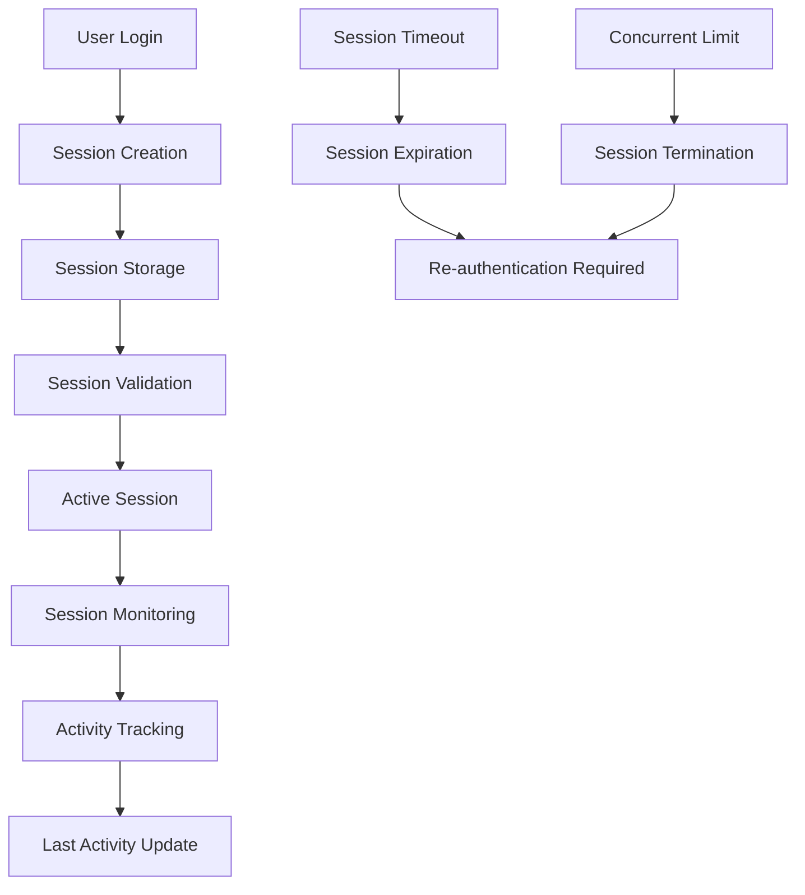

# Session Management

## Summary

Comprehensive guide for session management in the Axisor platform. This document covers session creation, validation, timeout handling, concurrent session limits, and security best practices for user sessions.

## Session Architecture



## Session Creation

### Login Session Creation

```typescript
// backend/src/services/auth.service.ts
async login(data: LoginRequest): Promise<AuthResponse> {
  console.log('🔍 AUTH SERVICE - Login called with:', { emailOrUsername: data.emailOrUsername });
  const { emailOrUsername, password } = data;

  // Find user by email or username
  const user = await this.prisma.user.findFirst({
    where: {
      OR: [
        { email: emailOrUsername },
        { username: emailOrUsername }
      ]
    },
  });

  if (!user) {
    throw new Error('Invalid email/username or password');
  }

  // Check if this is the first login
  const isFirstLogin = !user.last_login_at;
  
  if (isFirstLogin) {
    console.log('🎉 AUTH SERVICE - First login detected for user:', user.id);
    
    // Activate user on first login
    await this.prisma.user.update({
      where: { id: user.id },
      data: { 
        is_active: true,
        last_login_at: new Date(),
        last_activity_at: new Date() 
      },
    });
    
    console.log('✅ AUTH SERVICE - User activated on first login');
  } else if (!user.is_active) {
    console.log('⚠️ AUTH SERVICE - User account is deactivated:', user.id);
    throw new Error('Account is deactivated. Please contact support.');
  } else {
    // Update last activity for regular logins
    await this.prisma.user.update({
      where: { id: user.id },
      data: { 
        last_login_at: new Date(),
        last_activity_at: new Date() 
      },
    });
    
    console.log('✅ AUTH SERVICE - Regular login successful');
  }

  // Generate tokens
  const token = await this.generateAccessToken(user);
  const refreshToken = await this.generateRefreshToken(user);

  // Store refresh token in database
  await this.storeRefreshToken(user.id, refreshToken);

  return {
    user_id: user.id,
    token,
    refresh_token: refreshToken,
    plan_type: user.plan_type as PlanType,
  };
}
```

### Social Login Session Creation

```typescript
// backend/src/services/auth.service.ts
async socialLogin(
  provider: SocialProvider,
  socialId: string,
  email: string,
  _name?: string
): Promise<AuthResponse> {
  // Find existing user by social ID
  let user = await this.prisma.user.findFirst({
    where: {
      social_provider: provider,
      social_id: socialId,
    },
  });

  if (!user) {
    // Check if user exists with same email
    const existingUser = await this.prisma.user.findUnique({
      where: { email },
    });

    if (existingUser) {
      // Link social account to existing user
      user = await this.prisma.user.update({
        where: { id: existingUser.id },
        data: {
          social_provider: provider,
          social_id: socialId,
        },
      });
    } else {
      // Create new user
      user = await this.prisma.user.create({
        data: {
          email,
          username: email.split('@')[0] || 'user', // Generate username from email
          social_provider: provider,
          social_id: socialId,
          plan_type: 'free',
        },
      });
    }
  }

  if (!user.is_active) {
    throw new Error('Account is deactivated');
  }

  // Update last activity
  await this.prisma.user.update({
    where: { id: user.id },
    data: { last_activity_at: new Date() },
  });

  // Generate tokens
  const token = await this.generateAccessToken(user);
  const refreshToken = await this.generateRefreshToken(user);

  // Store refresh token in database
  await this.storeRefreshToken(user.id, refreshToken);

  return {
    user_id: user.id,
    token,
    refresh_token: refreshToken,
    plan_type: user.plan_type as PlanType,
  };
}
```

## Session Validation

### Session Validation Logic

```typescript
// backend/src/services/auth.service.ts
async validateSession(token: string): Promise<User> {
  try {
    console.log('🔍 VALIDATE SESSION - Token:', '[REDACTED]');
    const decoded = this.fastify.jwt.verify(token) as any;
    console.log('🔍 VALIDATE SESSION - Decoded:', { ...decoded, token: '[REDACTED]' });

    const user = await this.prisma.user.findUnique({
      where: { id: decoded.userId },
      select: {
        id: true,
        email: true,
        username: true,
        plan_type: true,
        created_at: true,
        last_activity_at: true,
        is_active: true,
        session_expires_at: true,
      },
    });
    console.log('🔍 VALIDATE SESSION - User found:', user?.email);

    if (!user || !user.is_active) {
      console.log('❌ VALIDATE SESSION - User not found or inactive');
      throw new Error('Invalid session');
    }

    // Check if session is expired
    if (user.session_expires_at && user.session_expires_at < new Date()) {
      console.log('❌ VALIDATE SESSION - Session expired');
      throw new Error('Session expired');
    }

    console.log('✅ VALIDATE SESSION - Session valid');
    return user as any;
  } catch (error) {
    console.log('❌ VALIDATE SESSION - Error:', (error as Error).message);
    console.log('❌ VALIDATE SESSION - Error stack:', (error as Error).stack);
    throw new Error('Invalid session');
  }
}
```

### Optional Authentication Middleware

```typescript
// backend/src/middleware/auth.middleware.ts
export async function optionalAuthMiddleware(
  request: FastifyRequest,
  _reply: FastifyReply
): Promise<void> {
  try {
    const authHeader = request.headers.authorization;

    if (!authHeader || !authHeader.startsWith('Bearer ')) {
      // No token provided, continue without authentication
      return;
    }

    const token = authHeader.substring(7);
    const prisma = await getPrisma();
    const authService = new AuthService(prisma, request.server);

    try {
      const user = await authService.validateSession(token);
      (request as any).user = user;
    } catch (error) {
      // Token invalid, continue without authentication
      console.log('Optional auth failed:', error);
    }
  } catch (error) {
    // Continue without authentication on any error
    console.log('Optional auth error:', error);
  }
}
```

## Session Storage

### Refresh Token Storage

```typescript
// backend/src/services/auth.service.ts
private async storeRefreshToken(
  userId: string,
  _refreshToken: string
): Promise<void> {
  const expiresAt = new Date();
  expiresAt.setDate(expiresAt.getDate() + 7); // 7 days

  await this.prisma.user.update({
    where: { id: userId },
    data: { session_expires_at: expiresAt },
  });
}
```

### Session Data Management

```typescript
// Session data structure in database
interface SessionData {
  user_id: string;
  session_expires_at: Date | null;
  last_login_at: Date | null;
  last_activity_at: Date | null;
  is_active: boolean;
}
```

## Session Timeout and Expiration

### Session Timeout Configuration

```typescript
// backend/src/services/security-config.service.ts
/**
 * Get session timeout from config
 */
async getSessionTimeout(): Promise<string> {
  return await this.getConfig('session_timeout') || '30m';
}

/**
 * Get max concurrent sessions
 */
async getMaxConcurrentSessions(): Promise<number> {
  const value = await this.getConfig('max_concurrent_sessions');
  return value ? parseInt(value) : 3;
}
```

### Session Expiration Check

```typescript
// Check if session is expired
const isSessionExpired = (user: User): boolean => {
  if (!user.session_expires_at) {
    return false; // No expiration set
  }
  
  return user.session_expires_at < new Date();
};

// Update session activity
const updateSessionActivity = async (userId: string): Promise<void> => {
  await prisma.user.update({
    where: { id: userId },
    data: { 
      last_activity_at: new Date() 
    },
  });
};
```

## Concurrent Session Management

### Session Limit Enforcement

```typescript
// Check concurrent session limits
const checkConcurrentSessions = async (userId: string): Promise<boolean> => {
  const securityConfig = new SecurityConfigService(prisma, fastify);
  const maxSessions = await securityConfig.getMaxConcurrentSessions();
  
  const activeSessions = await prisma.refreshToken.count({
    where: {
      user_id: userId,
      expires_at: { gt: new Date() },
      is_revoked: false
    }
  });
  
  return activeSessions < maxSessions;
};
```

### Session Termination

```typescript
// Terminate oldest session when limit exceeded
const terminateOldestSession = async (userId: string): Promise<void> => {
  const oldestSession = await prisma.refreshToken.findFirst({
    where: {
      user_id: userId,
      expires_at: { gt: new Date() },
      is_revoked: false
    },
    orderBy: { created_at: 'asc' }
  });
  
  if (oldestSession) {
    await prisma.refreshToken.update({
      where: { id: oldestSession.id },
      data: { is_revoked: true }
    });
  }
};
```

## Session Logout

### User Logout

```typescript
// backend/src/services/auth.service.ts
/**
 * Logout user
 */
async logout(userId: string): Promise<void> {
  // Clear session expiration
  await this.prisma.user.update({
    where: { id: userId },
    data: { session_expires_at: null },
  });
}
```

### Logout All Sessions

```typescript
// backend/src/services/security-config.service.ts
/**
 * Revoke all refresh tokens for a user
 */
async revokeAllUserTokens(userId: string, revokedBy?: string): Promise<void> {
  await this.prisma.refreshToken.updateMany({
    where: { user_id: userId, is_revoked: false },
    data: { is_revoked: true }
  });

  await this.logSecurityAction(
    revokedBy || userId,
    'TOKENS_REVOKED',
    `All refresh tokens revoked for user ${userId}`,
    { userId }
  );
}
```

## Session Monitoring

### Activity Tracking

```typescript
// Track user activity
const trackUserActivity = async (userId: string, action: string): Promise<void> => {
  await prisma.user.update({
    where: { id: userId },
    data: { 
      last_activity_at: new Date() 
    },
  });
  
  // Log activity for audit purposes
  await prisma.securityAuditLog.create({
    data: {
      user_id: userId,
      action,
      resource: 'session',
      success: true,
      details: { activity: action }
    }
  });
};
```

### Session Health Check

```typescript
// Check session health
const checkSessionHealth = async (userId: string): Promise<{
  isValid: boolean;
  expiresAt: Date | null;
  lastActivity: Date | null;
  isActive: boolean;
}> => {
  const user = await prisma.user.findUnique({
    where: { id: userId },
    select: {
      is_active: true,
      session_expires_at: true,
      last_activity_at: true
    }
  });
  
  if (!user) {
    return {
      isValid: false,
      expiresAt: null,
      lastActivity: null,
      isActive: false
    };
  }
  
  const isValid = user.is_active && 
    (!user.session_expires_at || user.session_expires_at > new Date());
  
  return {
    isValid,
    expiresAt: user.session_expires_at,
    lastActivity: user.last_activity_at,
    isActive: user.is_active
  };
};
```

## Session Security

### Session Hijacking Prevention

```typescript
// Validate session with IP and User Agent
const validateSessionSecurity = async (
  userId: string,
  ipAddress: string,
  userAgent: string
): Promise<boolean> => {
  const sessionLog = await prisma.securityAuditLog.findFirst({
    where: {
      user_id: userId,
      action: 'LOGIN',
      success: true
    },
    orderBy: { created_at: 'desc' }
  });
  
  if (!sessionLog) {
    return true; // First session
  }
  
  // Check if IP or User Agent changed significantly
  const ipChanged = sessionLog.ip_address !== ipAddress;
  const userAgentChanged = sessionLog.user_agent !== userAgent;
  
  if (ipChanged || userAgentChanged) {
    // Log suspicious activity
    await prisma.securityAuditLog.create({
      data: {
        user_id: userId,
        action: 'SUSPICIOUS_SESSION',
        resource: 'session',
        success: false,
        ip_address: ipAddress,
        user_agent: userAgent,
        details: { 
          ipChanged, 
          userAgentChanged,
          previousIp: sessionLog.ip_address,
          previousUserAgent: sessionLog.user_agent
        }
      }
    });
    
    return false; // Require re-authentication
  }
  
  return true;
};
```

## Session Cleanup

### Expired Session Cleanup

```typescript
// backend/src/services/security-config.service.ts
/**
 * Clean up expired refresh tokens
 */
async cleanupExpiredTokens(): Promise<number> {
  const result = await this.prisma.refreshToken.deleteMany({
    where: {
      OR: [
        { expires_at: { lt: new Date() } },
        { is_revoked: true }
      ]
    }
  });

  return result.count;
}
```

### Scheduled Cleanup Job

```typescript
// Cleanup job for expired sessions
const scheduleSessionCleanup = () => {
  setInterval(async () => {
    try {
      const securityConfig = new SecurityConfigService(prisma, fastify);
      const cleanedCount = await securityConfig.cleanupExpiredTokens();
      
      console.log(`🧹 Cleaned up ${cleanedCount} expired sessions`);
    } catch (error) {
      console.error('Session cleanup failed:', error);
    }
  }, 60 * 60 * 1000); // Run every hour
};
```

## Session Analytics

### Session Statistics

```typescript
// Get session statistics
const getSessionStatistics = async (userId?: string) => {
  const whereClause = userId ? { user_id: userId } : {};
  
  const [
    totalSessions,
    activeSessions,
    expiredSessions,
    revokedSessions
  ] = await Promise.all([
    prisma.refreshToken.count({ where: whereClause }),
    prisma.refreshToken.count({ 
      where: { 
        ...whereClause,
        expires_at: { gt: new Date() },
        is_revoked: false
      }
    }),
    prisma.refreshToken.count({ 
      where: { 
        ...whereClause,
        expires_at: { lt: new Date() },
        is_revoked: false
      }
    }),
    prisma.refreshToken.count({ 
      where: { 
        ...whereClause,
        is_revoked: true
      }
    })
  ]);
  
  return {
    totalSessions,
    activeSessions,
    expiredSessions,
    revokedSessions,
    activeRate: totalSessions > 0 ? (activeSessions / totalSessions) * 100 : 0
  };
};
```

## How to Use This Document

- **For Implementation**: Use the session creation and validation examples
- **For Security**: Use the security monitoring and prevention techniques
- **For Maintenance**: Use the cleanup and monitoring procedures
- **For Analytics**: Use the session statistics and health check methods
