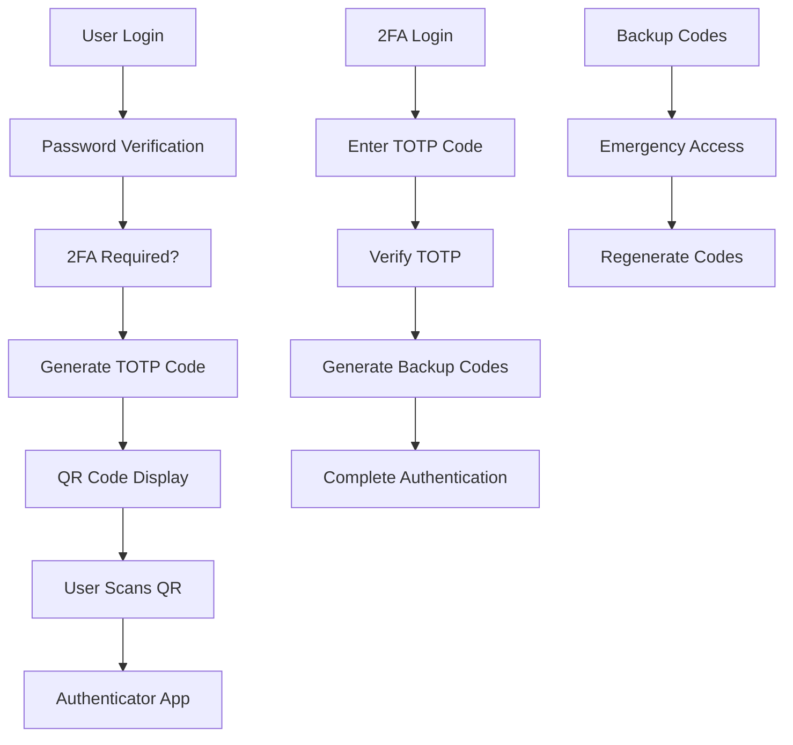

# Two-Factor Authentication (2FA)

## Summary

Comprehensive guide for implementing Two-Factor Authentication (2FA) in the Axisor platform. This document covers TOTP (Time-based One-Time Password) implementation, QR code generation, backup codes, and security best practices for multi-factor authentication.

## 2FA Architecture



## TOTP Implementation

### 2FA Service Setup

```typescript
// backend/src/services/two-factor-auth.service.ts
import * as speakeasy from 'speakeasy';
import * as QRCode from 'qrcode';
import { PrismaClient } from '@prisma/client';

export class TwoFactorAuthService {
  private prisma: PrismaClient;

  constructor(prisma: PrismaClient) {
    this.prisma = prisma;
  }

  /**
   * Enable 2FA for user
   */
  async enable2FA(userId: string): Promise<{
    secret: string;
    qrCodeUrl: string;
    backupCodes: string[];
  }> {
    // Generate TOTP secret
    const secret = speakeasy.generateSecret({
      name: 'Axisor',
      issuer: 'Axisor Platform',
      length: 32
    });

    // Generate backup codes
    const backupCodes = this.generateBackupCodes();

    // Store secret and backup codes
    await this.prisma.user.update({
      where: { id: userId },
      data: {
        two_factor_secret: secret.base32,
        two_factor_enabled: false, // Will be enabled after verification
        backup_codes: backupCodes
      }
    });

    // Generate QR code URL
    const qrCodeUrl = await QRCode.toDataURL(secret.otpauth_url!);

    return {
      secret: secret.base32,
      qrCodeUrl,
      backupCodes
    };
  }

  /**
   * Verify 2FA setup
   */
  async verify2FASetup(userId: string, token: string): Promise<boolean> {
    const user = await this.prisma.user.findUnique({
      where: { id: userId },
      select: { two_factor_secret: true }
    });

    if (!user?.two_factor_secret) {
      throw new Error('2FA not initialized for user');
    }

    // Verify TOTP token
    const verified = speakeasy.totp.verify({
      secret: user.two_factor_secret,
      encoding: 'base32',
      token,
      window: 2 // Allow 2 time steps tolerance
    });

    if (verified) {
      // Enable 2FA
      await this.prisma.user.update({
        where: { id: userId },
        data: { two_factor_enabled: true }
      });

      // Log 2FA enablement
      await this.log2FAEvent(userId, '2FA_ENABLED', { method: 'totp' });
    }

    return verified;
  }

  /**
   * Verify 2FA token during login
   */
  async verify2FAToken(userId: string, token: string): Promise<boolean> {
    const user = await this.prisma.user.findUnique({
      where: { id: userId },
      select: { 
        two_factor_secret: true, 
        two_factor_enabled: true,
        backup_codes: true
      }
    });

    if (!user?.two_factor_enabled || !user.two_factor_secret) {
      throw new Error('2FA not enabled for user');
    }

    // First try TOTP verification
    const totpVerified = speakeasy.totp.verify({
      secret: user.two_factor_secret,
      encoding: 'base32',
      token,
      window: 2
    });

    if (totpVerified) {
      await this.log2FAEvent(userId, '2FA_SUCCESS', { method: 'totp' });
      return true;
    }

    // If TOTP fails, try backup codes
    if (user.backup_codes && user.backup_codes.includes(token)) {
      // Remove used backup code
      const updatedBackupCodes = user.backup_codes.filter(code => code !== token);
      
      await this.prisma.user.update({
        where: { id: userId },
        data: { backup_codes: updatedBackupCodes }
      });

      await this.log2FAEvent(userId, '2FA_SUCCESS', { method: 'backup_code' });
      return true;
    }

    // Log failed attempt
    await this.log2FAEvent(userId, '2FA_FAILED', { method: 'unknown', token: token.substring(0, 3) + '***' });
    return false;
  }

  /**
   * Generate backup codes
   */
  private generateBackupCodes(): string[] {
    const codes: string[] = [];
    for (let i = 0; i < 10; i++) {
      const code = this.generateRandomCode(8);
      codes.push(code);
    }
    return codes;
  }

  /**
   * Generate random backup code
   */
  private generateRandomCode(length: number): string {
    const chars = 'ABCDEFGHIJKLMNOPQRSTUVWXYZ0123456789';
    let result = '';
    for (let i = 0; i < length; i++) {
      result += chars.charAt(Math.floor(Math.random() * chars.length));
    }
    return result;
  }

  /**
   * Regenerate backup codes
   */
  async regenerateBackupCodes(userId: string): Promise<string[]> {
    const user = await this.prisma.user.findUnique({
      where: { id: userId },
      select: { two_factor_enabled: true }
    });

    if (!user?.two_factor_enabled) {
      throw new Error('2FA not enabled for user');
    }

    const newBackupCodes = this.generateBackupCodes();

    await this.prisma.user.update({
      where: { id: userId },
      data: { backup_codes: newBackupCodes }
    });

    await this.log2FAEvent(userId, 'BACKUP_CODES_REGENERATED');

    return newBackupCodes;
  }

  /**
   * Disable 2FA for user
   */
  async disable2FA(userId: string, password: string): Promise<void> {
    const user = await this.prisma.user.findUnique({
      where: { id: userId },
      select: { 
        password_hash: true,
        two_factor_enabled: true
      }
    });

    if (!user?.two_factor_enabled) {
      throw new Error('2FA not enabled for user');
    }

    // Verify password
    const isPasswordValid = await bcrypt.compare(password, user.password_hash);
    if (!isPasswordValid) {
      throw new Error('Invalid password');
    }

    // Disable 2FA
    await this.prisma.user.update({
      where: { id: userId },
      data: {
        two_factor_enabled: false,
        two_factor_secret: null,
        backup_codes: null
      }
    });

    await this.log2FAEvent(userId, '2FA_DISABLED');
  }

  /**
   * Check if 2FA is required for user
   */
  async is2FARequired(userId: string): Promise<boolean> {
    const user = await this.prisma.user.findUnique({
      where: { id: userId },
      select: { two_factor_enabled: true }
    });

    return user?.two_factor_enabled || false;
  }

  /**
   * Log 2FA events
   */
  private async log2FAEvent(
    userId: string, 
    event: string, 
    details?: any
  ): Promise<void> {
    await this.prisma.securityAuditLog.create({
      data: {
        user_id: userId,
        action: event,
        resource: 'two_factor_auth',
        success: !event.includes('FAILED'),
        details: {
          ...details,
          timestamp: new Date().toISOString()
        }
      }
    });
  }
}
```

## 2FA Integration with Authentication

### Enhanced Login Flow

```typescript
// backend/src/services/auth.service.ts
async login(data: LoginRequest): Promise<AuthResponse> {
  const { emailOrUsername, password, twoFactorToken } = data;

  // Find user and verify password (existing logic)
  const user = await this.prisma.user.findFirst({
    where: {
      OR: [
        { email: emailOrUsername },
        { username: emailOrUsername }
      ]
    },
  });

  if (!user) {
    throw new Error('Invalid email/username or password');
  }

  const isValidPassword = await bcrypt.compare(password, user.password_hash);
  if (!isValidPassword) {
    throw new Error('Invalid email/username or password');
  }

  // Check if 2FA is enabled
  if (user.two_factor_enabled) {
    if (!twoFactorToken) {
      // Return partial response indicating 2FA is required
      return {
        user_id: user.id,
        requires_2fa: true,
        message: 'Two-factor authentication required'
      } as any;
    }

    // Verify 2FA token
    const twoFactorService = new TwoFactorAuthService(this.prisma);
    const is2FAValid = await twoFactorService.verify2FAToken(user.id, twoFactorToken);
    
    if (!is2FAValid) {
      throw new Error('Invalid two-factor authentication code');
    }
  }

  // Continue with normal login process
  const token = await this.generateAccessToken(user);
  const refreshToken = await this.generateRefreshToken(user);
  await this.storeRefreshToken(user.id, refreshToken);

  return {
    user_id: user.id,
    token,
    refresh_token: refreshToken,
    plan_type: user.plan_type as PlanType,
    is_admin: !!adminUser,
    user_balance: userBalance,
  };
}
```

## 2FA API Endpoints

### 2FA Routes

```typescript
// backend/src/routes/2fa.routes.ts
export async function twoFactorAuthRoutes(fastify: FastifyInstance) {
  const twoFactorService = new TwoFactorAuthService(fastify.prisma);

  // Enable 2FA
  fastify.post('/2fa/enable', {
    preHandler: [fastify.authenticate],
    handler: async (request: FastifyRequest, reply: FastifyReply) => {
      try {
        const userId = (request as any).user.id;
        const result = await twoFactorService.enable2FA(userId);

        return reply.send({
          success: true,
          data: {
            qrCodeUrl: result.qrCodeUrl,
            backupCodes: result.backupCodes
          }
        });
      } catch (error) {
        return reply.status(400).send({
          success: false,
          error: error instanceof Error ? error.message : 'Failed to enable 2FA'
        });
      }
    }
  });

  // Verify 2FA setup
  fastify.post('/2fa/verify', {
    preHandler: [fastify.authenticate],
    handler: async (request: FastifyRequest, reply: FastifyReply) => {
      try {
        const userId = (request as any).user.id;
        const { token } = request.body as { token: string };

        const verified = await twoFactorService.verify2FASetup(userId, token);

        if (verified) {
          return reply.send({
            success: true,
            message: '2FA enabled successfully'
          });
        } else {
          return reply.status(400).send({
            success: false,
            error: 'Invalid verification code'
          });
        }
      } catch (error) {
        return reply.status(400).send({
          success: false,
          error: error instanceof Error ? error.message : 'Verification failed'
        });
      }
    }
  });

  // Regenerate backup codes
  fastify.post('/2fa/backup-codes/regenerate', {
    preHandler: [fastify.authenticate],
    handler: async (request: FastifyRequest, reply: FastifyReply) => {
      try {
        const userId = (request as any).user.id;
        const backupCodes = await twoFactorService.regenerateBackupCodes(userId);

        return reply.send({
          success: true,
          data: { backupCodes }
        });
      } catch (error) {
        return reply.status(400).send({
          success: false,
          error: error instanceof Error ? error.message : 'Failed to regenerate backup codes'
        });
      }
    }
  });

  // Disable 2FA
  fastify.post('/2fa/disable', {
    preHandler: [fastify.authenticate],
    handler: async (request: FastifyRequest, reply: FastifyReply) => {
      try {
        const userId = (request as any).user.id;
        const { password } = request.body as { password: string };

        await twoFactorService.disable2FA(userId, password);

        return reply.send({
          success: true,
          message: '2FA disabled successfully'
        });
      } catch (error) {
        return reply.status(400).send({
          success: false,
          error: error instanceof Error ? error.message : 'Failed to disable 2FA'
        });
      }
    }
  });

  // Get 2FA status
  fastify.get('/2fa/status', {
    preHandler: [fastify.authenticate],
    handler: async (request: FastifyRequest, reply: FastifyReply) => {
      try {
        const userId = (request as any).user.id;
        const user = await fastify.prisma.user.findUnique({
          where: { id: userId },
          select: {
            two_factor_enabled: true,
            backup_codes: true
          }
        });

        return reply.send({
          success: true,
          data: {
            enabled: user?.two_factor_enabled || false,
            hasBackupCodes: !!(user?.backup_codes && user.backup_codes.length > 0)
          }
        });
      } catch (error) {
        return reply.status(500).send({
          success: false,
          error: 'Failed to get 2FA status'
        });
      }
    }
  });
}
```

## Frontend Integration

### 2FA Setup Component

```typescript
// frontend/src/components/TwoFactorSetup.tsx
import React, { useState } from 'react';
import QRCode from 'qrcode';

interface TwoFactorSetupProps {
  onComplete: () => void;
}

export const TwoFactorSetup: React.FC<TwoFactorSetupProps> = ({ onComplete }) => {
  const [step, setStep] = useState<'setup' | 'verify'>('setup');
  const [qrCodeUrl, setQrCodeUrl] = useState<string>('');
  const [backupCodes, setBackupCodes] = useState<string[]>([]);
  const [verificationCode, setVerificationCode] = useState('');
  const [loading, setLoading] = useState(false);

  const enable2FA = async () => {
    setLoading(true);
    try {
      const response = await fetch('/api/2fa/enable', {
        method: 'POST',
        headers: {
          'Authorization': `Bearer ${localStorage.getItem('token')}`,
          'Content-Type': 'application/json'
        }
      });

      const data = await response.json();
      if (data.success) {
        setQrCodeUrl(data.data.qrCodeUrl);
        setBackupCodes(data.data.backupCodes);
        setStep('verify');
      }
    } catch (error) {
      console.error('Failed to enable 2FA:', error);
    } finally {
      setLoading(false);
    }
  };

  const verify2FA = async () => {
    setLoading(true);
    try {
      const response = await fetch('/api/2fa/verify', {
        method: 'POST',
        headers: {
          'Authorization': `Bearer ${localStorage.getItem('token')}`,
          'Content-Type': 'application/json'
        },
        body: JSON.stringify({ token: verificationCode })
      });

      const data = await response.json();
      if (data.success) {
        onComplete();
      } else {
        alert(data.error);
      }
    } catch (error) {
      console.error('Failed to verify 2FA:', error);
    } finally {
      setLoading(false);
    }
  };

  return (
    <div className="two-factor-setup">
      {step === 'setup' && (
        <div>
          <h2>Enable Two-Factor Authentication</h2>
          <p>Two-factor authentication adds an extra layer of security to your account.</p>
          <button onClick={enable2FA} disabled={loading}>
            {loading ? 'Setting up...' : 'Enable 2FA'}
          </button>
        </div>
      )}

      {step === 'verify' && (
        <div>
          <h2>Scan QR Code</h2>
          <p>Scan this QR code with your authenticator app:</p>
          
          
          <h3>Backup Codes</h3>
          <p>Save these backup codes in a secure location:</p>
          <ul>
            {backupCodes.map((code, index) => (
              <li key={index}>{code}</li>
            ))}
          </ul>

          <div>
            <label>Enter verification code:</label>
            <input
              type="text"
              value={verificationCode}
              onChange={(e) => setVerificationCode(e.target.value)}
              placeholder="000000"
            />
            <button onClick={verify2FA} disabled={loading}>
              {loading ? 'Verifying...' : 'Verify & Enable'}
            </button>
          </div>
        </div>
      )}
    </div>
  );
};
```

## Security Best Practices

### 2FA Security Configuration

```typescript
// 2FA security configuration
export interface TwoFactorSecurityConfig {
  totpWindow: number; // Time window tolerance
  backupCodeLength: number;
  backupCodeCount: number;
  requireBackupCodes: boolean;
  lockoutAttempts: number;
  lockoutDuration: number; // minutes
  auditAllAttempts: boolean;
}

const default2FAConfig: TwoFactorSecurityConfig = {
  totpWindow: 2,
  backupCodeLength: 8,
  backupCodeCount: 10,
  requireBackupCodes: true,
  lockoutAttempts: 5,
  lockoutDuration: 15,
  auditAllAttempts: true
};
```

### Rate Limiting for 2FA

```typescript
// 2FA rate limiting
export class TwoFactorRateLimit {
  private attempts: Map<string, { count: number; lastAttempt: Date }> = new Map();

  isRateLimited(userId: string): boolean {
    const userAttempts = this.attempts.get(userId);
    if (!userAttempts) return false;

    const timeSinceLastAttempt = Date.now() - userAttempts.lastAttempt.getTime();
    const lockoutDuration = 15 * 60 * 1000; // 15 minutes

    if (timeSinceLastAttempt < lockoutDuration && userAttempts.count >= 5) {
      return true;
    }

    return false;
  }

  recordAttempt(userId: string, success: boolean): void {
    const userAttempts = this.attempts.get(userId);
    
    if (success) {
      // Reset on successful attempt
      this.attempts.delete(userId);
    } else {
      // Increment failed attempts
      if (userAttempts) {
        userAttempts.count++;
        userAttempts.lastAttempt = new Date();
      } else {
        this.attempts.set(userId, {
          count: 1,
          lastAttempt: new Date()
        });
      }
    }
  }
}
```

## Monitoring and Analytics

### 2FA Analytics

```typescript
// 2FA analytics service
export class TwoFactorAnalytics {
  constructor(private prisma: PrismaClient) {}

  async get2FAStats(): Promise<{
    totalUsers: number;
    usersWith2FA: number;
    recent2FAEnables: number;
    recent2FADisables: number;
    failedAttempts: number;
  }> {
    const [
      totalUsers,
      usersWith2FA,
      recent2FAEnables,
      recent2FADisables,
      failedAttempts
    ] = await Promise.all([
      this.prisma.user.count(),
      this.prisma.user.count({ where: { two_factor_enabled: true } }),
      this.prisma.securityAuditLog.count({
        where: {
          action: '2FA_ENABLED',
          created_at: { gte: new Date(Date.now() - 30 * 24 * 60 * 60 * 1000) }
        }
      }),
      this.prisma.securityAuditLog.count({
        where: {
          action: '2FA_DISABLED',
          created_at: { gte: new Date(Date.now() - 30 * 24 * 60 * 60 * 1000) }
        }
      }),
      this.prisma.securityAuditLog.count({
        where: {
          action: '2FA_FAILED',
          created_at: { gte: new Date(Date.now() - 30 * 24 * 60 * 60 * 1000) }
        }
      })
    ]);

    return {
      totalUsers,
      usersWith2FA,
      recent2FAEnables,
      recent2FADisables,
      failedAttempts
    };
  }
}
```

## How to Use This Document

- **For Implementation**: Use the TOTP service examples for 2FA setup
- **For Integration**: Use the authentication flow examples for login integration
- **For Frontend**: Use the React component examples for UI implementation
- **For Security**: Use the rate limiting and monitoring examples for security hardening
