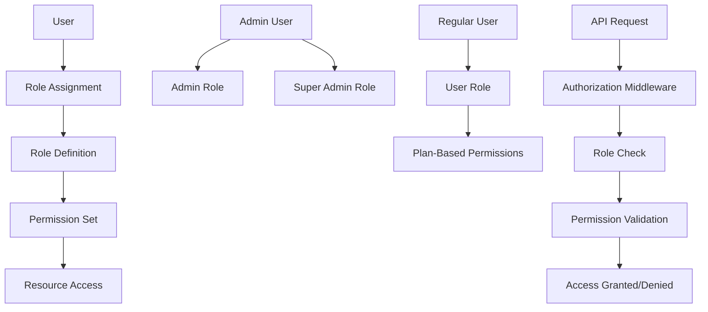

# Role-Based Access Control (RBAC)

## Summary

Comprehensive guide for implementing Role-Based Access Control (RBAC) in the Axisor platform. This document covers role definitions, permission management, middleware implementation, and access control patterns for different user types and administrative functions.

## RBAC Architecture



## Role Definitions

### Database Schema

```sql
-- AdminUser table from schema.prisma
model AdminUser {
  id        String   @id @default(cuid())
  user_id   String   @unique
  role      String   @default("admin") // admin, super_admin
  created_at DateTime @default(now())
  updated_at DateTime @updatedAt

  user User @relation(fields: [user_id], references: [id], onDelete: Cascade)

  @@map("admin_users")
}

-- User table with plan-based roles
model User {
  id          String   @id @default(cuid())
  email       String   @unique
  username    String   @unique
  plan_type   PlanType @default(FREE)
  is_active   Boolean  @default(true)
  // ... other fields
}
```

### Role Types

```typescript
// Role definitions
export enum UserRole {
  USER = 'user',
  ADMIN = 'admin',
  SUPER_ADMIN = 'super_admin'
}

export enum PlanType {
  FREE = 'free',
  BASIC = 'basic',
  ADVANCED = 'advanced',
  PRO = 'pro',
  LIFETIME = 'lifetime'
}

export interface RolePermissions {
  [key: string]: string[];
}

// Permission definitions
export enum Permission {
  // User permissions
  READ_OWN_PROFILE = 'read:own_profile',
  UPDATE_OWN_PROFILE = 'update:own_profile',
  DELETE_OWN_ACCOUNT = 'delete:own_account',
  
  // Trading permissions
  CREATE_AUTOMATION = 'create:automation',
  READ_OWN_AUTOMATIONS = 'read:own_automations',
  UPDATE_OWN_AUTOMATIONS = 'update:own_automations',
  DELETE_OWN_AUTOMATIONS = 'delete:own_automations',
  
  // Margin Guard permissions
  CONFIGURE_MARGIN_GUARD = 'configure:margin_guard',
  EXECUTE_MARGIN_GUARD = 'execute:margin_guard',
  
  // Admin permissions
  READ_ALL_USERS = 'read:all_users',
  UPDATE_USER_PLAN = 'update:user_plan',
  MANAGE_COUPONS = 'manage:coupons',
  VIEW_SYSTEM_LOGS = 'view:system_logs',
  
  // Super Admin permissions
  MANAGE_ADMINS = 'manage:admins',
  SYSTEM_CONFIGURATION = 'system:configuration',
  ACCESS_DEBUG_MODE = 'access:debug_mode'
}

// Role-Permission mapping
export const ROLE_PERMISSIONS: RolePermissions = {
  [UserRole.USER]: [
    Permission.READ_OWN_PROFILE,
    Permission.UPDATE_OWN_PROFILE,
    Permission.DELETE_OWN_ACCOUNT,
    Permission.CREATE_AUTOMATION,
    Permission.READ_OWN_AUTOMATIONS,
    Permission.UPDATE_OWN_AUTOMATIONS,
    Permission.DELETE_OWN_AUTOMATIONS
  ],
  
  [UserRole.ADMIN]: [
    ...ROLE_PERMISSIONS[UserRole.USER],
    Permission.READ_ALL_USERS,
    Permission.UPDATE_USER_PLAN,
    Permission.MANAGE_COUPONS,
    Permission.VIEW_SYSTEM_LOGS
  ],
  
  [UserRole.SUPER_ADMIN]: [
    ...ROLE_PERMISSIONS[UserRole.ADMIN],
    Permission.MANAGE_ADMINS,
    Permission.SYSTEM_CONFIGURATION,
    Permission.ACCESS_DEBUG_MODE
  ]
};

// Plan-based permissions
export const PLAN_PERMISSIONS: Record<PlanType, string[]> = {
  [PlanType.FREE]: [
    Permission.CONFIGURE_MARGIN_GUARD + ':limited',
    Permission.EXECUTE_MARGIN_GUARD + ':basic'
  ],
  [PlanType.BASIC]: [
    Permission.CONFIGURE_MARGIN_GUARD,
    Permission.EXECUTE_MARGIN_GUARD
  ],
  [PlanType.ADVANCED]: [
    Permission.CONFIGURE_MARGIN_GUARD,
    Permission.EXECUTE_MARGIN_GUARD + ':advanced'
  ],
  [PlanType.PRO]: [
    Permission.CONFIGURE_MARGIN_GUARD,
    Permission.EXECUTE_MARGIN_GUARD + ':pro'
  ],
  [PlanType.LIFETIME]: [
    Permission.CONFIGURE_MARGIN_GUARD,
    Permission.EXECUTE_MARGIN_GUARD + ':lifetime'
  ]
};
```

## RBAC Service Implementation

### Authorization Service

```typescript
// backend/src/services/authorization.service.ts
export class AuthorizationService {
  private prisma: PrismaClient;

  constructor(prisma: PrismaClient) {
    this.prisma = prisma;
  }

  /**
   * Check if user has permission
   */
  async hasPermission(
    userId: string, 
    permission: string, 
    resourceId?: string
  ): Promise<boolean> {
    const user = await this.getUserWithRoles(userId);
    if (!user) return false;

    // Get user's role
    const userRole = await this.getUserRole(userId);
    const rolePermissions = ROLE_PERMISSIONS[userRole] || [];

    // Get plan-based permissions
    const planPermissions = PLAN_PERMISSIONS[user.plan_type] || [];

    // Check role permissions
    const hasRolePermission = rolePermissions.some(p => 
      p === permission || p.endsWith('*')
    );

    // Check plan permissions
    const hasPlanPermission = planPermissions.some(p => 
      p === permission || p.startsWith(permission)
    );

    // Check resource-specific permissions if resourceId provided
    if (resourceId && permission.includes(':own_')) {
      const hasResourceAccess = await this.checkResourceOwnership(userId, permission, resourceId);
      return (hasRolePermission || hasPlanPermission) && hasResourceAccess;
    }

    return hasRolePermission || hasPlanPermission;
  }

  /**
   * Get user with role information
   */
  private async getUserWithRoles(userId: string) {
    return await this.prisma.user.findUnique({
      where: { id: userId },
      select: {
        id: true,
        email: true,
        username: true,
        plan_type: true,
        is_active: true,
        adminUser: {
          select: {
            role: true
          }
        }
      }
    });
  }

  /**
   * Get user's role
   */
  private async getUserRole(userId: string): Promise<UserRole> {
    const adminUser = await this.prisma.adminUser.findUnique({
      where: { user_id: userId },
      select: { role: true }
    });

    if (adminUser) {
      return adminUser.role as UserRole;
    }

    return UserRole.USER;
  }

  /**
   * Check resource ownership
   */
  private async checkResourceOwnership(
    userId: string, 
    permission: string, 
    resourceId: string
  ): Promise<boolean> {
    // Check if user owns the resource
    if (permission.includes('own_automations')) {
      const automation = await this.prisma.automation.findFirst({
        where: {
          id: resourceId,
          user_id: userId
        }
      });
      return !!automation;
    }

    if (permission.includes('own_profile')) {
      return userId === resourceId;
    }

    return false;
  }

  /**
   * Get user's effective permissions
   */
  async getUserPermissions(userId: string): Promise<string[]> {
    const userRole = await this.getUserRole(userId);
    const user = await this.getUserWithRoles(userId);
    
    const rolePermissions = ROLE_PERMISSIONS[userRole] || [];
    const planPermissions = user ? PLAN_PERMISSIONS[user.plan_type] || [] : [];

    return [...rolePermissions, ...planPermissions];
  }

  /**
   * Check if user can access admin functions
   */
  async isAdmin(userId: string): Promise<boolean> {
    const adminUser = await this.prisma.adminUser.findUnique({
      where: { user_id: userId }
    });
    return !!adminUser;
  }

  /**
   * Check if user is super admin
   */
  async isSuperAdmin(userId: string): Promise<boolean> {
    const adminUser = await this.prisma.adminUser.findUnique({
      where: { user_id: userId },
      select: { role: true }
    });
    return adminUser?.role === UserRole.SUPER_ADMIN;
  }
}
```

## Authorization Middleware

### Permission Middleware

```typescript
// backend/src/middleware/authorization.middleware.ts
export function requirePermission(permission: string) {
  return async (request: FastifyRequest, reply: FastifyReply): Promise<void> => {
    try {
      const userId = (request as any).user?.id;
      if (!userId) {
        return reply.status(401).send({
          error: 'UNAUTHORIZED',
          message: 'User not authenticated'
        });
      }

      const authService = new AuthorizationService(request.server.prisma);
      const resourceId = (request.params as any)?.id;

      const hasPermission = await authService.hasPermission(userId, permission, resourceId);
      
      if (!hasPermission) {
        return reply.status(403).send({
          error: 'FORBIDDEN',
          message: 'Insufficient permissions',
          required: permission
        });
      }
    } catch (error) {
      return reply.status(500).send({
        error: 'INTERNAL_SERVER_ERROR',
        message: 'Authorization check failed'
      });
    }
  };
}

/**
 * Require admin role
 */
export async function requireAdmin(
  request: FastifyRequest,
  reply: FastifyReply
): Promise<void> {
  try {
    const userId = (request as any).user?.id;
    if (!userId) {
      return reply.status(401).send({
        error: 'UNAUTHORIZED',
        message: 'User not authenticated'
      });
    }

    const authService = new AuthorizationService(request.server.prisma);
    const isAdmin = await authService.isAdmin(userId);

    if (!isAdmin) {
      return reply.status(403).send({
        error: 'FORBIDDEN',
        message: 'Admin access required'
      });
    }
  } catch (error) {
    return reply.status(500).send({
      error: 'INTERNAL_SERVER_ERROR',
      message: 'Admin check failed'
    });
  }
}

/**
 * Require super admin role
 */
export async function requireSuperAdmin(
  request: FastifyRequest,
  reply: FastifyReply
): Promise<void> {
  try {
    const userId = (request as any).user?.id;
    if (!userId) {
      return reply.status(401).send({
        error: 'UNAUTHORIZED',
        message: 'User not authenticated'
      });
    }

    const authService = new AuthorizationService(request.server.prisma);
    const isSuperAdmin = await authService.isSuperAdmin(userId);

    if (!isSuperAdmin) {
      return reply.status(403).send({
        error: 'FORBIDDEN',
        message: 'Super admin access required'
      });
    }
  } catch (error) {
    return reply.status(500).send({
      error: 'INTERNAL_SERVER_ERROR',
      message: 'Super admin check failed'
    });
  }
}

/**
 * Require plan level
 */
export function requirePlan(minPlan: PlanType) {
  return async (request: FastifyRequest, reply: FastifyReply): Promise<void> => {
    try {
      const user = (request as any).user;
      if (!user) {
        return reply.status(401).send({
          error: 'UNAUTHORIZED',
          message: 'User not authenticated'
        });
      }

      const planHierarchy = [PlanType.FREE, PlanType.BASIC, PlanType.ADVANCED, PlanType.PRO, PlanType.LIFETIME];
      const userPlanIndex = planHierarchy.indexOf(user.plan_type);
      const requiredPlanIndex = planHierarchy.indexOf(minPlan);

      if (userPlanIndex < requiredPlanIndex) {
        return reply.status(403).send({
          error: 'FORBIDDEN',
          message: `Plan upgrade required. Minimum plan: ${minPlan}`,
          currentPlan: user.plan_type,
          requiredPlan: minPlan
        });
      }
    } catch (error) {
      return reply.status(500).send({
        error: 'INTERNAL_SERVER_ERROR',
        message: 'Plan check failed'
      });
    }
  };
}
```

## Route Protection Examples

### Protected Routes

```typescript
// backend/src/routes/automations.routes.ts
export async function automationRoutes(fastify: FastifyInstance) {
  // Get user's automations (requires authentication)
  fastify.get('/automations', {
    preHandler: [fastify.authenticate],
    handler: async (request: FastifyRequest, reply: FastifyReply) => {
      const userId = (request as any).user.id;
      // ... implementation
    }
  });

  // Create automation (requires permission)
  fastify.post('/automations', {
    preHandler: [
      fastify.authenticate,
      requirePermission(Permission.CREATE_AUTOMATION)
    ],
    handler: async (request: FastifyRequest, reply: FastifyReply) => {
      // ... implementation
    }
  });

  // Update own automation (requires ownership)
  fastify.put('/automations/:id', {
    preHandler: [
      fastify.authenticate,
      requirePermission(Permission.UPDATE_OWN_AUTOMATIONS)
    ],
    handler: async (request: FastifyRequest, reply: FastifyReply) => {
      // ... implementation
    }
  });

  // Delete own automation (requires ownership)
  fastify.delete('/automations/:id', {
    preHandler: [
      fastify.authenticate,
      requirePermission(Permission.DELETE_OWN_AUTOMATIONS)
    ],
    handler: async (request: FastifyRequest, reply: FastifyReply) => {
      // ... implementation
    }
  });
}

// Admin routes
export async function adminRoutes(fastify: FastifyInstance) {
  // Get all users (admin only)
  fastify.get('/admin/users', {
    preHandler: [fastify.authenticate, requireAdmin],
    handler: async (request: FastifyRequest, reply: FastifyReply) => {
      // ... implementation
    }
  });

  // Update user plan (admin only)
  fastify.put('/admin/users/:id/plan', {
    preHandler: [
      fastify.authenticate,
      requireAdmin,
      requirePermission(Permission.UPDATE_USER_PLAN)
    ],
    handler: async (request: FastifyRequest, reply: FastifyReply) => {
      // ... implementation
    }
  });

  // Manage admins (super admin only)
  fastify.post('/admin/admins', {
    preHandler: [
      fastify.authenticate,
      requireSuperAdmin,
      requirePermission(Permission.MANAGE_ADMINS)
    ],
    handler: async (request: FastifyRequest, reply: FastifyReply) => {
      // ... implementation
    }
  });
}
```

## Plan-Based Access Control

### Plan Limitations Service

```typescript
// backend/src/services/plan-limits.service.ts
export class PlanLimitsService {
  constructor(private prisma: PrismaClient) {}

  /**
   * Get Margin Guard features by plan
   */
  getMarginGuardFeatures(planType: PlanType): MarginGuardFeatures {
    const features = {
      [PlanType.FREE]: {
        modes: ['basic'],
        maxPositions: 3,
        minThreshold: 20,
        maxMarginPercentage: 50,
        notificationChannels: ['email'],
        executionFrequency: 'hourly'
      },
      [PlanType.BASIC]: {
        modes: ['basic', 'advanced'],
        maxPositions: 10,
        minThreshold: 15,
        maxMarginPercentage: 75,
        notificationChannels: ['email', 'telegram'],
        executionFrequency: '30min'
      },
      [PlanType.ADVANCED]: {
        modes: ['basic', 'advanced', 'aggressive'],
        maxPositions: 25,
        minThreshold: 10,
        maxMarginPercentage: 90,
        notificationChannels: ['email', 'telegram', 'whatsapp'],
        executionFrequency: '15min'
      },
      [PlanType.PRO]: {
        modes: ['basic', 'advanced', 'aggressive', 'custom'],
        maxPositions: 100,
        minThreshold: 5,
        maxMarginPercentage: 95,
        notificationChannels: ['email', 'telegram', 'whatsapp', 'slack'],
        executionFrequency: '5min'
      },
      [PlanType.LIFETIME]: {
        modes: ['basic', 'advanced', 'aggressive', 'custom'],
        maxPositions: -1, // unlimited
        minThreshold: 1,
        maxMarginPercentage: 99,
        notificationChannels: ['email', 'telegram', 'whatsapp', 'slack', 'webhook'],
        executionFrequency: '1min'
      }
    };

    return features[planType];
  }

  /**
   * Validate Margin Guard configuration against plan
   */
  validateMarginGuardConfig(config: any, planType: PlanType): boolean {
    const features = this.getMarginGuardFeatures(planType);
    
    // Check mode
    if (!features.modes.includes(config.mode)) {
      throw new Error(`Mode '${config.mode}' not available in ${planType} plan`);
    }

    // Check positions limit
    if (features.maxPositions !== -1 && config.positions > features.maxPositions) {
      throw new Error(`Maximum ${features.maxPositions} positions allowed in ${planType} plan`);
    }

    // Check threshold
    if (config.marginThreshold < features.minThreshold) {
      throw new Error(`Minimum threshold ${features.minThreshold}% required in ${planType} plan`);
    }

    // Check margin percentage
    if (config.addMarginPercentage > features.maxMarginPercentage) {
      throw new Error(`Maximum margin percentage ${features.maxMarginPercentage}% allowed in ${planType} plan`);
    }

    return true;
  }
}
```

## Frontend Authorization

### Permission Hook

```typescript
// frontend/src/hooks/usePermissions.ts
import { useAuthStore } from '../stores/authStore';

export const usePermissions = () => {
  const { user } = useAuthStore();

  const hasPermission = (permission: string): boolean => {
    if (!user) return false;

    // Check role permissions
    const userRole = user.is_admin ? 'admin' : 'user';
    const rolePermissions = ROLE_PERMISSIONS[userRole] || [];

    // Check plan permissions
    const planPermissions = PLAN_PERMISSIONS[user.plan_type] || [];

    return rolePermissions.includes(permission) || planPermissions.includes(permission);
  };

  const hasPlan = (minPlan: PlanType): boolean => {
    if (!user) return false;

    const planHierarchy = [PlanType.FREE, PlanType.BASIC, PlanType.ADVANCED, PlanType.PRO, PlanType.LIFETIME];
    const userPlanIndex = planHierarchy.indexOf(user.plan_type);
    const requiredPlanIndex = planHierarchy.indexOf(minPlan);

    return userPlanIndex >= requiredPlanIndex;
  };

  const isAdmin = (): boolean => {
    return user?.is_admin || false;
  };

  return {
    hasPermission,
    hasPlan,
    isAdmin
  };
};
```

### Protected Component

```typescript
// frontend/src/components/ProtectedComponent.tsx
import React from 'react';
import { usePermissions } from '../hooks/usePermissions';

interface ProtectedComponentProps {
  permission?: string;
  minPlan?: PlanType;
  adminOnly?: boolean;
  children: React.ReactNode;
  fallback?: React.ReactNode;
}

export const ProtectedComponent: React.FC<ProtectedComponentProps> = ({
  permission,
  minPlan,
  adminOnly,
  children,
  fallback = null
}) => {
  const { hasPermission, hasPlan, isAdmin } = usePermissions();

  if (adminOnly && !isAdmin()) {
    return <>{fallback}</>;
  }

  if (permission && !hasPermission(permission)) {
    return <>{fallback}</>;
  }

  if (minPlan && !hasPlan(minPlan)) {
    return <>{fallback}</>;
  }

  return <>{children}</>;
};
```

## How to Use This Document

- **For Implementation**: Use the RBAC service and middleware examples for authorization
- **For Routes**: Use the route protection examples for securing endpoints
- **For Frontend**: Use the permission hooks and components for UI access control
- **For Plans**: Use the plan-based access control for feature limitations
