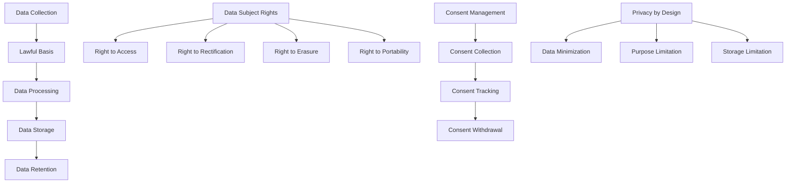

# GDPR Compliance Implementation

## Summary

Comprehensive guide for implementing GDPR (General Data Protection Regulation) compliance in the Axisor platform. This document covers data subject rights, consent management, data processing principles, privacy by design, and compliance monitoring.

## GDPR Architecture



## GDPR Implementation Framework

### Data Processing Principles

```typescript
// backend/src/services/gdpr-compliance.service.ts
export class GDPRComplianceService {
  private prisma: PrismaClient;

  constructor(prisma: PrismaClient) {
    this.prisma = prisma;
  }

  /**
   * Implement GDPR data processing principles
   */
  async processDataAccordingToGDPR(
    data: any,
    purpose: string,
    lawfulBasis: LawfulBasis,
    dataSubject: string
  ): Promise<ProcessingRecord> {
    // 1. Lawfulness, fairness and transparency
    await this.ensureLawfulBasis(data, purpose, lawfulBasis);
    
    // 2. Purpose limitation
    await this.validatePurposeLimitation(purpose, data);
    
    // 3. Data minimization
    const minimizedData = await this.minimizeData(data, purpose);
    
    // 4. Accuracy
    await this.ensureDataAccuracy(minimizedData);
    
    // 5. Storage limitation
    await this.applyStorageLimitation(minimizedData, purpose);
    
    // 6. Integrity and confidentiality
    await this.ensureDataSecurity(minimizedData);
    
    // 7. Accountability
    const processingRecord = await this.createProcessingRecord({
      dataSubject,
      purpose,
      lawfulBasis,
      data: minimizedData,
      timestamp: new Date()
    });

    return processingRecord;
  }

  /**
   * Ensure lawful basis for processing
   */
  private async ensureLawfulBasis(
    data: any,
    purpose: string,
    lawfulBasis: LawfulBasis
  ): Promise<void> {
    const lawfulBasisMap = {
      'consent': () => this.validateConsent(data.dataSubject, purpose),
      'contract': () => this.validateContractualNecessity(purpose),
      'legal_obligation': () => this.validateLegalObligation(purpose),
      'vital_interests': () => this.validateVitalInterests(purpose),
      'public_task': () => this.validatePublicTask(purpose),
      'legitimate_interests': () => this.validateLegitimateInterests(data, purpose)
    };

    const validator = lawfulBasisMap[lawfulBasis];
    if (!validator) {
      throw new Error(`Invalid lawful basis: ${lawfulBasis}`);
    }

    const isValid = await validator();
    if (!isValid) {
      throw new Error(`Lawful basis validation failed for ${lawfulBasis}`);
    }
  }

  /**
   * Validate consent for processing
   */
  private async validateConsent(dataSubject: string, purpose: string): Promise<boolean> {
    const consent = await this.prisma.userConsent.findFirst({
      where: {
        user_id: dataSubject,
        purpose,
        granted: true,
        withdrawn_at: null
      },
      orderBy: { granted_at: 'desc' }
    });

    return !!consent;
  }

  /**
   * Validate contractual necessity
   */
  private async validateContractualNecessity(purpose: string): Promise<boolean> {
    const contractualPurposes = [
      'account_creation',
      'service_provision',
      'payment_processing',
      'customer_support'
    ];

    return contractualPurposes.includes(purpose);
  }

  /**
   * Validate legitimate interests
   */
  private async validateLegitimateInterests(data: any, purpose: string): Promise<boolean> {
    // Perform legitimate interests assessment
    const interests = await this.identifyLegitimateInterests(purpose);
    const necessity = await this.assessNecessity(data, purpose);
    const balance = await this.performBalancingTest(data, purpose);

    return interests && necessity && balance;
  }

  /**
   * Minimize data according to purpose
   */
  private async minimizeData(data: any, purpose: string): Promise<any> {
    const dataMinimizationMap = {
      'account_creation': ['email', 'username', 'password_hash'],
      'service_provision': ['email', 'plan_type', 'is_active'],
      'payment_processing': ['email', 'plan_type', 'payment_method'],
      'customer_support': ['email', 'username', 'issue_description'],
      'marketing': ['email', 'preferences'],
      'analytics': ['usage_statistics', 'performance_metrics']
    };

    const allowedFields = dataMinimizationMap[purpose] || [];
    const minimizedData: any = {};

    allowedFields.forEach(field => {
      if (data[field] !== undefined) {
        minimizedData[field] = data[field];
      }
    });

    return minimizedData;
  }

  /**
   * Apply storage limitation
   */
  private async applyStorageLimitation(data: any, purpose: string): Promise<void> {
    const retentionPeriods = {
      'account_creation': 2555, // 7 years
      'service_provision': 2555, // 7 years
      'payment_processing': 2555, // 7 years
      'customer_support': 365, // 1 year
      'marketing': 365, // 1 year
      'analytics': 90 // 3 months
    };

    const retentionPeriod = retentionPeriods[purpose] || 365;
    const retentionDate = new Date(Date.now() + retentionPeriod * 24 * 60 * 60 * 1000);

    // Set retention date for data
    await this.prisma.dataRetention.create({
      data: {
        data_type: purpose,
        retention_date: retentionDate,
        created_at: new Date()
      }
    });
  }

  /**
   * Create processing record for accountability
   */
  private async createProcessingRecord(record: ProcessingRecord): Promise<ProcessingRecord> {
    const savedRecord = await this.prisma.dataProcessingRecord.create({
      data: {
        data_subject: record.dataSubject,
        purpose: record.purpose,
        lawful_basis: record.lawfulBasis,
        data_processed: record.data,
        timestamp: record.timestamp,
        processor: 'axisor_system'
      }
    });

    return {
      id: savedRecord.id,
      dataSubject: record.dataSubject,
      purpose: record.purpose,
      lawfulBasis: record.lawfulBasis,
      data: record.data,
      timestamp: record.timestamp
    };
  }
}

interface ProcessingRecord {
  id?: string;
  dataSubject: string;
  purpose: string;
  lawfulBasis: LawfulBasis;
  data: any;
  timestamp: Date;
}

type LawfulBasis = 'consent' | 'contract' | 'legal_obligation' | 'vital_interests' | 'public_task' | 'legitimate_interests';
```

## Data Subject Rights Implementation

### Data Subject Rights Service

```typescript
// backend/src/services/data-subject-rights.service.ts
export class DataSubjectRightsService {
  private prisma: PrismaClient;

  constructor(prisma: PrismaClient) {
    this.prisma = prisma;
  }

  /**
   * Right to be informed - Privacy notice
   */
  async generatePrivacyNotice(userId: string): Promise<PrivacyNotice> {
    const user = await this.prisma.user.findUnique({
      where: { id: userId },
      include: {
        userConsent: true,
        dataProcessingRecords: true
      }
    });

    if (!user) {
      throw new Error('User not found');
    }

    const privacyNotice: PrivacyNotice = {
      dataController: {
        name: 'Axisor Platform',
        address: 'Privacy-compliant address',
        contact: 'privacy@axisor.com'
      },
      dataProcessing: {
        purposes: this.extractPurposes(user.dataProcessingRecords),
        lawfulBasis: this.extractLawfulBasis(user.dataProcessingRecords),
        dataCategories: this.extractDataCategories(user),
        recipients: this.extractRecipients(),
        transfers: this.extractTransfers(),
        retention: this.extractRetentionPeriods()
      },
      rights: {
        access: true,
        rectification: true,
        erasure: true,
        restriction: true,
        portability: true,
        objection: true
      },
      contact: {
        email: 'privacy@axisor.com',
        phone: 'Privacy contact phone',
        address: 'Privacy contact address'
      },
      complaints: {
        supervisoryAuthority: 'Local Data Protection Authority',
        contact: 'authority@example.com'
      }
    };

    return privacyNotice;
  }

  /**
   * Right to access - Data export
   */
  async exportUserData(userId: string): Promise<DataExport> {
    const userData = await this.getAllUserData(userId);
    const processingRecords = await this.getProcessingRecords(userId);
    const consentRecords = await this.getConsentRecords(userId);

    const dataExport: DataExport = {
      personalData: userData,
      processingRecords,
      consentRecords,
      exportDate: new Date(),
      format: 'JSON',
      version: '1.0'
    };

    // Log data export
    await this.logDataSubjectRequest(userId, 'DATA_EXPORT', {
      format: dataExport.format,
      recordCount: processingRecords.length
    });

    return dataExport;
  }

  /**
   * Right to rectification
   */
  async rectifyUserData(
    userId: string,
    corrections: DataCorrection[]
  ): Promise<RectificationResult> {
    const results: RectificationResult[] = [];

    for (const correction of corrections) {
      try {
        // Validate correction
        await this.validateCorrection(userId, correction);
        
        // Apply correction
        await this.applyCorrection(userId, correction);
        
        results.push({
          field: correction.field,
          status: 'success',
          message: 'Data rectified successfully'
        });
      } catch (error) {
        results.push({
          field: correction.field,
          status: 'failed',
          message: error.message
        });
      }
    }

    // Log rectification
    await this.logDataSubjectRequest(userId, 'DATA_RECTIFICATION', {
      corrections: corrections.length,
      successful: results.filter(r => r.status === 'success').length
    });

    return {
      userId,
      corrections: results,
      timestamp: new Date()
    };
  }

  /**
   * Right to erasure (Right to be forgotten)
   */
  async eraseUserData(
    userId: string,
    reason: string
  ): Promise<ErasureResult> {
    // Check for legal obligations to retain data
    const retentionCheck = await this.checkRetentionObligations(userId);
    
    if (retentionCheck.mustRetain) {
      return {
        userId,
        status: 'partial',
        message: 'Some data must be retained due to legal obligations',
        retainedData: retentionCheck.retainedData,
        erasedData: retentionCheck.erasedData
      };
    }

    // Perform complete erasure
    await this.performCompleteErasure(userId);

    // Log erasure
    await this.logDataSubjectRequest(userId, 'DATA_ERASURE', {
      reason,
      type: 'complete'
    });

    return {
      userId,
      status: 'complete',
      message: 'All personal data has been erased',
      timestamp: new Date()
    };
  }

  /**
   * Right to data portability
   */
  async exportPortableData(userId: string): Promise<PortableData> {
    const userData = await this.getUserData(userId);
    const structuredData = await this.structureDataForPortability(userData);

    const portableData: PortableData = {
      personalData: structuredData.personal,
      serviceData: structuredData.service,
      preferences: structuredData.preferences,
      format: 'JSON',
      standard: 'GDPR Article 20',
      exportDate: new Date()
    };

    return portableData;
  }

  /**
   * Right to restriction of processing
   */
  async restrictProcessing(
    userId: string,
    restrictions: ProcessingRestriction[]
  ): Promise<RestrictionResult> {
    const results: RestrictionResult[] = [];

    for (const restriction of restrictions) {
      try {
        await this.applyProcessingRestriction(userId, restriction);
        
        results.push({
          purpose: restriction.purpose,
          status: 'restricted',
          message: 'Processing restricted successfully'
        });
      } catch (error) {
        results.push({
          purpose: restriction.purpose,
          status: 'failed',
          message: error.message
        });
      }
    }

    return {
      userId,
      restrictions: results,
      timestamp: new Date()
    };
  }

  /**
   * Right to object
   */
  async objectToProcessing(
    userId: string,
    objection: ProcessingObjection
  ): Promise<ObjectionResult> {
    // Validate objection
    await this.validateObjection(userId, objection);
    
    // Apply objection
    await this.applyObjection(userId, objection);
    
    // Log objection
    await this.logDataSubjectRequest(userId, 'PROCESSING_OBJECTION', {
      purpose: objection.purpose,
      reason: objection.reason
    });

    return {
      userId,
      purpose: objection.purpose,
      status: 'objection_applied',
      message: 'Objection to processing has been applied',
      timestamp: new Date()
    };
  }

  /**
   * Check retention obligations
   */
  private async checkRetentionObligations(userId: string): Promise<{
    mustRetain: boolean;
    retainedData: string[];
    erasedData: string[];
  }> {
    const retainedData: string[] = [];
    const erasedData: string[] = [];

    // Check for active subscriptions
    const user = await this.prisma.user.findUnique({
      where: { id: userId },
      select: { plan_type: true }
    });

    if (user?.plan_type !== 'free') {
      retainedData.push('account_data', 'subscription_data');
    } else {
      erasedData.push('account_data');
    }

    // Check for recent transactions
    const recentTransactions = await this.prisma.payment.findMany({
      where: {
        user_id: userId,
        created_at: { gte: new Date(Date.now() - 7 * 365 * 24 * 60 * 60 * 1000) }
      }
    });

    if (recentTransactions.length > 0) {
      retainedData.push('financial_records');
    } else {
      erasedData.push('financial_records');
    }

    return {
      mustRetain: retainedData.length > 0,
      retainedData,
      erasedData
    };
  }

  /**
   * Perform complete data erasure
   */
  private async performCompleteErasure(userId: string): Promise<void> {
    await this.prisma.$transaction([
      // Anonymize user record
      this.prisma.user.update({
        where: { id: userId },
        data: {
          email: `deleted_${userId}@deleted.com`,
          username: `deleted_${userId}`,
          password_hash: null,
          is_active: false,
          deleted_at: new Date()
        }
      }),
      
      // Delete related data
      this.prisma.automation.deleteMany({ where: { user_id: userId } }),
      this.prisma.userExchangeAccounts.deleteMany({ where: { user_id: userId } }),
      this.prisma.notification.deleteMany({ where: { user_id: userId } }),
      this.prisma.userConsent.deleteMany({ where: { user_id: userId } })
    ]);
  }

  /**
   * Log data subject request
   */
  private async logDataSubjectRequest(
    userId: string,
    requestType: string,
    details: any
  ): Promise<void> {
    await this.prisma.dataSubjectRequest.create({
      data: {
        user_id: userId,
        request_type: requestType,
        details,
        status: 'completed',
        processed_at: new Date()
      }
    });
  }
}

interface PrivacyNotice {
  dataController: {
    name: string;
    address: string;
    contact: string;
  };
  dataProcessing: {
    purposes: string[];
    lawfulBasis: string[];
    dataCategories: string[];
    recipients: string[];
    transfers: string[];
    retention: any;
  };
  rights: {
    access: boolean;
    rectification: boolean;
    erasure: boolean;
    restriction: boolean;
    portability: boolean;
    objection: boolean;
  };
  contact: {
    email: string;
    phone: string;
    address: string;
  };
  complaints: {
    supervisoryAuthority: string;
    contact: string;
  };
}

interface DataExport {
  personalData: any;
  processingRecords: any[];
  consentRecords: any[];
  exportDate: Date;
  format: string;
  version: string;
}

interface DataCorrection {
  field: string;
  currentValue: any;
  correctedValue: any;
  reason: string;
}

interface RectificationResult {
  userId: string;
  corrections: {
    field: string;
    status: 'success' | 'failed';
    message: string;
  }[];
  timestamp: Date;
}

interface ErasureResult {
  userId: string;
  status: 'complete' | 'partial';
  message: string;
  retainedData?: string[];
  erasedData?: string[];
  timestamp?: Date;
}

interface PortableData {
  personalData: any;
  serviceData: any;
  preferences: any;
  format: string;
  standard: string;
  exportDate: Date;
}

interface ProcessingRestriction {
  purpose: string;
  reason: string;
  duration?: number;
}

interface RestrictionResult {
  userId: string;
  restrictions: {
    purpose: string;
    status: 'restricted' | 'failed';
    message: string;
  }[];
  timestamp: Date;
}

interface ProcessingObjection {
  purpose: string;
  reason: string;
}

interface ObjectionResult {
  userId: string;
  purpose: string;
  status: string;
  message: string;
  timestamp: Date;
}
```

## Privacy by Design Implementation

### Privacy by Design Service

```typescript
// backend/src/services/privacy-by-design.service.ts
export class PrivacyByDesignService {
  private prisma: PrismaClient;

  constructor(prisma: PrismaClient) {
    this.prisma = prisma;
  }

  /**
   * Implement privacy by design principles
   */
  async implementPrivacyByDesign(
    feature: string,
    dataProcessing: DataProcessing
  ): Promise<PrivacyImpactAssessment> {
    // 1. Proactive not reactive
    const proactiveMeasures = await this.assessProactiveMeasures(feature);
    
    // 2. Privacy as the default setting
    const defaultPrivacy = await this.assessDefaultPrivacy(feature);
    
    // 3. Full functionality with privacy
    const functionality = await this.assessFunctionality(feature);
    
    // 4. End-to-end security
    const security = await this.assessEndToEndSecurity(feature);
    
    // 5. Visibility and transparency
    const transparency = await this.assessTransparency(feature);
    
    // 6. Respect for user privacy
    const userPrivacy = await this.assessUserPrivacy(feature);

    const pia: PrivacyImpactAssessment = {
      feature,
      dataProcessing,
      assessment: {
        proactiveMeasures,
        defaultPrivacy,
        functionality,
        security,
        transparency,
        userPrivacy
      },
      recommendations: await this.generateRecommendations({
        proactiveMeasures,
        defaultPrivacy,
        functionality,
        security,
        transparency,
        userPrivacy
      }),
      approved: await this.isAssessmentApproved({
        proactiveMeasures,
        defaultPrivacy,
        functionality,
        security,
        transparency,
        userPrivacy
      }),
      assessmentDate: new Date()
    };

    await this.storePrivacyImpactAssessment(pia);
    return pia;
  }

  /**
   * Assess proactive measures
   */
  private async assessProactiveMeasures(feature: string): Promise<AssessmentResult> {
    const measures = [
      'Data minimization implemented',
      'Purpose limitation enforced',
      'Retention periods defined',
      'Security controls in place',
      'Privacy notices updated'
    ];

    const implemented = measures.filter(measure => 
      this.isMeasureImplemented(feature, measure)
    );

    return {
      score: (implemented.length / measures.length) * 100,
      details: {
        implemented,
        missing: measures.filter(m => !implemented.includes(m))
      }
    };
  }

  /**
   * Assess default privacy settings
   */
  private async assessDefaultPrivacy(feature: string): Promise<AssessmentResult> {
    const privacyDefaults = [
      'Minimal data collection by default',
      'Opt-in consent required',
      'Privacy-friendly settings default',
      'No tracking by default',
      'Data sharing disabled by default'
    ];

    const implemented = privacyDefaults.filter(defaultSetting => 
      this.isDefaultImplemented(feature, defaultSetting)
    );

    return {
      score: (implemented.length / privacyDefaults.length) * 100,
      details: {
        implemented,
        missing: privacyDefaults.filter(d => !implemented.includes(d))
      }
    };
  }

  /**
   * Generate privacy recommendations
   */
  private async generateRecommendations(assessment: any): Promise<string[]> {
    const recommendations: string[] = [];

    if (assessment.proactiveMeasures.score < 80) {
      recommendations.push('Implement additional proactive privacy measures');
    }

    if (assessment.defaultPrivacy.score < 80) {
      recommendations.push('Improve default privacy settings');
    }

    if (assessment.security.score < 90) {
      recommendations.push('Enhance end-to-end security measures');
    }

    if (assessment.transparency.score < 80) {
      recommendations.push('Improve transparency and visibility');
    }

    return recommendations;
  }

  /**
   * Store privacy impact assessment
   */
  private async storePrivacyImpactAssessment(pia: PrivacyImpactAssessment): Promise<void> {
    await this.prisma.privacyImpactAssessment.create({
      data: {
        feature: pia.feature,
        data_processing: pia.dataProcessing,
        assessment: pia.assessment,
        recommendations: pia.recommendations,
        approved: pia.approved,
        assessment_date: pia.assessmentDate
      }
    });
  }

  private isMeasureImplemented(feature: string, measure: string): boolean {
    // Implementation logic for checking if measure is implemented
    return Math.random() > 0.3; // Placeholder logic
  }

  private isDefaultImplemented(feature: string, defaultSetting: string): boolean {
    // Implementation logic for checking if default is implemented
    return Math.random() > 0.3; // Placeholder logic
  }

  private async isAssessmentApproved(assessment: any): Promise<boolean> {
    const minScore = 80;
    const scores = Object.values(assessment).map((a: any) => a.score);
    const averageScore = scores.reduce((sum, score) => sum + score, 0) / scores.length;
    
    return averageScore >= minScore;
  }
}

interface PrivacyImpactAssessment {
  feature: string;
  dataProcessing: DataProcessing;
  assessment: {
    proactiveMeasures: AssessmentResult;
    defaultPrivacy: AssessmentResult;
    functionality: AssessmentResult;
    security: AssessmentResult;
    transparency: AssessmentResult;
    userPrivacy: AssessmentResult;
  };
  recommendations: string[];
  approved: boolean;
  assessmentDate: Date;
}

interface AssessmentResult {
  score: number;
  details: {
    implemented: string[];
    missing: string[];
  };
}

interface DataProcessing {
  purposes: string[];
  dataTypes: string[];
  lawfulBasis: string[];
  recipients: string[];
  transfers: string[];
  retention: any;
}
```

## How to Use This Document

- **For Implementation**: Use the GDPR compliance service for implementing data protection principles
- **For Rights**: Use the data subject rights service for handling user requests
- **For Design**: Use the privacy by design service for building privacy-compliant features
- **For Compliance**: Use the framework for maintaining GDPR compliance
