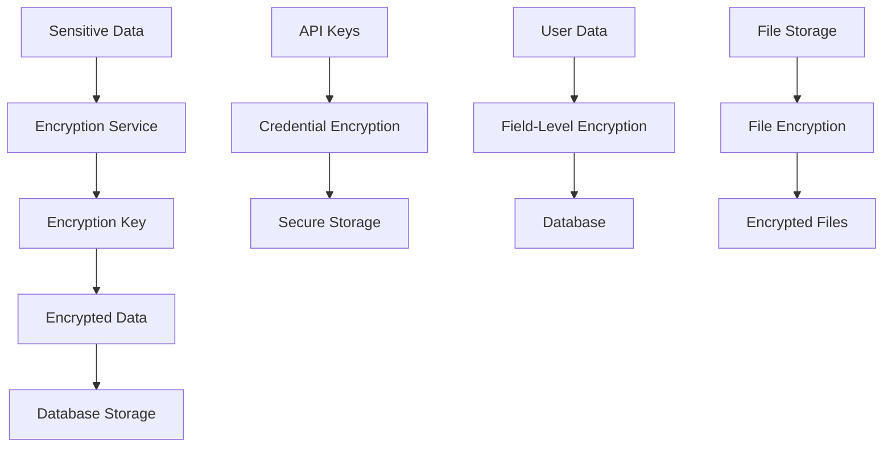

# Encryption at Rest

## Summary

Comprehensive guide for implementing encryption at rest in the Axisor platform. This document covers database encryption, file system encryption, sensitive data protection, key management, and security best practices for data at rest.

## Encryption Architecture



## Encryption Services

### Basic Encryption Service

```typescript
// backend/src/services/auth.service.ts
export class AuthService {
  /**
   * Encrypt sensitive data
   */
  public encryptData(data: string): string {
    const algorithm = 'aes-256-cbc';
    const key = crypto.scryptSync(config.security.encryption.key, 'salt', 32);
    const iv = crypto.randomBytes(16);

    const cipher = crypto.createCipheriv(algorithm, key, iv);
    let encrypted = cipher.update(data, 'utf8', 'hex');
    encrypted += cipher.final('hex');

    return iv.toString('hex') + ':' + encrypted;
  }

  // Cache da chave de descriptografia para evitar scryptSync custoso
  private static decryptionKey: Buffer | null = null;

  /**
   * Decrypt sensitive data - OTIMIZADO com cache de chave
   */
  public decryptData(encryptedData: string): string {
    const algorithm = 'aes-256-cbc';
    
    // Usar chave em cache ou criar uma vez
    if (!AuthService.decryptionKey) {
      AuthService.decryptionKey = crypto.scryptSync(config.security.encryption.key, 'salt', 32);
    }

    const parts = encryptedData.split(':');
    if (parts.length !== 2 || !parts[0] || !parts[1]) {
      throw new Error('Invalid encrypted data format');
    }

    const iv = Buffer.from(parts[0] as string, 'hex');
    const encrypted = parts[1] as string;

    const decipher = crypto.createDecipheriv(algorithm, AuthService.decryptionKey, iv);
    let decrypted = decipher.update(encrypted, 'hex', 'utf8');
    decrypted += decipher.final('utf8');

    return decrypted;
  }
}
```

### Advanced Encryption Service

```typescript
// backend/src/services/advanced-crypto.service.ts
import sodium from 'libsodium-wrappers';

export interface EncryptionResult {
  ciphertext: string;
  nonce: string;
  tag: string;
}

export class AdvancedCryptoService {
  private logger: Logger;
  private masterKey: Buffer;

  constructor(logger: Logger) {
    this.logger = logger;
    this.masterKey = Buffer.from(process.env.MASTER_ENCRYPTION_KEY || '', 'hex');
  }

  async initialize(): Promise<void> {
    await sodium.ready;
    this.logger.info('Advanced crypto service initialized with libsodium');
  }

  /**
   * Encrypt data using XChaCha20-Poly1305
   */
  async encrypt(data: string): Promise<EncryptionResult> {
    try {
      await sodium.ready;
      
      const dataBytes = sodium.from_string(data);
      const nonce = sodium.randombytes_buf(sodium.crypto_aead_xchacha20poly1305_ietf_NPUBBYTES);
      
      const ciphertext = sodium.crypto_aead_xchacha20poly1305_ietf_encrypt(
        dataBytes,
        null, // No additional data
        null, // No additional data
        nonce,
        this.masterKey
      );

      return {
        ciphertext: sodium.to_base64(ciphertext),
        nonce: sodium.to_base64(nonce),
        tag: sodium.to_base64(ciphertext.slice(-sodium.crypto_aead_xchacha20poly1305_ietf_ABYTES))
      };
    } catch (error) {
      this.logger.error('Encryption failed', { error: (error as Error).message });
      throw new Error('Encryption failed');
    }
  }

  /**
   * Decrypt data using XChaCha20-Poly1305
   */
  async decrypt(encryptionResult: EncryptionResult): Promise<string> {
    try {
      await sodium.ready;
      
      const ciphertext = sodium.from_base64(encryptionResult.ciphertext);
      const nonce = sodium.from_base64(encryptionResult.nonce);
      
      const decrypted = sodium.crypto_aead_xchacha20poly1305_ietf_decrypt(
        ciphertext,
        null, // No additional data
        null, // No additional data
        nonce,
        this.masterKey
      );

      return sodium.to_string(decrypted);
    } catch (error) {
      this.logger.error('Decryption failed', { error: (error as Error).message });
      throw new Error('Decryption failed');
    }
  }

  /**
   * Generate encryption key
   */
  generateKey(): string {
    return sodium.to_base64(sodium.randombytes_buf(32));
  }

  /**
   * Derive key from password
   */
  deriveKeyFromPassword(password: string, salt: string): string {
    const passwordBytes = sodium.from_string(password);
    const saltBytes = sodium.from_base64(salt);
    
    const key = sodium.crypto_pwhash(
      32,
      passwordBytes,
      saltBytes,
      sodium.crypto_pwhash_OPSLIMIT_INTERACTIVE,
      sodium.crypto_pwhash_MEMLIMIT_INTERACTIVE,
      sodium.crypto_pwhash_ALG_ARGON2ID13
    );

    return sodium.to_base64(key);
  }
}
```

### Secure Storage Service

```typescript
// backend/src/services/secure-storage.service.ts
import { scryptAsync, randomBytes, createCipheriv, createDecipheriv } from 'crypto';
import { promisify } from 'util';
import { config } from '../config/env';

export interface SecureCredentials {
  apiKey: string;
  apiSecret: string;
  passphrase: string;
}

export class SecureStorageService {
  private algorithm = 'aes-256-gcm';
  private keyLength = 32;
  private ivLength = 16;

  /**
   * Gerar chave de criptografia a partir da chave de ambiente
   */
  private async generateKey(): Promise<Buffer> {
    const salt = Buffer.from(config.security.encryption.key, 'hex');
    return (await scryptAsync(
      salt,
      'axisor-salt',
      this.keyLength
    )) as Buffer;
  }

  /**
   * Criptografar credenciais
   */
  async encryptCredentials(credentials: SecureCredentials): Promise<string> {
    try {
      const key = await this.generateKey();
      const iv = randomBytes(this.ivLength);
      const cipher = createCipheriv(this.algorithm, key, iv);

      // Serializar credenciais
      const data = JSON.stringify(credentials);

      // Criptografar
      let encrypted = cipher.update(data, 'utf8', 'hex');
      encrypted += cipher.final('hex');

      // Obter tag de autenticação
      const tag = (cipher as any).getAuthTag();

      // Combinar IV + tag + dados criptografados
      const result =
        iv.toString('hex') + ':' + tag.toString('hex') + ':' + encrypted;

      return result;
    } catch (error) {
      console.error('Error encrypting credentials:', error);
      throw new Error('Failed to encrypt credentials');
    }
  }

  /**
   * Descriptografar credenciais
   */
  async decryptCredentials(encryptedData: string): Promise<SecureCredentials> {
    try {
      const key = await this.generateKey();
      const parts = encryptedData.split(':');

      if (parts.length !== 3) {
        throw new Error('Invalid encrypted data format');
      }

      const iv = Buffer.from(parts[0], 'hex');
      const tag = Buffer.from(parts[1], 'hex');
      const encrypted = parts[2];

      const decipher = createDecipheriv(this.algorithm, key, iv);
      (decipher as any).setAuthTag(tag);

      let decrypted = decipher.update(encrypted, 'hex', 'utf8');
      decrypted += decipher.final('utf8');

      return JSON.parse(decrypted);
    } catch (error) {
      console.error('Error decrypting credentials:', error);
      throw new Error('Failed to decrypt credentials');
    }
  }
}
```

## Database Encryption

### Exchange Credentials Encryption

```typescript
// backend/src/services/userExchangeAccount.service.ts
export class UserExchangeAccountService {
  constructor(private prisma: PrismaClient) {}

  /**
   * Create a new user exchange account with encrypted credentials
   */
  async createUserExchangeAccount(
    userId: string, 
    data: CreateUserExchangeAccountData
  ): Promise<UserExchangeAccountWithExchange> {
    
    // Check if user already has an active account
    const hasActiveAccount = await this.prisma.userExchangeAccounts.findFirst({
      where: {
        user_id: userId,
        is_active: true
      }
    });

    // Criptografar credenciais
    const encryptedCredentials: Record<string, string> = {};
    
    Object.entries(data.credentials).forEach(([key, value]) => {
      // Campo isTestnet não precisa criptografia
      if (key === 'isTestnet' || key === 'testnet') {
        encryptedCredentials[key] = value;
        console.log(`ℹ️ USER EXCHANGE ACCOUNT SERVICE - Plain text field stored: ${key} = ${value}`);
        return;
      }

      if (value && value.trim() !== '') {
        try {
          const crypto = require('crypto');
          const { securityConfig } = require('../config/env');
          const algorithm = 'aes-256-cbc';
          const key = crypto.scryptSync(securityConfig.encryption.key, 'salt', 32);
          const iv = crypto.randomBytes(16);
          
          const cipher = crypto.createCipheriv(algorithm, key, iv);
          let encrypted = cipher.update(value, 'utf8', 'hex');
          encrypted += cipher.final('hex');
          
          encryptedCredentials[key] = `${iv.toString('hex')}:${encrypted}`;
          console.log(`✅ USER EXCHANGE ACCOUNT SERVICE - Encrypted credential ${key}`);
        } catch (error) {
          console.warn(`⚠️ USER EXCHANGE ACCOUNT SERVICE - Failed to encrypt credential ${key}:`, error);
          encryptedCredentials[key] = value; // Fallback para valor não criptografado
        }
      }
    });

    // Criar conta
    const account = await this.prisma.userExchangeAccounts.create({
      data: {
        user_id: userId,
        exchange_id: data.exchange_id,
        account_name: data.account_name,
        credentials: encryptedCredentials,
        is_active: !hasActiveAccount, // Apenas ativa se não houver conta ativa
        is_verified: false
      },
      include: {
        exchange: true
      }
    });

    return account;
  }

  /**
   * Decrypt credentials for use - CORRIGIDO para evitar corrupção de chaves
   */
  public decryptCredentials(encryptedCredentials: Record<string, string>): Record<string, string> {
    const decryptedCredentials: Record<string, string> = {};
    
    console.log(`🔍 USER EXCHANGE ACCOUNT SERVICE - Decrypting credentials:`, encryptedCredentials);
    
    if (encryptedCredentials && typeof encryptedCredentials === 'object') {
      // Usar Object.keys para evitar corrupção das chaves
      const keys = Object.keys(encryptedCredentials);
      
      for (const key of keys) {
        const value = encryptedCredentials[key];
        
        if (value && typeof value === 'string') {
          try {
            // Usar a mesma lógica de descriptografia do AuthService
            const crypto = require('crypto');
            const algorithm = 'aes-256-cbc';
            const encryptionKey = process.env.ENCRYPTION_KEY;
            const keyBuffer = crypto.scryptSync(encryptionKey, 'salt', 32);
            
            // Extrair IV e dados criptografados
            const [ivHex, encryptedHex] = value.split(':');
            if (!ivHex || !encryptedHex) {
              // Se não está no formato criptografado, assumir que é valor plano (ex: isTestnet)
              console.log(`ℹ️ USER EXCHANGE ACCOUNT SERVICE - Plain text credential field: ${key} = ${value}`);
              decryptedCredentials[key] = value;
              continue;
            }
            
            const iv = Buffer.from(ivHex, 'hex');
            const encrypted = encryptedHex;
            
            const decipher = crypto.createDecipheriv(algorithm, keyBuffer, iv);
            let decrypted = decipher.update(encrypted, 'hex', 'utf8');
            decrypted += decipher.final('utf8');
            
            decryptedCredentials[key] = decrypted;
            console.log(`✅ USER EXCHANGE ACCOUNT SERVICE - Decrypted ${key}: ${decrypted}`);
          } catch (error) {
            console.warn(`⚠️ USER EXCHANGE ACCOUNT SERVICE - Failed to decrypt credential ${key}:`, error);
            decryptedCredentials[key] = ''; // Fallback para string vazia
          }
        } else {
          decryptedCredentials[key] = '';
        }
      }
    }
    
    console.log(`🔍 USER EXCHANGE ACCOUNT SERVICE - Final decrypted credentials:`, decryptedCredentials);
    
    return decryptedCredentials;
  }
}
```

### Field-Level Encryption

```typescript
// Field-level encryption decorator
export function Encrypted(target: any, propertyKey: string) {
  let value = target[propertyKey];

  const getter = function() {
    if (value) {
      try {
        const crypto = require('crypto');
        const algorithm = 'aes-256-cbc';
        const key = crypto.scryptSync(process.env.ENCRYPTION_KEY, 'salt', 32);
        
        const parts = value.split(':');
        if (parts.length === 2) {
          const iv = Buffer.from(parts[0], 'hex');
          const encrypted = parts[1];
          
          const decipher = crypto.createDecipheriv(algorithm, key, iv);
          let decrypted = decipher.update(encrypted, 'hex', 'utf8');
          decrypted += decipher.final('utf8');
          
          return decrypted;
        }
      } catch (error) {
        console.error('Decryption failed:', error);
      }
    }
    return value;
  };

  const setter = function(newValue: string) {
    if (newValue) {
      try {
        const crypto = require('crypto');
        const algorithm = 'aes-256-cbc';
        const key = crypto.scryptSync(process.env.ENCRYPTION_KEY, 'salt', 32);
        const iv = crypto.randomBytes(16);
        
        const cipher = crypto.createCipheriv(algorithm, key, iv);
        let encrypted = cipher.update(newValue, 'utf8', 'hex');
        encrypted += cipher.final('hex');
        
        value = `${iv.toString('hex')}:${encrypted}`;
      } catch (error) {
        console.error('Encryption failed:', error);
        value = newValue; // Fallback to unencrypted
      }
    } else {
      value = newValue;
    }
  };

  Object.defineProperty(target, propertyKey, {
    get: getter,
    set: setter,
    enumerable: true,
    configurable: true
  });
}
```

## Key Management

### Key Rotation Service

```typescript
// backend/src/services/key-rotation.service.ts
export class KeyRotationService {
  private prisma: PrismaClient;
  private encryptionService: AdvancedCryptoService;

  constructor(prisma: PrismaClient, encryptionService: AdvancedCryptoService) {
    this.prisma = prisma;
    this.encryptionService = encryptionService;
  }

  /**
   * Rotate encryption keys
   */
  async rotateKeys(): Promise<void> {
    console.log('🔄 Starting key rotation process...');

    // Generate new key
    const newKey = this.encryptionService.generateKey();
    
    // Get all encrypted data that needs re-encryption
    const encryptedData = await this.getEncryptedData();
    
    // Re-encrypt with new key
    for (const data of encryptedData) {
      try {
        await this.reEncryptData(data, newKey);
      } catch (error) {
        console.error(`Failed to re-encrypt data ${data.id}:`, error);
      }
    }

    // Update master key
    await this.updateMasterKey(newKey);
    
    console.log('✅ Key rotation completed successfully');
  }

  /**
   * Get all encrypted data
   */
  private async getEncryptedData(): Promise<any[]> {
    // Get exchange credentials
    const exchangeCredentials = await this.prisma.userExchangeAccounts.findMany({
      select: { id: true, credentials: true }
    });

    // Get other encrypted fields
    const otherEncrypted = await this.prisma.user.findMany({
      select: { id: true, password_hash: true }
    });

    return [
      ...exchangeCredentials.map(c => ({ ...c, type: 'exchange_credentials' })),
      ...otherEncrypted.map(u => ({ ...u, type: 'user_password' }))
    ];
  }

  /**
   * Re-encrypt data with new key
   */
  private async reEncryptData(data: any, newKey: string): Promise<void> {
    if (data.type === 'exchange_credentials') {
      // Decrypt with old key
      const decryptedCredentials = this.decryptWithOldKey(data.credentials);
      
      // Encrypt with new key
      const encryptedCredentials = await this.encryptWithNewKey(decryptedCredentials, newKey);
      
      // Update in database
      await this.prisma.userExchangeAccounts.update({
        where: { id: data.id },
        data: { credentials: encryptedCredentials }
      });
    }
  }

  /**
   * Update master key
   */
  private async updateMasterKey(newKey: string): Promise<void> {
    // Store new key securely (implementation depends on key management system)
    process.env.MASTER_ENCRYPTION_KEY = newKey;
    
    // Log key rotation
    await this.prisma.securityAuditLog.create({
      data: {
        user_id: 'system',
        action: 'KEY_ROTATION',
        resource: 'encryption_keys',
        success: true,
        details: { timestamp: new Date().toISOString() }
      }
    });
  }
}
```

## File System Encryption

### File Encryption Service

```typescript
// backend/src/services/file-encryption.service.ts
import * as fs from 'fs/promises';
import * as crypto from 'crypto';
import * as path from 'path';

export class FileEncryptionService {
  private algorithm = 'aes-256-gcm';
  private keyLength = 32;

  /**
   * Encrypt file
   */
  async encryptFile(inputPath: string, outputPath: string): Promise<void> {
    const key = crypto.scryptSync(process.env.FILE_ENCRYPTION_KEY, 'salt', this.keyLength);
    const iv = crypto.randomBytes(16);
    
    const cipher = crypto.createCipheriv(this.algorithm, key, iv);
    
    const input = await fs.readFile(inputPath);
    const encrypted = Buffer.concat([cipher.update(input), cipher.final()]);
    const tag = (cipher as any).getAuthTag();
    
    // Write IV + tag + encrypted data
    const output = Buffer.concat([iv, tag, encrypted]);
    await fs.writeFile(outputPath, output);
  }

  /**
   * Decrypt file
   */
  async decryptFile(inputPath: string, outputPath: string): Promise<void> {
    const key = crypto.scryptSync(process.env.FILE_ENCRYPTION_KEY, 'salt', this.keyLength);
    
    const input = await fs.readFile(inputPath);
    
    const iv = input.slice(0, 16);
    const tag = input.slice(16, 32);
    const encrypted = input.slice(32);
    
    const decipher = crypto.createDecipheriv(this.algorithm, key, iv);
    (decipher as any).setAuthTag(tag);
    
    const decrypted = Buffer.concat([decipher.update(encrypted), decipher.final()]);
    await fs.writeFile(outputPath, decrypted);
  }

  /**
   * Encrypt file in place
   */
  async encryptFileInPlace(filePath: string): Promise<void> {
    const tempPath = filePath + '.tmp';
    await this.encryptFile(filePath, tempPath);
    await fs.rename(tempPath, filePath);
  }

  /**
   * Decrypt file in place
   */
  async decryptFileInPlace(filePath: string): Promise<void> {
    const tempPath = filePath + '.tmp';
    await this.decryptFile(filePath, tempPath);
    await fs.rename(tempPath, filePath);
  }
}
```

## Security Configuration

### Encryption Configuration

```typescript
// backend/src/config/security.ts
export interface SecurityConfig {
  encryption: {
    algorithm: string;
    keyLength: number;
    ivLength: number;
    key: string;
    salt: string;
  };
  fileEncryption: {
    algorithm: string;
    key: string;
  };
  keyRotation: {
    enabled: boolean;
    interval: number; // days
    autoRotate: boolean;
  };
}

export const securityConfig: SecurityConfig = {
  encryption: {
    algorithm: 'aes-256-cbc',
    keyLength: 32,
    ivLength: 16,
    key: process.env.ENCRYPTION_KEY || '',
    salt: process.env.ENCRYPTION_SALT || 'default-salt'
  },
  fileEncryption: {
    algorithm: 'aes-256-gcm',
    key: process.env.FILE_ENCRYPTION_KEY || ''
  },
  keyRotation: {
    enabled: true,
    interval: 90, // 90 days
    autoRotate: false
  }
};
```

## Monitoring and Auditing

### Encryption Audit Service

```typescript
// backend/src/services/encryption-audit.service.ts
export class EncryptionAuditService {
  constructor(private prisma: PrismaClient) {}

  /**
   * Log encryption events
   */
  async logEncryptionEvent(
    event: 'ENCRYPT' | 'DECRYPT' | 'KEY_ROTATION' | 'ENCRYPTION_FAILED',
    resource: string,
    details: any
  ): Promise<void> {
    await this.prisma.securityAuditLog.create({
      data: {
        user_id: 'system',
        action: event,
        resource,
        success: event !== 'ENCRYPTION_FAILED',
        details: {
          ...details,
          timestamp: new Date().toISOString()
        }
      }
    });
  }

  /**
   * Get encryption statistics
   */
  async getEncryptionStats(): Promise<{
    totalEncryptedRecords: number;
    recentEncryptionEvents: number;
    failedEncryptionAttempts: number;
    lastKeyRotation: Date | null;
  }> {
    const [
      totalEncryptedRecords,
      recentEncryptionEvents,
      failedEncryptionAttempts,
      lastKeyRotation
    ] = await Promise.all([
      this.prisma.userExchangeAccounts.count(),
      this.prisma.securityAuditLog.count({
        where: {
          action: { in: ['ENCRYPT', 'DECRYPT'] },
          created_at: { gte: new Date(Date.now() - 24 * 60 * 60 * 1000) }
        }
      }),
      this.prisma.securityAuditLog.count({
        where: {
          action: 'ENCRYPTION_FAILED',
          created_at: { gte: new Date(Date.now() - 24 * 60 * 60 * 1000) }
        }
      }),
      this.prisma.securityAuditLog.findFirst({
        where: { action: 'KEY_ROTATION' },
        orderBy: { created_at: 'desc' },
        select: { created_at: true }
      })
    ]);

    return {
      totalEncryptedRecords,
      recentEncryptionEvents,
      failedEncryptionAttempts,
      lastKeyRotation: lastKeyRotation?.created_at || null
    };
  }
}
```

## Recent Fixes and Improvements

### Key Corruption Fix (2025-01-23)

**Problem**: Keys were being corrupted during decryption due to `Object.entries()` iteration.

**Solution**: Changed to `Object.keys()` with `for...of` loop to prevent key corruption.

```typescript
// ❌ PROBLEMA: Object.entries() causava corrupção de chaves
Object.entries(encryptedCredentials).forEach(([key, value]) => {
  // key seria corrompido para caracteres especiais
});

// ✅ SOLUÇÃO: Object.keys() com for...of
const keys = Object.keys(encryptedCredentials);
for (const key of keys) {
  const value = encryptedCredentials[key];
  // key permanece intacto
}
```

### Double Decryption Fix (2025-01-23)

**Problem**: Credentials were being decrypted twice in some routes.

**Solution**: Ensure `AccountCredentialsService` handles decryption, routes use decrypted credentials directly.

```typescript
// ❌ PROBLEMA: Descriptografia dupla
const activeCredentials = await accountCredentialsService.getActiveAccountCredentials(user.id);
const decryptedCredentials = userExchangeAccountService.decryptCredentials(activeCredentials.credentials);

// ✅ SOLUÇÃO: AccountCredentialsService já retorna credenciais descriptografadas
const activeCredentials = await accountCredentialsService.getActiveAccountCredentials(user.id);
const decryptedCredentials = activeCredentials.credentials; // Já descriptografadas
```

### Environment Variable Fix (2025-01-23)

**Problem**: `securityConfig` import was failing, causing undefined encryption key.

**Solution**: Use `process.env.ENCRYPTION_KEY` directly.

```typescript
// ❌ PROBLEMA: Import falhando
const { securityConfig } = require('../config/env');
const key = crypto.scryptSync(securityConfig.encryption.key, 'salt', 32);

// ✅ SOLUÇÃO: Usar variável de ambiente diretamente
const encryptionKey = process.env.ENCRYPTION_KEY;
const keyBuffer = crypto.scryptSync(encryptionKey, 'salt', 32);
```

## How to Use This Document

- **For Implementation**: Use the encryption service examples for data protection
- **For Database**: Use the field-level encryption for sensitive database fields
- **For Files**: Use the file encryption service for file system protection
- **For Keys**: Use the key management and rotation services for key security
- **For Monitoring**: Use the audit service for encryption monitoring
- **For Troubleshooting**: Refer to the recent fixes section for common issues
