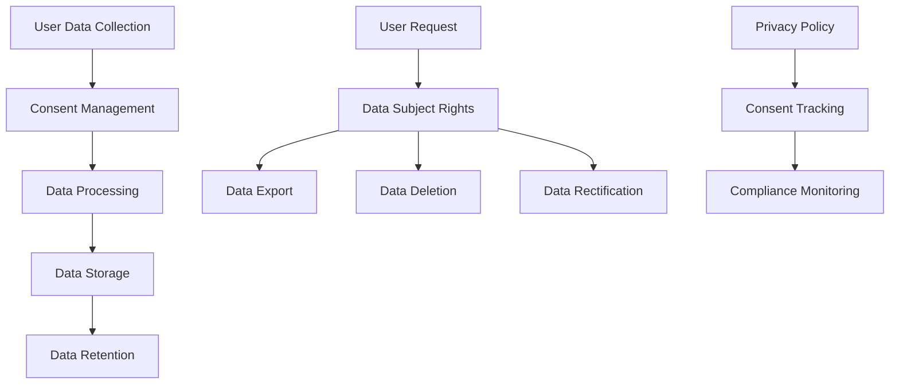

# Personal Data Protection

## Summary

Comprehensive guide for implementing personal data protection and privacy compliance in the Axisor platform. This document covers GDPR compliance, data minimization, user consent management, data retention policies, and privacy by design principles.

## Privacy Architecture



## GDPR Compliance Framework

### Data Categories

```typescript
// Personal data categories
export enum PersonalDataType {
  IDENTIFYING = 'identifying',
  CONTACT = 'contact',
  FINANCIAL = 'financial',
  BEHAVIORAL = 'behavioral',
  TECHNICAL = 'technical',
  SENSITIVE = 'sensitive'
}

export interface PersonalDataMapping {
  [key: string]: {
    type: PersonalDataType;
    purpose: string;
    retentionPeriod: number; // days
    lawfulBasis: string;
    requiresConsent: boolean;
  };
}

export const PERSONAL_DATA_MAPPING: PersonalDataMapping = {
  // User table fields
  'email': {
    type: PersonalDataType.CONTACT,
    purpose: 'Account identification and communication',
    retentionPeriod: 2555, // 7 years
    lawfulBasis: 'Contract performance',
    requiresConsent: false
  },
  'username': {
    type: PersonalDataType.IDENTIFYING,
    purpose: 'Account identification',
    retentionPeriod: 2555,
    lawfulBasis: 'Contract performance',
    requiresConsent: false
  },
  'password_hash': {
    type: PersonalDataType.SENSITIVE,
    purpose: 'Account security',
    retentionPeriod: 2555,
    lawfulBasis: 'Legitimate interest',
    requiresConsent: false
  },
  'plan_type': {
    type: PersonalDataType.FINANCIAL,
    purpose: 'Service provision',
    retentionPeriod: 2555,
    lawfulBasis: 'Contract performance',
    requiresConsent: false
  },
  'last_login_at': {
    type: PersonalDataType.BEHAVIORAL,
    purpose: 'Security monitoring',
    retentionPeriod: 365,
    lawfulBasis: 'Legitimate interest',
    requiresConsent: false
  },
  'last_activity_at': {
    type: PersonalDataType.BEHAVIORAL,
    purpose: 'Service optimization',
    retentionPeriod: 365,
    lawfulBasis: 'Legitimate interest',
    requiresConsent: true
  },
  
  // Exchange credentials
  'credentials': {
    type: PersonalDataType.SENSITIVE,
    purpose: 'Service functionality',
    retentionPeriod: 2555,
    lawfulBasis: 'Contract performance',
    requiresConsent: true
  },
  
  // Automation data
  'automation_config': {
    type: PersonalDataType.BEHAVIORAL,
    purpose: 'Service provision',
    retentionPeriod: 2555,
    lawfulBasis: 'Contract performance',
    requiresConsent: false
  }
};
```

### Consent Management Service

```typescript
// backend/src/services/consent-management.service.ts
export class ConsentManagementService {
  private prisma: PrismaClient;

  constructor(prisma: PrismaClient) {
    this.prisma = prisma;
  }

  /**
   * Record user consent
   */
  async recordConsent(
    userId: string,
    purpose: string,
    granted: boolean,
    ipAddress?: string,
    userAgent?: string
  ): Promise<void> {
    await this.prisma.userConsent.create({
      data: {
        user_id: userId,
        purpose,
        granted,
        ip_address: ipAddress,
        user_agent: userAgent,
        granted_at: granted ? new Date() : null,
        withdrawn_at: granted ? null : new Date()
      }
    });

    // Log consent event
    await this.logPrivacyEvent(userId, 'CONSENT_RECORDED', {
      purpose,
      granted,
      timestamp: new Date().toISOString()
    });
  }

  /**
   * Check if user has given consent for specific purpose
   */
  async hasConsent(userId: string, purpose: string): Promise<boolean> {
    const consent = await this.prisma.userConsent.findFirst({
      where: {
        user_id: userId,
        purpose,
        granted: true,
        withdrawn_at: null
      },
      orderBy: { granted_at: 'desc' }
    });

    return !!consent;
  }

  /**
   * Withdraw consent
   */
  async withdrawConsent(
    userId: string,
    purpose: string,
    ipAddress?: string,
    userAgent?: string
  ): Promise<void> {
    await this.prisma.userConsent.updateMany({
      where: {
        user_id: userId,
        purpose,
        granted: true,
        withdrawn_at: null
      },
      data: {
        withdrawn_at: new Date(),
        withdrawal_ip: ipAddress,
        withdrawal_user_agent: userAgent
      }
    });

    // Log withdrawal event
    await this.logPrivacyEvent(userId, 'CONSENT_WITHDRAWN', {
      purpose,
      timestamp: new Date().toISOString()
    });
  }

  /**
   * Get user's consent history
   */
  async getUserConsentHistory(userId: string): Promise<any[]> {
    return await this.prisma.userConsent.findMany({
      where: { user_id: userId },
      orderBy: { created_at: 'desc' }
    });
  }

  /**
   * Log privacy events
   */
  private async logPrivacyEvent(
    userId: string,
    event: string,
    details: any
  ): Promise<void> {
    await this.prisma.privacyAuditLog.create({
      data: {
        user_id: userId,
        event,
        details,
        timestamp: new Date()
      }
    });
  }
}
```

## Data Subject Rights Implementation

### Data Subject Rights Service

```typescript
// backend/src/services/data-subject-rights.service.ts
export class DataSubjectRightsService {
  private prisma: PrismaClient;

  constructor(prisma: PrismaClient) {
    this.prisma = prisma;
  }

  /**
   * Right to access - Export user's personal data
   */
  async exportUserData(userId: string): Promise<{
    personalData: any;
    metadata: {
      exportDate: Date;
      dataCategories: string[];
      retentionInfo: any;
    };
  }> {
    // Get all user data
    const userData = await this.prisma.user.findUnique({
      where: { id: userId },
      include: {
        automations: true,
        userExchangeAccounts: true,
        notifications: true,
        auditLogs: true
      }
    });

    if (!userData) {
      throw new Error('User not found');
    }

    // Filter sensitive data and add metadata
    const personalData = this.filterPersonalData(userData);
    const dataCategories = this.identifyDataCategories(userData);
    const retentionInfo = this.getRetentionInfo(dataCategories);

    // Log data export
    await this.logDataSubjectRequest(userId, 'DATA_EXPORT', {
      categories: dataCategories,
      timestamp: new Date().toISOString()
    });

    return {
      personalData,
      metadata: {
        exportDate: new Date(),
        dataCategories,
        retentionInfo
      }
    };
  }

  /**
   * Right to erasure - Delete user's personal data
   */
  async deleteUserData(userId: string, reason?: string): Promise<void> {
    // Check for legal obligations to retain data
    const retentionCheck = await this.checkRetentionObligations(userId);
    if (retentionCheck.mustRetain) {
      throw new Error(`Data must be retained due to: ${retentionCheck.reasons.join(', ')}`);
    }

    // Start deletion process
    await this.prisma.$transaction(async (tx) => {
      // Anonymize instead of delete for audit purposes
      await tx.user.update({
        where: { id: userId },
        data: {
          email: `deleted_${userId}@deleted.com`,
          username: `deleted_${userId}`,
          password_hash: null,
          is_active: false,
          deleted_at: new Date(),
          deletion_reason: reason
        }
      });

      // Delete related data
      await tx.automation.deleteMany({ where: { user_id: userId } });
      await tx.userExchangeAccounts.deleteMany({ where: { user_id: userId } });
      await tx.notification.deleteMany({ where: { user_id: userId } });
    });

    // Log deletion
    await this.logDataSubjectRequest(userId, 'DATA_DELETION', {
      reason,
      timestamp: new Date().toISOString()
    });
  }

  /**
   * Right to rectification - Update user's personal data
   */
  async rectifyUserData(
    userId: string,
    updates: Record<string, any>
  ): Promise<void> {
    // Validate updates
    const validUpdates = this.validateDataUpdates(updates);
    
    if (Object.keys(validUpdates).length === 0) {
      throw new Error('No valid updates provided');
    }

    // Update user data
    await this.prisma.user.update({
      where: { id: userId },
      data: validUpdates
    });

    // Log rectification
    await this.logDataSubjectRequest(userId, 'DATA_RECTIFICATION', {
      updates: Object.keys(validUpdates),
      timestamp: new Date().toISOString()
    });
  }

  /**
   * Right to data portability
   */
  async exportDataPortable(userId: string): Promise<any> {
    const userData = await this.exportUserData(userId);
    
    // Format for portability (structured format like JSON)
    const portableData = {
      user: userData.personalData,
      automations: userData.personalData.automations,
      exchangeAccounts: userData.personalData.userExchangeAccounts?.map((account: any) => ({
        accountName: account.account_name,
        exchange: account.exchange?.name,
        isActive: account.is_active
        // Exclude sensitive credentials
      })),
      metadata: userData.metadata
    };

    return portableData;
  }

  /**
   * Filter personal data based on consent
   */
  private filterPersonalData(userData: any): any {
    const filteredData = { ...userData };
    
    // Remove sensitive fields that require explicit consent
    const consentService = new ConsentManagementService(this.prisma);
    
    // Check consent for behavioral data
    if (!consentService.hasConsent(userData.id, 'behavioral_tracking')) {
      delete filteredData.last_activity_at;
      delete filteredData.login_attempts;
    }

    // Check consent for analytics
    if (!consentService.hasConsent(userData.id, 'analytics')) {
      delete filteredData.usage_statistics;
    }

    return filteredData;
  }

  /**
   * Identify data categories in user data
   */
  private identifyDataCategories(userData: any): string[] {
    const categories: string[] = [];
    
    Object.keys(userData).forEach(key => {
      const mapping = PERSONAL_DATA_MAPPING[key];
      if (mapping && !categories.includes(mapping.type)) {
        categories.push(mapping.type);
      }
    });

    return categories;
  }

  /**
   * Get retention information for data categories
   */
  private getRetentionInfo(categories: string[]): any {
    const retentionInfo: any = {};
    
    categories.forEach(category => {
      const mappings = Object.entries(PERSONAL_DATA_MAPPING)
        .filter(([_, mapping]) => mapping.type === category);
      
      if (mappings.length > 0) {
        retentionInfo[category] = {
          retentionPeriod: mappings[0][1].retentionPeriod,
          lawfulBasis: mappings[0][1].lawfulBasis,
          purposes: mappings.map(([_, mapping]) => mapping.purpose)
        };
      }
    });

    return retentionInfo;
  }

  /**
   * Check retention obligations
   */
  private async checkRetentionObligations(userId: string): Promise<{
    mustRetain: boolean;
    reasons: string[];
  }> {
    const reasons: string[] = [];
    
    // Check for active subscriptions
    const activeSubscriptions = await this.prisma.user.findUnique({
      where: { id: userId },
      select: { plan_type: true }
    });

    if (activeSubscriptions?.plan_type !== 'free') {
      reasons.push('Active subscription');
    }

    // Check for recent transactions
    const recentTransactions = await this.prisma.payment.findMany({
      where: {
        user_id: userId,
        created_at: { gte: new Date(Date.now() - 7 * 365 * 24 * 60 * 60 * 1000) } // 7 years
      }
    });

    if (recentTransactions.length > 0) {
      reasons.push('Financial records retention requirement');
    }

    // Check for legal disputes
    const legalIssues = await this.prisma.legalCase.findMany({
      where: {
        user_id: userId,
        status: { in: ['active', 'pending'] }
      }
    });

    if (legalIssues.length > 0) {
      reasons.push('Active legal proceedings');
    }

    return {
      mustRetain: reasons.length > 0,
      reasons
    };
  }

  /**
   * Validate data updates
   */
  private validateDataUpdates(updates: Record<string, any>): Record<string, any> {
    const validUpdates: Record<string, any> = {};
    
    Object.entries(updates).forEach(([key, value]) => {
      const mapping = PERSONAL_DATA_MAPPING[key];
      if (mapping) {
        // Add validation logic based on field type
        if (key === 'email' && typeof value === 'string' && value.includes('@')) {
          validUpdates[key] = value;
        } else if (key === 'username' && typeof value === 'string' && value.length >= 3) {
          validUpdates[key] = value;
        }
        // Add more validations as needed
      }
    });

    return validUpdates;
  }

  /**
   * Log data subject requests
   */
  private async logDataSubjectRequest(
    userId: string,
    requestType: string,
    details: any
  ): Promise<void> {
    await this.prisma.dataSubjectRequest.create({
      data: {
        user_id: userId,
        request_type: requestType,
        details,
        status: 'completed',
        processed_at: new Date()
      }
    });
  }
}
```

## Privacy by Design Implementation

### Data Minimization

```typescript
// Data minimization service
export class DataMinimizationService {
  /**
   * Check if data collection is necessary
   */
  async validateDataCollection(
    purpose: string,
    dataFields: string[]
  ): Promise<{
    valid: boolean;
    requiredFields: string[];
    optionalFields: string[];
    unnecessaryFields: string[];
  }> {
    const requiredFields: string[] = [];
    const optionalFields: string[] = [];
    const unnecessaryFields: string[] = [];

    dataFields.forEach(field => {
      const mapping = PERSONAL_DATA_MAPPING[field];
      if (!mapping) {
        unnecessaryFields.push(field);
        return;
      }

      if (mapping.purpose === purpose) {
        if (this.isFieldRequired(field, purpose)) {
          requiredFields.push(field);
        } else {
          optionalFields.push(field);
        }
      } else {
        unnecessaryFields.push(field);
      }
    });

    return {
      valid: unnecessaryFields.length === 0,
      requiredFields,
      optionalFields,
      unnecessaryFields
    };
  }

  /**
   * Determine if field is required for purpose
   */
  private isFieldRequired(field: string, purpose: string): boolean {
    const requiredFieldsMap: Record<string, string[]> = {
      'account_creation': ['email', 'username', 'password_hash'],
      'service_provision': ['email', 'plan_type'],
      'security_monitoring': ['email', 'last_login_at'],
      'communication': ['email']
    };

    return requiredFieldsMap[purpose]?.includes(field) || false;
  }

  /**
   * Anonymize data for analytics
   */
  anonymizeForAnalytics(data: any): any {
    const anonymized = { ...data };
    
    // Remove or hash identifying information
    if (anonymized.email) {
      anonymized.email = this.hashEmail(anonymized.email);
    }
    
    if (anonymized.username) {
      anonymized.username = this.hashUsername(anonymized.username);
    }

    // Remove sensitive data
    delete anonymized.password_hash;
    delete anonymized.two_factor_secret;
    delete anonymized.backup_codes;

    return anonymized;
  }

  private hashEmail(email: string): string {
    const crypto = require('crypto');
    return crypto.createHash('sha256').update(email).digest('hex').substring(0, 8);
  }

  private hashUsername(username: string): string {
    const crypto = require('crypto');
    return crypto.createHash('sha256').update(username).digest('hex').substring(0, 8);
  }
}
```

## Data Retention and Deletion

### Retention Policy Service

```typescript
// backend/src/services/retention-policy.service.ts
export class RetentionPolicyService {
  private prisma: PrismaClient;

  constructor(prisma: PrismaClient) {
    this.prisma = prisma;
  }

  /**
   * Apply retention policies
   */
  async applyRetentionPolicies(): Promise<{
    processedRecords: number;
    deletedRecords: number;
    anonymizedRecords: number;
  }> {
    let processedRecords = 0;
    let deletedRecords = 0;
    let anonymizedRecords = 0;

    // Process different data types
    const results = await Promise.all([
      this.processUserData(),
      this.processAuditLogs(),
      this.processSessionData(),
      this.processTemporaryData()
    ]);

    results.forEach(result => {
      processedRecords += result.processed;
      deletedRecords += result.deleted;
      anonymizedRecords += result.anonymized;
    });

    return { processedRecords, deletedRecords, anonymizedRecords };
  }

  /**
   * Process user data retention
   */
  private async processUserData(): Promise<{
    processed: number;
    deleted: number;
    anonymized: number;
  }> {
    const cutoffDate = new Date();
    cutoffDate.setDate(cutoffDate.getDate() - 2555); // 7 years

    // Find inactive users
    const inactiveUsers = await this.prisma.user.findMany({
      where: {
        last_activity_at: { lt: cutoffDate },
        plan_type: 'free',
        is_active: false
      }
    });

    let deleted = 0;
    let anonymized = 0;

    for (const user of inactiveUsers) {
      // Check if user has any legal obligations
      const hasLegalObligations = await this.checkLegalObligations(user.id);
      
      if (hasLegalObligations) {
        // Anonymize instead of delete
        await this.anonymizeUser(user.id);
        anonymized++;
      } else {
        // Safe to delete
        await this.deleteUserData(user.id);
        deleted++;
      }
    }

    return {
      processed: inactiveUsers.length,
      deleted,
      anonymized
    };
  }

  /**
   * Process audit logs retention
   */
  private async processAuditLogs(): Promise<{
    processed: number;
    deleted: number;
    anonymized: number;
  }> {
    const cutoffDate = new Date();
    cutoffDate.setDate(cutoffDate.getDate() - 365); // 1 year

    const result = await this.prisma.securityAuditLog.deleteMany({
      where: {
        created_at: { lt: cutoffDate },
        severity: { not: 'critical' }
      }
    });

    return {
      processed: result.count,
      deleted: result.count,
      anonymized: 0
    };
  }

  /**
   * Check legal obligations for user
   */
  private async checkLegalObligations(userId: string): Promise<boolean> {
    // Check for recent payments
    const recentPayments = await this.prisma.payment.findMany({
      where: {
        user_id: userId,
        created_at: { gte: new Date(Date.now() - 7 * 365 * 24 * 60 * 60 * 1000) }
      }
    });

    // Check for legal cases
    const legalCases = await this.prisma.legalCase.findMany({
      where: {
        user_id: userId,
        status: { in: ['active', 'pending'] }
      }
    });

    return recentPayments.length > 0 || legalCases.length > 0;
  }

  /**
   * Anonymize user data
   */
  private async anonymizeUser(userId: string): Promise<void> {
    await this.prisma.user.update({
      where: { id: userId },
      data: {
        email: `anonymized_${userId}@anonymized.com`,
        username: `anonymized_${userId}`,
        password_hash: null,
        is_active: false,
        anonymized_at: new Date()
      }
    });
  }

  /**
   * Delete user data
   */
  private async deleteUserData(userId: string): Promise<void> {
    await this.prisma.$transaction([
      this.prisma.automation.deleteMany({ where: { user_id: userId } }),
      this.prisma.userExchangeAccounts.deleteMany({ where: { user_id: userId } }),
      this.prisma.notification.deleteMany({ where: { user_id: userId } }),
      this.prisma.user.delete({ where: { id: userId } })
    ]);
  }
}
```

## Privacy Monitoring

### Privacy Audit Service

```typescript
// backend/src/services/privacy-audit.service.ts
export class PrivacyAuditService {
  private prisma: PrismaClient;

  constructor(prisma: PrismaClient) {
    this.prisma = prisma;
  }

  /**
   * Generate privacy compliance report
   */
  async generateComplianceReport(): Promise<{
    dataProcessingActivities: any[];
    consentStatus: any;
    dataSubjectRequests: any;
    retentionCompliance: any;
    securityIncidents: any;
  }> {
    const [
      dataProcessingActivities,
      consentStatus,
      dataSubjectRequests,
      retentionCompliance,
      securityIncidents
    ] = await Promise.all([
      this.getDataProcessingActivities(),
      this.getConsentStatus(),
      this.getDataSubjectRequests(),
      this.getRetentionCompliance(),
      this.getSecurityIncidents()
    ]);

    return {
      dataProcessingActivities,
      consentStatus,
      dataSubjectRequests,
      retentionCompliance,
      securityIncidents
    };
  }

  /**
   * Get data processing activities
   */
  private async getDataProcessingActivities(): Promise<any[]> {
    return await this.prisma.dataProcessingActivity.findMany({
      include: {
        personalDataTypes: true,
        lawfulBasis: true
      }
    });
  }

  /**
   * Get consent status overview
   */
  private async getConsentStatus(): Promise<any> {
    const consentStats = await this.prisma.userConsent.groupBy({
      by: ['purpose', 'granted'],
      _count: true
    });

    return consentStats.reduce((acc, stat) => {
      if (!acc[stat.purpose]) {
        acc[stat.purpose] = { granted: 0, denied: 0 };
      }
      acc[stat.purpose][stat.granted ? 'granted' : 'denied'] = stat._count;
      return acc;
    }, {} as any);
  }

  /**
   * Get data subject requests
   */
  private async getDataSubjectRequests(): Promise<any> {
    const requests = await this.prisma.dataSubjectRequest.findMany({
      orderBy: { created_at: 'desc' },
      take: 100
    });

    const stats = await this.prisma.dataSubjectRequest.groupBy({
      by: ['request_type', 'status'],
      _count: true
    });

    return {
      recentRequests: requests,
      statistics: stats
    };
  }

  /**
   * Get retention compliance status
   */
  private async getRetentionCompliance(): Promise<any> {
    const overdueData = await this.prisma.user.findMany({
      where: {
        last_activity_at: {
          lt: new Date(Date.now() - 2555 * 24 * 60 * 60 * 1000) // 7 years
        }
      },
      select: {
        id: true,
        email: true,
        last_activity_at: true,
        plan_type: true
      }
    });

    return {
      overdueRecords: overdueData.length,
      complianceRate: await this.calculateComplianceRate()
    };
  }

  /**
   * Calculate compliance rate
   */
  private async calculateComplianceRate(): Promise<number> {
    const totalUsers = await this.prisma.user.count();
    const compliantUsers = await this.prisma.user.count({
      where: {
        OR: [
          { last_activity_at: { gte: new Date(Date.now() - 2555 * 24 * 60 * 60 * 1000) } },
          { plan_type: { not: 'free' } },
          { is_active: true }
        ]
      }
    });

    return totalUsers > 0 ? (compliantUsers / totalUsers) * 100 : 100;
  }

  /**
   * Get security incidents
   */
  private async getSecurityIncidents(): Promise<any> {
    return await this.prisma.securityIncident.findMany({
      where: {
        created_at: { gte: new Date(Date.now() - 365 * 24 * 60 * 60 * 1000) }
      },
      orderBy: { created_at: 'desc' }
    });
  }
}
```

## How to Use This Document

- **For Compliance**: Use the GDPR framework and consent management for legal compliance
- **For Data Rights**: Use the data subject rights service for user data management
- **For Privacy**: Use the privacy by design principles for data minimization
- **For Retention**: Use the retention policy service for data lifecycle management
- **For Monitoring**: Use the privacy audit service for compliance monitoring
