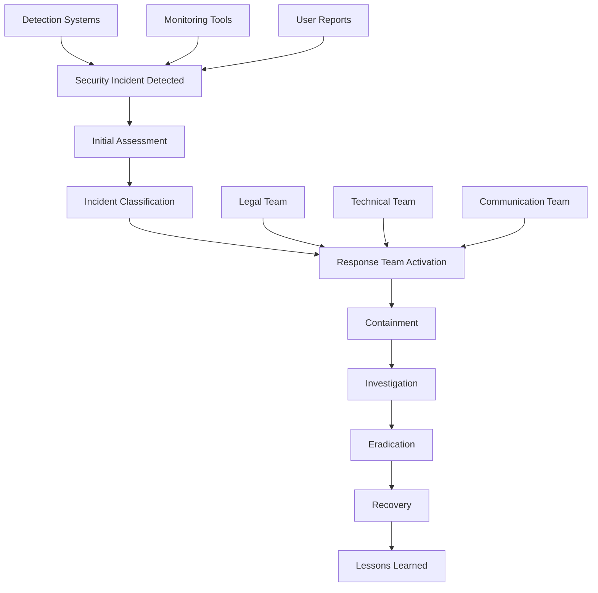

# Incident Response Plan

## Summary

Comprehensive incident response plan for the Axisor platform. This document covers security incident detection, response procedures, escalation protocols, communication plans, and recovery procedures for various types of security incidents.

## Incident Response Architecture



## Incident Classification

### Severity Levels

```typescript
// backend/src/services/incident-classification.service.ts
export enum IncidentSeverity {
  CRITICAL = 'critical',
  HIGH = 'high',
  MEDIUM = 'medium',
  LOW = 'low',
  INFO = 'info'
}

export enum IncidentType {
  DATA_BREACH = 'data_breach',
  MALWARE = 'malware',
  DOS_ATTACK = 'dos_attack',
  UNAUTHORIZED_ACCESS = 'unauthorized_access',
  PRIVILEGE_ESCALATION = 'privilege_escalation',
  DATA_LOSS = 'data_loss',
  SYSTEM_COMPROMISE = 'system_compromise',
  PHISHING = 'phishing',
  INSIDER_THREAT = 'insider_threat',
  VULNERABILITY_EXPLOIT = 'vulnerability_exploit'
}

export interface IncidentClassification {
  severity: IncidentSeverity;
  type: IncidentType;
  impact: string;
  urgency: string;
  responseTime: number; // minutes
  escalationLevel: number;
}

export class IncidentClassificationService {
  /**
   * Classify security incident
   */
  classifyIncident(
    type: IncidentType,
    impact: string,
    affectedSystems: string[],
    dataInvolved: boolean
  ): IncidentClassification {
    let severity: IncidentSeverity;
    let urgency: string;
    let responseTime: number;
    let escalationLevel: number;

    // Determine severity based on type and impact
    switch (type) {
      case IncidentType.DATA_BREACH:
        severity = dataInvolved ? IncidentSeverity.CRITICAL : IncidentSeverity.HIGH;
        urgency = 'immediate';
        responseTime = 15; // 15 minutes
        escalationLevel = 1;
        break;

      case IncidentType.SYSTEM_COMPROMISE:
        severity = IncidentSeverity.CRITICAL;
        urgency = 'immediate';
        responseTime = 30;
        escalationLevel = 1;
        break;

      case IncidentType.UNAUTHORIZED_ACCESS:
        severity = affectedSystems.includes('database') ? 
          IncidentSeverity.HIGH : IncidentSeverity.MEDIUM;
        urgency = 'high';
        responseTime = 60;
        escalationLevel = 2;
        break;

      case IncidentType.DOS_ATTACK:
        severity = affectedSystems.includes('production') ? 
          IncidentSeverity.HIGH : IncidentSeverity.MEDIUM;
        urgency = 'high';
        responseTime = 45;
        escalationLevel = 2;
        break;

      case IncidentType.VULNERABILITY_EXPLOIT:
        severity = IncidentSeverity.MEDIUM;
        urgency = 'medium';
        responseTime = 120;
        escalationLevel = 3;
        break;

      default:
        severity = IncidentSeverity.LOW;
        urgency = 'low';
        responseTime = 240;
        escalationLevel = 4;
    }

    return {
      severity,
      type,
      impact,
      urgency,
      responseTime,
      escalationLevel
    };
  }
}
```

## Incident Response Team

### Team Structure

```typescript
// backend/src/services/incident-response-team.service.ts
export interface IncidentResponseTeam {
  incidentCommander: TeamMember;
  technicalLead: TeamMember;
  securityAnalyst: TeamMember;
  communicationsLead: TeamMember;
  legalCounsel: TeamMember;
  businessContinuity: TeamMember;
}

export interface TeamMember {
  name: string;
  role: string;
  email: string;
  phone: string;
  backup: string;
  availability: string;
}

export class IncidentResponseTeamService {
  private team: IncidentResponseTeam;

  constructor() {
    this.team = {
      incidentCommander: {
        name: 'Security Team Lead',
        role: 'Incident Commander',
        email: 'security-lead@axisor.com',
        phone: '+1-XXX-XXX-XXXX',
        backup: 'security-backup@axisor.com',
        availability: '24/7'
      },
      technicalLead: {
        name: 'Technical Team Lead',
        role: 'Technical Lead',
        email: 'tech-lead@axisor.com',
        phone: '+1-XXX-XXX-XXXX',
        backup: 'tech-backup@axisor.com',
        availability: '24/7'
      },
      securityAnalyst: {
        name: 'Security Analyst',
        role: 'Security Analyst',
        email: 'security-analyst@axisor.com',
        phone: '+1-XXX-XXX-XXXX',
        backup: 'security-analyst-backup@axisor.com',
        availability: '24/7'
      },
      communicationsLead: {
        name: 'Communications Lead',
        role: 'Communications Lead',
        email: 'comms-lead@axisor.com',
        phone: '+1-XXX-XXX-XXXX',
        backup: 'comms-backup@axisor.com',
        availability: 'Business hours'
      },
      legalCounsel: {
        name: 'Legal Counsel',
        role: 'Legal Counsel',
        email: 'legal@axisor.com',
        phone: '+1-XXX-XXX-XXXX',
        backup: 'legal-backup@axisor.com',
        availability: 'Business hours'
      },
      businessContinuity: {
        name: 'Business Continuity Manager',
        role: 'Business Continuity Manager',
        email: 'bcm@axisor.com',
        phone: '+1-XXX-XXX-XXXX',
        backup: 'bcm-backup@axisor.com',
        availability: '24/7'
      }
    };
  }

  /**
   * Activate incident response team
   */
  async activateTeam(severity: IncidentSeverity): Promise<void> {
    const activationList = this.getActivationList(severity);
    
    for (const member of activationList) {
      await this.notifyTeamMember(member, severity);
    }
  }

  /**
   * Get team members to activate based on severity
   */
  private getActivationList(severity: IncidentSeverity): TeamMember[] {
    switch (severity) {
      case IncidentSeverity.CRITICAL:
        return [
          this.team.incidentCommander,
          this.team.technicalLead,
          this.team.securityAnalyst,
          this.team.communicationsLead,
          this.team.legalCounsel,
          this.team.businessContinuity
        ];

      case IncidentSeverity.HIGH:
        return [
          this.team.incidentCommander,
          this.team.technicalLead,
          this.team.securityAnalyst,
          this.team.communicationsLead
        ];

      case IncidentSeverity.MEDIUM:
        return [
          this.team.incidentCommander,
          this.team.securityAnalyst
        ];

      default:
        return [this.team.securityAnalyst];
    }
  }

  /**
   * Notify team member
   */
  private async notifyTeamMember(member: TeamMember, severity: IncidentSeverity): Promise<void> {
    // Send email notification
    await this.sendEmailNotification(member.email, severity);
    
    // Send SMS notification for critical incidents
    if (severity === IncidentSeverity.CRITICAL) {
      await this.sendSMSNotification(member.phone, severity);
    }
  }

  /**
   * Send email notification
   */
  private async sendEmailNotification(email: string, severity: IncidentSeverity): Promise<void> {
    // Implementation for sending email notifications
    console.log(`Sending email notification to ${email} for ${severity} incident`);
  }

  /**
   * Send SMS notification
   */
  private async sendSMSNotification(phone: string, severity: IncidentSeverity): Promise<void> {
    // Implementation for sending SMS notifications
    console.log(`Sending SMS notification to ${phone} for ${severity} incident`);
  }
}
```

## Incident Response Procedures

### Response Workflow

```typescript
// backend/src/services/incident-response.service.ts
export class IncidentResponseService {
  private prisma: PrismaClient;
  private classificationService: IncidentClassificationService;
  private teamService: IncidentResponseTeamService;

  constructor(prisma: PrismaClient) {
    this.prisma = prisma;
    this.classificationService = new IncidentClassificationService();
    this.teamService = new IncidentResponseTeamService();
  }

  /**
   * Handle security incident
   */
  async handleIncident(incidentData: IncidentData): Promise<IncidentResponse> {
    // 1. Initial Assessment
    const classification = this.classificationService.classifyIncident(
      incidentData.type,
      incidentData.impact,
      incidentData.affectedSystems,
      incidentData.dataInvolved
    );

    // 2. Create incident record
    const incident = await this.createIncidentRecord(incidentData, classification);

    // 3. Activate response team
    await this.teamService.activateTeam(classification.severity);

    // 4. Execute response procedures
    const response = await this.executeResponseProcedures(incident, classification);

    return response;
  }

  /**
   * Create incident record
   */
  private async createIncidentRecord(
    incidentData: IncidentData,
    classification: IncidentClassification
  ): Promise<Incident> {
    const incident = await this.prisma.securityIncident.create({
      data: {
        incident_id: this.generateIncidentId(),
        title: incidentData.title,
        description: incidentData.description,
        type: incidentData.type,
        severity: classification.severity,
        status: 'open',
        impact: incidentData.impact,
        affected_systems: incidentData.affectedSystems,
        data_involved: incidentData.dataInvolved,
        detected_by: incidentData.detectedBy,
        detected_at: new Date(),
        classification: classification,
        response_time: classification.responseTime,
        escalation_level: classification.escalationLevel
      }
    });

    return incident;
  }

  /**
   * Execute response procedures
   */
  private async executeResponseProcedures(
    incident: Incident,
    classification: IncidentClassification
  ): Promise<IncidentResponse> {
    const response: IncidentResponse = {
      incidentId: incident.incident_id,
      status: 'in_progress',
      steps: [],
      timeline: []
    };

    // Step 1: Containment
    const containmentResult = await this.containIncident(incident);
    response.steps.push(containmentResult);
    response.timeline.push({
      timestamp: new Date(),
      action: 'containment',
      result: containmentResult.status
    });

    // Step 2: Investigation
    const investigationResult = await this.investigateIncident(incident);
    response.steps.push(investigationResult);
    response.timeline.push({
      timestamp: new Date(),
      action: 'investigation',
      result: investigationResult.status
    });

    // Step 3: Eradication
    const eradicationResult = await this.eradicateThreat(incident);
    response.steps.push(eradicationResult);
    response.timeline.push({
      timestamp: new Date(),
      action: 'eradication',
      result: eradicationResult.status
    });

    // Step 4: Recovery
    const recoveryResult = await this.recoverSystems(incident);
    response.steps.push(recoveryResult);
    response.timeline.push({
      timestamp: new Date(),
      action: 'recovery',
      result: recoveryResult.status
    });

    // Step 5: Lessons Learned
    const lessonsLearned = await this.documentLessonsLearned(incident);
    response.steps.push(lessonsLearned);
    response.timeline.push({
      timestamp: new Date(),
      action: 'lessons_learned',
      result: lessonsLearned.status
    });

    response.status = 'completed';
    return response;
  }

  /**
   * Contain incident
   */
  private async containIncident(incident: Incident): Promise<ResponseStep> {
    try {
      // Implement containment measures based on incident type
      switch (incident.type) {
        case IncidentType.DATA_BREACH:
          await this.containDataBreach(incident);
          break;
        case IncidentType.SYSTEM_COMPROMISE:
          await this.containSystemCompromise(incident);
          break;
        case IncidentType.DOS_ATTACK:
          await this.containDOSAttack(incident);
          break;
        case IncidentType.UNAUTHORIZED_ACCESS:
          await this.containUnauthorizedAccess(incident);
          break;
        default:
          await this.containGenericIncident(incident);
      }

      return {
        step: 'containment',
        status: 'completed',
        description: 'Incident successfully contained',
        timestamp: new Date()
      };
    } catch (error) {
      return {
        step: 'containment',
        status: 'failed',
        description: `Containment failed: ${error.message}`,
        timestamp: new Date()
      };
    }
  }

  /**
   * Investigate incident
   */
  private async investigateIncident(incident: Incident): Promise<ResponseStep> {
    try {
      // Collect evidence
      const evidence = await this.collectEvidence(incident);
      
      // Analyze timeline
      const timeline = await this.analyzeTimeline(incident);
      
      // Identify root cause
      const rootCause = await this.identifyRootCause(incident, evidence);
      
      // Assess impact
      const impactAssessment = await this.assessImpact(incident, evidence);

      // Update incident with investigation results
      await this.updateIncident(incident.incident_id, {
        evidence,
        timeline,
        root_cause: rootCause,
        impact_assessment: impactAssessment
      });

      return {
        step: 'investigation',
        status: 'completed',
        description: 'Investigation completed successfully',
        timestamp: new Date()
      };
    } catch (error) {
      return {
        step: 'investigation',
        status: 'failed',
        description: `Investigation failed: ${error.message}`,
        timestamp: new Date()
      };
    }
  }

  /**
   * Eradicate threat
   */
  private async eradicateThreat(incident: Incident): Promise<ResponseStep> {
    try {
      // Remove malware or malicious code
      if (incident.type === IncidentType.MALWARE) {
        await this.removeMalware(incident);
      }

      // Patch vulnerabilities
      if (incident.type === IncidentType.VULNERABILITY_EXPLOIT) {
        await this.patchVulnerabilities(incident);
      }

      // Revoke compromised credentials
      if (incident.type === IncidentType.UNAUTHORIZED_ACCESS) {
        await this.revokeCompromisedCredentials(incident);
      }

      // Clean affected systems
      await this.cleanAffectedSystems(incident);

      return {
        step: 'eradication',
        status: 'completed',
        description: 'Threat successfully eradicated',
        timestamp: new Date()
      };
    } catch (error) {
      return {
        step: 'eradication',
        status: 'failed',
        description: `Eradication failed: ${error.message}`,
        timestamp: new Date()
      };
    }
  }

  /**
   * Recover systems
   */
  private async recoverSystems(incident: Incident): Promise<ResponseStep> {
    try {
      // Restore from backup if necessary
      if (incident.affected_systems.includes('database')) {
        await this.restoreDatabase(incident);
      }

      // Restart affected services
      await this.restartAffectedServices(incident);

      // Verify system integrity
      await this.verifySystemIntegrity(incident);

      // Monitor for recurrence
      await this.monitorForRecurrence(incident);

      return {
        step: 'recovery',
        status: 'completed',
        description: 'Systems successfully recovered',
        timestamp: new Date()
      };
    } catch (error) {
      return {
        step: 'recovery',
        status: 'failed',
        description: `Recovery failed: ${error.message}`,
        timestamp: new Date()
      };
    }
  }

  /**
   * Document lessons learned
   */
  private async documentLessonsLearned(incident: Incident): Promise<ResponseStep> {
    try {
      // Analyze response effectiveness
      const responseAnalysis = await this.analyzeResponseEffectiveness(incident);
      
      // Identify improvements
      const improvements = await this.identifyImprovements(incident);
      
      // Update procedures
      await this.updateProcedures(incident, improvements);
      
      // Train staff
      await this.trainStaff(incident, improvements);

      return {
        step: 'lessons_learned',
        status: 'completed',
        description: 'Lessons learned documented and implemented',
        timestamp: new Date()
      };
    } catch (error) {
      return {
        step: 'lessons_learned',
        status: 'failed',
        description: `Lessons learned failed: ${error.message}`,
        timestamp: new Date()
      };
    }
  }

  /**
   * Generate incident ID
   */
  private generateIncidentId(): string {
    const timestamp = Date.now();
    const random = Math.random().toString(36).substr(2, 5);
    return `INC-${timestamp}-${random}`.toUpperCase();
  }

  /**
   * Update incident record
   */
  private async updateIncident(incidentId: string, updates: any): Promise<void> {
    await this.prisma.securityIncident.update({
      where: { incident_id: incidentId },
      data: {
        ...updates,
        updated_at: new Date()
      }
    });
  }
}

interface IncidentData {
  title: string;
  description: string;
  type: IncidentType;
  impact: string;
  affectedSystems: string[];
  dataInvolved: boolean;
  detectedBy: string;
}

interface Incident {
  incident_id: string;
  title: string;
  description: string;
  type: IncidentType;
  severity: IncidentSeverity;
  status: string;
  impact: string;
  affected_systems: string[];
  data_involved: boolean;
  detected_by: string;
  detected_at: Date;
  classification: IncidentClassification;
  response_time: number;
  escalation_level: number;
}

interface IncidentResponse {
  incidentId: string;
  status: string;
  steps: ResponseStep[];
  timeline: TimelineEvent[];
}

interface ResponseStep {
  step: string;
  status: string;
  description: string;
  timestamp: Date;
}

interface TimelineEvent {
  timestamp: Date;
  action: string;
  result: string;
}
```

## Communication Plan

### Communication Procedures

```typescript
// backend/src/services/incident-communication.service.ts
export class IncidentCommunicationService {
  private prisma: PrismaClient;

  constructor(prisma: PrismaClient) {
    this.prisma = prisma;
  }

  /**
   * Execute communication plan
   */
  async executeCommunicationPlan(
    incident: Incident,
    severity: IncidentSeverity
  ): Promise<void> {
    const communicationPlan = this.getCommunicationPlan(severity);
    
    for (const communication of communicationPlan) {
      await this.executeCommunication(incident, communication);
    }
  }

  /**
   * Get communication plan based on severity
   */
  private getCommunicationPlan(severity: IncidentSeverity): Communication[] {
    const baseCommunications: Communication[] = [
      {
        audience: 'internal_team',
        method: 'email',
        template: 'internal_incident_notification',
        priority: 'high',
        delay: 0
      }
    ];

    switch (severity) {
      case IncidentSeverity.CRITICAL:
        return [
          ...baseCommunications,
          {
            audience: 'management',
            method: 'phone',
            template: 'critical_incident_escalation',
            priority: 'critical',
            delay: 0
          },
          {
            audience: 'customers',
            method: 'email',
            template: 'customer_incident_notification',
            priority: 'high',
            delay: 60 // 1 hour
          },
          {
            audience: 'regulators',
            method: 'email',
            template: 'regulatory_notification',
            priority: 'high',
            delay: 72 // 72 hours for GDPR
          }
        ];

      case IncidentSeverity.HIGH:
        return [
          ...baseCommunications,
          {
            audience: 'management',
            method: 'email',
            template: 'high_severity_incident',
            priority: 'high',
            delay: 30
          },
          {
            audience: 'customers',
            method: 'email',
            template: 'customer_incident_notification',
            priority: 'medium',
            delay: 120
          }
        ];

      case IncidentSeverity.MEDIUM:
        return [
          ...baseCommunications,
          {
            audience: 'management',
            method: 'email',
            template: 'medium_severity_incident',
            priority: 'medium',
            delay: 60
          }
        ];

      default:
        return baseCommunications;
    }
  }

  /**
   * Execute communication
   */
  private async executeCommunication(
    incident: Incident,
    communication: Communication
  ): Promise<void> {
    const template = await this.getTemplate(communication.template);
    const content = this.populateTemplate(template, incident);
    
    switch (communication.method) {
      case 'email':
        await this.sendEmail(communication.audience, content);
        break;
      case 'phone':
        await this.makePhoneCall(communication.audience, content);
        break;
      case 'sms':
        await this.sendSMS(communication.audience, content);
        break;
    }

    // Log communication
    await this.logCommunication(incident.incident_id, communication, content);
  }

  /**
   * Get communication template
   */
  private async getTemplate(templateName: string): Promise<string> {
    const templates = {
      internal_incident_notification: `
        Subject: Security Incident - {{incident_id}}
        
        A security incident has been detected:
        
        Type: {{type}}
        Severity: {{severity}}
        Impact: {{impact}}
        Affected Systems: {{affected_systems}}
        
        Please follow the incident response procedures.
      `,
      customer_incident_notification: `
        Subject: Important Security Update
        
        We are writing to inform you about a security incident that may have affected your account.
        
        What happened: {{description}}
        What we're doing: {{response_actions}}
        What you should do: {{customer_actions}}
        
        We apologize for any inconvenience and appreciate your patience.
      `,
      regulatory_notification: `
        Subject: Data Breach Notification
        
        We are notifying you of a data breach that occurred on {{detected_at}}.
        
        Nature of breach: {{type}}
        Categories of data affected: {{data_categories}}
        Number of affected individuals: {{affected_count}}
        Measures taken: {{response_measures}}
        
        Please find attached the detailed breach notification form.
      `
    };

    return templates[templateName] || '';
  }

  /**
   * Populate template with incident data
   */
  private populateTemplate(template: string, incident: Incident): string {
    return template
      .replace(/{{incident_id}}/g, incident.incident_id)
      .replace(/{{type}}/g, incident.type)
      .replace(/{{severity}}/g, incident.severity)
      .replace(/{{impact}}/g, incident.impact)
      .replace(/{{affected_systems}}/g, incident.affected_systems.join(', '))
      .replace(/{{description}}/g, incident.description)
      .replace(/{{detected_at}}/g, incident.detected_at.toISOString());
  }

  /**
   * Log communication
   */
  private async logCommunication(
    incidentId: string,
    communication: Communication,
    content: string
  ): Promise<void> {
    await this.prisma.incidentCommunication.create({
      data: {
        incident_id: incidentId,
        audience: communication.audience,
        method: communication.method,
        template: communication.template,
        content,
        sent_at: new Date()
      }
    });
  }
}

interface Communication {
  audience: string;
  method: 'email' | 'phone' | 'sms';
  template: string;
  priority: 'critical' | 'high' | 'medium' | 'low';
  delay: number; // minutes
}
```

## How to Use This Document

- **For Incident Response**: Use the incident response service for handling security incidents
- **For Team Activation**: Use the team service for activating response teams
- **For Communication**: Use the communication service for stakeholder notifications
- **For Procedures**: Follow the response workflow for systematic incident handling
- **For Training**: Use the procedures for incident response training and drills
