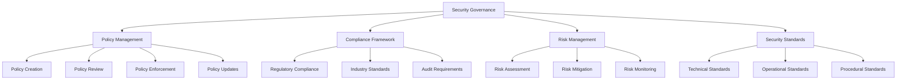

# Security Policies Overview

## Summary

Comprehensive overview of security policies and governance framework for the Axisor platform. This document covers security governance, policy management, compliance frameworks, security standards, and policy enforcement mechanisms.

## Security Governance Architecture



## Security Policy Framework

### Policy Categories

```typescript
// backend/src/services/security-policy.service.ts
export enum PolicyCategory {
  ACCESS_CONTROL = 'access_control',
  DATA_PROTECTION = 'data_protection',
  NETWORK_SECURITY = 'network_security',
  APPLICATION_SECURITY = 'application_security',
  INCIDENT_RESPONSE = 'incident_response',
  BUSINESS_CONTINUITY = 'business_continuity',
  PHYSICAL_SECURITY = 'physical_security',
  PERSONNEL_SECURITY = 'personnel_security',
  VENDOR_MANAGEMENT = 'vendor_management',
  COMPLIANCE = 'compliance'
}

export enum PolicyStatus {
  DRAFT = 'draft',
  REVIEW = 'review',
  APPROVED = 'approved',
  IMPLEMENTED = 'implemented',
  ARCHIVED = 'archived'
}

export interface SecurityPolicy {
  id: string;
  title: string;
  category: PolicyCategory;
  status: PolicyStatus;
  version: string;
  effectiveDate: Date;
  reviewDate: Date;
  owner: string;
  approver: string;
  content: string;
  procedures: string[];
  controls: SecurityControl[];
  compliance: ComplianceRequirement[];
  metrics: PolicyMetric[];
}

export class SecurityPolicyService {
  private prisma: PrismaClient;

  constructor(prisma: PrismaClient) {
    this.prisma = prisma;
  }

  /**
   * Create new security policy
   */
  async createPolicy(policyData: PolicyCreationData): Promise<SecurityPolicy> {
    const policy = await this.prisma.securityPolicy.create({
      data: {
        policy_id: this.generatePolicyId(),
        title: policyData.title,
        category: policyData.category,
        status: PolicyStatus.DRAFT,
        version: '1.0',
        effective_date: policyData.effectiveDate,
        review_date: policyData.reviewDate,
        owner: policyData.owner,
        approver: policyData.approver,
        content: policyData.content,
        procedures: policyData.procedures,
        controls: policyData.controls,
        compliance: policyData.compliance,
        metrics: policyData.metrics,
        created_at: new Date()
      }
    });

    return this.mapPolicyFromDB(policy);
  }

  /**
   * Update security policy
   */
  async updatePolicy(
    policyId: string,
    updates: PolicyUpdateData
  ): Promise<SecurityPolicy> {
    const policy = await this.prisma.securityPolicy.update({
      where: { policy_id: policyId },
      data: {
        ...updates,
        updated_at: new Date()
      }
    });

    return this.mapPolicyFromDB(policy);
  }

  /**
   * Approve security policy
   */
  async approvePolicy(
    policyId: string,
    approver: string,
    comments?: string
  ): Promise<SecurityPolicy> {
    const policy = await this.prisma.securityPolicy.update({
      where: { policy_id: policyId },
      data: {
        status: PolicyStatus.APPROVED,
        approver,
        approval_date: new Date(),
        approval_comments: comments
      }
    });

    // Log approval
    await this.logPolicyAction(policyId, 'APPROVED', approver, comments);

    return this.mapPolicyFromDB(policy);
  }

  /**
   * Implement security policy
   */
  async implementPolicy(
    policyId: string,
    implementer: string,
    implementationPlan: ImplementationPlan
  ): Promise<void> {
    // Update policy status
    await this.prisma.securityPolicy.update({
      where: { policy_id: policyId },
      data: {
        status: PolicyStatus.IMPLEMENTED,
        implementation_date: new Date(),
        implementer
      }
    });

    // Create implementation tasks
    for (const task of implementationPlan.tasks) {
      await this.prisma.policyImplementationTask.create({
        data: {
          policy_id: policyId,
          task_name: task.name,
          description: task.description,
          assignee: task.assignee,
          due_date: task.dueDate,
          status: 'pending',
          created_at: new Date()
        }
      });
    }

    // Log implementation
    await this.logPolicyAction(policyId, 'IMPLEMENTED', implementer, 'Policy implemented');
  }

  /**
   * Get policies by category
   */
  async getPoliciesByCategory(category: PolicyCategory): Promise<SecurityPolicy[]> {
    const policies = await this.prisma.securityPolicy.findMany({
      where: { category },
      orderBy: { created_at: 'desc' }
    });

    return policies.map(policy => this.mapPolicyFromDB(policy));
  }

  /**
   * Get active policies
   */
  async getActivePolicies(): Promise<SecurityPolicy[]> {
    const policies = await this.prisma.securityPolicy.findMany({
      where: {
        status: PolicyStatus.IMPLEMENTED,
        effective_date: { lte: new Date() }
      },
      orderBy: { effective_date: 'desc' }
    });

    return policies.map(policy => this.mapPolicyFromDB(policy));
  }

  /**
   * Check policy compliance
   */
  async checkPolicyCompliance(policyId: string): Promise<ComplianceReport> {
    const policy = await this.prisma.securityPolicy.findUnique({
      where: { policy_id: policyId },
      include: { controls: true, metrics: true }
    });

    if (!policy) {
      throw new Error('Policy not found');
    }

    const complianceChecks = await Promise.all(
      policy.controls.map(control => this.checkControlCompliance(control))
    );

    const metricResults = await Promise.all(
      policy.metrics.map(metric => this.measurePolicyMetric(metric))
    );

    const overallCompliance = this.calculateOverallCompliance(complianceChecks);

    return {
      policyId,
      policyTitle: policy.title,
      overallCompliance,
      controlCompliance: complianceChecks,
      metricResults,
      lastChecked: new Date(),
      recommendations: this.generateRecommendations(complianceChecks)
    };
  }

  /**
   * Generate policy ID
   */
  private generatePolicyId(): string {
    const timestamp = Date.now();
    const random = Math.random().toString(36).substr(2, 4);
    return `POL-${timestamp}-${random}`.toUpperCase();
  }

  /**
   * Map policy from database
   */
  private mapPolicyFromDB(policy: any): SecurityPolicy {
    return {
      id: policy.policy_id,
      title: policy.title,
      category: policy.category,
      status: policy.status,
      version: policy.version,
      effectiveDate: policy.effective_date,
      reviewDate: policy.review_date,
      owner: policy.owner,
      approver: policy.approver,
      content: policy.content,
      procedures: policy.procedures,
      controls: policy.controls,
      compliance: policy.compliance,
      metrics: policy.metrics
    };
  }

  /**
   * Log policy action
   */
  private async logPolicyAction(
    policyId: string,
    action: string,
    user: string,
    comments?: string
  ): Promise<void> {
    await this.prisma.policyActionLog.create({
      data: {
        policy_id: policyId,
        action,
        user,
        comments,
        timestamp: new Date()
      }
    });
  }
}

interface PolicyCreationData {
  title: string;
  category: PolicyCategory;
  effectiveDate: Date;
  reviewDate: Date;
  owner: string;
  approver: string;
  content: string;
  procedures: string[];
  controls: SecurityControl[];
  compliance: ComplianceRequirement[];
  metrics: PolicyMetric[];
}

interface PolicyUpdateData {
  title?: string;
  content?: string;
  procedures?: string[];
  controls?: SecurityControl[];
  compliance?: ComplianceRequirement[];
  metrics?: PolicyMetric[];
}

interface ImplementationPlan {
  tasks: ImplementationTask[];
  timeline: Date;
  resources: string[];
}

interface ImplementationTask {
  name: string;
  description: string;
  assignee: string;
  dueDate: Date;
}

interface ComplianceReport {
  policyId: string;
  policyTitle: string;
  overallCompliance: number;
  controlCompliance: ControlCompliance[];
  metricResults: MetricResult[];
  lastChecked: Date;
  recommendations: string[];
}

interface SecurityControl {
  id: string;
  name: string;
  description: string;
  category: string;
  implementation: string;
  testing: string;
  owner: string;
}

interface ComplianceRequirement {
  framework: string;
  requirement: string;
  description: string;
  implementation: string;
  evidence: string[];
}

interface PolicyMetric {
  id: string;
  name: string;
  description: string;
  target: number;
  current: number;
  unit: string;
  frequency: string;
}
```

## Security Standards

### Technical Security Standards

```typescript
// backend/src/services/security-standards.service.ts
export class SecurityStandardsService {
  /**
   * Get technical security standards
   */
  getTechnicalStandards(): TechnicalStandard[] {
    return [
      {
        category: 'Authentication',
        standards: [
          {
            name: 'Password Policy',
            description: 'Minimum password requirements and complexity',
            requirements: [
              'Minimum 8 characters',
              'At least one uppercase letter',
              'At least one lowercase letter',
              'At least one number',
              'At least one special character',
              'No common passwords',
              'Password history of 5 previous passwords'
            ],
            implementation: 'Enforced in user registration and password change',
            testing: 'Automated validation in registration flow'
          },
          {
            name: 'Multi-Factor Authentication',
            description: 'Two-factor authentication requirements',
            requirements: [
              'TOTP-based 2FA for admin accounts',
              'Backup codes for account recovery',
              'Rate limiting for 2FA attempts',
              '2FA bypass only for emergency procedures'
            ],
            implementation: 'TOTP implementation with backup codes',
            testing: 'Manual testing of 2FA flow and recovery'
          }
        ]
      },
      {
        category: 'Data Protection',
        standards: [
          {
            name: 'Encryption at Rest',
            description: 'Encryption requirements for stored data',
            requirements: [
              'AES-256 encryption for sensitive data',
              'Encrypted database connections',
              'Encrypted file storage',
              'Key management and rotation'
            ],
            implementation: 'Field-level encryption for sensitive data',
            testing: 'Encryption verification and key rotation testing'
          },
          {
            name: 'Encryption in Transit',
            description: 'Encryption requirements for data transmission',
            requirements: [
              'TLS 1.3 for all communications',
              'Certificate validation',
              'Perfect Forward Secrecy',
              'HSTS headers'
            ],
            implementation: 'TLS configuration and certificate management',
            testing: 'SSL/TLS testing and certificate validation'
          }
        ]
      },
      {
        category: 'Network Security',
        standards: [
          {
            name: 'Firewall Configuration',
            description: 'Network firewall rules and policies',
            requirements: [
              'Default deny policy',
              'Allow only necessary ports',
              'IP whitelisting for admin access',
              'Regular rule review and updates'
            ],
            implementation: 'Cloud provider firewall rules',
            testing: 'Network penetration testing'
          },
          {
            name: 'DDoS Protection',
            description: 'Distributed denial of service protection',
            requirements: [
              'Rate limiting at multiple layers',
              'Traffic filtering and scrubbing',
              'Auto-scaling for traffic spikes',
              'Monitoring and alerting'
            ],
            implementation: 'Cloud provider DDoS protection services',
            testing: 'Load testing and DDoS simulation'
          }
        ]
      }
    ];
  }

  /**
   * Get operational security standards
   */
  getOperationalStandards(): OperationalStandard[] {
    return [
      {
        category: 'Access Management',
        standards: [
          {
            name: 'User Access Review',
            description: 'Regular review of user access rights',
            frequency: 'Quarterly',
            procedure: 'Review all user accounts and permissions',
            responsible: 'Security Team',
            deliverables: 'Access review report with recommendations'
          },
          {
            name: 'Privileged Access Management',
            description: 'Management of privileged accounts',
            frequency: 'Monthly',
            procedure: 'Review admin accounts and access logs',
            responsible: 'Security Team',
            deliverables: 'Privileged access report'
          }
        ]
      },
      {
        category: 'Security Monitoring',
        standards: [
          {
            name: 'Security Event Monitoring',
            description: 'Continuous monitoring of security events',
            frequency: '24/7',
            procedure: 'Monitor security logs and alerts',
            responsible: 'Security Operations Center',
            deliverables: 'Security monitoring dashboard and reports'
          },
          {
            name: 'Vulnerability Scanning',
            description: 'Regular vulnerability assessments',
            frequency: 'Weekly',
            procedure: 'Automated vulnerability scanning',
            responsible: 'Security Team',
            deliverables: 'Vulnerability assessment reports'
          }
        ]
      }
    ];
  }

  /**
   * Validate compliance with standards
   */
  async validateCompliance(standard: SecurityStandard): Promise<ComplianceValidation> {
    const validation = {
      standard: standard.name,
      compliant: true,
      issues: [] as string[],
      recommendations: [] as string[],
      lastValidated: new Date()
    };

    // Implement validation logic based on standard type
    switch (standard.category) {
      case 'Authentication':
        validation.compliant = await this.validateAuthenticationStandard(standard);
        break;
      case 'Data Protection':
        validation.compliant = await this.validateDataProtectionStandard(standard);
        break;
      case 'Network Security':
        validation.compliant = await this.validateNetworkSecurityStandard(standard);
        break;
    }

    return validation;
  }

  private async validateAuthenticationStandard(standard: SecurityStandard): Promise<boolean> {
    // Implement authentication standard validation
    return true; // Placeholder
  }

  private async validateDataProtectionStandard(standard: SecurityStandard): Promise<boolean> {
    // Implement data protection standard validation
    return true; // Placeholder
  }

  private async validateNetworkSecurityStandard(standard: SecurityStandard): Promise<boolean> {
    // Implement network security standard validation
    return true; // Placeholder
  }
}

interface TechnicalStandard {
  category: string;
  standards: SecurityStandard[];
}

interface SecurityStandard {
  name: string;
  description: string;
  requirements: string[];
  implementation: string;
  testing: string;
}

interface OperationalStandard {
  category: string;
  standards: OperationalProcedure[];
}

interface OperationalProcedure {
  name: string;
  description: string;
  frequency: string;
  procedure: string;
  responsible: string;
  deliverables: string;
}

interface ComplianceValidation {
  standard: string;
  compliant: boolean;
  issues: string[];
  recommendations: string[];
  lastValidated: Date;
}
```

## Policy Enforcement

### Policy Enforcement Service

```typescript
// backend/src/services/policy-enforcement.service.ts
export class PolicyEnforcementService {
  private prisma: PrismaClient;

  constructor(prisma: PrismaClient) {
    this.prisma = prisma;
  }

  /**
   * Enforce security policies
   */
  async enforcePolicies(): Promise<EnforcementReport> {
    const activePolicies = await this.getActivePolicies();
    const enforcementResults: PolicyEnforcement[] = [];

    for (const policy of activePolicies) {
      const result = await this.enforcePolicy(policy);
      enforcementResults.push(result);
    }

    return {
      timestamp: new Date(),
      policiesEnforced: enforcementResults.length,
      results: enforcementResults,
      summary: this.generateEnforcementSummary(enforcementResults)
    };
  }

  /**
   * Enforce individual policy
   */
  private async enforcePolicy(policy: SecurityPolicy): Promise<PolicyEnforcement> {
    const enforcement: PolicyEnforcement = {
      policyId: policy.id,
      policyTitle: policy.title,
      enforced: true,
      violations: [],
      actions: [],
      timestamp: new Date()
    };

    // Enforce policy controls
    for (const control of policy.controls) {
      const controlResult = await this.enforceControl(control);
      if (!controlResult.enforced) {
        enforcement.enforced = false;
        enforcement.violations.push(...controlResult.violations);
        enforcement.actions.push(...controlResult.actions);
      }
    }

    // Log enforcement result
    await this.logEnforcementResult(enforcement);

    return enforcement;
  }

  /**
   * Enforce security control
   */
  private async enforceControl(control: SecurityControl): Promise<ControlEnforcement> {
    const enforcement: ControlEnforcement = {
      controlId: control.id,
      controlName: control.name,
      enforced: true,
      violations: [],
      actions: []
    };

    // Implement control-specific enforcement logic
    switch (control.category) {
      case 'access_control':
        await this.enforceAccessControl(control, enforcement);
        break;
      case 'data_protection':
        await this.enforceDataProtection(control, enforcement);
        break;
      case 'network_security':
        await this.enforceNetworkSecurity(control, enforcement);
        break;
      case 'application_security':
        await this.enforceApplicationSecurity(control, enforcement);
        break;
    }

    return enforcement;
  }

  /**
   * Enforce access control policies
   */
  private async enforceAccessControl(
    control: SecurityControl,
    enforcement: ControlEnforcement
  ): Promise<void> {
    // Check for inactive user accounts
    const inactiveUsers = await this.prisma.user.findMany({
      where: {
        is_active: true,
        last_activity_at: {
          lt: new Date(Date.now() - 90 * 24 * 60 * 60 * 1000) // 90 days
        }
      }
    });

    if (inactiveUsers.length > 0) {
      enforcement.violations.push({
        type: 'inactive_users',
        description: `${inactiveUsers.length} users have been inactive for more than 90 days`,
        severity: 'medium',
        affected: inactiveUsers.map(u => u.id)
      });

      // Deactivate inactive users
      await this.prisma.user.updateMany({
        where: {
          id: { in: inactiveUsers.map(u => u.id) }
        },
        data: { is_active: false }
      });

      enforcement.actions.push({
        type: 'user_deactivation',
        description: 'Deactivated inactive user accounts',
        count: inactiveUsers.length
      });
    }
  }

  /**
   * Enforce data protection policies
   */
  private async enforceDataProtection(
    control: SecurityControl,
    enforcement: ControlEnforcement
  ): Promise<void> {
    // Check for unencrypted sensitive data
    const unencryptedData = await this.prisma.userExchangeAccounts.findMany({
      where: {
        credentials: {
          path: ['apiKey'],
          not: { startsWith: 'encrypted:' }
        }
      }
    });

    if (unencryptedData.length > 0) {
      enforcement.violations.push({
        type: 'unencrypted_data',
        description: `${unencryptedData.length} exchange accounts have unencrypted credentials`,
        severity: 'high',
        affected: unencryptedData.map(d => d.id)
      });

      // Encrypt unencrypted data
      for (const account of unencryptedData) {
        const encryptedCredentials = await this.encryptCredentials(account.credentials);
        await this.prisma.userExchangeAccounts.update({
          where: { id: account.id },
          data: { credentials: encryptedCredentials }
        });
      }

      enforcement.actions.push({
        type: 'data_encryption',
        description: 'Encrypted unencrypted sensitive data',
        count: unencryptedData.length
      });
    }
  }

  /**
   * Generate enforcement summary
   */
  private generateEnforcementSummary(results: PolicyEnforcement[]): EnforcementSummary {
    const totalPolicies = results.length;
    const enforcedPolicies = results.filter(r => r.enforced).length;
    const totalViolations = results.reduce((sum, r) => sum + r.violations.length, 0);
    const totalActions = results.reduce((sum, r) => sum + r.actions.length, 0);

    return {
      totalPolicies,
      enforcedPolicies,
      violationCount: totalViolations,
      actionCount: totalActions,
      complianceRate: (enforcedPolicies / totalPolicies) * 100
    };
  }

  /**
   * Log enforcement result
   */
  private async logEnforcementResult(enforcement: PolicyEnforcement): Promise<void> {
    await this.prisma.policyEnforcementLog.create({
      data: {
        policy_id: enforcement.policyId,
        policy_title: enforcement.policyTitle,
        enforced: enforcement.enforced,
        violations: enforcement.violations,
        actions: enforcement.actions,
        timestamp: enforcement.timestamp
      }
    });
  }

  /**
   * Encrypt credentials
   */
  private async encryptCredentials(credentials: any): Promise<any> {
    // Implementation for encrypting credentials
    return credentials; // Placeholder
  }
}

interface EnforcementReport {
  timestamp: Date;
  policiesEnforced: number;
  results: PolicyEnforcement[];
  summary: EnforcementSummary;
}

interface PolicyEnforcement {
  policyId: string;
  policyTitle: string;
  enforced: boolean;
  violations: PolicyViolation[];
  actions: PolicyAction[];
  timestamp: Date;
}

interface ControlEnforcement {
  controlId: string;
  controlName: string;
  enforced: boolean;
  violations: PolicyViolation[];
  actions: PolicyAction[];
}

interface PolicyViolation {
  type: string;
  description: string;
  severity: 'critical' | 'high' | 'medium' | 'low';
  affected: string[];
}

interface PolicyAction {
  type: string;
  description: string;
  count: number;
}

interface EnforcementSummary {
  totalPolicies: number;
  enforcedPolicies: number;
  violationCount: number;
  actionCount: number;
  complianceRate: number;
}
```

## How to Use This Document

- **For Policy Management**: Use the security policy service for creating and managing security policies
- **For Standards**: Use the security standards service for implementing technical and operational standards
- **For Enforcement**: Use the policy enforcement service for automated policy compliance monitoring
- **For Governance**: Use the framework for establishing security governance and compliance programs
