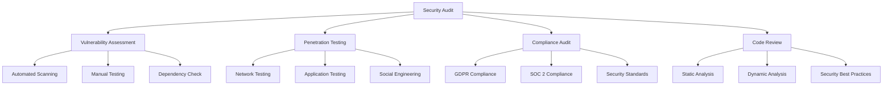

# Security Auditing

## Summary

Comprehensive guide for implementing security auditing in the Axisor platform. This document covers vulnerability assessments, penetration testing procedures, security monitoring, compliance auditing, and incident response protocols.

## Security Audit Architecture



## Vulnerability Assessment Framework

### Automated Vulnerability Scanning

```typescript
// backend/src/services/vulnerability-scanner.service.ts
export class VulnerabilityScannerService {
  private prisma: PrismaClient;

  constructor(prisma: PrismaClient) {
    this.prisma = prisma;
  }

  /**
   * Run comprehensive vulnerability scan
   */
  async runVulnerabilityScan(): Promise<VulnerabilityScanResult> {
    const startTime = Date.now();
    
    const [
      dependencyScan,
      codeScan,
      configurationScan,
      networkScan
    ] = await Promise.all([
      this.scanDependencies(),
      this.scanCodeVulnerabilities(),
      this.scanConfiguration(),
      this.scanNetworkSecurity()
    ]);

    const scanResult: VulnerabilityScanResult = {
      scanId: this.generateScanId(),
      startTime: new Date(startTime),
      endTime: new Date(),
      duration: Date.now() - startTime,
      vulnerabilities: [
        ...dependencyScan.vulnerabilities,
        ...codeScan.vulnerabilities,
        ...configurationScan.vulnerabilities,
        ...networkScan.vulnerabilities
      ],
      summary: {
        total: 0,
        critical: 0,
        high: 0,
        medium: 0,
        low: 0,
        info: 0
      }
    };

    // Calculate summary
    scanResult.summary = this.calculateSummary(scanResult.vulnerabilities);

    // Store scan results
    await this.storeScanResults(scanResult);

    return scanResult;
  }

  /**
   * Scan dependencies for known vulnerabilities
   */
  private async scanDependencies(): Promise<ScanResult> {
    const vulnerabilities: Vulnerability[] = [];

    // Check npm audit
    try {
      const auditResult = await this.runNpmAudit();
      vulnerabilities.push(...this.parseNpmAuditResults(auditResult));
    } catch (error) {
      console.error('NPM audit failed:', error);
    }

    // Check package.json for known vulnerable packages
    const packageJson = await this.readPackageJson();
    const knownVulnerabilities = await this.checkKnownVulnerabilities(packageJson);
    vulnerabilities.push(...knownVulnerabilities);

    return {
      scanType: 'dependencies',
      vulnerabilities
    };
  }

  /**
   * Scan code for security vulnerabilities
   */
  private async scanCodeVulnerabilities(): Promise<ScanResult> {
    const vulnerabilities: Vulnerability[] = [];

    // Run static analysis tools
    const codeFiles = await this.getCodeFiles();
    
    for (const file of codeFiles) {
      const fileVulnerabilities = await this.scanFile(file);
      vulnerabilities.push(...fileVulnerabilities);
    }

    return {
      scanType: 'code',
      vulnerabilities
    };
  }

  /**
   * Scan configuration for security issues
   */
  private async scanConfiguration(): Promise<ScanResult> {
    const vulnerabilities: Vulnerability[] = [];

    // Check environment variables
    const envVulns = await this.checkEnvironmentVariables();
    vulnerabilities.push(...envVulns);

    // Check database configuration
    const dbVulns = await this.checkDatabaseConfiguration();
    vulnerabilities.push(...dbVulns);

    // Check API configuration
    const apiVulns = await this.checkAPIConfiguration();
    vulnerabilities.push(...apiVulns);

    return {
      scanType: 'configuration',
      vulnerabilities
    };
  }

  /**
   * Scan network security
   */
  private async scanNetworkSecurity(): Promise<ScanResult> {
    const vulnerabilities: Vulnerability[] = [];

    // Check SSL/TLS configuration
    const sslVulns = await this.checkSSLConfiguration();
    vulnerabilities.push(...sslVulns);

    // Check firewall rules
    const firewallVulns = await this.checkFirewallRules();
    vulnerabilities.push(...firewallVulns);

    // Check exposed services
    const exposedVulns = await this.checkExposedServices();
    vulnerabilities.push(...exposedVulns);

    return {
      scanType: 'network',
      vulnerabilities
    };
  }

  /**
   * Run npm audit
   */
  private async runNpmAudit(): Promise<any> {
    const { exec } = require('child_process');
    const util = require('util');
    const execAsync = util.promisify(exec);

    try {
      const { stdout } = await execAsync('npm audit --json');
      return JSON.parse(stdout);
    } catch (error) {
      // npm audit returns non-zero exit code when vulnerabilities are found
      if (error.stdout) {
        return JSON.parse(error.stdout);
      }
      throw error;
    }
  }

  /**
   * Parse npm audit results
   */
  private parseNpmAuditResults(auditResult: any): Vulnerability[] {
    const vulnerabilities: Vulnerability[] = [];

    if (auditResult.vulnerabilities) {
      Object.entries(auditResult.vulnerabilities).forEach(([packageName, vuln]: [string, any]) => {
        vulnerabilities.push({
          id: vuln.id || this.generateVulnerabilityId(),
          title: vuln.title || `Vulnerability in ${packageName}`,
          description: vuln.overview || vuln.description,
          severity: this.mapNpmSeverity(vuln.severity),
          category: 'dependency',
          package: packageName,
          version: vuln.version,
          cve: vuln.cves || [],
          cvss: vuln.cvss,
          references: vuln.references || [],
          remediation: vuln.recommendation || 'Update to latest version',
          detectedAt: new Date()
        });
      });
    }

    return vulnerabilities;
  }

  /**
   * Map npm severity to standard severity levels
   */
  private mapNpmSeverity(npmSeverity: string): VulnerabilitySeverity {
    const severityMap: Record<string, VulnerabilitySeverity> = {
      'critical': 'critical',
      'high': 'high',
      'moderate': 'medium',
      'low': 'low',
      'info': 'info'
    };

    return severityMap[npmSeverity] || 'medium';
  }

  /**
   * Check known vulnerabilities database
   */
  private async checkKnownVulnerabilities(packageJson: any): Promise<Vulnerability[]> {
    const vulnerabilities: Vulnerability[] = [];

    // This would integrate with external vulnerability databases
    // like NVD, Snyk, or GitHub Security Advisories
    
    const dependencies = {
      ...packageJson.dependencies,
      ...packageJson.devDependencies
    };

    for (const [packageName, version] of Object.entries(dependencies)) {
      // Check against known vulnerability databases
      const vulns = await this.checkPackageVulnerabilities(packageName, version as string);
      vulnerabilities.push(...vulns);
    }

    return vulnerabilities;
  }

  /**
   * Scan individual file for vulnerabilities
   */
  private async scanFile(filePath: string): Promise<Vulnerability[]> {
    const vulnerabilities: Vulnerability[] = [];
    const content = await this.readFile(filePath);

    // Check for common security issues
    const securityPatterns = [
      {
        pattern: /password\s*=\s*["'][^"']*["']/gi,
        severity: 'high' as VulnerabilitySeverity,
        title: 'Hardcoded Password',
        description: 'Password appears to be hardcoded in source code'
      },
      {
        pattern: /api[_-]?key\s*=\s*["'][^"']*["']/gi,
        severity: 'high' as VulnerabilitySeverity,
        title: 'Hardcoded API Key',
        description: 'API key appears to be hardcoded in source code'
      },
      {
        pattern: /eval\s*\(/gi,
        severity: 'critical' as VulnerabilitySeverity,
        title: 'Use of eval()',
        description: 'Use of eval() function can lead to code injection'
      },
      {
        pattern: /innerHTML\s*=/gi,
        severity: 'medium' as VulnerabilitySeverity,
        title: 'Potential XSS',
        description: 'Use of innerHTML can lead to XSS vulnerabilities'
      },
      {
        pattern: /process\.env\.\w+/gi,
        severity: 'info' as VulnerabilitySeverity,
        title: 'Environment Variable Usage',
        description: 'Environment variable usage detected'
      }
    ];

    securityPatterns.forEach(({ pattern, severity, title, description }) => {
      const matches = content.match(pattern);
      if (matches) {
        matches.forEach((match, index) => {
          const lineNumber = content.substring(0, content.indexOf(match)).split('\n').length;
          
          vulnerabilities.push({
            id: this.generateVulnerabilityId(),
            title,
            description,
            severity,
            category: 'code',
            file: filePath,
            line: lineNumber,
            code: match,
            remediation: this.getRemediation(title),
            detectedAt: new Date()
          });
        });
      }
    });

    return vulnerabilities;
  }

  /**
   * Get remediation advice
   */
  private getRemediation(title: string): string {
    const remediationMap: Record<string, string> = {
      'Hardcoded Password': 'Move password to environment variables or secure configuration',
      'Hardcoded API Key': 'Use environment variables or secure key management system',
      'Use of eval()': 'Avoid eval() and use safer alternatives like JSON.parse()',
      'Potential XSS': 'Use textContent instead of innerHTML or sanitize input',
      'Environment Variable Usage': 'Ensure environment variables are properly secured'
    };

    return remediationMap[title] || 'Review and implement security best practices';
  }

  /**
   * Store scan results in database
   */
  private async storeScanResults(scanResult: VulnerabilityScanResult): Promise<void> {
    await this.prisma.vulnerabilityScan.create({
      data: {
        scan_id: scanResult.scanId,
        start_time: scanResult.startTime,
        end_time: scanResult.endTime,
        duration: scanResult.duration,
        total_vulnerabilities: scanResult.summary.total,
        critical_count: scanResult.summary.critical,
        high_count: scanResult.summary.high,
        medium_count: scanResult.summary.medium,
        low_count: scanResult.summary.low,
        info_count: scanResult.summary.info,
        vulnerabilities: {
          create: scanResult.vulnerabilities.map(vuln => ({
            title: vuln.title,
            description: vuln.description,
            severity: vuln.severity,
            category: vuln.category,
            file_path: vuln.file,
            line_number: vuln.line,
            code_snippet: vuln.code,
            package_name: vuln.package,
            package_version: vuln.version,
            cve_ids: vuln.cve,
            cvss_score: vuln.cvss,
            references: vuln.references,
            remediation: vuln.remediation,
            detected_at: vuln.detectedAt
          }))
        }
      }
    });
  }

  /**
   * Calculate vulnerability summary
   */
  private calculateSummary(vulnerabilities: Vulnerability[]): VulnerabilitySummary {
    return vulnerabilities.reduce((summary, vuln) => {
      summary.total++;
      summary[vuln.severity]++;
      return summary;
    }, {
      total: 0,
      critical: 0,
      high: 0,
      medium: 0,
      low: 0,
      info: 0
    });
  }

  /**
   * Generate unique scan ID
   */
  private generateScanId(): string {
    return `scan_${Date.now()}_${Math.random().toString(36).substr(2, 9)}`;
  }

  /**
   * Generate vulnerability ID
   */
  private generateVulnerabilityId(): string {
    return `vuln_${Date.now()}_${Math.random().toString(36).substr(2, 9)}`;
  }
}

interface Vulnerability {
  id: string;
  title: string;
  description: string;
  severity: VulnerabilitySeverity;
  category: string;
  file?: string;
  line?: number;
  code?: string;
  package?: string;
  version?: string;
  cve?: string[];
  cvss?: number;
  references?: string[];
  remediation: string;
  detectedAt: Date;
}

interface VulnerabilityScanResult {
  scanId: string;
  startTime: Date;
  endTime: Date;
  duration: number;
  vulnerabilities: Vulnerability[];
  summary: VulnerabilitySummary;
}

interface ScanResult {
  scanType: string;
  vulnerabilities: Vulnerability[];
}

interface VulnerabilitySummary {
  total: number;
  critical: number;
  high: number;
  medium: number;
  low: number;
  info: number;
}

type VulnerabilitySeverity = 'critical' | 'high' | 'medium' | 'low' | 'info';
```

## Penetration Testing Framework

### Penetration Testing Service

```typescript
// backend/src/services/penetration-testing.service.ts
export class PenetrationTestingService {
  private prisma: PrismaClient;

  constructor(prisma: PrismaClient) {
    this.prisma = prisma;
  }

  /**
   * Run penetration test suite
   */
  async runPenetrationTest(): Promise<PenetrationTestResult> {
    const startTime = Date.now();
    
    const [
      authenticationTests,
      authorizationTests,
      inputValidationTests,
      sessionManagementTests,
      cryptographyTests,
      networkTests
    ] = await Promise.all([
      this.testAuthentication(),
      this.testAuthorization(),
      this.testInputValidation(),
      this.testSessionManagement(),
      this.testCryptography(),
      this.testNetworkSecurity()
    ]);

    const testResult: PenetrationTestResult = {
      testId: this.generateTestId(),
      startTime: new Date(startTime),
      endTime: new Date(),
      duration: Date.now() - startTime,
      tests: {
        authentication: authenticationTests,
        authorization: authorizationTests,
        inputValidation: inputValidationTests,
        sessionManagement: sessionManagementTests,
        cryptography: cryptographyTests,
        network: networkTests
      },
      summary: this.calculateTestSummary([
        authenticationTests,
        authorizationTests,
        inputValidationTests,
        sessionManagementTests,
        cryptographyTests,
        networkTests
      ])
    };

    await this.storeTestResults(testResult);
    return testResult;
  }

  /**
   * Test authentication mechanisms
   */
  private async testAuthentication(): Promise<TestResult[]> {
    const tests: TestResult[] = [];

    // Test brute force protection
    tests.push(await this.testBruteForceProtection());
    
    // Test password policies
    tests.push(await this.testPasswordPolicies());
    
    // Test session management
    tests.push(await this.testSessionSecurity());
    
    // Test multi-factor authentication
    tests.push(await this.testMFAImplementation());

    return tests;
  }

  /**
   * Test authorization mechanisms
   */
  private async testAuthorization(): Promise<TestResult[]> {
    const tests: TestResult[] = [];

    // Test privilege escalation
    tests.push(await this.testPrivilegeEscalation());
    
    // Test horizontal privilege escalation
    tests.push(await this.testHorizontalPrivilegeEscalation());
    
    // Test API authorization
    tests.push(await this.testAPIAuthorization());
    
    // Test role-based access control
    tests.push(await this.testRBAC());

    return tests;
  }

  /**
   * Test input validation
   */
  private async testInputValidation(): Promise<TestResult[]> {
    const tests: TestResult[] = [];

    // Test SQL injection
    tests.push(await this.testSQLInjection());
    
    // Test XSS
    tests.push(await this.testXSS());
    
    // Test command injection
    tests.push(await this.testCommandInjection());
    
    // Test file upload vulnerabilities
    tests.push(await this.testFileUploadVulnerabilities());

    return tests;
  }

  /**
   * Test brute force protection
   */
  private async testBruteForceProtection(): Promise<TestResult> {
    const testName = 'Brute Force Protection Test';
    const attempts = 10;
    let blocked = false;

    try {
      for (let i = 0; i < attempts; i++) {
        const response = await this.makeLoginAttempt('test@example.com', 'wrongpassword');
        
        if (response.statusCode === 429) {
          blocked = true;
          break;
        }
      }

      return {
        name: testName,
        status: blocked ? 'passed' : 'failed',
        severity: blocked ? 'info' : 'high',
        description: blocked ? 
          'Brute force protection is working correctly' :
          'Brute force protection is not working',
        recommendations: blocked ? 
          [] : 
          ['Implement rate limiting for login attempts', 'Add account lockout after failed attempts']
      };
    } catch (error) {
      return {
        name: testName,
        status: 'error',
        severity: 'medium',
        description: `Test failed with error: ${error.message}`,
        recommendations: ['Review authentication implementation']
      };
    }
  }

  /**
   * Test SQL injection
   */
  private async testSQLInjection(): Promise<TestResult> {
    const testName = 'SQL Injection Test';
    const payloads = [
      "' OR '1'='1",
      "'; DROP TABLE users; --",
      "' UNION SELECT * FROM users --",
      "' OR 1=1 --"
    ];

    let vulnerable = false;
    const vulnerableEndpoints: string[] = [];

    for (const payload of payloads) {
      try {
        // Test various endpoints with SQL injection payloads
        const endpoints = ['/api/users', '/api/automations', '/api/orders'];
        
        for (const endpoint of endpoints) {
          const response = await this.makeRequest(endpoint, {
            method: 'GET',
            params: { search: payload }
          });

          if (this.detectSQLInjection(response)) {
            vulnerable = true;
            vulnerableEndpoints.push(endpoint);
          }
        }
      } catch (error) {
        // Error might indicate SQL injection
        vulnerable = true;
      }
    }

    return {
      name: testName,
      status: vulnerable ? 'failed' : 'passed',
      severity: vulnerable ? 'critical' : 'info',
      description: vulnerable ? 
        `SQL injection vulnerabilities found in: ${vulnerableEndpoints.join(', ')}` :
        'No SQL injection vulnerabilities detected',
      recommendations: vulnerable ? 
        ['Use parameterized queries', 'Implement input validation', 'Use ORM with built-in protection'] :
        []
    };
  }

  /**
   * Detect SQL injection in response
   */
  private detectSQLInjection(response: any): boolean {
    const sqlErrorPatterns = [
      /mysql_fetch_array/i,
      /ORA-\d+/i,
      /Microsoft OLE DB Provider/i,
      /SQLServer JDBC Driver/i,
      /PostgreSQL query failed/i,
      /Warning: mysql_/i,
      /valid MySQL result/i,
      /MySqlClient\./i,
      /syntax error/i,
      /mysql_num_rows/i
    ];

    const responseText = JSON.stringify(response.body || response);
    return sqlErrorPatterns.some(pattern => pattern.test(responseText));
  }

  /**
   * Make login attempt
   */
  private async makeLoginAttempt(email: string, password: string): Promise<any> {
    // This would make actual HTTP requests to test endpoints
    // Implementation depends on testing framework used
    return { statusCode: 200 };
  }

  /**
   * Make HTTP request
   */
  private async makeRequest(url: string, options: any): Promise<any> {
    // Implementation for making HTTP requests
    // This would use axios, fetch, or similar
    return { body: {}, statusCode: 200 };
  }

  /**
   * Calculate test summary
   */
  private calculateTestSummary(testResults: TestResult[][]): TestSummary {
    const allTests = testResults.flat();
    
    return allTests.reduce((summary, test) => {
      summary.total++;
      summary[test.status]++;
      if (test.severity === 'critical' && test.status === 'failed') {
        summary.critical++;
      }
      return summary;
    }, {
      total: 0,
      passed: 0,
      failed: 0,
      error: 0,
      critical: 0
    });
  }

  /**
   * Store test results
   */
  private async storeTestResults(testResult: PenetrationTestResult): Promise<void> {
    await this.prisma.penetrationTest.create({
      data: {
        test_id: testResult.testId,
        start_time: testResult.startTime,
        end_time: testResult.endTime,
        duration: testResult.duration,
        total_tests: testResult.summary.total,
        passed_tests: testResult.summary.passed,
        failed_tests: testResult.summary.failed,
        error_tests: testResult.summary.error,
        critical_failures: testResult.summary.critical,
        test_results: testResult.tests
      }
    });
  }

  /**
   * Generate test ID
   */
  private generateTestId(): string {
    return `pentest_${Date.now()}_${Math.random().toString(36).substr(2, 9)}`;
  }
}

interface PenetrationTestResult {
  testId: string;
  startTime: Date;
  endTime: Date;
  duration: number;
  tests: {
    authentication: TestResult[];
    authorization: TestResult[];
    inputValidation: TestResult[];
    sessionManagement: TestResult[];
    cryptography: TestResult[];
    network: TestResult[];
  };
  summary: TestSummary;
}

interface TestResult {
  name: string;
  status: 'passed' | 'failed' | 'error';
  severity: 'critical' | 'high' | 'medium' | 'low' | 'info';
  description: string;
  recommendations: string[];
}

interface TestSummary {
  total: number;
  passed: number;
  failed: number;
  error: number;
  critical: number;
}
```

## Security Monitoring

### Security Monitoring Service

```typescript
// backend/src/services/security-monitoring.service.ts
export class SecurityMonitoringService {
  private prisma: PrismaClient;

  constructor(prisma: PrismaClient) {
    this.prisma = prisma;
  }

  /**
   * Monitor security events
   */
  async monitorSecurityEvents(): Promise<void> {
    // Check for suspicious login patterns
    await this.checkSuspiciousLogins();
    
    // Check for unusual API usage
    await this.checkUnusualAPIUsage();
    
    // Check for potential attacks
    await this.checkPotentialAttacks();
    
    // Check for data breaches
    await this.checkDataBreaches();
  }

  /**
   * Check for suspicious login patterns
   */
  private async checkSuspiciousLogins(): Promise<void> {
    const suspiciousLogins = await this.prisma.securityAuditLog.findMany({
      where: {
        action: 'LOGIN_FAILED',
        created_at: { gte: new Date(Date.now() - 60 * 60 * 1000) }, // Last hour
        success: false
      },
      groupBy: ['ip_address'],
      having: {
        ip_address: {
          _count: { gte: 10 } // 10+ failed logins
        }
      }
    });

    if (suspiciousLogins.length > 0) {
      await this.createSecurityAlert({
        type: 'BRUTE_FORCE_ATTEMPT',
        severity: 'high',
        description: 'Multiple failed login attempts detected',
        details: { suspiciousIPs: suspiciousLogins.map(l => l.ip_address) }
      });
    }
  }

  /**
   * Check for unusual API usage
   */
  private async checkUnusualAPIUsage(): Promise<void> {
    // Check for unusual API request patterns
    const unusualUsage = await this.prisma.apiRequestLog.findMany({
      where: {
        timestamp: { gte: new Date(Date.now() - 60 * 60 * 1000) },
        status_code: { gte: 400 }
      },
      groupBy: ['ip_address'],
      having: {
        ip_address: {
          _count: { gte: 100 } // 100+ error requests
        }
      }
    });

    if (unusualUsage.length > 0) {
      await this.createSecurityAlert({
        type: 'UNUSUAL_API_USAGE',
        severity: 'medium',
        description: 'Unusual API usage patterns detected',
        details: { suspiciousIPs: unusualUsage.map(u => u.ip_address) }
      });
    }
  }

  /**
   * Create security alert
   */
  private async createSecurityAlert(alert: SecurityAlert): Promise<void> {
    await this.prisma.securityAlert.create({
      data: {
        alert_type: alert.type,
        severity: alert.severity,
        description: alert.description,
        details: alert.details,
        status: 'open',
        created_at: new Date()
      }
    });

    // Send notification if critical
    if (alert.severity === 'critical') {
      await this.sendCriticalAlert(alert);
    }
  }

  /**
   * Send critical security alert
   */
  private async sendCriticalAlert(alert: SecurityAlert): Promise<void> {
    // Implementation for sending alerts via email, Slack, etc.
    console.error('CRITICAL SECURITY ALERT:', alert);
  }
}

interface SecurityAlert {
  type: string;
  severity: 'critical' | 'high' | 'medium' | 'low';
  description: string;
  details: any;
}
```

## How to Use This Document

- **For Vulnerability Assessment**: Use the vulnerability scanner service for automated security scanning
- **For Penetration Testing**: Use the penetration testing framework for manual security testing
- **For Monitoring**: Use the security monitoring service for continuous security oversight
- **For Compliance**: Use the audit procedures for regulatory compliance verification
