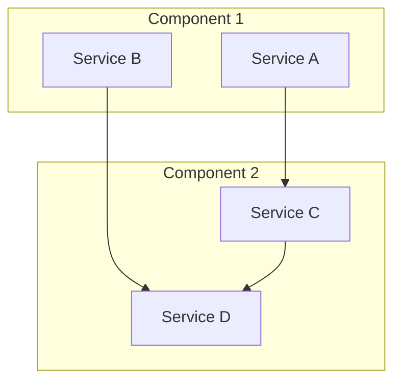
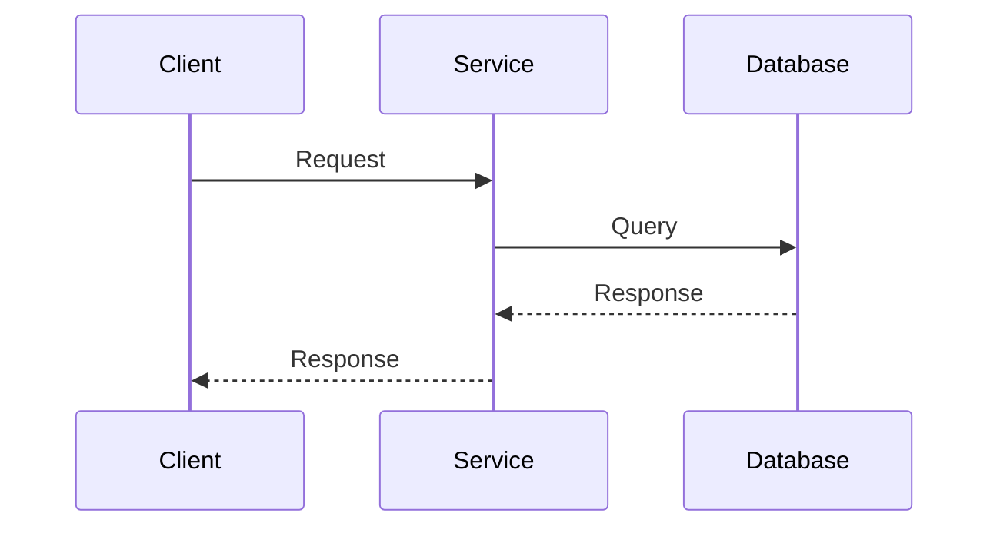

# {Feature Name} - Architecture

> **Status**: Active  
> **Última Atualização**: {YYYY-MM-DD}  
> **Versão**: 1.0.0  
> **Responsável**: {Feature Name} System  

## Índice

- [Visão Geral](#visão-geral)
- [Arquitetura do Sistema](#arquitetura-do-sistema)
- [Componentes Principais](#componentes-principais)
- [Fluxo de Dados](#fluxo-de-dados)
- [Padrões de Design](#padrões-de-design)
- [Configuração](#configuração)
- [Integração com Outros Sistemas](#integração-com-outros-sistemas)
- [Pontos Críticos](#pontos-críticos)
- [Checklist de Avaliação](#checklist-de-avaliação)
- [Referências](#referências)

## Visão Geral

{Descrição breve em 2-3 linhas sobre a arquitetura deste componente}

## Arquitetura do Sistema

### Diagrama de Arquitetura



### Principais Elementos

- **Elemento 1**: Descrição e responsabilidade
- **Elemento 2**: Descrição e responsabilidade
- **Elemento 3**: Descrição e responsabilidade

## Componentes Principais

### Componente A
**Responsabilidade**: {Descrição da responsabilidade}

**Localização**: `{path/to/component}`

**Dependências**: 
- {Dependency 1}
- {Dependency 2}

### Componente B
**Responsabilidade**: {Descrição da responsabilidade}

**Localização**: `{path/to/component}`

**Dependências**: 
- {Dependency 1}
- {Dependency 2}

## Fluxo de Dados

### Fluxo Principal



### Fluxos Secundários

1. **Fluxo A**: Descrição do fluxo
2. **Fluxo B**: Descrição do fluxo
3. **Fluxo C**: Descrição do fluxo

## Padrões de Design

### Padrão 1: {Nome do Padrão}
**Aplicação**: {Onde é aplicado}

```typescript
// Exemplo de implementação
class ExampleService {
  constructor(private config: Config) {}
  
  async processData(data: any): Promise<any> {
    // Implementation
  }
}
```

### Padrão 2: {Nome do Padrão}
**Aplicação**: {Onde é aplicado}

```typescript
// Exemplo de implementação
interface ExampleInterface {
  method(): Promise<any>;
}
```

## Configuração

### Configuração Base

```typescript
// Configuração principal
export const config = {
  feature: {
    enabled: true,
    timeout: 5000,
    retries: 3
  }
};
```

### Configuração por Ambiente

```typescript
// Desenvolvimento
const devConfig = {
  debug: true,
  logLevel: 'debug'
};

// Produção
const prodConfig = {
  debug: false,
  logLevel: 'error'
};
```

## Integração com Outros Sistemas

### Sistema A
**Tipo**: {API, Database, Service}

**Método**: {REST, GraphQL, WebSocket}

**Autenticação**: {JWT, API Key, OAuth}

### Sistema B
**Tipo**: {API, Database, Service}

**Método**: {REST, GraphQL, WebSocket}

**Autenticação**: {JWT, API Key, OAuth}

## Pontos Críticos

### Segurança
- **Autenticação**: {Detalhes de autenticação}
- **Autorização**: {Detalhes de autorização}
- **Validação**: {Detalhes de validação}

### Performance
- **Cache**: {Estratégia de cache}
- **Otimização**: {Otimizações implementadas}
- **Escalabilidade**: {Considerações de escalabilidade}

### Confiabilidade
- **Error Handling**: {Tratamento de erros}
- **Retry Logic**: {Lógica de retry}
- **Monitoring**: {Monitoramento}

## Checklist de Avaliação

### Arquitetura
- [ ] Separação clara de responsabilidades
- [ ] Padrões de design apropriados
- [ ] Documentação de interfaces
- [ ] Contratos bem definidos
- [ ] Estratégia de versionamento

### Implementação
- [ ] Código limpo e legível
- [ ] Testes unitários
- [ ] Testes de integração
- [ ] Documentação inline
- [ ] Tratamento de erros

### Operação
- [ ] Logs adequados
- [ ] Métricas implementadas
- [ ] Monitoramento configurado
- [ ] Alertas configurados
- [ ] Backup strategy

## Referências

- [Código Fonte](../{path/to/source})
- [Documentação Relacionada](./related-doc.md)
- [API Externa](https://external-api.com/docs)
- [Padrões de Design](../standards/design-patterns.md)

## Como Usar Este Documento

• **Para Desenvolvedores**: Use como referência para implementar ou modificar este componente seguindo a arquitetura definida.

• **Para Arquitetos**: Use para validar decisões arquiteturais e identificar pontos de melhoria.

• **Para DevOps**: Use para entender dependências e configurações necessárias para deploy e monitoramento.
