# End-to-End User Workflows Testing

## Summary

Comprehensive end-to-end testing strategy for user workflows in the Axisor platform. This document covers testing of complete user journeys, from registration and authentication to trading automation setup and execution, ensuring the entire user experience works seamlessly across all system components.

## E2E Testing Architecture

```mermaid
graph TB
    A[E2E Testing Framework] --> B[User Registration Flow]
    A --> C[Authentication Flow]
    A --> D[Account Management]
    A --> E[Trading Automation]
    A --> F[Admin Operations]
    
    B --> G[Account Creation]
    B --> H[Email Verification]
    B --> I[Profile Setup]
    B --> J[Plan Selection]
    
    C --> K[Login Process]
    C --> L[Session Management]
    C --> M[Password Reset]
    C --> N[Two-Factor Auth]
    
    D --> O[Exchange Account Setup]
    D --> P[Credential Management]
    D --> Q[Account Switching]
    D --> R[Plan Upgrades]
    
    E --> S[Automation Creation]
    E --> T[Margin Guard Setup]
    E --> U[Simulation Testing]
    E --> V[Execution Monitoring]
    
    F --> W[User Management]
    F --> X[System Monitoring]
    F --> Y[Coupon Management]
    F --> Z[Analytics Review]
```



## E2E Testing Setup

### Playwright Configuration

```typescript
// config/playwright.config.ts
import { defineConfig, devices } from '@playwright/test';

export default defineConfig({
  testDir: './frontend/src/__tests__/e2e',
  fullyParallel: false,
  forbidOnly: !!process.env.CI,
  retries: process.env.CI ? 2 : 0,
  workers: process.env.CI ? 1 : undefined,
  reporter: [
    ['html'],
    ['json', { outputFile: 'test-results.json' }],
    ['junit', { outputFile: 'test-results.xml' }],
  ],
  use: {
    baseURL: 'http://localhost:13000',
    trace: 'on-first-retry',
    screenshot: 'only-on-failure',
    video: 'retain-on-failure',
  },
  projects: [
    {
      name: 'chromium',
      use: { ...devices['Desktop Chrome'] },
    },
    {
      name: 'firefox',
      use: { ...devices['Desktop Firefox'] },
    },
    {
      name: 'webkit',
      use: { ...devices['Desktop Safari'] },
    },
    {
      name: 'Mobile Chrome',
      use: { ...devices['Pixel 5'] },
    },
    {
      name: 'Mobile Safari',
      use: { ...devices['iPhone 12'] },
    },
  ],
  webServer: {
    command: 'npm run dev',
    url: 'http://localhost:13000',
    reuseExistingServer: !process.env.CI,
  },
});
```

### Test Utilities

```typescript
// frontend/src/__tests__/e2e/utils/test-helpers.ts
import { Page, expect } from '@playwright/test';

export class TestHelpers {
  constructor(private page: Page) {}

  async login(email: string, password: string) {
    await this.page.goto('/login');
    await this.page.fill('[data-testid="email-input"]', email);
    await this.page.fill('[data-testid="password-input"]', password);
    await this.page.click('[data-testid="login-button"]');
    await this.page.waitForURL('/dashboard');
  }

  async logout() {
    await this.page.click('[data-testid="user-menu"]');
    await this.page.click('[data-testid="logout-button"]');
    await this.page.waitForURL('/login');
  }

  async waitForElement(selector: string, timeout = 10000) {
    await this.page.waitForSelector(selector, { timeout });
  }

  async waitForApiResponse(url: string, timeout = 10000) {
    return await this.page.waitForResponse(response => 
      response.url().includes(url) && response.status() === 200,
      { timeout }
    );
  }

  async mockApiResponse(url: string, response: any) {
    await this.page.route(url, route => {
      route.fulfill({
        status: 200,
        contentType: 'application/json',
        body: JSON.stringify(response)
      });
    });
  }

  async takeScreenshot(name: string) {
    await this.page.screenshot({ 
      path: `test-results/screenshots/${name}.png`,
      fullPage: true 
    });
  }
}
```

## User Registration Workflow

### Account Creation Flow

```typescript
// frontend/src/__tests__/e2e/account-creation-flow.e2e.test.ts
import { test, expect } from '@playwright/test';
import { TestHelpers } from '../utils/test-helpers';

test.describe('Account Creation Flow', () => {
  let testHelpers: TestHelpers;

  test.beforeEach(async ({ page }) => {
    testHelpers = new TestHelpers(page);
  });

  test('should complete user registration successfully', async ({ page }) => {
    // Mock API responses
    await testHelpers.mockApiResponse('/api/auth/register', {
      success: true,
      data: {
        user: {
          id: 'user-123',
          email: 'test@example.com',
          plan_type: 'Free'
        },
        access_token: 'mock-access-token',
        refresh_token: 'mock-refresh-token'
      }
    });

    // Navigate to registration page
    await page.goto('/register');

    // Fill registration form
    await page.fill('[data-testid="email-input"]', 'test@example.com');
    await page.fill('[data-testid="password-input"]', 'TestPassword123!');
    await page.fill('[data-testid="confirm-password-input"]', 'TestPassword123!');
    await page.fill('[data-testid="username-input"]', 'testuser');

    // Accept terms and conditions
    await page.check('[data-testid="terms-checkbox"]');

    // Submit registration
    await page.click('[data-testid="register-button"]');

    // Wait for success message
    await testHelpers.waitForElement('[data-testid="registration-success"]');

    // Verify user is redirected to dashboard
    await page.waitForURL('/dashboard');
    expect(page.url()).toContain('/dashboard');

    // Verify welcome message is displayed
    await expect(page.locator('[data-testid="welcome-message"]')).toBeVisible();
    await expect(page.locator('[data-testid="welcome-message"]')).toContainText('Welcome, testuser!');
  });

  test('should show validation errors for invalid input', async ({ page }) => {
    await page.goto('/register');

    // Submit empty form
    await page.click('[data-testid="register-button"]');

    // Verify validation errors
    await expect(page.locator('[data-testid="email-error"]')).toContainText('Email is required');
    await expect(page.locator('[data-testid="password-error"]')).toContainText('Password is required');
    await expect(page.locator('[data-testid="username-error"]')).toContainText('Username is required');
  });

  test('should show error for weak password', async ({ page }) => {
    await page.goto('/register');

    // Fill form with weak password
    await page.fill('[data-testid="email-input"]', 'test@example.com');
    await page.fill('[data-testid="password-input"]', '123');
    await page.fill('[data-testid="confirm-password-input"]', '123');
    await page.fill('[data-testid="username-input"]', 'testuser');

    // Submit form
    await page.click('[data-testid="register-button"]');

    // Verify password strength error
    await expect(page.locator('[data-testid="password-error"]')).toContainText('Password must be at least 8 characters');
  });

  test('should show error for password mismatch', async ({ page }) => {
    await page.goto('/register');

    // Fill form with mismatched passwords
    await page.fill('[data-testid="email-input"]', 'test@example.com');
    await page.fill('[data-testid="password-input"]', 'TestPassword123!');
    await page.fill('[data-testid="confirm-password-input"]', 'DifferentPassword123!');
    await page.fill('[data-testid="username-input"]', 'testuser');

    // Submit form
    await page.click('[data-testid="register-button"]');

    // Verify password mismatch error
    await expect(page.locator('[data-testid="confirm-password-error"]')).toContainText('Passwords do not match');
  });

  test('should show error for existing email', async ({ page }) => {
    // Mock API error response
    await testHelpers.mockApiResponse('/api/auth/register', {
      success: false,
      error: 'Email already exists'
    });

    await page.goto('/register');

    // Fill form with existing email
    await page.fill('[data-testid="email-input"]', 'existing@example.com');
    await page.fill('[data-testid="password-input"]', 'TestPassword123!');
    await page.fill('[data-testid="confirm-password-input"]', 'TestPassword123!');
    await page.fill('[data-testid="username-input"]', 'testuser');

    // Submit form
    await page.click('[data-testid="register-button"]');

    // Verify error message
    await expect(page.locator('[data-testid="error-message"]')).toContainText('Email already exists');
  });
});
```

## Authentication Workflow

### Login and Session Management

```typescript
// frontend/src/__tests__/e2e/authentication-flow.e2e.test.ts
import { test, expect } from '@playwright/test';
import { TestHelpers } from '../utils/test-helpers';

test.describe('Authentication Flow', () => {
  let testHelpers: TestHelpers;

  test.beforeEach(async ({ page }) => {
    testHelpers = new TestHelpers(page);
  });

  test('should login successfully with valid credentials', async ({ page }) => {
    // Mock successful login response
    await testHelpers.mockApiResponse('/api/auth/login', {
      success: true,
      data: {
        user: {
          id: 'user-123',
          email: 'test@example.com',
          plan_type: 'Pro'
        },
        access_token: 'mock-access-token',
        refresh_token: 'mock-refresh-token'
      }
    });

    // Navigate to login page
    await page.goto('/login');

    // Fill login form
    await page.fill('[data-testid="email-input"]', 'test@example.com');
    await page.fill('[data-testid="password-input"]', 'TestPassword123!');

    // Submit login
    await page.click('[data-testid="login-button"]');

    // Wait for redirect to dashboard
    await page.waitForURL('/dashboard');
    expect(page.url()).toContain('/dashboard');

    // Verify user is logged in
    await expect(page.locator('[data-testid="user-menu"]')).toBeVisible();
    await expect(page.locator('[data-testid="user-menu"]')).toContainText('test@example.com');
  });

  test('should show error for invalid credentials', async ({ page }) => {
    // Mock failed login response
    await testHelpers.mockApiResponse('/api/auth/login', {
      success: false,
      error: 'Invalid credentials'
    });

    await page.goto('/login');

    // Fill form with invalid credentials
    await page.fill('[data-testid="email-input"]', 'test@example.com');
    await page.fill('[data-testid="password-input"]', 'wrongpassword');

    // Submit login
    await page.click('[data-testid="login-button"]');

    // Verify error message
    await expect(page.locator('[data-testid="error-message"]')).toContainText('Invalid credentials');
    expect(page.url()).toContain('/login');
  });

  test('should maintain session across page refreshes', async ({ page }) => {
    // Mock successful login
    await testHelpers.mockApiResponse('/api/auth/login', {
      success: true,
      data: {
        user: {
          id: 'user-123',
          email: 'test@example.com',
          plan_type: 'Pro'
        },
        access_token: 'mock-access-token',
        refresh_token: 'mock-refresh-token'
      }
    });

    // Login
    await testHelpers.login('test@example.com', 'TestPassword123!');

    // Refresh page
    await page.reload();

    // Verify user is still logged in
    await expect(page.locator('[data-testid="user-menu"]')).toBeVisible();
    await expect(page.locator('[data-testid="user-menu"]')).toContainText('test@example.com');
  });

  test('should logout successfully', async ({ page }) => {
    // Mock successful login
    await testHelpers.mockApiResponse('/api/auth/login', {
      success: true,
      data: {
        user: {
          id: 'user-123',
          email: 'test@example.com',
          plan_type: 'Pro'
        },
        access_token: 'mock-access-token',
        refresh_token: 'mock-refresh-token'
      }
    });

    // Mock successful logout
    await testHelpers.mockApiResponse('/api/auth/logout', {
      success: true,
      message: 'Logged out successfully'
    });

    // Login
    await testHelpers.login('test@example.com', 'TestPassword123!');

    // Logout
    await testHelpers.logout();

    // Verify redirect to login page
    expect(page.url()).toContain('/login');
    await expect(page.locator('[data-testid="login-form"]')).toBeVisible();
  });
});
```

## Exchange Account Management Workflow

### Account Setup and Management

```typescript
// frontend/src/__tests__/e2e/account-switching-flow.e2e.test.ts
import { test, expect } from '@playwright/test';
import { TestHelpers } from '../utils/test-helpers';

test.describe('Exchange Account Management Flow', () => {
  let testHelpers: TestHelpers;

  test.beforeEach(async ({ page }) => {
    testHelpers = new TestHelpers(page);
  });

  test('should create and manage exchange accounts', async ({ page }) => {
    // Mock successful login
    await testHelpers.mockApiResponse('/api/auth/login', {
      success: true,
      data: {
        user: {
          id: 'user-123',
          email: 'test@example.com',
          plan_type: 'Pro'
        },
        access_token: 'mock-access-token',
        refresh_token: 'mock-refresh-token'
      }
    });

    // Mock exchange accounts response
    await testHelpers.mockApiResponse('/api/user/exchange-accounts', {
      success: true,
      data: []
    });

    // Mock credential test response
    await testHelpers.mockApiResponse('/api/user/exchange-accounts/test', {
      success: true,
      data: {
        success: true,
        user_info: {
          id: 'lnmarkets-user-123',
          username: 'testuser'
        }
      }
    });

    // Mock account creation response
    await testHelpers.mockApiResponse('/api/user/exchange-accounts', {
      success: true,
      data: {
        id: 'account-123',
        exchange: 'LNMarkets',
        is_active: true,
        created_at: new Date().toISOString(),
        updated_at: new Date().toISOString()
      }
    });

    // Login
    await testHelpers.login('test@example.com', 'TestPassword123!');

    // Navigate to exchange accounts page
    await page.goto('/exchange-accounts');
    await testHelpers.waitForElement('[data-testid="exchange-accounts-page"]');

    // Click add account button
    await page.click('[data-testid="add-account-button"]');

    // Fill account form
    await page.fill('[data-testid="exchange-select"]', 'LNMarkets');
    await page.fill('[data-testid="api-key-input"]', 'test-api-key');
    await page.fill('[data-testid="api-secret-input"]', 'test-api-secret');

    // Test credentials
    await page.click('[data-testid="test-credentials-button"]');
    await testHelpers.waitForElement('[data-testid="credentials-success"]');

    // Save account
    await page.click('[data-testid="save-account-button"]');

    // Verify account was created
    await expect(page.locator('[data-testid="account-list"]')).toContainText('LNMarkets');
    await expect(page.locator('[data-testid="account-status"]')).toContainText('Active');
  });

  test('should switch between exchange accounts', async ({ page }) => {
    // Mock multiple accounts
    await testHelpers.mockApiResponse('/api/user/exchange-accounts', {
      success: true,
      data: [
        {
          id: 'account-1',
          exchange: 'LNMarkets',
          is_active: true,
          created_at: new Date().toISOString(),
          updated_at: new Date().toISOString()
        },
        {
          id: 'account-2',
          exchange: 'LNMarkets',
          is_active: false,
          created_at: new Date().toISOString(),
          updated_at: new Date().toISOString()
        }
      ]
    });

    // Mock account update response
    await testHelpers.mockApiResponse('/api/user/exchange-accounts/account-2', {
      success: true,
      data: {
        id: 'account-2',
        exchange: 'LNMarkets',
        is_active: true,
        created_at: new Date().toISOString(),
        updated_at: new Date().toISOString()
      }
    });

    // Login
    await testHelpers.login('test@example.com', 'TestPassword123!');

    // Navigate to exchange accounts page
    await page.goto('/exchange-accounts');
    await testHelpers.waitForElement('[data-testid="account-list"]');

    // Verify current active account
    await expect(page.locator('[data-testid="account-1"]')).toHaveClass(/active/);

    // Switch to second account
    await page.click('[data-testid="account-2"] [data-testid="activate-button"]');

    // Verify account switch
    await expect(page.locator('[data-testid="account-2"]')).toHaveClass(/active/);
    await expect(page.locator('[data-testid="account-1"]')).not.toHaveClass(/active/);
  });

  test('should delete exchange account', async ({ page }) => {
    // Mock accounts with delete functionality
    await testHelpers.mockApiResponse('/api/user/exchange-accounts', {
      success: true,
      data: [
        {
          id: 'account-1',
          exchange: 'LNMarkets',
          is_active: false,
          created_at: new Date().toISOString(),
          updated_at: new Date().toISOString()
        }
      ]
    });

    // Mock delete response
    await testHelpers.mockApiResponse('/api/user/exchange-accounts/account-1', {
      success: true,
      message: 'Account deleted successfully'
    });

    // Login
    await testHelpers.login('test@example.com', 'TestPassword123!');

    // Navigate to exchange accounts page
    await page.goto('/exchange-accounts');
    await testHelpers.waitForElement('[data-testid="account-list"]');

    // Click delete button
    await page.click('[data-testid="account-1"] [data-testid="delete-button"]');

    // Confirm deletion
    await page.click('[data-testid="confirm-delete-button"]');

    // Verify account was deleted
    await expect(page.locator('[data-testid="account-1"]')).not.toBeVisible();
    await expect(page.locator('[data-testid="no-accounts-message"]')).toBeVisible();
  });
});
```

## Trading Automation Workflow

### Margin Guard Setup and Execution

```typescript
// frontend/src/__tests__/e2e/automation-account-flow.e2e.test.ts
import { test, expect } from '@playwright/test';
import { TestHelpers } from '../utils/test-helpers';

test.describe('Trading Automation Flow', () => {
  let testHelpers: TestHelpers;

  test.beforeEach(async ({ page }) => {
    testHelpers = new TestHelpers(page);
  });

  test('should create and configure Margin Guard automation', async ({ page }) => {
    // Mock successful login
    await testHelpers.mockApiResponse('/api/auth/login', {
      success: true,
      data: {
        user: {
          id: 'user-123',
          email: 'test@example.com',
          plan_type: 'Pro'
        },
        access_token: 'mock-access-token',
        refresh_token: 'mock-refresh-token'
      }
    });

    // Mock user exchange accounts
    await testHelpers.mockApiResponse('/api/user/exchange-accounts', {
      success: true,
      data: [
        {
          id: 'account-1',
          exchange: 'LNMarkets',
          is_active: true,
          created_at: new Date().toISOString(),
          updated_at: new Date().toISOString()
        }
      ]
    });

    // Mock plan limits
    await testHelpers.mockApiResponse('/api/user/plan-limits', {
      success: true,
      data: {
        margin_guard_enabled: true,
        max_automations: 5,
        max_margin_guard_configs: 3
      }
    });

    // Mock automation creation
    await testHelpers.mockApiResponse('/api/automations', {
      success: true,
      data: {
        id: 'automation-123',
        name: 'Margin Guard Test',
        type: 'margin_guard',
        is_active: true,
        created_at: new Date().toISOString(),
        updated_at: new Date().toISOString()
      }
    });

    // Login
    await testHelpers.login('test@example.com', 'TestPassword123!');

    // Navigate to Margin Guard page
    await page.goto('/margin-guard');
    await testHelpers.waitForElement('[data-testid="margin-guard-page"]');

    // Click create automation button
    await page.click('[data-testid="create-automation-button"]');

    // Fill automation form
    await page.fill('[data-testid="automation-name-input"]', 'Margin Guard Test');
    await page.selectOption('[data-testid="exchange-select"]', 'account-1');
    await page.fill('[data-testid="margin-threshold-input"]', '80');
    await page.selectOption('[data-testid="action-select"]', 'reduce_position');
    await page.fill('[data-testid="reduction-percentage-input"]', '50');

    // Configure notifications
    await page.check('[data-testid="email-notification-checkbox"]');
    await page.check('[data-testid="push-notification-checkbox"]');

    // Save automation
    await page.click('[data-testid="save-automation-button"]');

    // Verify automation was created
    await expect(page.locator('[data-testid="automation-list"]')).toContainText('Margin Guard Test');
    await expect(page.locator('[data-testid="automation-status"]')).toContainText('Active');
  });

  test('should test automation with simulation', async ({ page }) => {
    // Mock simulation response
    await testHelpers.mockApiResponse('/api/simulations', {
      success: true,
      data: {
        id: 'simulation-123',
        status: 'running',
        progress: 0
      }
    });

    // Mock simulation results
    await testHelpers.mockApiResponse('/api/simulations/simulation-123', {
      success: true,
      data: {
        id: 'simulation-123',
        status: 'completed',
        progress: 100,
        results: {
          total_trades: 10,
          successful_trades: 8,
          success_rate: 80,
          total_profit: 150.50
        }
      }
    });

    // Login
    await testHelpers.login('test@example.com', 'TestPassword123!');

    // Navigate to automation page
    await page.goto('/automations');
    await testHelpers.waitForElement('[data-testid="automation-list"]');

    // Click test automation button
    await page.click('[data-testid="automation-123"] [data-testid="test-button"]');

    // Wait for simulation to complete
    await testHelpers.waitForElement('[data-testid="simulation-complete"]');

    // Verify simulation results
    await expect(page.locator('[data-testid="success-rate"]')).toContainText('80%');
    await expect(page.locator('[data-testid="total-profit"]')).toContainText('150.50');
  });

  test('should monitor automation execution', async ({ page }) => {
    // Mock automation status
    await testHelpers.mockApiResponse('/api/automations/automation-123/status', {
      success: true,
      data: {
        id: 'automation-123',
        status: 'active',
        last_execution: new Date().toISOString(),
        executions_today: 5,
        success_rate: 85
      }
    });

    // Login
    await testHelpers.login('test@example.com', 'TestPassword123!');

    // Navigate to automation details
    await page.goto('/automations/automation-123');
    await testHelpers.waitForElement('[data-testid="automation-details"]');

    // Verify automation status
    await expect(page.locator('[data-testid="automation-status"]')).toContainText('Active');
    await expect(page.locator('[data-testid="executions-today"]')).toContainText('5');
    await expect(page.locator('[data-testid="success-rate"]')).toContainText('85%');
  });
});
```

## Admin Panel Workflow

### Administrative Operations

```typescript
// frontend/src/__tests__/e2e/admin-operations-flow.e2e.test.ts
import { test, expect } from '@playwright/test';
import { TestHelpers } from '../utils/test-helpers';

test.describe('Admin Operations Flow', () => {
  let testHelpers: TestHelpers;

  test.beforeEach(async ({ page }) => {
    testHelpers = new TestHelpers(page);
  });

  test('should access admin panel and view dashboard', async ({ page }) => {
    // Mock admin login
    await testHelpers.mockApiResponse('/api/auth/login', {
      success: true,
      data: {
        user: {
          id: 'admin-123',
          email: 'admin@example.com',
          plan_type: 'Admin'
        },
        access_token: 'mock-admin-token',
        refresh_token: 'mock-refresh-token'
      }
    });

    // Mock dashboard data
    await testHelpers.mockApiResponse('/api/admin/dashboard', {
      success: true,
      data: {
        users: {
          total_users: 1000,
          new_users_today: 10,
          active_users: 800
        },
        revenue: {
          total_revenue: 50000,
          monthly_recurring_revenue: 15000
        },
        system: {
          uptime: 99.9,
          response_time: 150
        }
      }
    });

    // Login as admin
    await testHelpers.login('admin@example.com', 'AdminPassword123!');

    // Navigate to admin panel
    await page.goto('/admin');
    await testHelpers.waitForElement('[data-testid="admin-dashboard"]');

    // Verify dashboard metrics
    await expect(page.locator('[data-testid="total-users"]')).toContainText('1,000');
    await expect(page.locator('[data-testid="new-users-today"]')).toContainText('10');
    await expect(page.locator('[data-testid="total-revenue"]')).toContainText('50,000');
    await expect(page.locator('[data-testid="system-uptime"]')).toContainText('99.9%');
  });

  test('should manage user accounts', async ({ page }) => {
    // Mock users data
    await testHelpers.mockApiResponse('/api/admin/users', {
      success: true,
      data: [
        {
          id: 'user-1',
          email: 'user1@example.com',
          plan_type: 'Pro',
          is_active: true,
          created_at: new Date().toISOString()
        },
        {
          id: 'user-2',
          email: 'user2@example.com',
          plan_type: 'Free',
          is_active: false,
          created_at: new Date().toISOString()
        }
      ]
    });

    // Mock user update
    await testHelpers.mockApiResponse('/api/admin/users/user-2', {
      success: true,
      data: {
        id: 'user-2',
        email: 'user2@example.com',
        plan_type: 'Pro',
        is_active: true
      }
    });

    // Login as admin
    await testHelpers.login('admin@example.com', 'AdminPassword123!');

    // Navigate to user management
    await page.goto('/admin/users');
    await testHelpers.waitForElement('[data-testid="user-list"]');

    // Verify users are displayed
    await expect(page.locator('[data-testid="user-1"]')).toContainText('user1@example.com');
    await expect(page.locator('[data-testid="user-2"]')).toContainText('user2@example.com');

    // Activate inactive user
    await page.click('[data-testid="user-2"] [data-testid="activate-button"]');

    // Verify user was activated
    await expect(page.locator('[data-testid="user-2"] [data-testid="status"]')).toContainText('Active');
  });

  test('should create and manage coupons', async ({ page }) => {
    // Mock coupon creation
    await testHelpers.mockApiResponse('/api/admin/coupons', {
      success: true,
      data: {
        id: 'coupon-123',
        code: 'TEST2024',
        discount_percentage: 20,
        max_uses: 100,
        current_uses: 0,
        is_active: true,
        valid_until: new Date(Date.now() + 30 * 24 * 60 * 60 * 1000).toISOString()
      }
    });

    // Login as admin
    await testHelpers.login('admin@example.com', 'AdminPassword123!');

    // Navigate to coupon management
    await page.goto('/admin/coupons');
    await testHelpers.waitForElement('[data-testid="coupon-management"]');

    // Click create coupon button
    await page.click('[data-testid="create-coupon-button"]');

    // Fill coupon form
    await page.fill('[data-testid="coupon-code-input"]', 'TEST2024');
    await page.fill('[data-testid="discount-percentage-input"]', '20');
    await page.fill('[data-testid="max-uses-input"]', '100');
    await page.fill('[data-testid="valid-until-input"]', '2024-12-31');

    // Save coupon
    await page.click('[data-testid="save-coupon-button"]');

    // Verify coupon was created
    await expect(page.locator('[data-testid="coupon-list"]')).toContainText('TEST2024');
    await expect(page.locator('[data-testid="coupon-discount"]')).toContainText('20%');
  });
});
```

## Responsibilities

### User Experience Testing

- **Complete Workflows**: Test end-to-end user journeys
- **Cross-Browser Compatibility**: Ensure functionality across browsers
- **Mobile Responsiveness**: Test mobile and tablet experiences
- **Accessibility**: Verify accessibility compliance

### System Integration Testing

- **Frontend-Backend Integration**: Test API integrations
- **Database Operations**: Verify data persistence
- **External Service Integration**: Test third-party integrations
- **Real-time Features**: Test WebSocket and real-time updates

## Critical Points

### Test Reliability

- **Stable Selectors**: Use data-testid attributes for reliable element selection
- **Proper Waits**: Wait for elements and API responses appropriately
- **Mock External Services**: Mock external dependencies for consistent testing
- **Clean State**: Reset application state between tests

### Performance Testing

- **Page Load Times**: Verify pages load within acceptable timeframes
- **API Response Times**: Test API performance under load
- **User Interaction Responsiveness**: Ensure UI responds quickly to user actions
- **Memory Usage**: Monitor memory usage during tests

## Evaluation Checklist

- [ ] All critical user workflows are tested
- [ ] Cross-browser compatibility is verified
- [ ] Mobile responsiveness is tested
- [ ] API integrations work correctly
- [ ] Error scenarios are handled properly
- [ ] Performance requirements are met
- [ ] Tests are reliable and maintainable
- [ ] Accessibility standards are met
- [ ] Real-time features work correctly
- [ ] Admin operations are properly tested

## How to Use This Document

- **For E2E Testing**: Use the examples to understand E2E testing patterns
- **For Test Setup**: Use the configuration sections to set up Playwright
- **For User Workflows**: Use the workflow sections to test complete user journeys
- **For Performance Testing**: Use the performance sections to test application performance
