# API Endpoints Integration Testing

## Summary

Comprehensive integration testing strategy for API endpoints in the Axisor platform. This document covers testing of REST API endpoints, authentication flows, request/response validation, error handling, and end-to-end API scenarios to ensure robust API functionality.

## API Integration Testing Architecture

```mermaid
graph TB
    A[API Integration Tests] --> B[Authentication Tests]
    A --> C[CRUD Operations]
    A --> D[Business Logic]
    A --> E[Error Handling]
    A --> F[Performance Tests]
    
    B --> G[JWT Validation]
    B --> H[Role-based Access]
    B --> I[Session Management]
    B --> J[Rate Limiting]
    
    C --> K[User Management]
    C --> L[Exchange Accounts]
    C --> M[Automations]
    C --> N[Notifications]
    
    D --> O[Margin Guard Logic]
    D --> P[Plan Validation]
    D --> Q[Data Processing]
    D --> R[External Integrations]
    
    E --> S[Validation Errors]
    E --> T[Authentication Errors]
    E --> U[Business Logic Errors]
    E --> V[System Errors]
    
    F --> W[Response Times]
    F --> X[Concurrent Requests]
    F --> Y[Load Testing]
    F --> Z[Stress Testing]
```



## Integration Testing Setup

### Test Server Configuration

```typescript
// backend/src/tests/integration/setup.ts
import { FastifyInstance } from 'fastify';
import { build } from '../../index';
import { PrismaClient } from '@prisma/client';
import { mockPrismaClient } from '../mocks/prisma.mock';

export interface TestContext {
  app: FastifyInstance;
  prisma: jest.Mocked<PrismaClient>;
  authToken: string;
  adminToken: string;
}

export async function createTestServer(): Promise<TestContext> {
  // Create test Fastify instance
  const app = await build({
    logger: false,
    disableRequestLogging: true
  });

  // Mock Prisma client
  const prisma = mockPrismaClient();
  app.decorate('prisma', prisma);

  // Start server
  await app.ready();

  // Create test authentication tokens
  const authToken = await createTestAuthToken(app);
  const adminToken = await createTestAdminToken(app);

  return {
    app,
    prisma,
    authToken,
    adminToken
  };
}

export async function createTestAuthToken(app: FastifyInstance): Promise<string> {
  const response = await app.inject({
    method: 'POST',
    url: '/api/auth/login',
    payload: {
      email: 'test@example.com',
      password: 'testpassword'
    }
  });

  const body = JSON.parse(response.body);
  return body.data.access_token;
}

export async function createTestAdminToken(app: FastifyInstance): Promise<string> {
  const response = await app.inject({
    method: 'POST',
    url: '/api/auth/login',
    payload: {
      email: 'admin@example.com',
      password: 'adminpassword'
    }
  });

  const body = JSON.parse(response.body);
  return body.data.access_token;
}
```

## Authentication API Tests

### Login Flow Testing

```typescript
// backend/src/tests/integration/auth.api.test.ts
import { createTestServer, TestContext } from './setup';

describe('Authentication API', () => {
  let testContext: TestContext;

  beforeAll(async () => {
    testContext = await createTestServer();
  });

  afterAll(async () => {
    await testContext.app.close();
  });

  describe('POST /api/auth/login', () => {
    it('should login successfully with valid credentials', async () => {
      // Arrange
      const loginData = {
        email: 'test@example.com',
        password: 'testpassword'
      };

      testContext.prisma.user.findUnique.mockResolvedValue({
        id: 'user-123',
        email: 'test@example.com',
        password_hash: '$2b$10$hashedpassword',
        plan_type: 'Pro',
        is_active: true,
        created_at: new Date(),
        updated_at: new Date()
      });

      // Act
      const response = await testContext.app.inject({
        method: 'POST',
        url: '/api/auth/login',
        payload: loginData
      });

      // Assert
      expect(response.statusCode).toBe(200);
      
      const body = JSON.parse(response.body);
      expect(body.success).toBe(true);
      expect(body.data).toHaveProperty('access_token');
      expect(body.data).toHaveProperty('refresh_token');
      expect(body.data).toHaveProperty('user');
      expect(body.data.user.email).toBe('test@example.com');
    });

    it('should return 401 for invalid credentials', async () => {
      // Arrange
      const loginData = {
        email: 'test@example.com',
        password: 'wrongpassword'
      };

      testContext.prisma.user.findUnique.mockResolvedValue({
        id: 'user-123',
        email: 'test@example.com',
        password_hash: '$2b$10$hashedpassword',
        plan_type: 'Pro',
        is_active: true,
        created_at: new Date(),
        updated_at: new Date()
      });

      // Act
      const response = await testContext.app.inject({
        method: 'POST',
        url: '/api/auth/login',
        payload: loginData
      });

      // Assert
      expect(response.statusCode).toBe(401);
      
      const body = JSON.parse(response.body);
      expect(body.success).toBe(false);
      expect(body.error).toContain('Invalid credentials');
    });

    it('should return 400 for missing email', async () => {
      // Arrange
      const loginData = {
        password: 'testpassword'
      };

      // Act
      const response = await testContext.app.inject({
        method: 'POST',
        url: '/api/auth/login',
        payload: loginData
      });

      // Assert
      expect(response.statusCode).toBe(400);
      
      const body = JSON.parse(response.body);
      expect(body.success).toBe(false);
      expect(body.error).toContain('Email is required');
    });

    it('should return 400 for missing password', async () => {
      // Arrange
      const loginData = {
        email: 'test@example.com'
      };

      // Act
      const response = await testContext.app.inject({
        method: 'POST',
        url: '/api/auth/login',
        payload: loginData
      });

      // Assert
      expect(response.statusCode).toBe(400);
      
      const body = JSON.parse(response.body);
      expect(body.success).toBe(false);
      expect(body.error).toContain('Password is required');
    });
  });

  describe('POST /api/auth/refresh', () => {
    it('should refresh token successfully', async () => {
      // Arrange
      const refreshToken = 'valid-refresh-token';

      testContext.prisma.refreshToken.findUnique.mockResolvedValue({
        id: 'refresh-123',
        token: refreshToken,
        user_id: 'user-123',
        expires_at: new Date(Date.now() + 7 * 24 * 60 * 60 * 1000),
        created_at: new Date()
      });

      testContext.prisma.user.findUnique.mockResolvedValue({
        id: 'user-123',
        email: 'test@example.com',
        plan_type: 'Pro',
        is_active: true,
        created_at: new Date(),
        updated_at: new Date()
      });

      // Act
      const response = await testContext.app.inject({
        method: 'POST',
        url: '/api/auth/refresh',
        payload: { refresh_token: refreshToken }
      });

      // Assert
      expect(response.statusCode).toBe(200);
      
      const body = JSON.parse(response.body);
      expect(body.success).toBe(true);
      expect(body.data).toHaveProperty('access_token');
      expect(body.data).toHaveProperty('refresh_token');
    });

    it('should return 401 for invalid refresh token', async () => {
      // Arrange
      const refreshToken = 'invalid-refresh-token';

      testContext.prisma.refreshToken.findUnique.mockResolvedValue(null);

      // Act
      const response = await testContext.app.inject({
        method: 'POST',
        url: '/api/auth/refresh',
        payload: { refresh_token: refreshToken }
      });

      // Assert
      expect(response.statusCode).toBe(401);
      
      const body = JSON.parse(response.body);
      expect(body.success).toBe(false);
      expect(body.error).toContain('Invalid refresh token');
    });
  });

  describe('POST /api/auth/logout', () => {
    it('should logout successfully', async () => {
      // Act
      const response = await testContext.app.inject({
        method: 'POST',
        url: '/api/auth/logout',
        headers: {
          authorization: `Bearer ${testContext.authToken}`
        }
      });

      // Assert
      expect(response.statusCode).toBe(200);
      
      const body = JSON.parse(response.body);
      expect(body.success).toBe(true);
      expect(body.message).toBe('Logged out successfully');
    });

    it('should return 401 without authorization header', async () => {
      // Act
      const response = await testContext.app.inject({
        method: 'POST',
        url: '/api/auth/logout'
      });

      // Assert
      expect(response.statusCode).toBe(401);
      
      const body = JSON.parse(response.body);
      expect(body.success).toBe(false);
      expect(body.error).toContain('No token provided');
    });
  });
});
```

## User Management API Tests

### Exchange Account Management

```typescript
// backend/src/tests/integration/user-management.api.test.ts
import { createTestServer, TestContext } from './setup';

describe('User Management API', () => {
  let testContext: TestContext;

  beforeAll(async () => {
    testContext = await createTestServer();
  });

  afterAll(async () => {
    await testContext.app.close();
  });

  describe('POST /api/user/exchange-accounts', () => {
    it('should create exchange account successfully', async () => {
      // Arrange
      const accountData = {
        exchange: 'LNMarkets',
        api_key: 'test-api-key',
        api_secret: 'test-api-secret',
        is_active: true
      };

      testContext.prisma.user.findUnique.mockResolvedValue({
        id: 'user-123',
        email: 'test@example.com',
        plan_type: 'Pro',
        is_active: true,
        created_at: new Date(),
        updated_at: new Date()
      });

      testContext.prisma.userExchangeAccount.create.mockResolvedValue({
        id: 'account-123',
        user_id: 'user-123',
        exchange: 'LNMarkets',
        api_key: 'encrypted-api-key',
        api_secret: 'encrypted-api-secret',
        is_active: true,
        created_at: new Date(),
        updated_at: new Date()
      });

      // Act
      const response = await testContext.app.inject({
        method: 'POST',
        url: '/api/user/exchange-accounts',
        headers: {
          authorization: `Bearer ${testContext.authToken}`
        },
        payload: accountData
      });

      // Assert
      expect(response.statusCode).toBe(201);
      
      const body = JSON.parse(response.body);
      expect(body.success).toBe(true);
      expect(body.data).toHaveProperty('id');
      expect(body.data.exchange).toBe('LNMarkets');
      expect(body.data.is_active).toBe(true);
    });

    it('should return 400 for invalid exchange type', async () => {
      // Arrange
      const accountData = {
        exchange: 'InvalidExchange',
        api_key: 'test-api-key',
        api_secret: 'test-api-secret',
        is_active: true
      };

      // Act
      const response = await testContext.app.inject({
        method: 'POST',
        url: '/api/user/exchange-accounts',
        headers: {
          authorization: `Bearer ${testContext.authToken}`
        },
        payload: accountData
      });

      // Assert
      expect(response.statusCode).toBe(400);
      
      const body = JSON.parse(response.body);
      expect(body.success).toBe(false);
      expect(body.error).toContain('Invalid exchange type');
    });

    it('should return 401 without authentication', async () => {
      // Arrange
      const accountData = {
        exchange: 'LNMarkets',
        api_key: 'test-api-key',
        api_secret: 'test-api-secret',
        is_active: true
      };

      // Act
      const response = await testContext.app.inject({
        method: 'POST',
        url: '/api/user/exchange-accounts',
        payload: accountData
      });

      // Assert
      expect(response.statusCode).toBe(401);
      
      const body = JSON.parse(response.body);
      expect(body.success).toBe(false);
      expect(body.error).toContain('No token provided');
    });
  });

  describe('GET /api/user/exchange-accounts', () => {
    it('should return user exchange accounts', async () => {
      // Arrange
      const mockAccounts = [
        {
          id: 'account-1',
          user_id: 'user-123',
          exchange: 'LNMarkets',
          is_active: true,
          created_at: new Date(),
          updated_at: new Date()
        },
        {
          id: 'account-2',
          user_id: 'user-123',
          exchange: 'LNMarkets',
          is_active: false,
          created_at: new Date(),
          updated_at: new Date()
        }
      ];

      testContext.prisma.userExchangeAccount.findMany.mockResolvedValue(mockAccounts);

      // Act
      const response = await testContext.app.inject({
        method: 'GET',
        url: '/api/user/exchange-accounts',
        headers: {
          authorization: `Bearer ${testContext.authToken}`
        }
      });

      // Assert
      expect(response.statusCode).toBe(200);
      
      const body = JSON.parse(response.body);
      expect(body.success).toBe(true);
      expect(body.data).toHaveLength(2);
      expect(body.data[0].id).toBe('account-1');
      expect(body.data[1].id).toBe('account-2');
    });

    it('should return empty array when user has no accounts', async () => {
      // Arrange
      testContext.prisma.userExchangeAccount.findMany.mockResolvedValue([]);

      // Act
      const response = await testContext.app.inject({
        method: 'GET',
        url: '/api/user/exchange-accounts',
        headers: {
          authorization: `Bearer ${testContext.authToken}`
        }
      });

      // Assert
      expect(response.statusCode).toBe(200);
      
      const body = JSON.parse(response.body);
      expect(body.success).toBe(true);
      expect(body.data).toHaveLength(0);
    });
  });

  describe('PUT /api/user/exchange-accounts/:id', () => {
    it('should update exchange account successfully', async () => {
      // Arrange
      const accountId = 'account-123';
      const updateData = {
        is_active: false
      };

      testContext.prisma.userExchangeAccount.findUnique.mockResolvedValue({
        id: accountId,
        user_id: 'user-123',
        exchange: 'LNMarkets',
        is_active: true,
        created_at: new Date(),
        updated_at: new Date()
      });

      testContext.prisma.userExchangeAccount.update.mockResolvedValue({
        id: accountId,
        user_id: 'user-123',
        exchange: 'LNMarkets',
        is_active: false,
        created_at: new Date(),
        updated_at: new Date()
      });

      // Act
      const response = await testContext.app.inject({
        method: 'PUT',
        url: `/api/user/exchange-accounts/${accountId}`,
        headers: {
          authorization: `Bearer ${testContext.authToken}`
        },
        payload: updateData
      });

      // Assert
      expect(response.statusCode).toBe(200);
      
      const body = JSON.parse(response.body);
      expect(body.success).toBe(true);
      expect(body.data.is_active).toBe(false);
    });

    it('should return 404 for non-existent account', async () => {
      // Arrange
      const accountId = 'non-existent-account';
      const updateData = {
        is_active: false
      };

      testContext.prisma.userExchangeAccount.findUnique.mockResolvedValue(null);

      // Act
      const response = await testContext.app.inject({
        method: 'PUT',
        url: `/api/user/exchange-accounts/${accountId}`,
        headers: {
          authorization: `Bearer ${testContext.authToken}`
        },
        payload: updateData
      });

      // Assert
      expect(response.statusCode).toBe(404);
      
      const body = JSON.parse(response.body);
      expect(body.success).toBe(false);
      expect(body.error).toContain('Account not found');
    });
  });

  describe('DELETE /api/user/exchange-accounts/:id', () => {
    it('should delete exchange account successfully', async () => {
      // Arrange
      const accountId = 'account-123';

      testContext.prisma.userExchangeAccount.findUnique.mockResolvedValue({
        id: accountId,
        user_id: 'user-123',
        exchange: 'LNMarkets',
        is_active: true,
        created_at: new Date(),
        updated_at: new Date()
      });

      testContext.prisma.userExchangeAccount.delete.mockResolvedValue({
        id: accountId,
        user_id: 'user-123',
        exchange: 'LNMarkets',
        is_active: true,
        created_at: new Date(),
        updated_at: new Date()
      });

      // Act
      const response = await testContext.app.inject({
        method: 'DELETE',
        url: `/api/user/exchange-accounts/${accountId}`,
        headers: {
          authorization: `Bearer ${testContext.authToken}`
        }
      });

      // Assert
      expect(response.statusCode).toBe(200);
      
      const body = JSON.parse(response.body);
      expect(body.success).toBe(true);
      expect(body.message).toBe('Account deleted successfully');
    });
  });
});
```

## Admin API Tests

### Admin Panel Endpoints

```typescript
// backend/src/tests/integration/admin.api.test.ts
import { createTestServer, TestContext } from './setup';

describe('Admin API', () => {
  let testContext: TestContext;

  beforeAll(async () => {
    testContext = await createTestServer();
  });

  afterAll(async () => {
    await testContext.app.close();
  });

  describe('GET /api/admin/dashboard', () => {
    it('should return dashboard metrics for admin', async () => {
      // Arrange
      const mockMetrics = {
        users: {
          total_users: 1000,
          new_users_today: 10,
          active_users: 800
        },
        revenue: {
          total_revenue: 50000,
          monthly_recurring_revenue: 15000
        },
        system: {
          uptime: 99.9,
          response_time: 150
        }
      };

      // Mock admin controller method
      jest.spyOn(testContext.app.adminController, 'getAdvancedDashboard').mockResolvedValue({
        success: true,
        data: mockMetrics
      });

      // Act
      const response = await testContext.app.inject({
        method: 'GET',
        url: '/api/admin/dashboard',
        headers: {
          authorization: `Bearer ${testContext.adminToken}`
        }
      });

      // Assert
      expect(response.statusCode).toBe(200);
      
      const body = JSON.parse(response.body);
      expect(body.success).toBe(true);
      expect(body.data.users.total_users).toBe(1000);
      expect(body.data.revenue.total_revenue).toBe(50000);
    });

    it('should return 403 for non-admin user', async () => {
      // Act
      const response = await testContext.app.inject({
        method: 'GET',
        url: '/api/admin/dashboard',
        headers: {
          authorization: `Bearer ${testContext.authToken}`
        }
      });

      // Assert
      expect(response.statusCode).toBe(403);
      
      const body = JSON.parse(response.body);
      expect(body.success).toBe(false);
      expect(body.error).toContain('Admin access required');
    });

    it('should return 401 without authentication', async () => {
      // Act
      const response = await testContext.app.inject({
        method: 'GET',
        url: '/api/admin/dashboard'
      });

      // Assert
      expect(response.statusCode).toBe(401);
      
      const body = JSON.parse(response.body);
      expect(body.success).toBe(false);
      expect(body.error).toContain('No token provided');
    });
  });

  describe('POST /api/admin/coupons', () => {
    it('should create coupon successfully', async () => {
      // Arrange
      const couponData = {
        code: 'TEST2024',
        discount_percentage: 20,
        max_uses: 100,
        valid_until: new Date(Date.now() + 30 * 24 * 60 * 60 * 1000)
      };

      testContext.prisma.coupon.create.mockResolvedValue({
        id: 'coupon-123',
        code: 'TEST2024',
        discount_percentage: 20,
        max_uses: 100,
        current_uses: 0,
        is_active: true,
        valid_until: couponData.valid_until,
        created_at: new Date(),
        updated_at: new Date()
      });

      // Act
      const response = await testContext.app.inject({
        method: 'POST',
        url: '/api/admin/coupons',
        headers: {
          authorization: `Bearer ${testContext.adminToken}`
        },
        payload: couponData
      });

      // Assert
      expect(response.statusCode).toBe(201);
      
      const body = JSON.parse(response.body);
      expect(body.success).toBe(true);
      expect(body.data.code).toBe('TEST2024');
      expect(body.data.discount_percentage).toBe(20);
    });

    it('should return 400 for invalid coupon data', async () => {
      // Arrange
      const couponData = {
        code: 'TEST2024',
        discount_percentage: 150, // Invalid: > 100%
        max_uses: -1 // Invalid: negative
      };

      // Act
      const response = await testContext.app.inject({
        method: 'POST',
        url: '/api/admin/coupons',
        headers: {
          authorization: `Bearer ${testContext.adminToken}`
        },
        payload: couponData
      });

      // Assert
      expect(response.statusCode).toBe(400);
      
      const body = JSON.parse(response.body);
      expect(body.success).toBe(false);
      expect(body.error).toContain('Invalid discount percentage');
    });
  });
});
```

## Performance Testing

### Load Testing

```typescript
// backend/src/tests/integration/performance.api.test.ts
import { createTestServer, TestContext } from './setup';

describe('API Performance Tests', () => {
  let testContext: TestContext;

  beforeAll(async () => {
    testContext = await createTestServer();
  });

  afterAll(async () => {
    await testContext.app.close();
  });

  describe('GET /api/user/exchange-accounts', () => {
    it('should handle concurrent requests efficiently', async () => {
      // Arrange
      const concurrentRequests = 10;
      const requests = Array(concurrentRequests).fill(null).map(() =>
        testContext.app.inject({
          method: 'GET',
          url: '/api/user/exchange-accounts',
          headers: {
            authorization: `Bearer ${testContext.authToken}`
          }
        })
      );

      // Act
      const startTime = Date.now();
      const responses = await Promise.all(requests);
      const endTime = Date.now();

      // Assert
      const responseTime = endTime - startTime;
      expect(responseTime).toBeLessThan(1000); // Should complete within 1 second

      responses.forEach(response => {
        expect(response.statusCode).toBe(200);
      });
    });

    it('should maintain response time under load', async () => {
      // Arrange
      const requests = Array(50).fill(null).map(() =>
        testContext.app.inject({
          method: 'GET',
          url: '/api/user/exchange-accounts',
          headers: {
            authorization: `Bearer ${testContext.authToken}`
          }
        })
      );

      // Act
      const startTime = Date.now();
      const responses = await Promise.all(requests);
      const endTime = Date.now();

      // Assert
      const averageResponseTime = (endTime - startTime) / requests.length;
      expect(averageResponseTime).toBeLessThan(100); // Average response time < 100ms

      responses.forEach(response => {
        expect(response.statusCode).toBe(200);
      });
    });
  });
});
```

## Responsibilities

### API Validation

- **Request Validation**: Test input validation and sanitization
- **Response Validation**: Test response format and data integrity
- **Error Handling**: Test error responses and status codes
- **Authentication**: Test authentication and authorization flows

### Integration Testing

- **End-to-End Flows**: Test complete user workflows
- **Cross-Service Communication**: Test service interactions
- **Database Operations**: Test database transactions and queries
- **External Integrations**: Test third-party service integrations

## Critical Points

### Test Isolation

- **Independent Tests**: Each test should be independent
- **Mock External Services**: Mock external dependencies
- **Clean Database State**: Reset database between tests
- **Isolated Environments**: Use separate test environments

### Performance Requirements

- **Response Times**: Ensure APIs meet performance requirements
- **Concurrent Users**: Test under concurrent load
- **Resource Usage**: Monitor memory and CPU usage
- **Scalability**: Test system scalability limits

## Evaluation Checklist

- [ ] All API endpoints are tested
- [ ] Authentication flows are properly tested
- [ ] Error scenarios are covered
- [ ] Request/response validation is tested
- [ ] Performance requirements are met
- [ ] Concurrent request handling is tested
- [ ] Database operations are properly tested
- [ ] External integrations are mocked appropriately
- [ ] Test isolation is maintained
- [ ] CI/CD integration is configured

## How to Use This Document

- **For API Testing**: Use the examples to understand API testing patterns
- **For Test Setup**: Use the setup sections to configure test environments
- **For Performance Testing**: Use the performance sections to test API performance
- **For Integration Testing**: Use the integration sections to test complete workflows
