# Load Testing & Performance Validation

## Summary

Comprehensive load testing and performance validation strategy for the Axisor platform. This document covers load testing methodologies, performance benchmarks, stress testing scenarios, scalability validation, and performance monitoring to ensure the platform can handle production workloads efficiently.

## Performance Testing Architecture

```mermaid
graph TB
    A[Performance Testing Framework] --> B[Load Testing]
    A --> C[Stress Testing]
    A --> D[Spike Testing]
    A --> E[Volume Testing]
    A --> F[Endurance Testing]
    
    B --> G[Normal Load]
    B --> H[Peak Load]
    B --> I[Concurrent Users]
    B --> J[Response Times]
    
    C --> K[Breaking Point]
    C --> L[Resource Limits]
    C --> M[Error Handling]
    C --> N[Recovery Testing]
    
    D --> O[Traffic Spikes]
    D --> P[Sudden Load]
    D --> Q[System Stability]
    D --> R[Auto-scaling]
    
    E --> S[Large Data Sets]
    E --> T[Data Processing]
    E --> U[Storage Limits]
    E --> V[Memory Usage]
    
    F --> W[Long Duration]
    F --> X[Memory Leaks]
    F --> Y[Performance Degradation]
    F --> Z[System Stability]
```



## Load Testing Setup

### Artillery.js Configuration

```yaml
# config/load-testing/artillery-config.yml
config:
  target: 'http://localhost:13010'
  phases:
    - duration: 60
      arrivalRate: 10
      name: "Warm up"
    - duration: 120
      arrivalRate: 50
      name: "Ramp up load"
    - duration: 300
      arrivalRate: 100
      name: "Sustained load"
    - duration: 60
      arrivalRate: 200
      name: "Peak load"
    - duration: 60
      arrivalRate: 10
      name: "Cool down"
  http:
    timeout: 30
  plugins:
    metrics-by-endpoint: {}
    publish-metrics:
      - type: datadog
        prefix: axisor.loadtest
      - type: cloudwatch
        region: us-east-1
  variables:
    baseUrl: "http://localhost:13010"
    testUserEmail: "loadtest@example.com"
    testUserPassword: "LoadTest123!"

scenarios:
  - name: "Authentication Flow"
    weight: 30
    flow:
      - post:
          url: "/api/auth/login"
          json:
            email: "{{ testUserEmail }}"
            password: "{{ testUserPassword }}"
          capture:
            - json: "$.data.access_token"
              as: "accessToken"
      - get:
          url: "/api/user/profile"
          headers:
            Authorization: "Bearer {{ accessToken }}"
      - post:
          url: "/api/auth/logout"
          headers:
            Authorization: "Bearer {{ accessToken }}"

  - name: "Exchange Account Management"
    weight: 25
    flow:
      - post:
          url: "/api/auth/login"
          json:
            email: "{{ testUserEmail }}"
            password: "{{ testUserPassword }}"
          capture:
            - json: "$.data.access_token"
              as: "accessToken"
      - get:
          url: "/api/user/exchange-accounts"
          headers:
            Authorization: "Bearer {{ accessToken }}"
      - post:
          url: "/api/user/exchange-accounts"
          headers:
            Authorization: "Bearer {{ accessToken }}"
          json:
            exchange: "LNMarkets"
            api_key: "test-api-key-{{ $randomString() }}"
            api_secret: "test-api-secret-{{ $randomString() }}"
            is_active: true

  - name: "Margin Guard Operations"
    weight: 20
    flow:
      - post:
          url: "/api/auth/login"
          json:
            email: "{{ testUserEmail }}"
            password: "{{ testUserPassword }}"
          capture:
            - json: "$.data.access_token"
              as: "accessToken"
      - get:
          url: "/api/automations"
          headers:
            Authorization: "Bearer {{ accessToken }}"
      - post:
          url: "/api/automations"
          headers:
            Authorization: "Bearer {{ accessToken }}"
          json:
            name: "Load Test Automation {{ $randomString() }}"
            type: "margin_guard"
            config:
              margin_threshold: 80
              action: "reduce_position"
              reduction_percentage: 50

  - name: "Admin Dashboard"
    weight: 15
    flow:
      - post:
          url: "/api/auth/login"
          json:
            email: "admin@example.com"
            password: "AdminPassword123!"
          capture:
            - json: "$.data.access_token"
              as: "accessToken"
      - get:
          url: "/api/admin/dashboard"
          headers:
            Authorization: "Bearer {{ accessToken }}"
      - get:
          url: "/api/admin/users"
          headers:
            Authorization: "Bearer {{ accessToken }}"
      - get:
          url: "/api/admin/analytics"
          headers:
            Authorization: "Bearer {{ accessToken }}"

  - name: "Simulation Testing"
    weight: 10
    flow:
      - post:
          url: "/api/auth/login"
          json:
            email: "{{ testUserEmail }}"
            password: "{{ testUserPassword }}"
          capture:
            - json: "$.data.access_token"
              as: "accessToken"
      - post:
          url: "/api/simulations"
          headers:
            Authorization: "Bearer {{ accessToken }}"
          json:
            name: "Load Test Simulation {{ $randomString() }}"
            type: "backtest"
            config:
              start_date: "2024-01-01"
              end_date: "2024-01-31"
              initial_balance: 1000
```

### K6 Load Testing Scripts

```javascript
// config/load-testing/k6-load-test.js
import http from 'k6/http';
import { check, sleep } from 'k6';
import { Rate, Trend, Counter } from 'k6/metrics';

// Custom metrics
export let errorRate = new Rate('errors');
export let responseTime = new Trend('response_time');
export let requestCount = new Counter('requests');

// Test configuration
export let options = {
  stages: [
    { duration: '2m', target: 10 }, // Ramp up
    { duration: '5m', target: 50 }, // Stay at 50 users
    { duration: '2m', target: 100 }, // Ramp up to 100 users
    { duration: '5m', target: 100 }, // Stay at 100 users
    { duration: '2m', target: 0 }, // Ramp down
  ],
  thresholds: {
    http_req_duration: ['p(95)<500'], // 95% of requests under 500ms
    http_req_failed: ['rate<0.1'], // Error rate under 10%
    errors: ['rate<0.1'],
  },
};

// Global variables
const BASE_URL = 'http://localhost:13010';
let authToken = '';

// Setup function - runs once
export function setup() {
  console.log('Setting up load test...');
  
  // Login to get authentication token
  const loginResponse = http.post(`${BASE_URL}/api/auth/login`, JSON.stringify({
    email: 'loadtest@example.com',
    password: 'LoadTest123!'
  }), {
    headers: { 'Content-Type': 'application/json' },
  });

  if (loginResponse.status === 200) {
    const loginData = JSON.parse(loginResponse.body);
    authToken = loginData.data.access_token;
    console.log('Authentication successful');
  } else {
    console.error('Authentication failed');
    return null;
  }

  return { authToken };
}

// Main test function
export default function(data) {
  if (!data || !data.authToken) {
    console.error('No auth token available');
    return;
  }

  // Test scenarios with different weights
  const scenario = Math.random();
  
  if (scenario < 0.3) {
    testAuthenticationFlow(data.authToken);
  } else if (scenario < 0.55) {
    testExchangeAccountManagement(data.authToken);
  } else if (scenario < 0.75) {
    testMarginGuardOperations(data.authToken);
  } else if (scenario < 0.9) {
    testAdminOperations(data.authToken);
  } else {
    testSimulationOperations(data.authToken);
  }

  sleep(1);
}

// Authentication flow test
function testAuthenticationFlow(token) {
  const headers = {
    'Authorization': `Bearer ${token}`,
    'Content-Type': 'application/json'
  };

  // Test profile access
  const profileResponse = http.get(`${BASE_URL}/api/user/profile`, { headers });
  
  const profileCheck = check(profileResponse, {
    'profile access status is 200': (r) => r.status === 200,
    'profile response time < 200ms': (r) => r.timings.duration < 200,
  });

  errorRate.add(!profileCheck);
  responseTime.add(profileResponse.timings.duration);
  requestCount.add(1);
}

// Exchange account management test
function testExchangeAccountManagement(token) {
  const headers = {
    'Authorization': `Bearer ${token}`,
    'Content-Type': 'application/json'
  };

  // Get exchange accounts
  const accountsResponse = http.get(`${BASE_URL}/api/user/exchange-accounts`, { headers });
  
  const accountsCheck = check(accountsResponse, {
    'accounts status is 200': (r) => r.status === 200,
    'accounts response time < 300ms': (r) => r.timings.duration < 300,
    'accounts response has data': (r) => {
      const body = JSON.parse(r.body);
      return body.success === true;
    },
  });

  errorRate.add(!accountsCheck);
  responseTime.add(accountsResponse.timings.duration);
  requestCount.add(1);
}

// Margin Guard operations test
function testMarginGuardOperations(token) {
  const headers = {
    'Authorization': `Bearer ${token}`,
    'Content-Type': 'application/json'
  };

  // Get automations
  const automationsResponse = http.get(`${BASE_URL}/api/automations`, { headers });
  
  const automationsCheck = check(automationsResponse, {
    'automations status is 200': (r) => r.status === 200,
    'automations response time < 400ms': (r) => r.timings.duration < 400,
  });

  errorRate.add(!automationsCheck);
  responseTime.add(automationsResponse.timings.duration);
  requestCount.add(1);
}

// Admin operations test
function testAdminOperations(token) {
  const headers = {
    'Authorization': `Bearer ${token}`,
    'Content-Type': 'application/json'
  };

  // Test admin dashboard access
  const dashboardResponse = http.get(`${BASE_URL}/api/admin/dashboard`, { headers });
  
  const dashboardCheck = check(dashboardResponse, {
    'admin dashboard status is 200 or 403': (r) => r.status === 200 || r.status === 403,
    'admin response time < 500ms': (r) => r.timings.duration < 500,
  });

  errorRate.add(!dashboardCheck);
  responseTime.add(dashboardResponse.timings.duration);
  requestCount.add(1);
}

// Simulation operations test
function testSimulationOperations(token) {
  const headers = {
    'Authorization': `Bearer ${token}`,
    'Content-Type': 'application/json'
  };

  // Get simulations
  const simulationsResponse = http.get(`${BASE_URL}/api/simulations`, { headers });
  
  const simulationsCheck = check(simulationsResponse, {
    'simulations status is 200': (r) => r.status === 200,
    'simulations response time < 600ms': (r) => r.timings.duration < 600,
  });

  errorRate.add(!simulationsCheck);
  responseTime.add(simulationsResponse.timings.duration);
  requestCount.add(1);
}

// Teardown function - runs once at the end
export function teardown(data) {
  console.log('Load test completed');
  console.log(`Total requests: ${requestCount.count}`);
  console.log(`Error rate: ${errorRate.rate}`);
  console.log(`Average response time: ${responseTime.avg}ms`);
}
```

## Performance Testing Implementation

### Load Testing Service

```typescript
// backend/src/services/load-testing.service.ts
import { PrismaClient } from '@prisma/client';
import { Redis } from 'ioredis';
import { performance } from 'perf_hooks';

export interface LoadTestConfig {
  duration: number; // in seconds
  concurrent_users: number;
  ramp_up_time: number; // in seconds
  test_scenarios: TestScenario[];
  thresholds: PerformanceThresholds;
}

export interface TestScenario {
  name: string;
  weight: number; // percentage of total load
  endpoint: string;
  method: 'GET' | 'POST' | 'PUT' | 'DELETE';
  headers?: Record<string, string>;
  payload?: any;
  expected_response_time?: number;
}

export interface PerformanceThresholds {
  max_response_time: number; // in milliseconds
  max_error_rate: number; // percentage
  min_throughput: number; // requests per second
  max_cpu_usage: number; // percentage
  max_memory_usage: number; // in MB
}

export interface LoadTestResult {
  test_id: string;
  start_time: Date;
  end_time: Date;
  duration: number;
  total_requests: number;
  successful_requests: number;
  failed_requests: number;
  error_rate: number;
  average_response_time: number;
  p95_response_time: number;
  p99_response_time: number;
  throughput: number;
  system_metrics: SystemMetrics;
  scenario_results: ScenarioResult[];
}

export interface SystemMetrics {
  cpu_usage: number;
  memory_usage: number;
  disk_usage: number;
  network_io: number;
  database_connections: number;
  cache_hit_rate: number;
}

export interface ScenarioResult {
  scenario_name: string;
  requests: number;
  successful_requests: number;
  failed_requests: number;
  average_response_time: number;
  p95_response_time: number;
  p99_response_time: number;
  error_rate: number;
}

export class LoadTestingService {
  private prisma: PrismaClient;
  private redis: Redis;
  private activeTests: Map<string, LoadTestResult> = new Map();

  constructor(prisma: PrismaClient, redis: Redis) {
    this.prisma = prisma;
    this.redis = redis;
  }

  /**
   * Start load test
   */
  async startLoadTest(config: LoadTestConfig): Promise<string> {
    const testId = this.generateTestId();
    
    const result: LoadTestResult = {
      test_id: testId,
      start_time: new Date(),
      end_time: new Date(),
      duration: 0,
      total_requests: 0,
      successful_requests: 0,
      failed_requests: 0,
      error_rate: 0,
      average_response_time: 0,
      p95_response_time: 0,
      p99_response_time: 0,
      throughput: 0,
      system_metrics: {} as SystemMetrics,
      scenario_results: []
    };

    this.activeTests.set(testId, result);

    // Start load test in background
    this.runLoadTest(testId, config).catch(error => {
      console.error(`Load test ${testId} failed:`, error);
    });

    return testId;
  }

  /**
   * Run load test
   */
  private async runLoadTest(testId: string, config: LoadTestConfig): Promise<void> {
    const result = this.activeTests.get(testId);
    if (!result) return;

    try {
      console.log(`Starting load test ${testId} with ${config.concurrent_users} concurrent users`);

      // Initialize scenario results
      config.test_scenarios.forEach(scenario => {
        result.scenario_results.push({
          scenario_name: scenario.name,
          requests: 0,
          successful_requests: 0,
          failed_requests: 0,
          average_response_time: 0,
          p95_response_time: 0,
          p99_response_time: 0,
          error_rate: 0
        });
      });

      // Ramp up phase
      await this.rampUpUsers(testId, config);

      // Sustained load phase
      await this.runSustainedLoad(testId, config);

      // Collect final metrics
      await this.collectFinalMetrics(testId, result);

      result.end_time = new Date();
      result.duration = result.end_time.getTime() - result.start_time.getTime();

      console.log(`Load test ${testId} completed`);
      console.log(`Total requests: ${result.total_requests}`);
      console.log(`Error rate: ${result.error_rate}%`);
      console.log(`Average response time: ${result.average_response_time}ms`);

    } catch (error) {
      console.error(`Load test ${testId} failed:`, error);
      result.end_time = new Date();
    }
  }

  /**
   * Ramp up users gradually
   */
  private async rampUpUsers(testId: string, config: LoadTestConfig): Promise<void> {
    const rampUpSteps = Math.ceil(config.concurrent_users / 10);
    const stepDuration = config.ramp_up_time / rampUpSteps;
    const usersPerStep = Math.ceil(config.concurrent_users / rampUpSteps);

    for (let step = 0; step < rampUpSteps; step++) {
      const currentUsers = Math.min((step + 1) * usersPerStep, config.concurrent_users);
      
      console.log(`Ramping up to ${currentUsers} users (step ${step + 1}/${rampUpSteps})`);
      
      await this.runLoadTestPhase(testId, config, currentUsers, stepDuration * 1000);
      
      await this.sleep(stepDuration * 1000);
    }
  }

  /**
   * Run sustained load
   */
  private async runSustainedLoad(testId: string, config: LoadTestConfig): Promise<void> {
    const sustainedDuration = config.duration - config.ramp_up_time;
    console.log(`Running sustained load for ${sustainedDuration} seconds`);
    
    await this.runLoadTestPhase(testId, config, config.concurrent_users, sustainedDuration * 1000);
  }

  /**
   * Run load test phase
   */
  private async runLoadTestPhase(
    testId: string, 
    config: LoadTestConfig, 
    concurrentUsers: number, 
    duration: number
  ): Promise<void> {
    const result = this.activeTests.get(testId);
    if (!result) return;

    const startTime = Date.now();
    const endTime = startTime + duration;
    
    // Create worker promises
    const workers = Array(concurrentUsers).fill(null).map(() => 
      this.loadTestWorker(testId, config, endTime)
    );

    // Wait for all workers to complete
    await Promise.all(workers);
  }

  /**
   * Load test worker
   */
  private async loadTestWorker(
    testId: string, 
    config: LoadTestConfig, 
    endTime: number
  ): Promise<void> {
    const result = this.activeTests.get(testId);
    if (!result) return;

    while (Date.now() < endTime) {
      try {
        // Select scenario based on weights
        const scenario = this.selectScenario(config.test_scenarios);
        
        // Execute request
        const responseTime = await this.executeRequest(scenario);
        
        // Update metrics
        result.total_requests++;
        result.successful_requests++;
        
        // Update scenario metrics
        const scenarioResult = result.scenario_results.find(s => s.scenario_name === scenario.name);
        if (scenarioResult) {
          scenarioResult.requests++;
          scenarioResult.successful_requests++;
          scenarioResult.average_response_time = 
            (scenarioResult.average_response_time * (scenarioResult.requests - 1) + responseTime) / scenarioResult.requests;
        }

        // Small delay between requests
        await this.sleep(Math.random() * 100);

      } catch (error) {
        result.total_requests++;
        result.failed_requests++;
        
        // Update scenario error metrics
        const scenarioResult = result.scenario_results.find(s => s.scenario_name === scenario.name);
        if (scenarioResult) {
          scenarioResult.requests++;
          scenarioResult.failed_requests++;
        }
      }
    }
  }

  /**
   * Execute HTTP request
   */
  private async executeRequest(scenario: TestScenario): Promise<number> {
    const startTime = performance.now();
    
    try {
      const url = `${process.env.API_BASE_URL || 'http://localhost:13010'}${scenario.endpoint}`;
      
      const options: any = {
        method: scenario.method,
        headers: {
          'Content-Type': 'application/json',
          ...scenario.headers
        }
      };

      if (scenario.payload) {
        options.body = JSON.stringify(scenario.payload);
      }

      const response = await fetch(url, options);
      
      if (!response.ok) {
        throw new Error(`HTTP ${response.status}: ${response.statusText}`);
      }

      const endTime = performance.now();
      return endTime - startTime;

    } catch (error) {
      throw error;
    }
  }

  /**
   * Select scenario based on weights
   */
  private selectScenario(scenarios: TestScenario[]): TestScenario {
    const totalWeight = scenarios.reduce((sum, scenario) => sum + scenario.weight, 0);
    const random = Math.random() * totalWeight;
    
    let currentWeight = 0;
    for (const scenario of scenarios) {
      currentWeight += scenario.weight;
      if (random <= currentWeight) {
        return scenario;
      }
    }
    
    return scenarios[0]; // Fallback
  }

  /**
   * Collect system metrics
   */
  private async collectSystemMetrics(): Promise<SystemMetrics> {
    try {
      // This would integrate with system monitoring tools
      // For now, return mock data
      return {
        cpu_usage: Math.random() * 100,
        memory_usage: Math.random() * 1000,
        disk_usage: Math.random() * 100,
        network_io: Math.random() * 1000,
        database_connections: Math.floor(Math.random() * 50),
        cache_hit_rate: Math.random() * 100
      };
    } catch (error) {
      console.error('Error collecting system metrics:', error);
      return {} as SystemMetrics;
    }
  }

  /**
   * Collect final metrics
   */
  private async collectFinalMetrics(testId: string, result: LoadTestResult): Promise<void> {
    // Calculate error rate
    result.error_rate = result.total_requests > 0 
      ? (result.failed_requests / result.total_requests) * 100 
      : 0;

    // Calculate throughput
    result.throughput = result.duration > 0 
      ? (result.total_requests / result.duration) * 1000 
      : 0;

    // Collect system metrics
    result.system_metrics = await this.collectSystemMetrics();

    // Calculate scenario metrics
    result.scenario_results.forEach(scenario => {
      scenario.error_rate = scenario.requests > 0 
        ? (scenario.failed_requests / scenario.requests) * 100 
        : 0;
    });
  }

  /**
   * Get load test results
   */
  async getLoadTestResults(testId: string): Promise<LoadTestResult | null> {
    return this.activeTests.get(testId) || null;
  }

  /**
   * Get all load test results
   */
  async getAllLoadTestResults(): Promise<LoadTestResult[]> {
    return Array.from(this.activeTests.values());
  }

  /**
   * Stop load test
   */
  async stopLoadTest(testId: string): Promise<boolean> {
    const result = this.activeTests.get(testId);
    if (result && !result.end_time) {
      result.end_time = new Date();
      result.duration = result.end_time.getTime() - result.start_time.getTime();
      return true;
    }
    return false;
  }

  /**
   * Helper methods
   */
  private generateTestId(): string {
    return `loadtest_${Date.now()}_${Math.random().toString(36).substr(2, 9)}`;
  }

  private sleep(ms: number): Promise<void> {
    return new Promise(resolve => setTimeout(resolve, ms));
  }
}
```

## Performance Benchmarks

### API Endpoint Benchmarks

```typescript
// backend/src/tests/performance/benchmarks.ts
export const API_BENCHMARKS = {
  // Authentication endpoints
  '/api/auth/login': {
    target_response_time: 200, // ms
    max_concurrent_users: 100,
    expected_throughput: 500 // requests per second
  },
  '/api/auth/logout': {
    target_response_time: 100,
    max_concurrent_users: 100,
    expected_throughput: 1000
  },

  // User management endpoints
  '/api/user/profile': {
    target_response_time: 150,
    max_concurrent_users: 200,
    expected_throughput: 800
  },
  '/api/user/exchange-accounts': {
    target_response_time: 300,
    max_concurrent_users: 150,
    expected_throughput: 400
  },

  // Automation endpoints
  '/api/automations': {
    target_response_time: 400,
    max_concurrent_users: 100,
    expected_throughput: 300
  },
  '/api/automations/:id/execute': {
    target_response_time: 2000,
    max_concurrent_users: 50,
    expected_throughput: 100
  },

  // Admin endpoints
  '/api/admin/dashboard': {
    target_response_time: 500,
    max_concurrent_users: 20,
    expected_throughput: 100
  },
  '/api/admin/users': {
    target_response_time: 600,
    max_concurrent_users: 10,
    expected_throughput: 50
  },

  // Simulation endpoints
  '/api/simulations': {
    target_response_time: 800,
    max_concurrent_users: 30,
    expected_throughput: 150
  }
};

export const SYSTEM_BENCHMARKS = {
  // Database performance
  database: {
    max_connections: 100,
    query_timeout: 5000, // ms
    max_query_time: 1000 // ms
  },

  // Redis performance
  redis: {
    max_connections: 200,
    command_timeout: 1000, // ms
    max_memory_usage: 80 // percentage
  },

  // Application performance
  application: {
    max_cpu_usage: 80, // percentage
    max_memory_usage: 2048, // MB
    max_response_time: 5000 // ms
  }
};
```

## Responsibilities

### Performance Monitoring

- **Response Time Monitoring**: Track API response times
- **Throughput Measurement**: Monitor requests per second
- **Resource Usage**: Monitor CPU, memory, and disk usage
- **Error Rate Tracking**: Monitor error rates under load

### Load Testing Execution

- **Gradual Load Increase**: Ramp up load gradually
- **Sustained Load Testing**: Test under sustained load
- **Peak Load Testing**: Test system breaking points
- **Recovery Testing**: Test system recovery after load

## Critical Points

### Test Realism

- **Realistic Scenarios**: Test realistic user scenarios
- **Realistic Data**: Use production-like data volumes
- **Realistic Load Patterns**: Simulate real traffic patterns
- **Realistic Network Conditions**: Test under various network conditions

### System Stability

- **Graceful Degradation**: Ensure system degrades gracefully
- **Error Handling**: Test error handling under load
- **Resource Management**: Monitor resource usage and limits
- **Recovery Procedures**: Test recovery after failures

## Evaluation Checklist

- [ ] Load testing covers all critical endpoints
- [ ] Performance benchmarks are defined and met
- [ ] System handles expected concurrent users
- [ ] Response times meet requirements
- [ ] Error rates remain within acceptable limits
- [ ] System resources are used efficiently
- [ ] Recovery procedures work correctly
- [ ] Load testing is automated and repeatable
- [ ] Performance monitoring is in place
- [ ] Scalability limits are identified

## How to Use This Document

- **For Load Testing Setup**: Use the configuration sections to set up load testing tools
- **For Performance Testing**: Use the implementation sections to create load tests
- **For Benchmarking**: Use the benchmark sections to define performance targets
- **For Monitoring**: Use the monitoring sections to track performance metrics
