# Test Data Management & Fixtures

## Summary

Comprehensive test data management and fixture strategy for the Axisor platform. This document covers test data creation, database seeding, fixture management, test isolation, and data cleanup strategies to ensure reliable and consistent testing across all test suites.

## Test Data Architecture

```mermaid
graph TB
    A[Test Data Management] --> B[Data Creation]
    A --> C[Data Seeding]
    A --> D[Fixture Management]
    A --> E[Data Cleanup]
    A --> F[Test Isolation]
    
    B --> G[User Data]
    B --> H[Exchange Accounts]
    B --> I[Automations]
    B --> J[Transactions]
    
    C --> K[Database Seeds]
    C --> L[Test Scenarios]
    C --> M[Edge Cases]
    C --> N[Performance Data]
    
    D --> O[Static Fixtures]
    D --> P[Dynamic Fixtures]
    D --> Q[Factory Patterns]
    D --> R[Builder Patterns]
    
    E --> S[Transaction Rollback]
    E --> T[Database Reset]
    E --> U[Cleanup Scripts]
    E --> V[Isolation Strategies]
    
    F --> W[Test Databases]
    F --> X[Parallel Execution]
    F --> Y[Data Conflicts]
    F --> Z[Concurrent Tests]
```



## Test Data Factory Implementation

### User Data Factory

```typescript
// backend/src/tests/factories/user.factory.ts
import { PrismaClient } from '@prisma/client';
import bcrypt from 'bcrypt';

export interface UserFactoryOptions {
  email?: string;
  username?: string;
  password?: string;
  plan_type?: 'Free' | 'Basic' | 'Pro' | 'Lifetime';
  is_active?: boolean;
  email_verified?: boolean;
  two_factor_enabled?: boolean;
}

export class UserFactory {
  private prisma: PrismaClient;
  private static userCounter = 0;

  constructor(prisma: PrismaClient) {
    this.prisma = prisma;
  }

  async create(options: UserFactoryOptions = {}): Promise<any> {
    const defaults = {
      email: `testuser${++UserFactory.userCounter}@example.com`,
      username: `testuser${UserFactory.userCounter}`,
      password: 'TestPassword123!',
      plan_type: 'Pro' as const,
      is_active: true,
      email_verified: true,
      two_factor_enabled: false
    };

    const userData = { ...defaults, ...options };
    
    // Hash password
    const passwordHash = await bcrypt.hash(userData.password, 10);

    return await this.prisma.user.create({
      data: {
        email: userData.email,
        username: userData.username,
        password_hash: passwordHash,
        plan_type: userData.plan_type,
        is_active: userData.is_active,
        email_verified: userData.email_verified,
        two_factor_enabled: userData.two_factor_enabled
      }
    });
  }

  async createMany(count: number, options: UserFactoryOptions = {}): Promise<any[]> {
    const users = [];
    for (let i = 0; i < count; i++) {
      users.push(await this.create(options));
    }
    return users;
  }

  async createWithExchangeAccount(options: UserFactoryOptions = {}): Promise<{ user: any; account: any }> {
    const user = await this.create(options);
    
    const account = await this.prisma.userExchangeAccount.create({
      data: {
        user_id: user.id,
        exchange: 'LNMarkets',
        api_key: 'test-api-key',
        api_secret: 'test-api-secret',
        is_active: true
      }
    });

    return { user, account };
  }

  async createWithAutomation(options: UserFactoryOptions = {}): Promise<{ user: any; automation: any }> {
    const user = await this.create(options);
    
    const automation = await this.prisma.automation.create({
      data: {
        user_id: user.id,
        name: 'Test Automation',
        type: 'margin_guard',
        config: {
          margin_threshold: 80,
          action: 'reduce_position'
        },
        is_active: true
      }
    });

    return { user, automation };
  }

  // Builder pattern for complex user creation
  static builder(prisma: PrismaClient): UserBuilder {
    return new UserBuilder(prisma);
  }
}

export class UserBuilder {
  private prisma: PrismaClient;
  private options: UserFactoryOptions = {};

  constructor(prisma: PrismaClient) {
    this.prisma = prisma;
  }

  withEmail(email: string): UserBuilder {
    this.options.email = email;
    return this;
  }

  withPlan(plan_type: 'Free' | 'Basic' | 'Pro' | 'Lifetime'): UserBuilder {
    this.options.plan_type = plan_type;
    return this;
  }

  withTwoFactor(): UserBuilder {
    this.options.two_factor_enabled = true;
    return this;
  }

  inactive(): UserBuilder {
    this.options.is_active = false;
    return this;
  }

  unverified(): UserBuilder {
    this.options.email_verified = false;
    return this;
  }

  async build(): Promise<any> {
    const factory = new UserFactory(this.prisma);
    return await factory.create(this.options);
  }
}
```

### Exchange Account Factory

```typescript
// backend/src/tests/factories/exchange-account.factory.ts
import { PrismaClient } from '@prisma/client';

export interface ExchangeAccountFactoryOptions {
  user_id?: string;
  exchange?: 'LNMarkets' | 'Binance' | 'Coinbase';
  api_key?: string;
  api_secret?: string;
  is_active?: boolean;
  credentials_encrypted?: boolean;
}

export class ExchangeAccountFactory {
  private prisma: PrismaClient;
  private static accountCounter = 0;

  constructor(prisma: PrismaClient) {
    this.prisma = prisma;
  }

  async create(options: ExchangeAccountFactoryOptions = {}): Promise<any> {
    const defaults = {
      exchange: 'LNMarkets' as const,
      api_key: `test-api-key-${++ExchangeAccountFactory.accountCounter}`,
      api_secret: `test-api-secret-${ExchangeAccountFactory.accountCounter}`,
      is_active: true,
      credentials_encrypted: true
    };

    const accountData = { ...defaults, ...options };

    return await this.prisma.userExchangeAccount.create({
      data: {
        user_id: accountData.user_id!,
        exchange: accountData.exchange,
        api_key: accountData.api_key,
        api_secret: accountData.api_secret,
        is_active: accountData.is_active
      }
    });
  }

  async createMany(count: number, options: ExchangeAccountFactoryOptions = {}): Promise<any[]> {
    const accounts = [];
    for (let i = 0; i < count; i++) {
      accounts.push(await this.create(options));
    }
    return accounts;
  }

  async createForUser(userId: string, options: ExchangeAccountFactoryOptions = {}): Promise<any> {
    return await this.create({
      user_id: userId,
      ...options
    });
  }

  // Create multiple accounts for different exchanges
  async createMultipleExchanges(userId: string): Promise<any[]> {
    const exchanges = ['LNMarkets', 'Binance', 'Coinbase'];
    const accounts = [];

    for (const exchange of exchanges) {
      accounts.push(await this.create({
        user_id: userId,
        exchange: exchange as any
      }));
    }

    return accounts;
  }
}
```

### Automation Factory

```typescript
// backend/src/tests/factories/automation.factory.ts
import { PrismaClient } from '@prisma/client';

export interface AutomationFactoryOptions {
  user_id?: string;
  name?: string;
  type?: 'margin_guard' | 'tp_sl' | 'auto_entry';
  config?: any;
  is_active?: boolean;
  last_execution?: Date;
}

export class AutomationFactory {
  private prisma: PrismaClient;
  private static automationCounter = 0;

  constructor(prisma: PrismaClient) {
    this.prisma = prisma;
  }

  async create(options: AutomationFactoryOptions = {}): Promise<any> {
    const defaults = {
      name: `Test Automation ${++AutomationFactory.automationCounter}`,
      type: 'margin_guard' as const,
      config: {
        margin_threshold: 80,
        action: 'reduce_position',
        reduction_percentage: 50
      },
      is_active: true
    };

    const automationData = { ...defaults, ...options };

    return await this.prisma.automation.create({
      data: {
        user_id: automationData.user_id!,
        name: automationData.name,
        type: automationData.type,
        config: automationData.config,
        is_active: automationData.is_active,
        last_execution: automationData.last_execution
      }
    });
  }

  async createMarginGuard(userId: string, options: Partial<AutomationFactoryOptions> = {}): Promise<any> {
    return await this.create({
      user_id: userId,
      type: 'margin_guard',
      config: {
        margin_threshold: 80,
        action: 'reduce_position',
        reduction_percentage: 50,
        ...options.config
      },
      ...options
    });
  }

  async createTPSL(userId: string, options: Partial<AutomationFactoryOptions> = {}): Promise<any> {
    return await this.create({
      user_id: userId,
      type: 'tp_sl',
      config: {
        take_profit_percentage: 10,
        stop_loss_percentage: 5,
        ...options.config
      },
      ...options
    });
  }

  async createAutoEntry(userId: string, options: Partial<AutomationFactoryOptions> = {}): Promise<any> {
    return await this.create({
      user_id: userId,
      type: 'auto_entry',
      config: {
        entry_condition: 'rsi_oversold',
        entry_amount: 100,
        ...options.config
      },
      ...options
    });
  }
}
```

## Database Seeding for Tests

### Test Database Seeder

```typescript
// backend/src/tests/seeders/test-database.seeder.ts
import { PrismaClient } from '@prisma/client';
import { UserFactory } from '../factories/user.factory';
import { ExchangeAccountFactory } from '../factories/exchange-account.factory';
import { AutomationFactory } from '../factories/automation.factory';

export interface TestDataOptions {
  users?: {
    count: number;
    withExchangeAccounts?: boolean;
    withAutomations?: boolean;
  };
  adminUsers?: {
    count: number;
  };
  coupons?: {
    count: number;
  };
  systemConfig?: boolean;
}

export class TestDatabaseSeeder {
  private prisma: PrismaClient;
  private userFactory: UserFactory;
  private exchangeAccountFactory: ExchangeAccountFactory;
  private automationFactory: AutomationFactory;

  constructor(prisma: PrismaClient) {
    this.prisma = prisma;
    this.userFactory = new UserFactory(prisma);
    this.exchangeAccountFactory = new ExchangeAccountFactory(prisma);
    this.automationFactory = new AutomationFactory(prisma);
  }

  async seed(options: TestDataOptions = {}): Promise<void> {
    const defaults: TestDataOptions = {
      users: { count: 10, withExchangeAccounts: true, withAutomations: true },
      adminUsers: { count: 2 },
      coupons: { count: 5 },
      systemConfig: true
    };

    const config = { ...defaults, ...options };

    // Seed system configuration
    if (config.systemConfig) {
      await this.seedSystemConfig();
    }

    // Seed admin users
    if (config.adminUsers) {
      await this.seedAdminUsers(config.adminUsers.count);
    }

    // Seed regular users
    if (config.users) {
      await this.seedUsers(config.users);
    }

    // Seed coupons
    if (config.coupons) {
      await this.seedCoupons(config.coupons.count);
    }
  }

  private async seedSystemConfig(): Promise<void> {
    await this.prisma.systemConfig.upsert({
      where: { key: 'app_version' },
      update: { value: '1.0.0-test' },
      create: {
        key: 'app_version',
        value: '1.0.0-test',
        description: 'Application version for testing'
      }
    });

    await this.prisma.systemConfig.upsert({
      where: { key: 'maintenance_mode' },
      update: { value: 'false' },
      create: {
        key: 'maintenance_mode',
        value: 'false',
        description: 'Maintenance mode status'
      }
    });
  }

  private async seedAdminUsers(count: number): Promise<void> {
    for (let i = 0; i < count; i++) {
      const user = await this.userFactory.create({
        email: `admin${i + 1}@example.com`,
        username: `admin${i + 1}`,
        plan_type: 'Lifetime'
      });

      await this.prisma.adminUser.create({
        data: {
          user_id: user.id,
          role: i === 0 ? 'super_admin' : 'admin',
          permissions: i === 0 ? ['*'] : ['users:read', 'users:write', 'analytics:read'],
          is_active: true
        }
      });
    }
  }

  private async seedUsers(config: { count: number; withExchangeAccounts?: boolean; withAutomations?: boolean }): Promise<void> {
    for (let i = 0; i < config.count; i++) {
      const user = await this.userFactory.create({
        email: `user${i + 1}@example.com`,
        username: `user${i + 1}`,
        plan_type: i < 3 ? 'Free' : i < 6 ? 'Basic' : 'Pro'
      });

      // Create exchange accounts if requested
      if (config.withExchangeAccounts) {
        await this.exchangeAccountFactory.create({
          user_id: user.id,
          exchange: 'LNMarkets',
          is_active: true
        });

        // Some users have multiple exchange accounts
        if (i % 3 === 0) {
          await this.exchangeAccountFactory.create({
            user_id: user.id,
            exchange: 'Binance',
            is_active: false
          });
        }
      }

      // Create automations if requested
      if (config.withAutomations) {
        // All Pro users have automations
        if (user.plan_type === 'Pro') {
          await this.automationFactory.createMarginGuard(user.id);
          
          if (i % 2 === 0) {
            await this.automationFactory.createTPSL(user.id);
          }
        }
      }
    }
  }

  private async seedCoupons(count: number): Promise<void> {
    const couponTypes = ['percentage', 'fixed_amount'];
    
    for (let i = 0; i < count; i++) {
      const type = couponTypes[i % couponTypes.length];
      
      await this.prisma.coupon.create({
        data: {
          code: `TEST${i + 1}${Date.now()}`,
          discount_percentage: type === 'percentage' ? 20 : null,
          discount_amount: type === 'fixed_amount' ? 100 : null,
          max_uses: 100,
          current_uses: 0,
          is_active: true,
          valid_until: new Date(Date.now() + 30 * 24 * 60 * 60 * 1000) // 30 days from now
        }
      });
    }
  }

  async cleanup(): Promise<void> {
    // Clean up in reverse order to respect foreign key constraints
    await this.prisma.automation.deleteMany();
    await this.prisma.userExchangeAccount.deleteMany();
    await this.prisma.adminUser.deleteMany();
    await this.prisma.coupon.deleteMany();
    await this.prisma.user.deleteMany();
    await this.prisma.systemConfig.deleteMany();
  }

  async reset(): Promise<void> {
    await this.cleanup();
    await this.seed();
  }
}
```

## Test Isolation Strategies

### Database Transaction Isolation

```typescript
// backend/src/tests/utils/database-isolation.ts
import { PrismaClient } from '@prisma/client';

export class DatabaseIsolation {
  private prisma: PrismaClient;

  constructor(prisma: PrismaClient) {
    this.prisma = prisma;
  }

  async withTransaction<T>(testFn: (prisma: PrismaClient) => Promise<T>): Promise<T> {
    return await this.prisma.$transaction(async (tx) => {
      const result = await testFn(tx);
      // Transaction will be rolled back automatically
      throw new Error('ROLLBACK'); // Force rollback
    });
  }

  async withIsolatedDatabase<T>(testFn: () => Promise<T>): Promise<T> {
    // Create a new database for this test
    const testDbName = `test_${Date.now()}_${Math.random().toString(36).substr(2, 9)}`;
    
    try {
      // Create test database
      await this.prisma.$executeRaw`CREATE DATABASE ${testDbName}`;
      
      // Create new Prisma client for test database
      const testPrisma = new PrismaClient({
        datasources: {
          db: {
            url: `${process.env.DATABASE_URL}_${testDbName}`
          }
        }
      });

      // Run migrations on test database
      await testPrisma.$executeRaw`CREATE SCHEMA public`;
      // Run Prisma migrations here...

      // Execute test
      const result = await testFn();

      return result;

    } finally {
      // Clean up test database
      try {
        await this.prisma.$executeRaw`DROP DATABASE ${testDbName}`;
      } catch (error) {
        console.warn(`Failed to drop test database ${testDbName}:`, error);
      }
    }
  }

  async withDataSnapshot<T>(testFn: () => Promise<T>): Promise<T> {
    // Create data snapshot
    const snapshot = await this.createDataSnapshot();
    
    try {
      return await testFn();
    } finally {
      // Restore data snapshot
      await this.restoreDataSnapshot(snapshot);
    }
  }

  private async createDataSnapshot(): Promise<any> {
    // Export current database state
    const users = await this.prisma.user.findMany();
    const exchangeAccounts = await this.prisma.userExchangeAccount.findMany();
    const automations = await this.prisma.automation.findMany();
    
    return {
      users,
      exchangeAccounts,
      automations,
      timestamp: Date.now()
    };
  }

  private async restoreDataSnapshot(snapshot: any): Promise<void> {
    // Clear current data
    await this.prisma.automation.deleteMany();
    await this.prisma.userExchangeAccount.deleteMany();
    await this.prisma.user.deleteMany();

    // Restore from snapshot
    if (snapshot.users.length > 0) {
      await this.prisma.user.createMany({
        data: snapshot.users
      });
    }

    if (snapshot.exchangeAccounts.length > 0) {
      await this.prisma.userExchangeAccount.createMany({
        data: snapshot.exchangeAccounts
      });
    }

    if (snapshot.automations.length > 0) {
      await this.prisma.automation.createMany({
        data: snapshot.automations
      });
    }
  }
}
```

## Test Data Cleanup

### Cleanup Service

```typescript
// backend/src/tests/utils/test-cleanup.ts
import { PrismaClient } from '@prisma/client';

export class TestCleanup {
  private prisma: PrismaClient;

  constructor(prisma: PrismaClient) {
    this.prisma = prisma;
  }

  async cleanupAll(): Promise<void> {
    await this.cleanupAutomations();
    await this.cleanupExchangeAccounts();
    await this.cleanupUsers();
    await this.cleanupAdminUsers();
    await this.cleanupCoupons();
    await this.cleanupSystemConfig();
  }

  async cleanupUsers(): Promise<void> {
    await this.prisma.user.deleteMany({
      where: {
        email: {
          contains: '@example.com'
        }
      }
    });
  }

  async cleanupExchangeAccounts(): Promise<void> {
    await this.prisma.userExchangeAccount.deleteMany({
      where: {
        api_key: {
          startsWith: 'test-api-key'
        }
      }
    });
  }

  async cleanupAutomations(): Promise<void> {
    await this.prisma.automation.deleteMany({
      where: {
        name: {
          startsWith: 'Test Automation'
        }
      }
    });
  }

  async cleanupAdminUsers(): Promise<void> {
    await this.prisma.adminUser.deleteMany({
      where: {
        user: {
          email: {
            contains: 'admin@example.com'
          }
        }
      }
    });
  }

  async cleanupCoupons(): Promise<void> {
    await this.prisma.coupon.deleteMany({
      where: {
        code: {
          startsWith: 'TEST'
        }
      }
    });
  }

  async cleanupSystemConfig(): Promise<void> {
    await this.prisma.systemConfig.deleteMany({
      where: {
        key: {
          in: ['app_version', 'maintenance_mode']
        }
      }
    });
  }

  async cleanupByTimestamp(timestamp: Date): Promise<void> {
    await this.prisma.automation.deleteMany({
      where: {
        created_at: {
          gte: timestamp
        }
      }
    });

    await this.prisma.userExchangeAccount.deleteMany({
      where: {
        created_at: {
          gte: timestamp
        }
      }
    });

    await this.prisma.user.deleteMany({
      where: {
        created_at: {
          gte: timestamp
        }
      }
    });
  }
}
```

## Responsibilities

### Test Data Management

- **Data Creation**: Create realistic test data
- **Data Isolation**: Ensure test data doesn't interfere
- **Data Cleanup**: Clean up test data after tests
- **Data Consistency**: Maintain consistent test data

### Test Reliability

- **Deterministic Tests**: Ensure tests produce consistent results
- **Test Independence**: Make tests independent of each other
- **Fast Execution**: Minimize test execution time
- **Easy Maintenance**: Make test data easy to maintain

## Critical Points

### Data Isolation

- **Database Isolation**: Use separate databases or transactions
- **Data Conflicts**: Prevent data conflicts between tests
- **Parallel Execution**: Support parallel test execution
- **Cleanup Strategies**: Implement effective cleanup strategies

### Data Realism

- **Realistic Data**: Use realistic test data
- **Edge Cases**: Include edge case data
- **Performance Data**: Use data that tests performance
- **Security Data**: Use data that tests security

## Evaluation Checklist

- [ ] Test data factories are comprehensive
- [ ] Database seeding works correctly
- [ ] Test isolation is properly implemented
- [ ] Data cleanup is effective
- [ ] Test data is realistic
- [ ] Edge cases are covered
- [ ] Performance testing data is available
- [ ] Security testing data is available
- [ ] Test execution is fast
- [ ] Test maintenance is easy

## How to Use This Document

- **For Test Data Creation**: Use the factory examples to create test data
- **For Database Seeding**: Use the seeder examples to set up test databases
- **For Test Isolation**: Use the isolation strategies to prevent test conflicts
- **For Data Cleanup**: Use the cleanup utilities to clean up after tests
