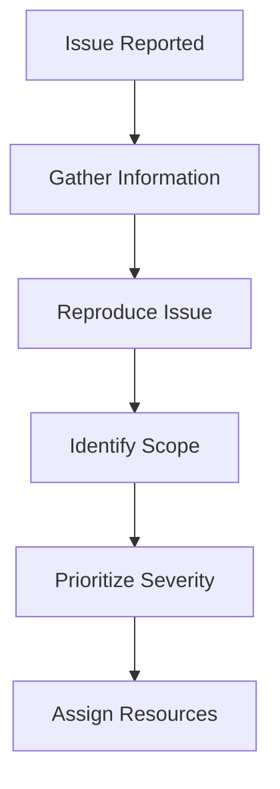

# Debugging Procedures and Techniques

## Summary

Comprehensive guide to debugging procedures and techniques for the Axisor platform. This document covers systematic debugging methodologies, tools, and best practices for identifying and resolving issues across the entire system stack.

## Debugging Methodology

### 1. Systematic Approach

**Step 1: Problem Identification**


**Step 2: Information Gathering**
- User reports and error messages
- System logs and metrics
- Environment details
- Recent changes or deployments
- Affected user base

**Step 3: Issue Reproduction**
- Recreate the problem in a controlled environment
- Document exact steps to reproduce
- Identify if issue is consistent or intermittent
- Test with different user accounts or data sets

### 2. Debugging Levels

**Level 1: Application Level**
- User interface issues
- Business logic problems
- Data validation errors
- API response issues

**Level 2: Service Level**
- Database connection problems
- External API failures
- Authentication issues
- Performance bottlenecks

**Level 3: Infrastructure Level**
- Container orchestration issues
- Network connectivity problems
- Resource constraints
- Security vulnerabilities

## Backend Debugging

### 1. Log Analysis

**Structured Logging Setup**
```typescript
import winston from 'winston';

const logger = winston.createLogger({
  level: process.env.LOG_LEVEL || 'info',
  format: winston.format.combine(
    winston.format.timestamp(),
    winston.format.errors({ stack: true }),
    winston.format.json()
  ),
  defaultMeta: { service: 'axisor-backend' },
  transports: [
    new winston.transports.Console({
      format: winston.format.combine(
        winston.format.colorize(),
        winston.format.simple()
      )
    }),
    new winston.transports.File({ 
      filename: 'logs/error.log', 
      level: 'error' 
    }),
    new winston.transports.File({ 
      filename: 'logs/combined.log' 
    })
  ]
});

// Usage in services
logger.info('User authentication successful', {
  userId: user.id,
  email: user.email,
  timestamp: new Date().toISOString()
});
```

**Log Analysis Commands**
```bash
# View real-time logs
docker logs -f axisor-backend

# Search for specific errors
docker logs axisor-backend 2>&1 | grep -i "error\|exception\|failed"

# Filter by time range
docker logs --since "2025-01-06T10:00:00" --until "2025-01-06T11:00:00" axisor-backend

# Count error occurrences
docker logs axisor-backend 2>&1 | grep -c "ERROR"

# Export logs to file
docker logs axisor-backend > backend_logs_$(date +%Y%m%d_%H%M%S).log
```

### 2. Database Debugging

**Connection Monitoring**
```typescript
// Prisma connection health check
async function checkDatabaseHealth() {
  try {
    const prisma = await getPrisma();
    
    // Test basic connectivity
    await prisma.$queryRaw`SELECT 1`;
    
    // Check connection pool status
    const poolStatus = await prisma.$queryRaw`
      SELECT 
        count(*) as total_connections,
        count(*) FILTER (WHERE state = 'active') as active_connections,
        count(*) FILTER (WHERE state = 'idle') as idle_connections
      FROM pg_stat_activity 
      WHERE datname = current_database()
    `;
    
    logger.info('Database health check', { poolStatus });
    
    return { status: 'healthy', poolStatus };
  } catch (error) {
    logger.error('Database health check failed', { error });
    return { status: 'unhealthy', error: error.message };
  }
}
```

**Query Performance Analysis**
```sql
-- Identify slow queries
SELECT 
  query,
  mean_time,
  calls,
  total_time,
  rows
FROM pg_stat_statements 
WHERE mean_time > 1000  -- Queries taking more than 1 second
ORDER BY mean_time DESC 
LIMIT 10;

-- Check index usage
SELECT 
  schemaname,
  tablename,
  indexname,
  idx_scan,
  idx_tup_read,
  idx_tup_fetch
FROM pg_stat_user_indexes 
WHERE idx_scan = 0  -- Unused indexes
ORDER BY tablename;

-- Monitor database locks
SELECT 
  pid,
  state,
  query,
  query_start,
  now() - query_start as duration
FROM pg_stat_activity 
WHERE state = 'active' 
  AND query NOT LIKE '%pg_stat_activity%';
```

### 3. API Debugging

**Request/Response Logging**
```typescript
// Fastify request logging middleware
fastify.addHook('onRequest', async (request, reply) => {
  request.startTime = Date.now();
  
  logger.info('Incoming request', {
    method: request.method,
    url: request.url,
    headers: request.headers,
    userAgent: request.headers['user-agent'],
    ip: request.ip
  });
});

fastify.addHook('onResponse', async (request, reply) => {
  const duration = Date.now() - request.startTime;
  
  logger.info('Request completed', {
    method: request.method,
    url: request.url,
    statusCode: reply.statusCode,
    duration: `${duration}ms`,
    user: request.user?.id
  });
  
  // Log slow requests
  if (duration > 5000) {
    logger.warn('Slow request detected', {
      method: request.method,
      url: request.url,
      duration: `${duration}ms`
    });
  }
});
```

**Error Handling and Debugging**
```typescript
// Enhanced error handler
fastify.setErrorHandler((error, request, reply) => {
  const errorId = uuidv4();
  
  logger.error('Request error', {
    errorId,
    error: error.message,
    stack: error.stack,
    method: request.method,
    url: request.url,
    headers: request.headers,
    body: request.body,
    user: request.user?.id
  });
  
  // Capture error in monitoring system
  if (monitoring) {
    monitoring.captureError(error, {
      request: {
        method: request.method,
        url: request.url,
        headers: request.headers,
        body: request.body,
      },
      user: request.user ? {
        id: request.user.id,
        email: request.user.email,
      } : undefined,
    });
  }
  
  // Return appropriate error response
  const statusCode = error.statusCode || 500;
  reply.status(statusCode).send({
    error: 'INTERNAL_SERVER_ERROR',
    message: config.isDevelopment ? error.message : 'Internal server error',
    errorId: config.isDevelopment ? errorId : undefined,
    ...(config.isDevelopment && { stack: error.stack }),
  });
});
```

### 4. External API Debugging

**LN Markets API Debugging**
```typescript
// Enhanced LN Markets client with debugging
export class LNMarketsClient {
  private debugMode: boolean;
  
  constructor(config: LNMarketsConfig) {
    this.debugMode = config.debug || false;
    // ... existing initialization
  }
  
  async request<T = any>(config: AxiosRequestConfig): Promise<T> {
    const requestId = uuidv4();
    const startTime = Date.now();
    
    if (this.debugMode) {
      logger.debug('LN Markets API Request', {
        requestId,
        method: config.method?.toUpperCase(),
        url: config.url,
        baseURL: config.baseURL,
        headers: config.headers
      });
    }
    
    try {
      const response = await this.client.request(config);
      const duration = Date.now() - startTime;
      
      if (this.debugMode) {
        logger.debug('LN Markets API Response', {
          requestId,
          status: response.status,
          duration: `${duration}ms`,
          data: response.data
        });
      }
      
      return response.data;
    } catch (error) {
      const duration = Date.now() - startTime;
      
      logger.error('LN Markets API Error', {
        requestId,
        error: error.message,
        status: error.response?.status,
        duration: `${duration}ms`,
        response: error.response?.data
      });
      
      throw this.normalizeError(error);
    }
  }
}
```

**LND API Debugging**
```typescript
// LND client debugging
export class LNDClient {
  private debugMode: boolean;
  
  constructor(config: LNDConfig, logger: any) {
    this.debugMode = config.debug || false;
    // ... existing initialization
  }
  
  private async executeRequest<T = any>(
    options: LNDRequestOptions,
    attempt: number = 1
  ): Promise<LNDResponse<T>> {
    const requestId = uuidv4();
    const startTime = Date.now();
    
    if (this.debugMode) {
      this.logger.debug('LND Request', {
        requestId,
        attempt,
        method: options.method,
        url: options.url,
        network: this.config.network
      });
    }
    
    try {
      const response = await this.httpClient.request(options);
      const duration = Date.now() - startTime;
      
      if (this.debugMode) {
        this.logger.debug('LND Response', {
          requestId,
          attempt,
          status: response.status,
          duration: `${duration}ms`,
          data: response.data
        });
      }
      
      return response;
    } catch (error) {
      const duration = Date.now() - startTime;
      
      this.logger.error('LND Error', {
        requestId,
        attempt,
        error: error.message,
        status: error.response?.status,
        duration: `${duration}ms`,
        response: error.response?.data
      });
      
      throw this.handleError(error);
    }
  }
}
```

## Frontend Debugging

### 1. React Component Debugging

**Component Error Boundaries**
```typescript
// Error boundary for catching React errors
class ErrorBoundary extends React.Component {
  constructor(props) {
    super(props);
    this.state = { hasError: false, error: null, errorInfo: null };
  }
  
  static getDerivedStateFromError(error) {
    return { hasError: true };
  }
  
  componentDidCatch(error, errorInfo) {
    this.setState({
      error: error,
      errorInfo: errorInfo
    });
    
    // Log error to monitoring service
    console.error('React Error Boundary caught an error:', error, errorInfo);
    
    // Send to error tracking service
    if (window.Sentry) {
      window.Sentry.captureException(error, {
        contexts: {
          react: {
            componentStack: errorInfo.componentStack
          }
        }
      });
    }
  }
  
  render() {
    if (this.state.hasError) {
      return (
        <div className="error-boundary">
          <h2>Something went wrong.</h2>
          <details style={{ whiteSpace: 'pre-wrap' }}>
            {this.state.error && this.state.error.toString()}
            <br />
            {this.state.errorInfo.componentStack}
          </details>
        </div>
      );
    }
    
    return this.props.children;
  }
}
```

**Debug Hooks**
```typescript
// Custom hook for debugging API calls
export const useApiDebugger = () => {
  const [debugInfo, setDebugInfo] = useState({});
  
  const debugApiCall = useCallback(async (
    apiCall: () => Promise<any>,
    callName: string
  ) => {
    const startTime = Date.now();
    
    try {
      const result = await apiCall();
      const duration = Date.now() - startTime;
      
      setDebugInfo(prev => ({
        ...prev,
        [callName]: {
          status: 'success',
          duration: `${duration}ms`,
          timestamp: new Date().toISOString()
        }
      }));
      
      return result;
    } catch (error) {
      const duration = Date.now() - startTime;
      
      setDebugInfo(prev => ({
        ...prev,
        [callName]: {
          status: 'error',
          duration: `${duration}ms`,
          error: error.message,
          timestamp: new Date().toISOString()
        }
      }));
      
      throw error;
    }
  }, []);
  
  return { debugApiCall, debugInfo };
};

// Usage in components
const { debugApiCall, debugInfo } = useApiDebugger();

const fetchUserData = async () => {
  return debugApiCall(
    () => api.get('/users/me'),
    'fetchUserData'
  );
};
```

### 2. Chart Debugging

**Chart Performance Monitoring**
```typescript
// Chart performance debugging
export const useChartDebugger = () => {
  const [performanceMetrics, setPerformanceMetrics] = useState({});
  
  const measureChartPerformance = useCallback((
    chartInstance: any,
    operation: string
  ) => {
    const startTime = performance.now();
    
    return () => {
      const endTime = performance.now();
      const duration = endTime - startTime;
      
      setPerformanceMetrics(prev => ({
        ...prev,
        [operation]: {
          duration: `${duration.toFixed(2)}ms`,
          timestamp: new Date().toISOString(),
          memoryUsage: performance.memory ? {
            used: `${(performance.memory.usedJSHeapSize / 1024 / 1024).toFixed(2)}MB`,
            total: `${(performance.memory.totalJSHeapSize / 1024 / 1024).toFixed(2)}MB`
          } : null
        }
      }));
    };
  }, []);
  
  return { measureChartPerformance, performanceMetrics };
};

// Usage in chart components
const { measureChartPerformance, performanceMetrics } = useChartDebugger();

useEffect(() => {
  const endMeasurement = measureChartPerformance(chart, 'chartInitialization');
  
  // Chart initialization code
  const chart = createChart(container, chartOptions);
  
  endMeasurement();
}, []);
```

### 3. State Management Debugging

**Zustand Store Debugging**
```typescript
// Enhanced store with debugging
export const useAuthStore = create<AuthState>((set, get) => ({
  user: null,
  isLoading: false,
  error: null,
  
  login: async (credentials) => {
    set({ isLoading: true, error: null });
    
    try {
      console.log('Auth Store: Starting login process', { credentials });
      
      const response = await authApi.login(credentials);
      
      console.log('Auth Store: Login successful', { 
        userId: response.user.id,
        email: response.user.email 
      });
      
      set({ 
        user: response.user, 
        isLoading: false,
        error: null 
      });
    } catch (error) {
      console.error('Auth Store: Login failed', { 
        error: error.message,
        credentials: { email: credentials.email } // Don't log password
      });
      
      set({ 
        user: null, 
        isLoading: false, 
        error: error.message 
      });
    }
  },
  
  logout: () => {
    console.log('Auth Store: Logging out user');
    set({ user: null, isLoading: false, error: null });
  }
}));

// Store subscription for debugging
useAuthStore.subscribe((state, prevState) => {
  console.log('Auth Store: State changed', {
    prevState: {
      user: prevState.user?.id,
      isLoading: prevState.isLoading,
      error: prevState.error
    },
    newState: {
      user: state.user?.id,
      isLoading: state.isLoading,
      error: state.error
    }
  });
});
```

## Performance Debugging

### 1. Backend Performance

**Performance Monitoring Middleware**
```typescript
// Performance monitoring middleware
export const performanceMiddleware = (fastify: FastifyInstance) => {
  fastify.addHook('onRequest', async (request) => {
    request.startTime = process.hrtime.bigint();
    request.startMemory = process.memoryUsage();
  });
  
  fastify.addHook('onResponse', async (request, reply) => {
    const endTime = process.hrtime.bigint();
    const endMemory = process.memoryUsage();
    
    const duration = Number(endTime - request.startTime) / 1000000; // Convert to milliseconds
    const memoryDelta = endMemory.heapUsed - request.startMemory.heapUsed;
    
    // Log performance metrics
    logger.info('Request performance', {
      method: request.method,
      url: request.url,
      statusCode: reply.statusCode,
      duration: `${duration.toFixed(2)}ms`,
      memoryDelta: `${(memoryDelta / 1024 / 1024).toFixed(2)}MB`,
      user: request.user?.id
    });
    
    // Alert on slow requests
    if (duration > 5000) {
      logger.warn('Slow request detected', {
        method: request.method,
        url: request.url,
        duration: `${duration.toFixed(2)}ms`
      });
    }
    
    // Alert on memory leaks
    if (memoryDelta > 50 * 1024 * 1024) { // 50MB
      logger.warn('Potential memory leak detected', {
        method: request.method,
        url: request.url,
        memoryDelta: `${(memoryDelta / 1024 / 1024).toFixed(2)}MB`
      });
    }
  });
};
```

**Database Query Performance**
```typescript
// Query performance monitoring
export class QueryPerformanceMonitor {
  private queryMetrics: Map<string, QueryMetric> = new Map();
  
  startQuery(queryId: string, sql: string, params: any[]) {
    this.queryMetrics.set(queryId, {
      sql,
      params,
      startTime: Date.now(),
      startMemory: process.memoryUsage().heapUsed
    });
  }
  
  endQuery(queryId: string, result?: any) {
    const metric = this.queryMetrics.get(queryId);
    if (!metric) return;
    
    const endTime = Date.now();
    const endMemory = process.memoryUsage().heapUsed;
    
    metric.duration = endTime - metric.startTime;
    metric.memoryDelta = endMemory - metric.startMemory;
    metric.resultSize = result ? JSON.stringify(result).length : 0;
    
    // Log slow queries
    if (metric.duration > 1000) {
      logger.warn('Slow query detected', {
        sql: metric.sql,
        duration: `${metric.duration}ms`,
        memoryDelta: `${(metric.memoryDelta / 1024 / 1024).toFixed(2)}MB`,
        resultSize: `${(metric.resultSize / 1024).toFixed(2)}KB`
      });
    }
    
    this.queryMetrics.delete(queryId);
  }
}

// Usage with Prisma
const queryMonitor = new QueryPerformanceMonitor();

// Wrap Prisma calls
const originalQuery = prisma.$queryRaw;
prisma.$queryRaw = function(sql, ...params) {
  const queryId = uuidv4();
  queryMonitor.startQuery(queryId, sql.toString(), params);
  
  return originalQuery.call(this, sql, ...params)
    .then(result => {
      queryMonitor.endQuery(queryId, result);
      return result;
    })
    .catch(error => {
      queryMonitor.endQuery(queryId);
      throw error;
    });
};
```

### 2. Frontend Performance

**React Performance Monitoring**
```typescript
// Performance monitoring hook
export const usePerformanceMonitor = () => {
  const [metrics, setMetrics] = useState({});
  
  const measurePerformance = useCallback((name: string, fn: () => void) => {
    const startTime = performance.now();
    const startMemory = performance.memory?.usedJSHeapSize || 0;
    
    fn();
    
    const endTime = performance.now();
    const endMemory = performance.memory?.usedJSHeapSize || 0;
    
    const metric = {
      duration: `${(endTime - startTime).toFixed(2)}ms`,
      memoryDelta: `${((endMemory - startMemory) / 1024 / 1024).toFixed(2)}MB`,
      timestamp: new Date().toISOString()
    };
    
    setMetrics(prev => ({ ...prev, [name]: metric }));
    
    // Log slow operations
    if (endTime - startTime > 100) {
      console.warn(`Slow operation detected: ${name}`, metric);
    }
  }, []);
  
  return { measurePerformance, metrics };
};

// Usage in components
const { measurePerformance, metrics } = usePerformanceMonitor();

const handleDataProcessing = () => {
  measurePerformance('dataProcessing', () => {
    // Data processing logic
    const processedData = rawData.map(item => ({
      ...item,
      processed: true
    }));
    setData(processedData);
  });
};
```

**Bundle Analysis**
```bash
# Analyze bundle size
npm run build
npx webpack-bundle-analyzer dist/assets/*.js

# Check for large dependencies
npx bundlephobia [package-name]

# Monitor bundle size over time
npx bundlesize
```

## Debugging Tools and Commands

### 1. Docker Debugging

**Container Debugging Commands**
```bash
# Check container status
docker ps -a

# View container logs
docker logs -f axisor-backend

# Execute commands in running container
docker exec -it axisor-backend /bin/bash

# Check container resources
docker stats axisor-backend

# Inspect container configuration
docker inspect axisor-backend

# Check container network
docker network ls
docker network inspect axisor-network
```

**Docker Compose Debugging**
```bash
# Check service status
docker compose -f docker-compose.prod.yml ps

# View service logs
docker compose -f docker-compose.prod.yml logs backend

# Restart specific service
docker compose -f docker-compose.prod.yml restart backend

# Scale services
docker compose -f docker-compose.prod.yml up --scale backend=3

# Check service health
docker compose -f docker-compose.prod.yml exec backend curl http://localhost:3000/health
```

### 2. Database Debugging

**PostgreSQL Debugging**
```bash
# Connect to database
docker exec -it axisor-postgres psql -U axisor -d axisor

# Check active connections
SELECT * FROM pg_stat_activity;

# Check database size
SELECT pg_size_pretty(pg_database_size('axisor'));

# Check table sizes
SELECT 
  schemaname,
  tablename,
  pg_size_pretty(pg_total_relation_size(schemaname||'.'||tablename)) as size
FROM pg_tables 
WHERE schemaname = 'public'
ORDER BY pg_total_relation_size(schemaname||'.'||tablename) DESC;

# Check slow queries
SELECT query, mean_time, calls 
FROM pg_stat_statements 
ORDER BY mean_time DESC 
LIMIT 10;
```

**Redis Debugging**
```bash
# Connect to Redis
docker exec -it axisor-redis redis-cli

# Check Redis info
INFO

# Check memory usage
INFO memory

# Check connected clients
CLIENT LIST

# Monitor commands
MONITOR

# Check keys
KEYS *

# Check specific key
GET key_name
```

### 3. Network Debugging

**Network Connectivity Tests**
```bash
# Test internal network connectivity
docker exec axisor-backend ping axisor-postgres
docker exec axisor-backend ping axisor-redis

# Check port connectivity
docker exec axisor-backend nc -zv axisor-postgres 5432
docker exec axisor-backend nc -zv axisor-redis 6379

# Test external API connectivity
docker exec axisor-backend curl -I https://api.lnmarkets.com/v2/health

# Check DNS resolution
docker exec axisor-backend nslookup api.lnmarkets.com
```

**Load Testing**
```bash
# Basic load test with curl
for i in {1..100}; do
  curl -w "@curl-format.txt" -o /dev/null -s "http://localhost:3000/api/health"
done

# Load test with Apache Bench
ab -n 1000 -c 10 http://localhost:3000/api/health

# Load test with wrk
wrk -t12 -c400 -d30s http://localhost:3000/api/health
```

## Checklist

### Pre-Debugging Preparation
- [ ] Gather error details and logs
- [ ] Identify affected components
- [ ] Check recent changes
- [ ] Verify environment status
- [ ] Prepare debugging tools
- [ ] Set up monitoring
- [ ] Document reproduction steps

### During Debugging
- [ ] Follow systematic approach
- [ ] Use appropriate debugging tools
- [ ] Monitor system resources
- [ ] Check external dependencies
- [ ] Test with minimal configuration
- [ ] Document findings
- [ ] Implement temporary fixes if needed

### Post-Debugging
- [ ] Implement permanent solution
- [ ] Update monitoring and alerts
- [ ] Document resolution steps
- [ ] Share knowledge with team
- [ ] Update runbooks
- [ ] Prevent similar issues
- [ ] Review and improve processes
