# User Profiles - User Management

> **Status**: Active  
> **Última Atualização**: 2025-01-26  
> **Versão**: 1.0.0  
> **Responsável**: Axisor User Management Team  

## Índice

- [Visão Geral](#visão-geral)
- [Profile Structure](#profile-structure)
- [User Data Model](#user-data-model)
- [Profile Management](#profile-management)
- [Preferences System](#preferences-system)
- [Profile Validation](#profile-validation)
- [API Endpoints](#api-endpoints)
- [Security Considerations](#security-considerations)
- [Troubleshooting](#troubleshooting)
- [Referências](#referências)

## Visão Geral

O sistema de perfis de usuário do Axisor gerencia informações pessoais, preferências e configurações individuais. O sistema é projetado para ser flexível, seguro e escalável, permitindo personalização completa da experiência do usuário.

## Profile Structure

### User Profile Components

```mermaid
graph TD
    A[User Profile] --> B[Personal Info]
    A --> C[Account Settings]
    A --> D[Trading Preferences]
    A --> E[Notification Settings]
    A --> F[Security Settings]
    
    B --> B1[Name]
    B --> B2[Email]
    B --> B3[Avatar]
    B --> B4[Timezone]
    
    C --> C1[Plan Type]
    C --> C2[Account Status]
    C --> C3[Registration Date]
    C --> C4[Last Login]
    
    D --> D1[Default Position Size]
    D --> D2[Risk Management]
    D --> D3[Chart Preferences]
    D --> D4[Automation Settings]
    
    E --> E1[Email Notifications]
    E --> E2[Push Notifications]
    E --> E3[Telegram Integration]
    E --> E4[WhatsApp Integration]
    
    F --> F1[2FA Settings]
    F --> F2[Session Management]
    F --> F3[API Keys]
    F --> F4[Login History]
```



## User Data Model

### Database Schema

```typescript
// Prisma Schema - User Model
model User {
  id                    String    @id @default(cuid())
  email                 String    @unique
  password_hash         String?
  first_name            String?
  last_name             String?
  avatar_url            String?
  phone                 String?
  timezone              String    @default("UTC")
  language              String    @default("pt-BR")
  currency              String    @default("BRL")
  
  // Account Status
  is_active             Boolean   @default(true)
  is_verified           Boolean   @default(false)
  is_admin              Boolean   @default(false)
  plan_type             PlanType  @default(FREE)
  
  // Timestamps
  created_at            DateTime  @default(now())
  updated_at            DateTime  @updatedAt
  last_login_at         DateTime?
  email_verified_at     DateTime?
  
  // Security
  two_factor_enabled    Boolean   @default(false)
  two_factor_secret     String?
  failed_login_attempts Int       @default(0)
  locked_until          DateTime?
  
  // Preferences
  preferences           UserPreferences?
  
  // Relations
  automations           Automation[]
  trade_logs            TradeLog[]
  notifications         Notification[]
  payments              Payment[]
  refresh_tokens        RefreshToken[]
  audit_logs            AuditLog[]
  exchange_accounts     UserExchangeAccount[]
  
  @@map("users")
}

model UserPreferences {
  id                    String    @id @default(cuid())
  user_id               String    @unique
  user                  User      @relation(fields: [user_id], references: [id], onDelete: Cascade)
  
  // Trading Preferences
  default_position_size Float?
  max_position_size     Float?
  risk_percentage       Float     @default(2.0)
  stop_loss_percentage  Float     @default(5.0)
  take_profit_percentage Float    @default(10.0)
  
  // Chart Preferences
  chart_theme           String    @default("dark")
  chart_type            String    @default("candlestick")
  default_timeframe     String    @default("1h")
  show_volume           Boolean   @default(true)
  show_indicators       Boolean   @default(true)
  
  // Notification Preferences
  email_trades          Boolean   @default(true)
  email_margin_calls    Boolean   @default(true)
  email_automations     Boolean   @default(false)
  push_trades           Boolean   @default(true)
  push_margin_calls     Boolean   @default(true)
  telegram_enabled      Boolean   @default(false)
  telegram_chat_id      String?
  whatsapp_enabled      Boolean   @default(false)
  whatsapp_phone        String?
  
  // UI Preferences
  dashboard_layout      String    @default("default")
  sidebar_collapsed     Boolean   @default(false)
  show_tutorials        Boolean   @default(true)
  auto_refresh          Boolean   @default(true)
  refresh_interval      Int       @default(30) // seconds
  
  // Privacy
  profile_public        Boolean   @default(false)
  show_trading_stats    Boolean   @default(false)
  allow_dm              Boolean   @default(true)
  
  created_at            DateTime  @default(now())
  updated_at            DateTime  @updatedAt
  
  @@map("user_preferences")
}
```

## Profile Management

### Profile Service

```typescript
class UserProfileService {
  async getProfile(userId: string): Promise<UserProfile> {
    const user = await this.prisma.user.findUnique({
      where: { id: userId },
      include: {
        preferences: true,
        exchange_accounts: {
          select: {
            id: true,
            exchange_name: true,
            is_active: true,
            created_at: true
          }
        }
      }
    });

    if (!user) {
      throw new NotFoundError('User not found');
    }

    return this.formatUserProfile(user);
  }

  async updateProfile(userId: string, profileData: UpdateProfileRequest): Promise<UserProfile> {
    // Validar dados de entrada
    await this.validateProfileData(profileData);

    // Atualizar informações básicas
    const updatedUser = await this.prisma.user.update({
      where: { id: userId },
      data: {
        first_name: profileData.first_name,
        last_name: profileData.last_name,
        phone: profileData.phone,
        timezone: profileData.timezone,
        language: profileData.language,
        currency: profileData.currency,
        updated_at: new Date()
      },
      include: { preferences: true }
    });

    // Atualizar preferências se fornecidas
    if (profileData.preferences) {
      await this.updatePreferences(userId, profileData.preferences);
    }

    // Log da atualização
    await this.auditService.logProfileUpdate(userId, profileData);

    return this.formatUserProfile(updatedUser);
  }

  async updateAvatar(userId: string, avatarFile: Buffer, mimeType: string): Promise<string> {
    // Validar arquivo
    if (!this.isValidImageType(mimeType)) {
      throw new ValidationError('Invalid image type. Only JPEG, PNG and WebP are allowed.');
    }

    if (avatarFile.length > 5 * 1024 * 1024) { // 5MB limit
      throw new ValidationError('Image size must be less than 5MB');
    }

    // Processar e otimizar imagem
    const optimizedImage = await this.imageService.optimizeAvatar(avatarFile, mimeType);
    
    // Upload para storage
    const avatarUrl = await this.storageService.uploadAvatar(userId, optimizedImage);
    
    // Atualizar no banco
    await this.prisma.user.update({
      where: { id: userId },
      data: { avatar_url: avatarUrl }
    });

    // Log da atualização
    await this.auditService.logAvatarUpdate(userId);

    return avatarUrl;
  }

  private formatUserProfile(user: any): UserProfile {
    return {
      id: user.id,
      email: user.email,
      first_name: user.first_name,
      last_name: user.last_name,
      avatar_url: user.avatar_url,
      phone: user.phone,
      timezone: user.timezone,
      language: user.language,
      currency: user.currency,
      is_verified: user.is_verified,
      plan_type: user.plan_type,
      created_at: user.created_at,
      last_login_at: user.last_login_at,
      preferences: user.preferences,
      exchange_accounts: user.exchange_accounts || []
    };
  }
}
```

## Preferences System

### Preferences Service

```typescript
class UserPreferencesService {
  async getPreferences(userId: string): Promise<UserPreferences> {
    const preferences = await this.prisma.userPreferences.findUnique({
      where: { user_id: userId }
    });

    if (!preferences) {
      // Criar preferências padrão se não existirem
      return await this.createDefaultPreferences(userId);
    }

    return preferences;
  }

  async updatePreferences(userId: string, preferencesData: Partial<UserPreferences>): Promise<UserPreferences> {
    // Validar dados
    await this.validatePreferencesData(preferencesData);

    // Atualizar preferências
    const updatedPreferences = await this.prisma.userPreferences.upsert({
      where: { user_id: userId },
      update: {
        ...preferencesData,
        updated_at: new Date()
      },
      create: {
        user_id: userId,
        ...preferencesData,
        ...this.getDefaultPreferences()
      }
    });

    // Notificar mudanças relevantes
    await this.notifyPreferenceChanges(userId, preferencesData);

    return updatedPreferences;
  }

  async resetPreferences(userId: string): Promise<UserPreferences> {
    const defaultPreferences = this.getDefaultPreferences();
    
    const resetPreferences = await this.prisma.userPreferences.update({
      where: { user_id: userId },
      data: {
        ...defaultPreferences,
        updated_at: new Date()
      }
    });

    await this.auditService.logPreferencesReset(userId);

    return resetPreferences;
  }

  private async createDefaultPreferences(userId: string): Promise<UserPreferences> {
    const defaultPreferences = this.getDefaultPreferences();
    
    return await this.prisma.userPreferences.create({
      data: {
        user_id: userId,
        ...defaultPreferences
      }
    });
  }

  private getDefaultPreferences(): Partial<UserPreferences> {
    return {
      risk_percentage: 2.0,
      stop_loss_percentage: 5.0,
      take_profit_percentage: 10.0,
      chart_theme: 'dark',
      chart_type: 'candlestick',
      default_timeframe: '1h',
      show_volume: true,
      show_indicators: true,
      email_trades: true,
      email_margin_calls: true,
      email_automations: false,
      push_trades: true,
      push_margin_calls: true,
      telegram_enabled: false,
      whatsapp_enabled: false,
      dashboard_layout: 'default',
      sidebar_collapsed: false,
      show_tutorials: true,
      auto_refresh: true,
      refresh_interval: 30,
      profile_public: false,
      show_trading_stats: false,
      allow_dm: true
    };
  }

  private async notifyPreferenceChanges(userId: string, changes: Partial<UserPreferences>): Promise<void> {
    // Se notificações foram alteradas, reconfigurar sistema de notificações
    if (changes.email_trades !== undefined || changes.push_trades !== undefined) {
      await this.notificationService.reconfigureUserNotifications(userId);
    }

    // Se configurações de telegram/whatsapp foram alteradas
    if (changes.telegram_enabled !== undefined || changes.whatsapp_enabled !== undefined) {
      await this.integrationService.updateMessagingIntegrations(userId);
    }

    // Se preferências de risco foram alteradas
    if (changes.risk_percentage !== undefined || changes.stop_loss_percentage !== undefined) {
      await this.riskService.updateUserRiskSettings(userId);
    }
  }
}
```

## Profile Validation

### Validation Service

```typescript
class ProfileValidationService {
  async validateProfileData(data: UpdateProfileRequest): Promise<void> {
    const errors: ValidationError[] = [];

    // Validar nome
    if (data.first_name && !this.isValidName(data.first_name)) {
      errors.push(new ValidationError('First name must be between 2 and 50 characters'));
    }

    if (data.last_name && !this.isValidName(data.last_name)) {
      errors.push(new ValidationError('Last name must be between 2 and 50 characters'));
    }

    // Validar telefone
    if (data.phone && !this.isValidPhone(data.phone)) {
      errors.push(new ValidationError('Invalid phone number format'));
    }

    // Validar timezone
    if (data.timezone && !this.isValidTimezone(data.timezone)) {
      errors.push(new ValidationError('Invalid timezone'));
    }

    // Validar idioma
    if (data.language && !this.isValidLanguage(data.language)) {
      errors.push(new ValidationError('Invalid language code'));
    }

    // Validar moeda
    if (data.currency && !this.isValidCurrency(data.currency)) {
      errors.push(new ValidationError('Invalid currency code'));
    }

    if (errors.length > 0) {
      throw new ValidationError('Profile validation failed', errors);
    }
  }

  async validatePreferencesData(data: Partial<UserPreferences>): Promise<void> {
    const errors: ValidationError[] = [];

    // Validar percentuais de risco
    if (data.risk_percentage !== undefined) {
      if (data.risk_percentage < 0.1 || data.risk_percentage > 20) {
        errors.push(new ValidationError('Risk percentage must be between 0.1% and 20%'));
      }
    }

    if (data.stop_loss_percentage !== undefined) {
      if (data.stop_loss_percentage < 0.5 || data.stop_loss_percentage > 50) {
        errors.push(new ValidationError('Stop loss percentage must be between 0.5% and 50%'));
      }
    }

    if (data.take_profit_percentage !== undefined) {
      if (data.take_profit_percentage < 1 || data.take_profit_percentage > 100) {
        errors.push(new ValidationError('Take profit percentage must be between 1% and 100%'));
      }
    }

    // Validar tema do gráfico
    if (data.chart_theme && !['dark', 'light'].includes(data.chart_theme)) {
      errors.push(new ValidationError('Chart theme must be either "dark" or "light"'));
    }

    // Validar tipo de gráfico
    if (data.chart_type && !['candlestick', 'line', 'area', 'bar'].includes(data.chart_type)) {
      errors.push(new ValidationError('Invalid chart type'));
    }

    // Validar timeframe
    if (data.default_timeframe && !this.isValidTimeframe(data.default_timeframe)) {
      errors.push(new ValidationError('Invalid timeframe'));
    }

    // Validar intervalo de refresh
    if (data.refresh_interval !== undefined) {
      if (data.refresh_interval < 5 || data.refresh_interval > 300) {
        errors.push(new ValidationError('Refresh interval must be between 5 and 300 seconds'));
      }
    }

    if (errors.length > 0) {
      throw new ValidationError('Preferences validation failed', errors);
    }
  }

  private isValidName(name: string): boolean {
    return name.length >= 2 && name.length <= 50 && /^[a-zA-ZÀ-ÿ\s]+$/.test(name);
  }

  private isValidPhone(phone: string): boolean {
    // Regex para telefone brasileiro
    return /^(\+55\s?)?(\(?\d{2}\)?\s?)?\d{4,5}-?\d{4}$/.test(phone);
  }

  private isValidTimezone(timezone: string): boolean {
    try {
      Intl.DateTimeFormat(undefined, { timeZone: timezone });
      return true;
    } catch {
      return false;
    }
  }

  private isValidLanguage(language: string): boolean {
    return ['pt-BR', 'en-US'].includes(language);
  }

  private isValidCurrency(currency: string): boolean {
    return ['BRL', 'USD', 'EUR'].includes(currency);
  }

  private isValidTimeframe(timeframe: string): boolean {
    const validTimeframes = ['1m', '5m', '15m', '30m', '1h', '4h', '1d', '1w'];
    return validTimeframes.includes(timeframe);
  }

  private isValidImageType(mimeType: string): boolean {
    return ['image/jpeg', 'image/png', 'image/webp'].includes(mimeType);
  }
}
```

## API Endpoints

### Profile Endpoints

```typescript
// GET /api/user/profile
export const getUserProfile = async (request: FastifyRequest, reply: FastifyReply) => {
  const userId = request.user.userId;
  
  try {
    const profile = await userProfileService.getProfile(userId);
    
    return reply.send({
      success: true,
      data: profile
    });
  } catch (error) {
    return reply.status(500).send({
      error: 'PROFILE_FETCH_FAILED',
      message: 'Failed to fetch user profile'
    });
  }
};

// PUT /api/user/profile
export const updateUserProfile = async (request: FastifyRequest, reply: FastifyReply) => {
  const userId = request.user.userId;
  const profileData = request.body as UpdateProfileRequest;
  
  try {
    const updatedProfile = await userProfileService.updateProfile(userId, profileData);
    
    return reply.send({
      success: true,
      data: updatedProfile,
      message: 'Profile updated successfully'
    });
  } catch (error) {
    if (error instanceof ValidationError) {
      return reply.status(400).send({
        error: 'VALIDATION_ERROR',
        message: error.message,
        details: error.details
      });
    }
    
    return reply.status(500).send({
      error: 'PROFILE_UPDATE_FAILED',
      message: 'Failed to update profile'
    });
  }
};

// POST /api/user/profile/avatar
export const updateUserAvatar = async (request: FastifyRequest, reply: FastifyReply) => {
  const userId = request.user.userId;
  
  try {
    const data = await request.file();
    
    if (!data) {
      return reply.status(400).send({
        error: 'NO_FILE',
        message: 'No file provided'
      });
    }

    const buffer = await data.toBuffer();
    const avatarUrl = await userProfileService.updateAvatar(userId, buffer, data.mimetype);
    
    return reply.send({
      success: true,
      data: { avatar_url: avatarUrl },
      message: 'Avatar updated successfully'
    });
  } catch (error) {
    if (error instanceof ValidationError) {
      return reply.status(400).send({
        error: 'VALIDATION_ERROR',
        message: error.message
      });
    }
    
    return reply.status(500).send({
      error: 'AVATAR_UPDATE_FAILED',
      message: 'Failed to update avatar'
    });
  }
};

// GET /api/user/preferences
export const getUserPreferences = async (request: FastifyRequest, reply: FastifyReply) => {
  const userId = request.user.userId;
  
  try {
    const preferences = await userPreferencesService.getPreferences(userId);
    
    return reply.send({
      success: true,
      data: preferences
    });
  } catch (error) {
    return reply.status(500).send({
      error: 'PREFERENCES_FETCH_FAILED',
      message: 'Failed to fetch user preferences'
    });
  }
};

// PUT /api/user/preferences
export const updateUserPreferences = async (request: FastifyRequest, reply: FastifyReply) => {
  const userId = request.user.userId;
  const preferencesData = request.body as Partial<UserPreferences>;
  
  try {
    const updatedPreferences = await userPreferencesService.updatePreferences(userId, preferencesData);
    
    return reply.send({
      success: true,
      data: updatedPreferences,
      message: 'Preferences updated successfully'
    });
  } catch (error) {
    if (error instanceof ValidationError) {
      return reply.status(400).send({
        error: 'VALIDATION_ERROR',
        message: error.message,
        details: error.details
      });
    }
    
    return reply.status(500).send({
      error: 'PREFERENCES_UPDATE_FAILED',
      message: 'Failed to update preferences'
    });
  }
};
```

## Security Considerations

### Data Protection

```typescript
class ProfileSecurityService {
  // Sanitizar dados sensíveis antes de retornar
  sanitizeProfileData(profile: UserProfile): UserProfile {
    return {
      ...profile,
      // Não retornar dados sensíveis em respostas públicas
      email: this.maskEmail(profile.email),
      phone: profile.phone ? this.maskPhone(profile.phone) : null,
      // Remover campos internos
      two_factor_secret: undefined,
      password_hash: undefined,
      failed_login_attempts: undefined,
      locked_until: undefined
    };
  }

  // Verificar permissões para visualizar perfil
  async canViewProfile(viewerId: string, targetUserId: string): Promise<boolean> {
    // Usuário pode sempre ver seu próprio perfil
    if (viewerId === targetUserId) {
      return true;
    }

    // Verificar se o perfil é público
    const targetUser = await this.prisma.user.findUnique({
      where: { id: targetUserId },
      include: { preferences: true }
    });

    if (!targetUser) {
      return false;
    }

    return targetUser.preferences?.profile_public || false;
  }

  private maskEmail(email: string): string {
    const [local, domain] = email.split('@');
    const maskedLocal = local.length > 2 
      ? local.substring(0, 2) + '*'.repeat(local.length - 2)
      : '*'.repeat(local.length);
    return `${maskedLocal}@${domain}`;
  }

  private maskPhone(phone: string): string {
    const cleaned = phone.replace(/\D/g, '');
    if (cleaned.length >= 10) {
      return cleaned.substring(0, 2) + '*'.repeat(cleaned.length - 4) + cleaned.substring(cleaned.length - 2);
    }
    return '*'.repeat(cleaned.length);
  }
}
```

## Troubleshooting

### Common Issues

#### Profile Not Found

```typescript
// Debug profile not found
async function debugProfileNotFound(userId: string): Promise<void> {
  try {
    const user = await prisma.user.findUnique({
      where: { id: userId },
      select: {
        id: true,
        email: true,
        is_active: true,
        created_at: true
      }
    });

    if (!user) {
      console.log('User does not exist in database');
      return;
    }

    if (!user.is_active) {
      console.log('User is inactive');
      return;
    }

    console.log('User exists and is active:', user);
  } catch (error) {
    console.error('Database error:', error);
  }
}
```

#### Preferences Not Saving

```typescript
// Debug preferences saving
async function debugPreferencesSaving(userId: string, preferencesData: any): Promise<void> {
  try {
    // Verificar se usuário existe
    const user = await prisma.user.findUnique({
      where: { id: userId },
      select: { id: true, is_active: true }
    });

    if (!user) {
      console.log('User not found');
      return;
    }

    // Verificar dados de entrada
    console.log('Input data:', JSON.stringify(preferencesData, null, 2));

    // Tentar validação
    await profileValidationService.validatePreferencesData(preferencesData);
    console.log('Validation passed');

    // Verificar se preferências existem
    const existingPreferences = await prisma.userPreferences.findUnique({
      where: { user_id: userId }
    });

    console.log('Existing preferences:', existingPreferences ? 'Found' : 'Not found');

  } catch (error) {
    console.error('Preferences debug error:', error);
  }
}
```

## Referências

- [User Management Overview](./user-management-overview.md)
- [Authentication Service](../../architecture/microservices/authentication-service.md)
- [Security Overview](../../security/security-overview.md)
- [Notification System](../notifications/notification-preferences.md)

## Como Usar Este Documento

• **Para Desenvolvedores**: Use como referência para implementar funcionalidades de perfil de usuário e gerenciamento de preferências.

• **Para Product Managers**: Utilize para entender as capacidades do sistema de perfis e planejar novas funcionalidades.

• **Para QA**: Use para validar comportamentos esperados e identificar cenários de teste para perfis de usuário.
