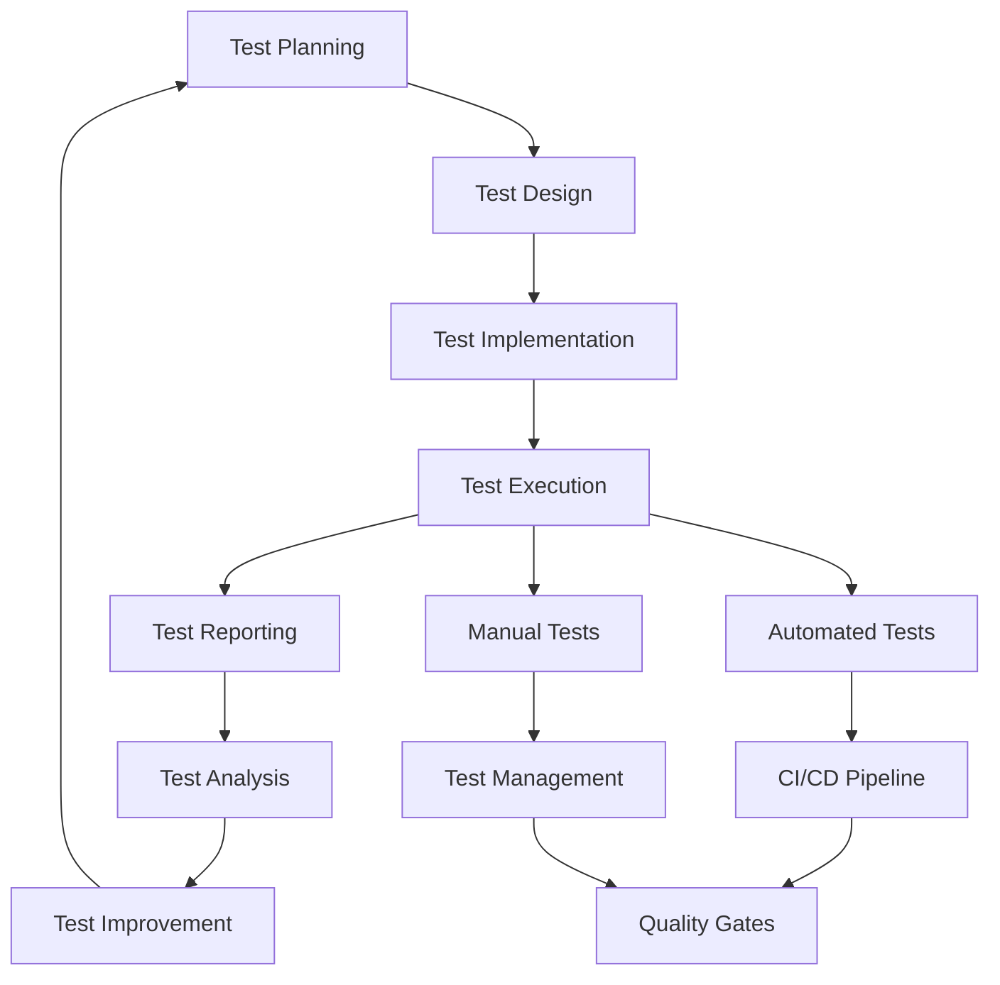

# Quality Assurance

## Overview

This document outlines the Quality Assurance (QA) processes and practices for the Axisor project. It covers quality standards, testing procedures, code quality metrics, and continuous improvement processes to ensure high-quality software delivery.

## Quality Standards

### Quality Principles

#### Core Quality Principles
```typescript
// Quality Principles
interface QualityPrinciples {
  reliability: {
    stability: "Ensure system stability and reliability";
    consistency: "Maintain consistent behavior across environments";
    predictability: "Predictable system behavior";
    fault_tolerance: "System resilience to failures";
  };
  maintainability: {
    readability: "Code should be readable and understandable";
    modularity: "Code should be modular and well-organized";
    documentation: "Comprehensive documentation";
    testability: "Code should be easily testable";
  };
  performance: {
    efficiency: "Efficient resource utilization";
    scalability: "System scalability and growth";
    responsiveness: "Responsive user experience";
    throughput: "High system throughput";
  };
  security: {
    confidentiality: "Protect sensitive data";
    integrity: "Ensure data integrity";
    availability: "Maintain system availability";
    compliance: "Meet regulatory requirements";
  };
}
```

#### Quality Metrics
```typescript
// Quality Metrics
interface QualityMetrics {
  code_quality: {
    complexity: "Cyclomatic complexity < 10";
    duplication: "Code duplication < 5%";
    maintainability: "Maintainability index > 70";
    technical_debt: "Technical debt ratio < 5%";
  };
  test_quality: {
    coverage: "Test coverage > 80%";
    reliability: "Test reliability > 95%";
    maintainability: "Test maintainability";
    performance: "Test execution time < 15 minutes";
  };
  security: {
    vulnerabilities: "Zero high/critical vulnerabilities";
    dependencies: "All dependencies up to date";
    compliance: "Security compliance 100%";
    scanning: "Regular security scanning";
  };
  performance: {
    response_time: "API response time < 200ms";
    throughput: "System throughput > 1000 req/s";
    resource_usage: "Resource usage < 80%";
    scalability: "Horizontal scalability";
  };
}
```

### Quality Gates

#### Quality Gate Configuration
```typescript
// Quality Gate Configuration
interface QualityGate {
  code_quality: {
    sonarqube: {
      quality_gate: "Pass";
      coverage: "> 80%";
      duplication: "< 3%";
      maintainability: "> 70";
    };
    eslint: {
      errors: 0;
      warnings: "< 10";
      style: "Consistent";
    };
  };
  test_quality: {
    unit_tests: {
      coverage: "> 90%";
      reliability: "> 95%";
      performance: "< 5 minutes";
    };
    integration_tests: {
      coverage: "> 80%";
      reliability: "> 90%";
      performance: "< 10 minutes";
    };
    e2e_tests: {
      coverage: "> 70%";
      reliability: "> 85%";
      performance: "< 15 minutes";
    };
  };
  security: {
    vulnerabilities: {
      high: 0;
      medium: "< 5";
      low: "< 20;
    };
    dependencies: {
      outdated: "< 10%";
      vulnerable: 0;
    };
  };
}
```

## Testing Procedures

### Test Planning

#### Test Strategy
```typescript
// Test Strategy
interface TestStrategy {
  unit_testing: {
    scope: "Individual functions and components";
    coverage: "90% of code lines";
    execution: "Fast execution (< 5 minutes)";
    reliability: "High reliability (> 95%)";
  };
  integration_testing: {
    scope: "Component interactions and APIs";
    coverage: "80% of integration points";
    execution: "Medium execution (< 10 minutes)";
    reliability: "High reliability (> 90%)";
  };
  e2e_testing: {
    scope: "End-to-end user workflows";
    coverage: "70% of critical paths";
    execution: "Slower execution (< 15 minutes)";
    reliability: "Medium reliability (> 85%)";
  };
  performance_testing: {
    scope: "System performance under load";
    coverage: "Critical performance scenarios";
    execution: "Variable execution time";
    reliability: "High reliability (> 90%)";
  };
}
```

#### Test Planning Process
1. **Requirements Analysis**: Analyze requirements and identify test scenarios
2. **Test Design**: Design comprehensive test cases
3. **Test Implementation**: Implement test cases
4. **Test Execution**: Execute tests and collect results
5. **Test Reporting**: Generate test reports and metrics
6. **Test Maintenance**: Maintain and update tests

### Test Execution

#### Test Execution Strategy
```typescript
// Test Execution Strategy
interface TestExecution {
  automated: {
    unit_tests: "Run on every commit";
    integration_tests: "Run on every pull request";
    e2e_tests: "Run on every merge to main";
    performance_tests: "Run on every release";
  };
  manual: {
    exploratory: "Exploratory testing for new features";
    usability: "Usability testing for user experience";
    accessibility: "Accessibility testing for compliance";
    security: "Security testing for vulnerabilities";
  };
  continuous: {
    monitoring: "Continuous monitoring of production";
    alerting: "Alerting on quality issues";
    feedback: "Feedback loop for quality improvement";
    optimization: "Continuous optimization of processes";
  };
}
```

#### Test Execution Workflow


## Code Quality

### Code Quality Metrics

#### Code Quality Standards
```typescript
// Code Quality Standards
interface CodeQualityStandards {
  complexity: {
    cyclomatic: "Cyclomatic complexity < 10";
    cognitive: "Cognitive complexity < 15";
    nesting: "Maximum nesting depth < 4";
    parameters: "Maximum parameters < 5";
  };
  maintainability: {
    lines_per_function: "Lines per function < 50";
    lines_per_file: "Lines per file < 300";
    functions_per_file: "Functions per file < 20";
    classes_per_file: "Classes per file < 10";
  };
  readability: {
    naming: "Descriptive and consistent naming";
    comments: "Meaningful comments and documentation";
    structure: "Clear code structure and organization";
    formatting: "Consistent code formatting";
  };
  testability: {
    test_coverage: "Test coverage > 80%";
    test_quality: "High-quality test cases";
    test_maintainability: "Maintainable test code";
    test_performance: "Fast test execution";
  };
}
```

#### Code Quality Tools
```typescript
// Code Quality Tools
interface CodeQualityTools {
  static_analysis: {
    sonarqube: "Comprehensive code quality analysis";
    eslint: "JavaScript/TypeScript linting";
    prettier: "Code formatting";
    husky: "Git hooks for quality checks";
  };
  testing: {
    jest: "Unit testing framework";
    vitest: "Fast unit testing framework";
    playwright: "E2E testing framework";
    testing_library: "Component testing utilities";
  };
  coverage: {
    jest_coverage: "Jest coverage reporting";
    vitest_coverage: "Vitest coverage reporting";
    codecov: "Coverage reporting and analysis";
    nyc: "Coverage instrumentation";
  };
  security: {
    snyk: "Security vulnerability scanning";
    npm_audit: "Dependency vulnerability scanning";
    codeql: "Code security analysis";
    semgrep: "Security pattern detection";
  };
}
```

### Code Review Process

#### Code Review Standards
```typescript
// Code Review Standards
interface CodeReviewStandards {
  functionality: {
    correctness: "Code works as intended";
    completeness: "All requirements are met";
    edge_cases: "Edge cases are handled";
    error_handling: "Error handling is appropriate";
  };
  quality: {
    readability: "Code is readable and understandable";
    maintainability: "Code is maintainable";
    performance: "Code is performant";
    security: "Code is secure";
  };
  standards: {
    consistency: "Code follows project standards";
    best_practices: "Code follows best practices";
    patterns: "Code uses appropriate patterns";
    architecture: "Code follows architectural principles";
  };
}
```

#### Code Review Checklist
- [ ] **Functionality**: Code works as intended
- [ ] **Testing**: Adequate test coverage
- [ ] **Documentation**: Code is well documented
- [ ] **Performance**: No performance regressions
- [ ] **Security**: No security vulnerabilities
- [ ] **Style**: Follows coding standards
- [ ] **Dependencies**: No unnecessary dependencies
- [ ] **Breaking Changes**: Documented if applicable

## Quality Metrics

### Quality Measurement

#### Quality Metrics Dashboard
```typescript
// Quality Metrics Dashboard
interface QualityMetricsDashboard {
  code_quality: {
    sonarqube_metrics: {
      quality_gate: "Pass/Fail status";
      coverage: "Code coverage percentage";
      duplication: "Code duplication percentage";
      maintainability: "Maintainability rating";
      reliability: "Reliability rating";
      security: "Security rating";
    };
    eslint_metrics: {
      errors: "Number of ESLint errors";
      warnings: "Number of ESLint warnings";
      fixable: "Number of fixable issues";
      rules: "Rule violations by category";
    };
  };
  test_quality: {
    coverage_metrics: {
      lines: "Line coverage percentage";
      functions: "Function coverage percentage";
      branches: "Branch coverage percentage";
      statements: "Statement coverage percentage";
    };
    test_metrics: {
      total_tests: "Total number of tests";
      passing_tests: "Number of passing tests";
      failing_tests: "Number of failing tests";
      test_duration: "Test execution duration";
    };
  };
  security_metrics: {
    vulnerability_metrics: {
      high: "Number of high vulnerabilities";
      medium: "Number of medium vulnerabilities";
      low: "Number of low vulnerabilities";
      total: "Total number of vulnerabilities";
    };
    dependency_metrics: {
      outdated: "Number of outdated dependencies";
      vulnerable: "Number of vulnerable dependencies";
      total: "Total number of dependencies";
    };
  };
}
```

#### Quality Trends
```typescript
// Quality Trends
interface QualityTrends {
  historical: {
    coverage_trend: "Code coverage trend over time";
    quality_trend: "Code quality trend over time";
    security_trend: "Security posture trend over time";
    performance_trend: "Performance trend over time";
  };
  comparative: {
    team_comparison: "Quality metrics by team";
    project_comparison: "Quality metrics by project";
    benchmark_comparison: "Quality metrics vs benchmarks";
  };
  predictive: {
    quality_forecast: "Predicted quality trends";
    risk_assessment: "Quality risk assessment";
    improvement_recommendations: "Quality improvement recommendations";
  };
}
```

### Quality Reporting

#### Quality Reports
```typescript
// Quality Reports
interface QualityReports {
  daily: {
    build_status: "Daily build status report";
    test_results: "Daily test results report";
    quality_metrics: "Daily quality metrics report";
    security_scan: "Daily security scan report";
  };
  weekly: {
    quality_summary: "Weekly quality summary report";
    trend_analysis: "Weekly trend analysis report";
    improvement_recommendations: "Weekly improvement recommendations";
  };
  monthly: {
    quality_dashboard: "Monthly quality dashboard";
    quality_analysis: "Monthly quality analysis report";
    quality_goals: "Monthly quality goals assessment";
    quality_improvement: "Monthly quality improvement plan";
  };
}
```

#### Quality Alerts
```typescript
// Quality Alerts
interface QualityAlerts {
  critical: {
    build_failure: "Build failure alert";
    test_failure: "Test failure alert";
    security_vulnerability: "Security vulnerability alert";
    performance_degradation: "Performance degradation alert";
  };
  warning: {
    quality_degradation: "Quality degradation warning";
    coverage_drop: "Coverage drop warning";
    technical_debt: "Technical debt warning";
    dependency_update: "Dependency update warning";
  };
  info: {
    quality_improvement: "Quality improvement notification";
    best_practice: "Best practice notification";
    tool_update: "Tool update notification";
    process_improvement: "Process improvement notification";
  };
}
```

## Continuous Improvement

### Quality Improvement Process

#### Improvement Framework
```typescript
// Quality Improvement Framework
interface QualityImprovement {
  assessment: {
    current_state: "Assess current quality state";
    gap_analysis: "Identify quality gaps";
    root_cause: "Identify root causes of quality issues";
    impact_analysis: "Analyze impact of quality issues";
  };
  planning: {
    improvement_goals: "Define quality improvement goals";
    action_plan: "Create quality improvement action plan";
    resource_allocation: "Allocate resources for improvement";
    timeline: "Define improvement timeline";
  };
  implementation: {
    process_changes: "Implement process changes";
    tool_updates: "Update quality tools and processes";
    training: "Provide quality training and education";
    monitoring: "Monitor improvement progress";
  };
  evaluation: {
    progress_measurement: "Measure improvement progress";
    effectiveness_assessment: "Assess improvement effectiveness";
    lessons_learned: "Capture lessons learned";
    continuous_improvement: "Plan continuous improvement";
  };
}
```

#### Improvement Metrics
```typescript
// Improvement Metrics
interface ImprovementMetrics {
  process_metrics: {
    defect_density: "Defects per KLOC";
    defect_escape_rate: "Defects escaping to production";
    test_effectiveness: "Test effectiveness percentage";
    review_effectiveness: "Code review effectiveness";
  };
  quality_metrics: {
    quality_gate_pass_rate: "Quality gate pass rate";
    technical_debt_ratio: "Technical debt ratio";
    maintainability_index: "Maintainability index";
    reliability_index: "Reliability index";
  };
  efficiency_metrics: {
    build_time: "Build time improvement";
    test_execution_time: "Test execution time improvement";
    deployment_time: "Deployment time improvement";
    cycle_time: "Development cycle time";
  };
}
```

### Quality Culture

#### Quality Culture Development
```typescript
// Quality Culture Development
interface QualityCulture {
  mindset: {
    quality_first: "Quality-first mindset";
    continuous_improvement: "Continuous improvement mindset";
    collaboration: "Collaborative quality approach";
    ownership: "Quality ownership and accountability";
  };
  practices: {
    quality_standards: "Consistent quality standards";
    quality_processes: "Established quality processes";
    quality_tools: "Effective quality tools";
    quality_training: "Quality training and education";
  };
  communication: {
    quality_communication: "Clear quality communication";
    quality_feedback: "Regular quality feedback";
    quality_recognition: "Quality recognition and rewards";
    quality_learning: "Quality learning and sharing";
  };
}
```

#### Quality Training
```typescript
// Quality Training
interface QualityTraining {
  technical: {
    coding_standards: "Coding standards training";
    testing_techniques: "Testing techniques training";
    quality_tools: "Quality tools training";
    best_practices: "Best practices training";
  };
  process: {
    quality_processes: "Quality process training";
    quality_methodologies: "Quality methodology training";
    quality_management: "Quality management training";
    continuous_improvement: "Continuous improvement training";
  };
  soft_skills: {
    quality_communication: "Quality communication skills";
    quality_collaboration: "Quality collaboration skills";
    quality_leadership: "Quality leadership skills";
    quality_problem_solving: "Quality problem-solving skills";
  };
}
```

## Conclusion

This Quality Assurance framework provides a comprehensive approach to ensuring high-quality software delivery for the Axisor project. By following the guidelines and best practices outlined in this document, the team can maintain high quality standards while continuously improving their processes.

Key principles for effective quality assurance:
- **Quality First**: Prioritize quality in all development activities
- **Continuous Improvement**: Continuously improve quality processes
- **Collaboration**: Foster collaboration in quality practices
- **Measurement**: Measure and monitor quality metrics
- **Culture**: Build a strong quality culture

Remember that quality assurance is not just about testing, but about building quality into every aspect of the development process and creating a culture of continuous improvement.
