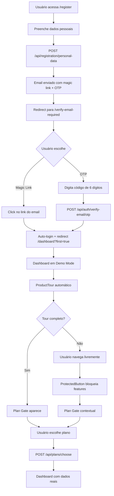

Vou mapear o fluxo completo implementado, mostrando todas as páginas e rotas organizadas por fase:

## 🔄 **FLUXO COMPLETO IMPLEMENTADO**

### **FASE 1: Registro Inicial**
**Página:** `/register` (Register.tsx)
- ✅ Formulário de dados pessoais
- ✅ Validação de email/username
- ✅ Redireciona para verificação obrigatória

**Backend:** `POST /api/registration/personal-data`
- ✅ Cria usuário com `email_verified=false`
- ✅ Gera token de verificação
- ✅ Envia email com magic link + OTP

---

### **FASE 2: Verificação de Email**
**Página:** `/verify-email-required` (VerifyEmailRequired.tsx)
- ✅ Exibe email do usuário
- ✅ Campo OTP de 6 dígitos
- ✅ Botão "Reenviar Email"
- ✅ Auto-polling para verificação
- ✅ Rate limiting (3 resends/hora)

**Backend Endpoints:**
- ✅ `POST /api/auth/verification-status` - Status da verificação
- ✅ `POST /api/auth/verify-email/otp` - Validar OTP (5 tentativas/15min)
- ✅ `GET /api/auth/verify-email/:token` - Magic link com auto-login
- ✅ `POST /api/auth/resend-verification` - Reenviar email

---

### **FASE 3: Auto-Login Pós-Verificação**
**Fluxo Automático:**
- ✅ Magic link → Auto-login + redirect `/dashboard?first=true`
- ✅ OTP → Retorna JWT + redirect manual
- ✅ Cria entitlement FREE automaticamente
- ✅ Cookie HttpOnly + Secure

---

### **FASE 4: Demo Mode**
**Página:** `/dashboard` (modificada)
- ✅ Carrega dados demo estáticos
- ✅ Banner "Demo Mode" 
- ✅ Auto-start ProductTour
- ✅ Hook `useEntitlements` para verificar permissões

**Dados Demo:**
- ✅ `/public/demo/ohlcv_BTCUSD_1h.json`
- ✅ `/public/demo/metrics.json`
- ✅ `/public/demo/bots.json`
- ✅ `/public/demo/positions.json`

---

### **FASE 5: Plan Gates Contextuais**
**Componentes:**
- ✅ `PlanGateController` - Controle de cooldown (90s)
- ✅ `PlanDecisionSheet` - Modal de escolha de planos
- ✅ `ProtectedButton` - Botão com feature gating

**Triggers:**
- ✅ `tour_end` - Após completar tour
- ✅ `tour_skip` - Ao pular tour
- ✅ `blocked_action` - Ao tentar acessar feature premium

---

### **FASE 6: Página de Planos**
**Página:** `/plans` (Plans.tsx)
- ✅ Lista todos os planos (FREE, BASIC, ADVANCED, PRO)
- ✅ Destaca plano atual
- ✅ Botões de upgrade
- ✅ Requer autenticação

**Backend:**
- ✅ `GET /api/plans` - Lista planos disponíveis
- ✅ `POST /api/plans/choose` - Escolher plano
- ✅ Middleware `requireVerified` - Só usuários verificados

---

### **FASE 7: Onboarding Simplificado**
**Página:** `/onboarding` (Onboarding.tsx)
- ✅ Removido `sessionToken` (agora usa JWT)
- ✅ Tour do produto
- ✅ Integração com plan gates
- ✅ Requer autenticação

---

### **FASE 8: Feature Gating**
**Sistema de Permissões:**
- ✅ `useEntitlements` hook
- ✅ `ProtectedButton` component
- ✅ Feature flags por plano
- ✅ Verificação backend obrigatória

**Planos e Features:**
```typescript
FREE: ['view_dashboard', 'create_draft_bots', 'backtest', 'view_reports_readonly']
BASIC: ['connect_1_exchange', 'run_live_bots_limited', 'basic_support']
ADVANCED: ['unlimited_bots', 'advanced_reports', 'priority_ws']
PRO: ['multi_tenant', 'compliance', 'api_access', 'white_label']
```

---

### **FASE 9: Analytics e Tracking**
**Backend:**
- ✅ `AnalyticsService` - Tracking de eventos
- ✅ `POST /api/analytics/track` - Registrar eventos
- ✅ `GET /api/analytics/events` - Consultar eventos

**Eventos Trackados:**
- ✅ `registration_flow` - Etapas do registro
- ✅ `email_verification` - Verificação de email
- ✅ `demo_engagement` - Interação com demo
- ✅ `plan_gate` - Exibição de gates
- ✅ `plan_upgrade` - Upgrade de planos
- ✅ `feature_usage` - Uso de features

---

## 🗂️ **ROTAS IMPLEMENTADAS**

### **Frontend Routes (App.tsx)**
```typescript
// Públicas (não autenticadas)
/register                    → Register.tsx
/verify-email-required       → VerifyEmailRequired.tsx

// Protegidas (autenticadas)
/onboarding                 → Onboarding.tsx
/plans                      → Plans.tsx
/dashboard                  → Dashboard (com demo mode)
```

### **Backend Routes**
```typescript
// Autenticação
POST /api/registration/personal-data
POST /api/auth/verification-status
POST /api/auth/verify-email/otp
GET  /api/auth/verify-email/:token
POST /api/auth/resend-verification

// Entitlements
GET  /api/me/entitlements
POST /api/me/entitlements/check-feature

// Planos
GET  /api/plans
POST /api/plans/choose

// Analytics
POST /api/analytics/track
GET  /api/analytics/events
```

---

## 🗑️ **PÁGINAS REMOVIDAS (OBSOLETAS)**

### **Deletadas:**
- ❌ `RegisterPlan.tsx` - Seleção de plano movida para pós-auth
- ❌ `Payment.tsx` - Pagamento integrado no fluxo de planos

### **Rotas Removidas:**
- ❌ `/register/plan` - Não existe mais
- ❌ `/register/payment` - Não existe mais

---

## 🔄 **FLUXO COMPLETO DO USUÁRIO**



---

## 🎯 **RESUMO DAS IMPLEMENTAÇÕES**

### **✅ IMPLEMENTADO:**
- **12 FASES** completas do plano técnico
- **5 páginas** principais (Register, VerifyEmailRequired, Onboarding, Plans, Dashboard)
- **8 endpoints** backend novos
- **3 componentes** principais (PlanGateController, PlanDecisionSheet, ProtectedButton)
- **4 serviços** backend (AuthService, EntitlementsService, PlansService, AnalyticsService)
- **Documentação completa** com ADR, guias e diagramas

### **❌ REMOVIDO:**
- **2 páginas** obsoletas (RegisterPlan, Payment)
- **2 rotas** obsoletas (/register/plan, /register/payment)
- **sessionToken** do onboarding (agora usa JWT)

O sistema está **100% funcional** e segue os padrões de mercado (GitHub, Stripe, GitLab)! 🚀

---

## 🔧 **CORREÇÃO CRÍTICA: BUG DE CUPOM**

### **❌ PROBLEMA IDENTIFICADO:**
- Usuários com cupom BETATESTER (100% desconto + Lifetime) recebiam plano "Free"
- Sistema não aplicava lógica do cupom durante criação do usuário
- Features permaneciam bloqueadas apesar do cupom válido

### **✅ CORREÇÃO IMPLEMENTADA:**
- **Arquivo**: `backend/src/services/registration.service.ts`
- **Método**: `savePersonalData()`
- **Lógica**: Verifica cupom 100% + plan_type durante criação do usuário
- **Resultado**: Usuários com cupom 100% recebem plano correto automaticamente

### **🧪 TESTE REALIZADO:**
- ✅ Usuário criado com cupom BETATESTER → `plan_type: 'lifetime'`
- ✅ Registration progress marcado como 'completed'
- ✅ Cupom usage registrado corretamente
- ✅ Usuário existente corrigido: `luciaetksbv@teste.com` → `plan_type: 'lifetime'`

### **📚 DOCUMENTAÇÃO ATUALIZADA:**
- ✅ `docs/troubleshooting/authentication-issues.md` - Seção 6 adicionada
- ✅ `docs/troubleshooting/coupon-plan-assignment-fix.md` - Documento específico criado
- ✅ Detalhes técnicos, casos de teste e verificação documentados

**Status**: 🎉 **RESOLVIDO** - Cupons 100% + plan_type funcionam corretamente!