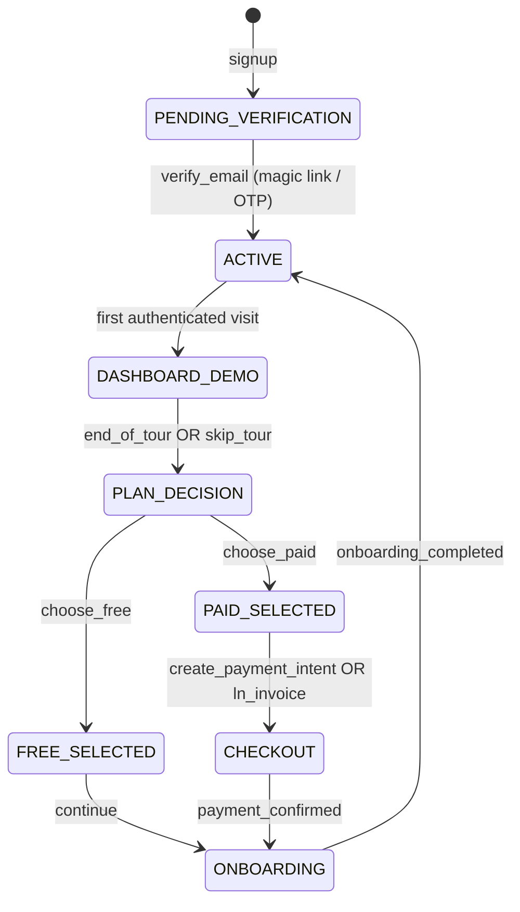

Aqui está o **Relatório Técnico Completo – Fluxo de Registro, Verificação, Planos, Demo e Onboarding** no mesmo nível (ou acima) do documento que você enviou, já formatado para o **Cursor AI** ler e executar alterações. O texto inclui decisões finais, contratos, migrations, guards, handlers, cópias de UX, telemetria, testes E2E e checklists. Pode colar direto no repositório como `docs/ADR-Registration-Verification-Plans-Onboarding.md` e usar como base para tasks.

---

# ADR — Registro → Verificação (Magic Link/OTP) → Dashboard (Demo + Tour) → Gate (Free vs Pago) → Planos → Pagamento → Onboarding

**Data:** 2025-10-22
**Versão:** 1.0.0
**Status:** ✅ Aprovado para implementação

## 0) Objetivo

Convergir o fluxo de cadastro/onboarding do Axisor ao padrão de mercado com **segurança impecável** e **UX pró-conversão**, garantindo:

* Nenhuma ação sensível antes de **`email_verified=true` + JWT**.
* **Demo realista** na primeira visita à dashboard (sem “paywall surpresa”).
* **Tour guiado** (pular/concluir) que dispara o **gate** de decisão **Free vs Pago**.
* **Planos** autenticados; **cupom** visível cedo, mas efetivado no **checkout**.
* **Onboarding** apenas após plano (Free ou Pago).
* **UI única** (igual para Free/Pago) com **entitlements**/flags.

---

## 1) Decisões de Arquitetura (resumo executivo)

* **Gating absoluto por verificação**: nada de planos/pagamento/onboarding/credenciais sem `email_verified=true` + JWT.
* **Eliminação de `sessionToken`** em telas pós-registro.
* **Verificação inline**: e-mail contém **Magic Link (single-use)** e **OTP 6 dígitos** (fallback).
* **FREE por padrão no ato da verificação** (entitlement mínimo).
* **Dashboard inicial com Demo realista**; **Tour** dispara **Gate** (sheet) com **Free vs Pago**.
* **Planos** autenticados: Free continua; Pago faz checkout; ambos seguem para **Onboarding**.
* **UI de Free não “mutila” navegação**: ações indisponíveis mostram **teasers**/**tooltips** e abrem **Upgrade sheet**.

---

## 2) Modelo de Estados



**User fields (tabela `users`):**

* `email_verified boolean default false`
* `account_status enum('pending_verification','active','suspended','closed') default 'pending_verification'`
* `first_login_at timestamptz null`
* `onboarding_completed_at timestamptz null`

**Entitlements (tabela `user_entitlements`)**:

* `plan enum('FREE','BASIC','ADVANCED','PRO') default 'FREE'`
* `feature_set enum('free','basic','advanced','pro')`
* `demo_mode boolean` (true na primeira dashboard; false após escolher free ou ao iniciar checkout)
* `created_at/updated_at timestamptz`

---

## 3) Migrations (PostgreSQL)

```sql
-- users
ALTER TABLE users
  ADD COLUMN IF NOT EXISTS email_verified boolean NOT NULL DEFAULT false,
  ADD COLUMN IF NOT EXISTS account_status text NOT NULL DEFAULT 'pending_verification'
    CHECK (account_status IN ('pending_verification','active','suspended','closed')),
  ADD COLUMN IF NOT EXISTS first_login_at timestamptz,
  ADD COLUMN IF NOT EXISTS onboarding_completed_at timestamptz;

-- entitlements por usuário
CREATE TABLE IF NOT EXISTS user_entitlements (
  id uuid PRIMARY KEY DEFAULT gen_random_uuid(),
  user_id uuid NOT NULL REFERENCES users(id) ON DELETE CASCADE,
  plan text NOT NULL CHECK (plan IN ('FREE','BASIC','ADVANCED','PRO')) DEFAULT 'FREE',
  feature_set text NOT NULL CHECK (feature_set IN ('free','basic','advanced','pro')) DEFAULT 'free',
  demo_mode boolean NOT NULL DEFAULT true,
  created_at timestamptz NOT NULL DEFAULT now(),
  updated_at timestamptz NOT NULL DEFAULT now(),
  UNIQUE (user_id)
);

-- progresso do registro (pré-seleção etc.)
CREATE TABLE IF NOT EXISTS registration_progress (
  id uuid PRIMARY KEY DEFAULT gen_random_uuid(),
  user_id uuid NOT NULL REFERENCES users(id) ON DELETE CASCADE,
  preselected_plan text CHECK (preselected_plan IN ('FREE','BASIC','ADVANCED','PRO')),
  risk_score integer DEFAULT 0,
  coupon_candidate text,
  created_at timestamptz NOT NULL DEFAULT now(),
  updated_at timestamptz NOT NULL DEFAULT now(),
  UNIQUE (user_id)
);

CREATE INDEX IF NOT EXISTS idx_user_entitlements_user ON user_entitlements(user_id);
CREATE INDEX IF NOT EXISTS idx_registration_progress_user ON registration_progress(user_id);
```

---

## 4) Tokens & Segurança

* **Magic Link**: token **single-use**, TTL 24h, rotate a cada reenvio; invalida anteriores.
* **OTP 6 dígitos** como fallback (rate limit por IP/dispositivo: ex. 5/min, 10/hora).
* **JWT** após verificação: incluir claims `sub`, `email_verified`, `plan`, `feature_set`.
* **Mensagens neutras** em falhas (evitam enumeração).
* **Cupom**: pode ser inserido cedo, **apenas efetiva** no **checkout** autenticado.
* **Nenhuma credencial** (LN Markets etc.) antes de JWT + `email_verified=true`.

---

## 5) Rotas (contratos mínimos)

### 5.1 Registro

`POST /register`

```ts
// Body (Zod)
{
  firstName: string, lastName: string,
  username: string,
  email: string, password: string,
  coupon?: string,
  marketingConsent?: boolean,
  termsAccepted: boolean
}

// 200
{ next: "/verify-email-required" }
```

* Cria `users` pendente + `registration_progress` (salva `preselected_plan` se usado; `coupon_candidate` se informado).
* Envia e-mail com **magic link** e **OTP**.

`GET /verify-email-required`

* Página com **campo OTP**, **reenvio** e **polling** (`GET /me/status`).

### 5.2 Verificação

`GET /verify-email/:token`

```ts
// efeito: valida, set email_verified=true, account_status='active'
/*
- Cria/garante user_entitlements: plan='FREE', feature_set='free', demo_mode=true
- Emite JWT (Set-Cookie ou Bearer)
- Redireciona -> /dashboard?first=true
*/
```

`POST /verify-email/otp`

```ts
{ email: string, code: string } -> 200 same effects as magic link
```

`GET /me/status` (para polling)

```ts
// 200
{ email_verified: boolean, account_status: string }
```

### 5.3 Dashboard (autenticado)

`GET /me/entitlements`

```ts
// 200
{ plan: 'FREE'|'BASIC'|'ADVANCED'|'PRO', feature_set: 'free'|'basic'|'advanced'|'pro', demo_mode: boolean }
```

* UI: carrega **demo** quando `demo_mode=true`.
* **Tour** (skippable). Ao finalizar ou pular → dispara Gate.

### 5.4 Gate (decisão Free vs Pago)

`POST /plans/choose`

```ts
// Body
{ plan: 'FREE'|'BASIC'|'ADVANCED'|'PRO', coupon?: string }

// Regras:
- Se FREE: set user_entitlements.plan='FREE', feature_set='free', demo_mode=false -> 200 { next: "/onboarding" }
- Se pago: retorna { payment_intent | invoice | lnurl }, { next: "/checkout" }
```

**Checkout (pago)**

* `POST /payments/intent` (Stripe/Card) → client_secret.
* `POST /payments/ln` (Lightning) → invoice/lnurl.
* Webhook de confirmação → atualiza entitlements (`plan`, `feature_set` mapping).

### 5.5 Onboarding (autenticado + verificado)

* `GET /onboarding` (carrega preferências iniciais, integrações)
* `POST /credentials/lnmarkets` → **somente aqui** aceita credenciais sensíveis
* `POST /onboarding/complete` → `onboarding_completed_at=now()`, redirect `/dashboard`

---

## 6) Middlewares/Guards (Fastify/TS)

```ts
function requireJWT(req, reply, done) {
  if (!req.user) return reply.code(401).send({ error: 'UNAUTHENTICATED' });
  done();
}

function requireVerified(req, reply, done) {
  if (!req.user?.email_verified) return reply.code(403).send({ error: 'EMAIL_NOT_VERIFIED' });
  done();
}

// Rotas protegidas (planos/pagamentos/onboarding/credenciais)
fastify.register(async (app) => {
  app.addHook('preHandler', requireJWT);
  app.addHook('preHandler', requireVerified);
  app.get('/register/plan', plansController.view);
  app.post('/plans/choose', plansController.choose);
  app.post('/payments/intent', paymentsController.intent);
  app.post('/payments/ln', paymentsController.lnInvoice);
  app.get('/onboarding', onboardingController.view);
  app.post('/credentials/lnmarkets', credentialsController.add);
});
```

---

## 7) Schemas (Zod)

```ts
import { z } from 'zod';

export const SignupSchema = z.object({
  firstName: z.string().min(1).max(80),
  lastName: z.string().min(1).max(80),
  username: z.string().min(3).max(40),
  email: z.string().email(),
  password: z.string().min(8),
  coupon: z.string().trim().max(64).optional(),
  marketingConsent: z.boolean().optional(),
  termsAccepted: z.literal(true),
});

export const VerifyOtpSchema = z.object({
  email: z.string().email(),
  code: z.string().length(6).regex(/^\d{6}$/),
});

export const ChoosePlanSchema = z.object({
  plan: z.enum(['FREE','BASIC','ADVANCED','PRO']),
  coupon: z.string().trim().max(64).optional(),
});
```

---

## 8) JWT Claims (exemplo)

```ts
type AxisorJwt = {
  sub: string;
  email: string;
  email_verified: boolean;
  plan: 'FREE'|'BASIC'|'ADVANCED'|'PRO';
  feature_set: 'free'|'basic'|'advanced'|'pro';
  iat: number;
  exp: number;
};
```

---

## 9) Frontend (React/TS) — Feature Gating

### 9.1 Carregamento inicial

* Após `?first=true`, disparar **Tour** (3–5 passos).
* `GET /me/entitlements` → setar store: `{ plan, feature_set, demo_mode }`.

### 9.2 Gatilhos do Gate

* **Ao concluir** Tour → abrir `PlanDecisionSheet`.
* **Ao pular** Tour → abrir `PlanDecisionSheet`.
* **Se ignorar**: ao tentar **ação protegida** (ex.: “Run live” / “Connect Exchange”) → abrir `PlanDecisionSheet` contextual.

### 9.3 Componente de Ação Protegida

```tsx
function ProtectedAction({ requiredFeature, children }) {
  const ent = useEntitlements();
  const allowed = hasFeature(ent, requiredFeature);
  return (
    <Button
      disabled={!allowed}
      onClick={() => allowed ? doAction() : openUpgradeSheet(requiredFeature)}
      title={!allowed ? 'Upgrade to unlock' : ''}
    >
      {children}
    </Button>
  );
}
```

### 9.4 Planos (página)

* Free: **badge “Active”** e CTA **“Continue”** (idempotente).
* Pago: **“Get Started”** → cria intent (Stripe) ou invoice (Lightning).
* **Cupom**: input opcional; **mostrar preço com desconto** no card, **efetivo** no backend no checkout.

---

## 10) UX/Cópias (PT-BR)

**/verify-email-required**

* “Conta criada. Falta **1 passo**: verifique seu e-mail.”
* “Digite o código ou clique no link enviado.”
* [Reenviar] [Abrir e-mail] (rate-limited)

**Dashboard Banner (Demo)**

* “Você está no **Modo Demo** — explore à vontade; nada é publicado.”
* “Para operar de verdade, **escolha um plano**.”

**PlanDecisionSheet**

* “Curtiu o que viu? No **Free** você tem: *X, Y, Z*.
  Nos **planos pagos** você desbloqueia: *A, B, C*.”
* Botões: **Escolher plano** · **Continuar no Free**

**Planos**

* Free: “**Ativo**. Você pode continuar explorando e ativar mais tarde.”
* Pago: “Inclui: *…*” + preço; se cupom: “após cupom *XYZ*, *$xx/mês*”.

**Ações bloqueadas (tooltip)**

* “Recurso disponível no plano **Basic+**. **Upgrade** para desbloquear.”

---

## 11) Anti-Fraude & Rate Limits

* Reenvio de verificação: máx. 3/h; exibir cooldown.
* OTP: 5 tentativas/15 min; bloquear por IP/dispositivo se excesso.
* Cupom 100%: só efetiva **pós-verificação** + auth; se `risk_score` alto → MFA light (reenviar magic link adicional).
* Mensagens neutras em erros de login/verificação/registro.

---

## 12) Telemetria (Eventos)

* `signup_view`, `submit_signup`, `verify_link_clicked`, `otp_submitted`, `verification_success`
* `first_dashboard_view`, `tour_started`, `tour_completed`, `tour_skipped`
* `plan_sheet_viewed`, `choose_free`, `choose_paid`, `checkout_started`, `payment_success`
* `onboarding_started`, `onboarding_completed`
* `demo_action_blocked` (action_name)

**Funis**:

* `signup → verification_success → first_dashboard_view → plan_sheet_viewed → checkout_started → payment_success → onboarding_completed`

**Segmentação**: origem (e-mail, Google, GitHub), dispositivo, presença de cupom, plano pre-selecionado.

---

## 13) Testes E2E (Playwright)

1. **T1**: Registro → ignora e-mail → tenta `/register/plan` (deve redirecionar `/verify-email-required`).
2. **T2**: Registro → verificação via magic link → JWT emitido → `/dashboard?first=true` → Tour → Sheet → **Free** → `/onboarding` → complete → `/dashboard`.
3. **T3**: Registro → verificação via OTP → **Pago** → checkout (mock) → webhooks → entitlements atualizados → `/onboarding`.
4. **T4**: Ação protegida em Demo → abre `PlanDecisionSheet`.
5. **T5**: Reenvio de e-mail rate-limited (mensagem clara).
6. **T6**: Cupom 100% → mostrado no card; só efetiva no backend (total zero) após pagamento; sem verificação não aplica.
7. **T7**: SSO (Google/GitHub) com `email_verified` do provedor → pular verificação local; senão, exigir verificação.
8. **T8**: Link de verificação reutilizado (single-use) → inválido com mensagem neutra.
9. **T9**: Primeira sessão retorna após 24h → persistência de entitlements/flags correta.

---

## 14) Config & ENV

* `JWT_SECRET`, `JWT_TTL=3600`
* `EMAIL_VERIF_TTL=86400`, `EMAIL_VERIF_MAX_RESENDS_PER_HOUR=3`
* `OTP_TTL=600`, `OTP_MAX_ATTEMPTS_15M=5`
* `RATE_LIMIT_IP` (por rota)
* `STRIPE_SECRET`, `STRIPE_WEBHOOK_SECRET` (se cartão)
* `LN_NODE_ENDPOINT`, `LN_API_KEY` (se Lightning)
* `KMS_ENDPOINT/VAULT_*` (armazenar secrets de credenciais)

---

## 15) Mapeamento de `feature_set`

| Plano    | feature_set | Regras principais                                                                       |
| -------- | ----------- | --------------------------------------------------------------------------------------- |
| FREE     | `free`      | Sem credenciais; bots apenas **draft/backtest**; dashboards readonly; limites reduzidos |
| BASIC    | `basic`     | Credenciais 1 exchange; até N bots live; suporte básico                                 |
| ADVANCED | `advanced`  | Bots ilimitados; relatórios avançados; prioridade WS                                    |
| PRO      | `pro`       | Multi-tenant / compliance / recursos premium                                            |

---

## 16) Pseudocódigo — Pontos críticos

**Verificação (magic link/otp)**

```ts
async function verifyAndLogin(userId) {
  await usersRepo.markEmailVerified(userId);
  await usersRepo.setAccountStatus(userId, 'active');

  await entitlementsRepo.upsert({
    userId, plan: 'FREE', feature_set: 'free', demo_mode: true
  });

  const jwt = signJwt({ sub: userId, email_verified: true, plan: 'FREE', feature_set: 'free' });
  return { jwt, next: '/dashboard?first=true' };
}
```

**Escolha de plano**

```ts
async function choosePlan(userId, plan, coupon) {
  if (plan === 'FREE') {
    await entitlementsRepo.update({ userId, plan: 'FREE', feature_set: 'free', demo_mode: false });
    return { next: '/onboarding' };
  } else {
    const intent = await payments.createIntent({ userId, plan, coupon });
    return { next: '/checkout', client_secret: intent.client_secret };
  }
}
```

**Guarda de credenciais (ex.)**

```ts
fastify.post('/credentials/lnmarkets', { preHandler: [requireJWT, requireVerified] }, async (req, reply) => {
  const ent = await entitlementsRepo.get(req.user.sub);
  if (!hasFeature(ent, 'canConnectExchanges')) return reply.code(403).send({ error: 'UPGRADE_REQUIRED' });
  // Save via KMS/Vault...
  return reply.code(200).send({ ok: true });
});
```

---

## 17) Checklists de Deploy

**Backend**

* [ ] Migrations aplicadas
* [ ] Guardas `requireJWT` + `requireVerified` ativos
* [ ] E-mail de verificação com link single-use + OTP
* [ ] Rate limits/resend/otp configurados
* [ ] Entitlements upsert no `verify`
* [ ] Checkout (Stripe/LN) e webhooks atualizados
* [ ] Logs estruturados (registro → verificação → planos → pagamento → onboarding)

**Frontend**

* [ ] Tela `/verify-email-required` (OTP + polling)
* [ ] Dashboard com **demo_mode** + Tour (skippable)
* [ ] `PlanDecisionSheet` (Free vs Pago)
* [ ] Página de planos com badge “Active” no Free; CTAs “Continue / Get Started”; cupom visual
* [ ] Bloqueios por feature (tooltips + Upgrade sheet)
* [ ] Telemetria (eventos)

---

## 18) Critérios de Aceite (QA)

* Usuário **nunca** acessa onboarding/planos/checkout/credenciais **sem** `email_verified=true` + JWT.
* Primeira visita à dashboard **mostra demo** e **tour**; Gate surge **ao fim do tour** ou **ao pular** (não em 5s).
* Escolhendo **Free**, UI permanece igual visualmente, mas ações indisponíveis mostram **teasers/upgrade**.
* Cupom **visual** pode aparecer cedo; **efetivo** apenas em checkout.
* Links de verificação **não reutilizáveis**; reenvio e OTP com rate-limit.
* Testes E2E T1–T9 **verdes**.

---

## 19) Notas de Observabilidade

* Traçar `user_id` e `session_id` em todos os eventos e logs (correlação).
* Alarmes: taxas de erro >2% em `verify`, aumento de `demo_action_blocked` sem `plan_sheet_viewed` (sinal de UX travada), tempo médio da primeira sessão, conversão D1/D7.

---

## 20) Roadmap (incrementos futuros)

* **MFA pós-ativação** (TOTP/WebAuthn).
* **Magic link universal** (passwordless opcional).
* **A/B**: “tour-gate” vs “ação-gate” vs “timer-gate”.
* **Personalização do demo** por perfil (trade leve vs avançado).

---

### Conclusão

O fluxo aprovado entrega **valor imediato** (demo realista + tour), **decisão clara** (sheet Free vs Pago), **segurança forte** (sem brechas pré-verificação) e **UI consistente** (entitlements/feature gating). Os contratos, migrations, guards, cópias e testes E2E acima permitem implementação rápida e auditável.
